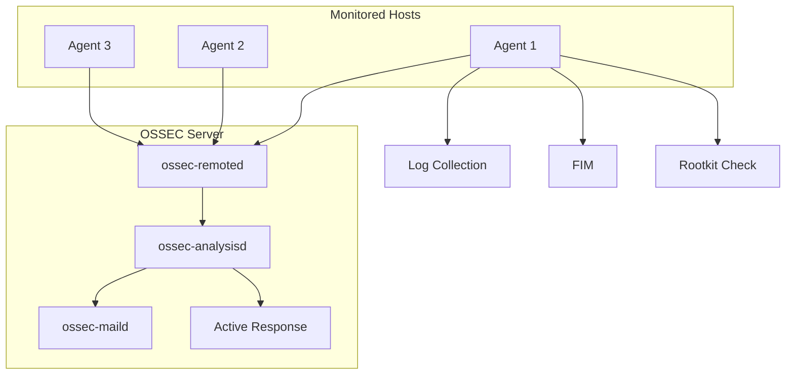

# How to Use Ansible to Set Up Intrusion Detection (OSSEC)

Author: [nawazdhandala](https://www.github.com/nawazdhandala)

Tags: Ansible, OSSEC, Intrusion Detection, Security, HIDS

Description: Deploy and configure OSSEC host-based intrusion detection system across your infrastructure using Ansible for automated security monitoring.

---

OSSEC is a powerful open-source host-based intrusion detection system (HIDS) that provides log analysis, rootkit detection, file integrity monitoring, and real-time alerting. Setting it up on a single server is straightforward enough, but deploying it across an entire fleet with consistent configurations is a different story. Ansible makes this manageable.

In this post, I will show you how to deploy OSSEC in a server-agent architecture using Ansible. We will cover installing the OSSEC server, deploying agents, configuring rules, and setting up alerting.

## OSSEC Architecture

OSSEC uses a centralized architecture. A server collects and analyzes data from agents running on monitored hosts. Agents send logs, file integrity data, and system information to the server for processing.



## Installing the OSSEC Server

The OSSEC server is the central component that receives and processes data from all agents.

This playbook installs and configures the OSSEC server:

```yaml
# install_ossec_server.yml - Install OSSEC server
---
- name: Install OSSEC Server
  hosts: ossec_server
  become: true

  vars:
    ossec_version: "3.7.0"
    ossec_server_ip: "{{ ansible_default_ipv4.address }}"
    ossec_email_to: security@example.com
    ossec_smtp_server: localhost

  tasks:
    - name: Install build dependencies
      ansible.builtin.apt:
        name:
          - build-essential
          - gcc
          - make
          - libevent-dev
          - zlib1g-dev
          - libssl-dev
          - libpcre2-dev
          - wget
        state: present
        update_cache: true
      when: ansible_os_family == "Debian"

    - name: Download OSSEC source
      ansible.builtin.get_url:
        url: "https://github.com/ossec/ossec-hids/archive/{{ ossec_version }}.tar.gz"
        dest: "/tmp/ossec-{{ ossec_version }}.tar.gz"
        mode: '0644'

    - name: Extract OSSEC source
      ansible.builtin.unarchive:
        src: "/tmp/ossec-{{ ossec_version }}.tar.gz"
        dest: /tmp/
        remote_src: true

    - name: Deploy preloaded-vars.conf for unattended install
      ansible.builtin.copy:
        content: |
          USER_INSTALL_TYPE="server"
          USER_DIR="/var/ossec"
          USER_ENABLE_EMAIL="y"
          USER_EMAIL_ADDRESS="{{ ossec_email_to }}"
          USER_EMAIL_SMTP="{{ ossec_smtp_server }}"
          USER_ENABLE_SYSCHECK="y"
          USER_ENABLE_ROOTCHECK="y"
          USER_ENABLE_ACTIVE_RESPONSE="y"
          USER_UPDATE="n"
          USER_AGENT_SERVER_IP="{{ ossec_server_ip }}"
          USER_NO_STOP="y"
        dest: "/tmp/ossec-hids-{{ ossec_version }}/etc/preloaded-vars.conf"
        mode: '0644'

    - name: Install OSSEC server
      ansible.builtin.shell: |
        cd /tmp/ossec-hids-{{ ossec_version }}
        ./install.sh
      args:
        creates: /var/ossec/bin/ossec-control

    - name: Start OSSEC server
      ansible.builtin.command: /var/ossec/bin/ossec-control start
      changed_when: true
```

## Configuring the OSSEC Server

The server configuration defines what rules to apply, which logs to analyze, and how to alert.

This playbook deploys the OSSEC server configuration:

```yaml
# configure_ossec_server.yml - Configure OSSEC server
---
- name: Configure OSSEC server
  hosts: ossec_server
  become: true

  vars:
    ossec_email_to: security@example.com
    ossec_email_from: ossec@example.com
    ossec_smtp_server: smtp.example.com
    ossec_white_list:
      - 127.0.0.1
      - 10.0.0.0/8
    ossec_alert_level: 7
    ossec_email_alert_level: 10

  tasks:
    - name: Deploy OSSEC server configuration
      ansible.builtin.template:
        src: ossec_server.conf.j2
        dest: /var/ossec/etc/ossec.conf
        owner: root
        group: ossec
        mode: '0640'
      notify: restart ossec

    - name: Configure syscheck (file integrity monitoring)
      ansible.builtin.blockinfile:
        path: /var/ossec/etc/ossec.conf
        insertbefore: "</ossec_config>"
        block: |
          <syscheck>
            <frequency>7200</frequency>
            <directories check_all="yes">/etc,/usr/bin,/usr/sbin</directories>
            <directories check_all="yes">/bin,/sbin</directories>
            <directories check_all="yes">/boot</directories>
            <ignore>/etc/mtab</ignore>
            <ignore>/etc/hosts.deny</ignore>
            <ignore>/etc/resolv.conf</ignore>
            <ignore type="sregex">.log$|.swp$</ignore>
          </syscheck>
        marker: "<!-- {mark} ANSIBLE MANAGED SYSCHECK -->"
      notify: restart ossec

  handlers:
    - name: restart ossec
      ansible.builtin.command: /var/ossec/bin/ossec-control restart
      changed_when: true
```

The server configuration template:

```xml
<!-- templates/ossec_server.conf.j2 - OSSEC server configuration -->
<!-- Managed by Ansible -->
<ossec_config>
  <global>
    <email_notification>yes</email_notification>
    <email_to>{{ ossec_email_to }}</email_to>
    <smtp_server>{{ ossec_smtp_server }}</smtp_server>
    <email_from>{{ ossec_email_from }}</email_from>
  </global>

  <rules>
    <include>rules_config.xml</include>
    <include>pam_rules.xml</include>
    <include>sshd_rules.xml</include>
    <include>syslog_rules.xml</include>
    <include>web_rules.xml</include>
    <include>apache_rules.xml</include>
    <include>nginx_rules.xml</include>
  </rules>

  <alerts>
    <log_alert_level>{{ ossec_alert_level }}</log_alert_level>
    <email_alert_level>{{ ossec_email_alert_level }}</email_alert_level>
  </alerts>

  <remote>
    <connection>secure</connection>
    <allowed-ips>10.0.0.0/8</allowed-ips>
  </remote>

  
  <global>
    <white_list>{{ ip }}</white_list>
  </global>
  

  <active-response>
    <command>host-deny</command>
    <location>local</location>
    <level>10</level>
    <timeout>600</timeout>
  </active-response>
</ossec_config>
```

## Deploying OSSEC Agents

Agents run on every monitored host and report back to the OSSEC server.

This playbook installs and configures OSSEC agents:

```yaml
# install_ossec_agent.yml - Deploy OSSEC agents
---
- name: Install OSSEC agent
  hosts: monitored_servers
  become: true

  vars:
    ossec_version: "3.7.0"
    ossec_server_ip: "10.0.1.10"  # IP of your OSSEC server

  tasks:
    - name: Install build dependencies
      ansible.builtin.package:
        name:
          - build-essential
          - gcc
          - make
        state: present

    - name: Download OSSEC source
      ansible.builtin.get_url:
        url: "https://github.com/ossec/ossec-hids/archive/{{ ossec_version }}.tar.gz"
        dest: "/tmp/ossec-{{ ossec_version }}.tar.gz"
        mode: '0644'

    - name: Extract OSSEC source
      ansible.builtin.unarchive:
        src: "/tmp/ossec-{{ ossec_version }}.tar.gz"
        dest: /tmp/
        remote_src: true

    - name: Deploy agent preloaded-vars.conf
      ansible.builtin.copy:
        content: |
          USER_INSTALL_TYPE="agent"
          USER_DIR="/var/ossec"
          USER_AGENT_SERVER_IP="{{ ossec_server_ip }}"
          USER_ENABLE_SYSCHECK="y"
          USER_ENABLE_ROOTCHECK="y"
          USER_ENABLE_ACTIVE_RESPONSE="y"
          USER_NO_STOP="y"
        dest: "/tmp/ossec-hids-{{ ossec_version }}/etc/preloaded-vars.conf"
        mode: '0644'

    - name: Install OSSEC agent
      ansible.builtin.shell: |
        cd /tmp/ossec-hids-{{ ossec_version }}
        ./install.sh
      args:
        creates: /var/ossec/bin/ossec-control
```

## Managing Agent Keys

OSSEC agents authenticate with the server using shared keys. This is the most challenging part to automate.

This playbook handles agent key registration:

```yaml
# manage_agent_keys.yml - Register OSSEC agents with server
---
- name: Register OSSEC agents
  hosts: ossec_server
  become: true

  vars:
    ossec_agents:
      - name: web01
        ip: 10.0.1.20
      - name: web02
        ip: 10.0.1.21
      - name: db01
        ip: 10.0.2.10

  tasks:
    - name: Add agents to OSSEC server
      ansible.builtin.shell: |
        /var/ossec/bin/manage_agents -a {{ item.ip }} {{ item.name }}
      loop: "{{ ossec_agents }}"
      register: add_result
      changed_when: "'Added' in add_result.stdout"
      failed_when: false

    - name: Extract agent keys
      ansible.builtin.shell: |
        /var/ossec/bin/manage_agents -e {{ item.name }}
      loop: "{{ ossec_agents }}"
      register: agent_keys
      changed_when: false

    - name: Save agent keys for distribution
      ansible.builtin.set_fact:
        agent_key_map: "{{ agent_key_map | default({}) | combine({item.item.name: item.stdout}) }}"
      loop: "{{ agent_keys.results }}"

- name: Distribute keys to agents
  hosts: monitored_servers
  become: true

  tasks:
    - name: Import agent key
      ansible.builtin.shell: |
        echo "{{ hostvars[groups['ossec_server'][0]]['agent_key_map'][inventory_hostname] }}" | \
        /var/ossec/bin/manage_agents -i
      when: inventory_hostname in hostvars[groups['ossec_server'][0]]['agent_key_map']
      notify: restart ossec agent

  handlers:
    - name: restart ossec agent
      ansible.builtin.command: /var/ossec/bin/ossec-control restart
      changed_when: true
```

## Custom Rules and Decoders

You can deploy custom OSSEC rules through Ansible for organization-specific detection.

This playbook adds custom detection rules:

```yaml
# custom_rules.yml - Deploy custom OSSEC rules
---
- name: Deploy custom OSSEC rules
  hosts: ossec_server
  become: true

  tasks:
    - name: Deploy custom rules
      ansible.builtin.copy:
        content: |
          <group name="custom,">
            <!-- Detect multiple SSH failures from same IP -->
            <rule id="100001" level="10">
              <if_matched_sid>5716</if_matched_sid>
              <same_source_ip />
              <description>Multiple SSH authentication failures</description>
              <group>authentication_failures,</group>
            </rule>

            <!-- Detect sudo abuse -->
            <rule id="100002" level="12">
              <if_sid>5401</if_sid>
              <match>NOT in sudoers</match>
              <description>Unauthorized sudo attempt</description>
              <group>authentication_failures,sudo,</group>
            </rule>

            <!-- Detect web shell access patterns -->
            <rule id="100003" level="14">
              <if_sid>31100</if_sid>
              <url>.php?cmd=|.php?exec=|.jsp?cmd=</url>
              <description>Possible web shell access detected</description>
              <group>web,attack,</group>
            </rule>
          </group>
        dest: /var/ossec/rules/local_rules.xml
        owner: root
        group: ossec
        mode: '0640'
      notify: restart ossec

  handlers:
    - name: restart ossec
      ansible.builtin.command: /var/ossec/bin/ossec-control restart
      changed_when: true
```

## Monitoring OSSEC Health

Keep an eye on OSSEC itself to make sure it stays running:

```yaml
# monitor_ossec.yml - Check OSSEC health across fleet
---
- name: Monitor OSSEC status
  hosts: all
  become: true

  tasks:
    - name: Check OSSEC status
      ansible.builtin.command: /var/ossec/bin/ossec-control status
      register: ossec_status
      changed_when: false
      failed_when: false

    - name: Parse running processes
      ansible.builtin.set_fact:
        ossec_running: "{{ 'not running' not in ossec_status.stdout }}"

    - name: Report OSSEC status
      ansible.builtin.debug:
        msg: "OSSEC on {{ inventory_hostname }}: {{ 'RUNNING' if ossec_running else 'NOT RUNNING' }}"

    - name: Restart OSSEC if not running
      ansible.builtin.command: /var/ossec/bin/ossec-control start
      when: not ossec_running
      changed_when: true
```

## Tips from the Field

Deploying OSSEC across production environments has taught me several things:

1. **Start with low alert levels and tune up.** OSSEC generates a lot of noise out of the box. Start by watching alerts at level 10+ and gradually lower the threshold.
2. **Use agent groups.** Different server types need different monitoring configurations. OSSEC agent groups let you push specific configs to web servers vs database servers.
3. **Monitor the OSSEC server itself.** If the server goes down, you lose visibility into everything. Set up external monitoring for it.
4. **Plan for key management.** Agent key distribution is the hardest part of automation. Consider using the OSSEC API for key management.
5. **Forward alerts to your SIEM.** OSSEC alerts should feed into your centralized logging and alerting system for unified visibility.

OSSEC with Ansible gives you a scalable intrusion detection system that runs consistently across your entire infrastructure. The initial deployment takes some work, but once automated, adding new agents is just a matter of adding hosts to your inventory.
