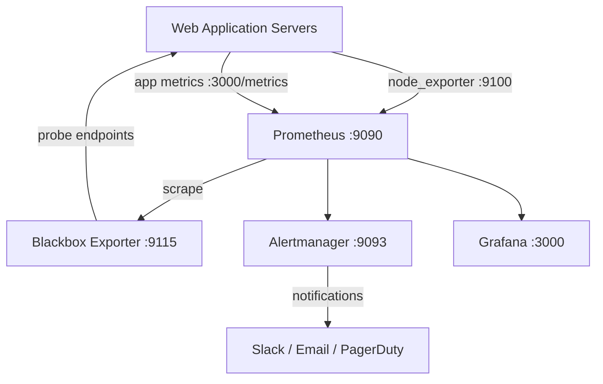

# How to Use Ansible to Set Up Monitoring for Web Applications

Author: [nawazdhandala](https://www.github.com/nawazdhandala)

Tags: Ansible, Monitoring, Prometheus, Grafana, DevOps

Description: Automate the setup of a complete monitoring stack for web applications using Ansible, covering Prometheus, Grafana, and alerting.

---

Running a web application without monitoring is like driving at night without headlights. You only find out something is wrong when it is already too late. Setting up a monitoring stack manually on every server is time-consuming and inconsistent. Ansible lets you deploy a complete monitoring pipeline in minutes, and redeploy it identically every time.

In this guide, I will walk through deploying a monitoring stack that covers system metrics, application health checks, log aggregation, and alerting. We will use Prometheus for metrics collection, Grafana for visualization, Node Exporter for system metrics, and Blackbox Exporter for endpoint monitoring.

## Architecture Overview



## Project Structure

```
monitoring-setup/
  inventory/
    hosts.yml
  roles/
    prometheus/
      tasks/
        main.yml
      templates/
        prometheus.yml.j2
        alert_rules.yml.j2
      defaults/
        main.yml
    grafana/
      tasks/
        main.yml
      templates/
        grafana.ini.j2
        datasource.yml.j2
      defaults/
        main.yml
    node_exporter/
      tasks/
        main.yml
      defaults/
        main.yml
    blackbox_exporter/
      tasks/
        main.yml
      templates/
        blackbox.yml.j2
      defaults/
        main.yml
  playbook.yml
```

## Node Exporter Role

Node Exporter runs on every server you want to monitor. It exposes system metrics like CPU, memory, disk, and network usage.

```yaml
# roles/node_exporter/defaults/main.yml
node_exporter_version: "1.7.0"
node_exporter_port: 9100
node_exporter_user: "node_exporter"
```

```yaml
# roles/node_exporter/tasks/main.yml
---
- name: Create node_exporter user
  ansible.builtin.user:
    name: "{{ node_exporter_user }}"
    shell: /usr/sbin/nologin
    system: yes
    create_home: no
  become: true

- name: Download Node Exporter
  ansible.builtin.get_url:
    url: "https://github.com/prometheus/node_exporter/releases/download/v{{ node_exporter_version }}/node_exporter-{{ node_exporter_version }}.linux-amd64.tar.gz"
    dest: /tmp/node_exporter.tar.gz
    mode: "0644"

- name: Extract Node Exporter
  ansible.builtin.unarchive:
    src: /tmp/node_exporter.tar.gz
    dest: /tmp/
    remote_src: yes

- name: Install Node Exporter binary
  ansible.builtin.copy:
    src: "/tmp/node_exporter-{{ node_exporter_version }}.linux-amd64/node_exporter"
    dest: /usr/local/bin/node_exporter
    owner: "{{ node_exporter_user }}"
    group: "{{ node_exporter_user }}"
    mode: "0755"
    remote_src: yes
  become: true
  notify: Restart node_exporter

- name: Create Node Exporter systemd service
  ansible.builtin.copy:
    dest: /etc/systemd/system/node_exporter.service
    content: |
      [Unit]
      Description=Node Exporter
      Wants=network-online.target
      After=network-online.target

      [Service]
      User={{ node_exporter_user }}
      Group={{ node_exporter_user }}
      Type=simple
      ExecStart=/usr/local/bin/node_exporter --web.listen-address=:{{ node_exporter_port }}

      [Install]
      WantedBy=multi-user.target
    owner: root
    group: root
    mode: "0644"
  become: true
  notify: Restart node_exporter

- name: Enable and start Node Exporter
  ansible.builtin.systemd:
    name: node_exporter
    state: started
    enabled: true
    daemon_reload: true
  become: true
```

Add a handler file for the node_exporter role:

```yaml
# roles/node_exporter/handlers/main.yml
---
- name: Restart node_exporter
  ansible.builtin.systemd:
    name: node_exporter
    state: restarted
    daemon_reload: true
  become: true
```

## Blackbox Exporter Role

Blackbox Exporter probes endpoints over HTTP, HTTPS, TCP, and ICMP. It is useful for monitoring external-facing endpoints and checking SSL certificate expiration.

```yaml
# roles/blackbox_exporter/defaults/main.yml
blackbox_exporter_version: "0.24.0"
blackbox_exporter_port: 9115

# Endpoints to monitor
monitored_endpoints:
  - name: "Main Website"
    url: "https://example.com"
    module: "http_2xx"
  - name: "API Health"
    url: "https://api.example.com/health"
    module: "http_2xx"
```

```yaml
# roles/blackbox_exporter/templates/blackbox.yml.j2
# Blackbox Exporter configuration
modules:
  http_2xx:
    prober: http
    timeout: 10s
    http:
      valid_http_versions: ["HTTP/1.1", "HTTP/2.0"]
      valid_status_codes: [200]
      method: GET
      follow_redirects: true
      preferred_ip_protocol: "ip4"
      tls_config:
        insecure_skip_verify: false
  http_post_2xx:
    prober: http
    timeout: 10s
    http:
      method: POST
      valid_status_codes: [200, 201]
  tcp_connect:
    prober: tcp
    timeout: 5s
  icmp_check:
    prober: icmp
    timeout: 5s
```

## Prometheus Configuration

The Prometheus configuration template dynamically includes all your targets based on the inventory.

```yaml
# roles/prometheus/defaults/main.yml
prometheus_version: "2.48.0"
prometheus_port: 9090
prometheus_retention: "30d"
prometheus_scrape_interval: "15s"
prometheus_evaluation_interval: "15s"
```

```yaml
# roles/prometheus/templates/prometheus.yml.j2
# Prometheus configuration
global:
  scrape_interval: {{ prometheus_scrape_interval }}
  evaluation_interval: {{ prometheus_evaluation_interval }}

rule_files:
  - "alert_rules.yml"

alerting:
  alertmanagers:
    - static_configs:
        - targets:
            - "localhost:9093"

scrape_configs:
  # Prometheus self-monitoring
  - job_name: "prometheus"
    static_configs:
      - targets: ["localhost:{{ prometheus_port }}"]

  # Node Exporter on all application servers
  - job_name: "node"
    static_configs:
      - targets:

          - "{{ hostvars[host]['ansible_host'] }}:{{ node_exporter_port }}"


  # Application metrics (if your app exposes /metrics)
  - job_name: "webapp"
    metrics_path: /metrics
    static_configs:
      - targets:

          - "{{ hostvars[host]['ansible_host'] }}:8080"


  # Blackbox Exporter for endpoint probing
  - job_name: "blackbox"
    metrics_path: /probe
    params:
      module: [http_2xx]
    static_configs:
      - targets:

          - "{{ endpoint.url }}"

    relabel_configs:
      - source_labels: [__address__]
        target_label: __param_target
      - source_labels: [__param_target]
        target_label: instance
      - target_label: __address__
        replacement: "localhost:{{ blackbox_exporter_port }}"
```

## Alert Rules

```yaml
# roles/prometheus/templates/alert_rules.yml.j2
# Alerting rules for web application monitoring
groups:
  - name: instance_health
    rules:
      - alert: InstanceDown
        expr: up == 0
        for: 2m
        labels:
          severity: critical
        annotations:
          summary: "Instance {{ '{{ $labels.instance }}' }} is down"
          description: "{{ '{{ $labels.instance }}' }} has been down for more than 2 minutes."

      - alert: HighCPUUsage
        expr: 100 - (avg by(instance) (rate(node_cpu_seconds_total{mode="idle"}[5m])) * 100) > 85
        for: 5m
        labels:
          severity: warning
        annotations:
          summary: "High CPU usage on {{ '{{ $labels.instance }}' }}"

      - alert: HighMemoryUsage
        expr: (1 - (node_memory_MemAvailable_bytes / node_memory_MemTotal_bytes)) * 100 > 90
        for: 5m
        labels:
          severity: warning
        annotations:
          summary: "High memory usage on {{ '{{ $labels.instance }}' }}"

      - alert: DiskSpaceLow
        expr: (1 - (node_filesystem_avail_bytes{fstype!="tmpfs"} / node_filesystem_size_bytes{fstype!="tmpfs"})) * 100 > 85
        for: 10m
        labels:
          severity: warning
        annotations:
          summary: "Disk space low on {{ '{{ $labels.instance }}' }}"

  - name: endpoint_health
    rules:
      - alert: EndpointDown
        expr: probe_success == 0
        for: 1m
        labels:
          severity: critical
        annotations:
          summary: "Endpoint {{ '{{ $labels.instance }}' }} is down"

      - alert: SSLCertExpiringSoon
        expr: probe_ssl_earliest_cert_expiry - time() < 86400 * 14
        for: 1h
        labels:
          severity: warning
        annotations:
          summary: "SSL certificate for {{ '{{ $labels.instance }}' }} expires in less than 14 days"

      - alert: HighResponseTime
        expr: probe_http_duration_seconds > 2
        for: 5m
        labels:
          severity: warning
        annotations:
          summary: "High response time for {{ '{{ $labels.instance }}' }}"
```

## Grafana Datasource

```yaml
# roles/grafana/templates/datasource.yml.j2
# Grafana datasource provisioning
apiVersion: 1
datasources:
  - name: Prometheus
    type: prometheus
    access: proxy
    url: http://localhost:{{ prometheus_port }}
    isDefault: true
    editable: false
```

## The Main Playbook

```yaml
# playbook.yml
---
- name: Install Node Exporter on all app servers
  hosts: app_servers
  roles:
    - node_exporter

- name: Set up monitoring server
  hosts: monitoring
  vars:
    monitored_endpoints:
      - name: "Production Site"
        url: "https://myapp.com"
        module: "http_2xx"
      - name: "API Health"
        url: "https://api.myapp.com/health"
        module: "http_2xx"
  roles:
    - prometheus
    - blackbox_exporter
    - grafana
```

## Running the Playbook

```bash
# Deploy the full monitoring stack
ansible-playbook -i inventory/hosts.yml playbook.yml

# Deploy only Node Exporter to app servers
ansible-playbook -i inventory/hosts.yml playbook.yml --tags node_exporter
```

After deployment, access Grafana at `http://monitoring-server:3000` and Prometheus at `http://monitoring-server:9090`. The datasource is auto-provisioned, so you can start building dashboards immediately.

## Summary

This Ansible-based monitoring setup gives you full visibility into your web application infrastructure. Node Exporter covers system-level metrics, Blackbox Exporter handles endpoint health checks and SSL monitoring, and Prometheus ties it all together with powerful alerting rules. As you add new servers to your inventory, they are automatically picked up by the monitoring system on the next playbook run.
