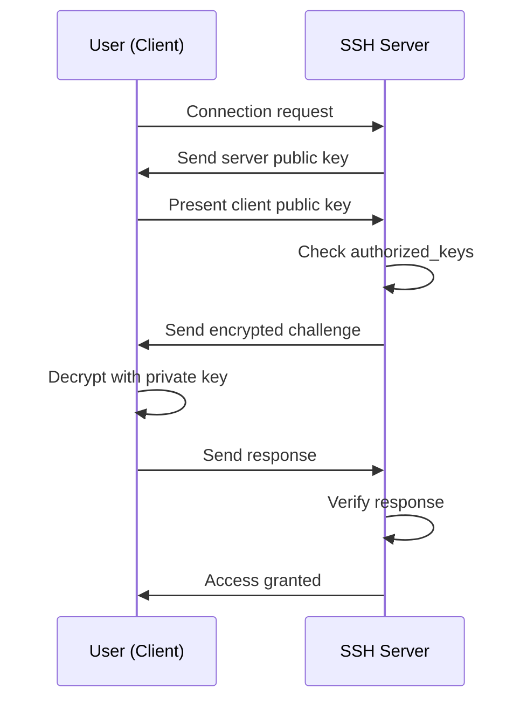

# How to Use Ansible to Set Up SSH Key-Based Authentication for Users

Author: [nawazdhandala](https://www.github.com/nawazdhandala)

Tags: Ansible, SSH, Authentication, Security, DevOps

Description: Learn how to set up SSH key-based authentication for users with Ansible, including key deployment, sshd configuration, and disabling password auth.

---

SSH key-based authentication is more secure than passwords and more convenient once set up. Instead of typing a password every time, you prove your identity with a cryptographic key pair. Setting this up across a fleet of servers is one of the most common Ansible tasks, and in this post I will cover the full workflow from key deployment to hardening the SSH daemon.

## The SSH Key Authentication Flow

Before diving into Ansible, let us understand how SSH key auth works:



## Deploying SSH Public Keys

The `ansible.posix.authorized_key` module is purpose-built for managing SSH authorized keys:

```yaml
# deploy-ssh-keys.yml - Deploy SSH public keys
- name: Deploy SSH keys for users
  hosts: all
  become: yes
  tasks:
    - name: Ensure user exists
      ansible.builtin.user:
        name: deploy
        shell: /bin/bash
        state: present

    - name: Deploy SSH public key for deploy user
      ansible.posix.authorized_key:
        user: deploy
        key: "ssh-ed25519 AAAAC3NzaC1lZDI1NTE5AAAAIBxampleKeyGoesHere deploy@workstation"
        state: present
```

The module handles creating the `.ssh` directory and the `authorized_keys` file with the correct permissions. You do not need to worry about that.

## Deploying Keys from Files

Instead of embedding keys in the playbook, load them from files:

```yaml
# deploy-keys-from-files.yml - Load keys from files
- name: Deploy SSH keys from files
  hosts: all
  become: yes
  tasks:
    - name: Deploy alice's SSH key
      ansible.posix.authorized_key:
        user: alice
        key: "{{ lookup('file', 'ssh_keys/alice.pub') }}"
        state: present

    - name: Deploy bob's SSH key
      ansible.posix.authorized_key:
        user: bob
        key: "{{ lookup('file', 'ssh_keys/bob.pub') }}"
        state: present
```

Store the public key files in your Ansible project under `ssh_keys/`:

```
project/
  ssh_keys/
    alice.pub
    bob.pub
    carol.pub
  deploy-keys-from-files.yml
```

## Deploying Keys for Multiple Users

Use a loop to deploy keys for an entire team:

```yaml
# deploy-team-keys.yml - Deploy SSH keys for the whole team
- name: Deploy SSH keys for team
  hosts: all
  become: yes
  vars:
    team:
      - name: alice
        key: "ssh-ed25519 AAAAC3NzaC1lZDI1NTE5AAAAIAlice alice@laptop"
      - name: bob
        key: "ssh-ed25519 AAAAC3NzaC1lZDI1NTE5AAAAIBob bob@workstation"
      - name: carol
        keys:
          - "ssh-ed25519 AAAAC3NzaC1lZDI1NTE5AAAAICarolLaptop carol@laptop"
          - "ssh-ed25519 AAAAC3NzaC1lZDI1NTE5AAAAICarolDesktop carol@desktop"
  tasks:
    - name: Ensure users exist
      ansible.builtin.user:
        name: "{{ item.name }}"
        shell: /bin/bash
        state: present
      loop: "{{ team }}"

    # Deploy single keys
    - name: Deploy single SSH keys
      ansible.posix.authorized_key:
        user: "{{ item.name }}"
        key: "{{ item.key }}"
        state: present
      loop: "{{ team | selectattr('key', 'defined') | list }}"
      loop_control:
        label: "{{ item.name }}"

    # Deploy multiple keys for users who have them
    - name: Deploy multiple SSH keys
      ansible.posix.authorized_key:
        user: "{{ item.0.name }}"
        key: "{{ item.1 }}"
        state: present
      loop: "{{ team | selectattr('keys', 'defined') | subelements('keys') }}"
      loop_control:
        label: "{{ item.0.name }}"
```

## Managing the authorized_keys File Exclusively

The `exclusive` parameter ensures that ONLY the keys you specify are in the authorized_keys file. Any other keys are removed:

```yaml
# exclusive-keys.yml - Manage authorized_keys exclusively
- name: Manage SSH keys exclusively
  hosts: all
  become: yes
  vars:
    alice_authorized_keys: |
      ssh-ed25519 AAAAC3NzaC1lZDI1NTE5AAAAIAliceLaptop alice@laptop
      ssh-ed25519 AAAAC3NzaC1lZDI1NTE5AAAAIAliceDesktop alice@desktop
  tasks:
    - name: Set authorized keys exclusively for alice
      ansible.posix.authorized_key:
        user: alice
        key: "{{ alice_authorized_keys }}"
        exclusive: yes
        state: present
```

With `exclusive: yes`, if alice had any other keys in her `authorized_keys` file, they would be removed. This is useful for key rotation and ensuring no unauthorized keys exist.

## Deploying Keys from GitHub

You can pull public keys directly from GitHub:

```yaml
# deploy-github-keys.yml - Deploy SSH keys from GitHub
- name: Deploy SSH keys from GitHub
  hosts: all
  become: yes
  vars:
    github_users:
      - github_user: alicejohnson
        system_user: alice
      - github_user: bobsmith
        system_user: bob
  tasks:
    - name: Deploy SSH keys from GitHub profiles
      ansible.posix.authorized_key:
        user: "{{ item.system_user }}"
        key: "https://github.com/{{ item.github_user }}.keys"
        state: present
      loop: "{{ github_users }}"
      loop_control:
        label: "{{ item.system_user }}"
```

The module fetches the keys from `https://github.com/<username>.keys` and adds them to the user's authorized_keys file.

## Configuring SSH Daemon for Key-Only Authentication

After deploying keys, harden SSH to only allow key-based authentication:

```yaml
# harden-ssh.yml - Disable password auth, enable key auth
- name: Harden SSH configuration
  hosts: all
  become: yes
  tasks:
    - name: Configure sshd for key-only auth
      ansible.builtin.lineinfile:
        path: /etc/ssh/sshd_config
        regexp: "{{ item.regexp }}"
        line: "{{ item.line }}"
      loop:
        - regexp: '^#?PasswordAuthentication'
          line: 'PasswordAuthentication no'
        - regexp: '^#?ChallengeResponseAuthentication'
          line: 'ChallengeResponseAuthentication no'
        - regexp: '^#?PubkeyAuthentication'
          line: 'PubkeyAuthentication yes'
        - regexp: '^#?PermitRootLogin'
          line: 'PermitRootLogin prohibit-password'
        - regexp: '^#?AuthorizedKeysFile'
          line: 'AuthorizedKeysFile .ssh/authorized_keys'
      notify: restart sshd

    - name: Verify sshd config before restart
      ansible.builtin.command: "sshd -t"
      changed_when: false

  handlers:
    - name: restart sshd
      ansible.builtin.systemd:
        name: sshd
        state: restarted
```

## Adding Key Options

You can add SSH options to restrict what a key can do:

```yaml
# key-with-options.yml - Deploy SSH key with restrictions
- name: Deploy restricted SSH key
  hosts: all
  become: yes
  tasks:
    # This key can only run a specific command
    - name: Deploy backup key with command restriction
      ansible.posix.authorized_key:
        user: backup
        key: "ssh-ed25519 AAAAC3NzaC1lZDI1NTE5AAAAIBackup backup@master"
        key_options: 'command="/usr/local/bin/backup-script",no-port-forwarding,no-X11-forwarding,no-agent-forwarding'
        state: present

    # This key can only connect from a specific IP
    - name: Deploy key with IP restriction
      ansible.posix.authorized_key:
        user: deploy
        key: "ssh-ed25519 AAAAC3NzaC1lZDI1NTE5AAAAIDeploy deploy@ci"
        key_options: 'from="10.0.1.100"'
        state: present
```

## Complete SSH Key Setup Playbook

Here is a full playbook that handles everything:

```yaml
# complete-ssh-setup.yml - Full SSH key setup
- name: Complete SSH key-based authentication setup
  hosts: all
  become: yes
  vars_files:
    - vars/users.yml
  tasks:
    # Create all users first
    - name: Create user accounts
      ansible.builtin.user:
        name: "{{ item.name }}"
        shell: /bin/bash
        state: present
      loop: "{{ ssh_users }}"

    # Deploy SSH keys
    - name: Deploy SSH authorized keys
      ansible.posix.authorized_key:
        user: "{{ item.name }}"
        key: "{{ item.ssh_key }}"
        state: present
      loop: "{{ ssh_users }}"
      loop_control:
        label: "{{ item.name }}"

    # Harden SSH config
    - name: Disable password authentication
      ansible.builtin.lineinfile:
        path: /etc/ssh/sshd_config
        regexp: '^#?PasswordAuthentication'
        line: 'PasswordAuthentication no'
      notify: restart sshd

    - name: Enable public key authentication
      ansible.builtin.lineinfile:
        path: /etc/ssh/sshd_config
        regexp: '^#?PubkeyAuthentication'
        line: 'PubkeyAuthentication yes'
      notify: restart sshd

    - name: Validate sshd configuration
      ansible.builtin.command: "sshd -t"
      changed_when: false

  handlers:
    - name: restart sshd
      ansible.builtin.systemd:
        name: sshd
        state: restarted
```

## Revoking SSH Keys

To remove a specific key from a user:

```yaml
# revoke-key.yml - Remove an SSH key
- name: Revoke SSH key
  hosts: all
  become: yes
  tasks:
    - name: Remove old SSH key for alice
      ansible.posix.authorized_key:
        user: alice
        key: "ssh-ed25519 AAAAC3NzaC1lZDI1NTE5AAAAIOldKey alice@old-laptop"
        state: absent
```

## Best Practices

1. **Deploy keys before disabling password auth**. If you disable passwords first and then Ansible loses connection, you are locked out.

2. **Always run `sshd -t`** before restarting SSH. This validates the configuration and prevents you from applying broken configs.

3. **Use Ed25519 keys**. They are faster and more secure than RSA.

4. **Use `exclusive: yes` for high-security environments**. This prevents unauthorized keys from being added manually.

5. **Restrict keys with options** when possible. Service accounts should only run specific commands, and CI/CD keys should only connect from known IPs.

6. **Keep a root SSH key as a backup**. If something goes wrong with user keys, you need a way to access the server.

7. **Rotate keys periodically**. Set up a process to rotate SSH keys at least annually.

SSH key-based authentication is the foundation of secure server access. With Ansible, you can deploy and manage keys across your entire infrastructure in minutes.
