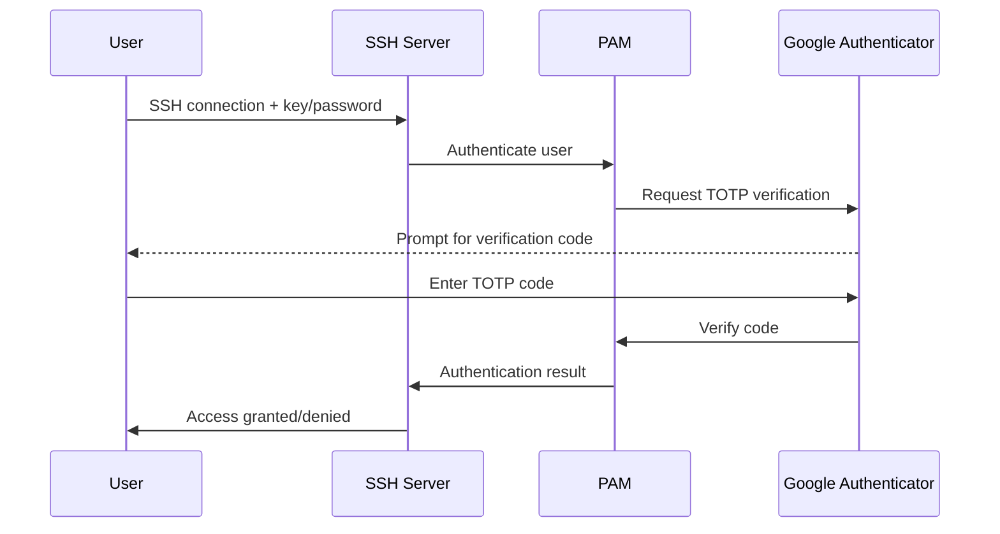

# How to Use Ansible to Set Up Two-Factor Authentication

Author: [nawazdhandala](https://www.github.com/nawazdhandala)

Tags: Ansible, Two-Factor Authentication, Security, SSH, Google Authenticator

Description: Automate the deployment of two-factor authentication across your Linux servers using Ansible and Google Authenticator PAM module.

---

Adding two-factor authentication (2FA) to your SSH servers is one of the best things you can do for security. But doing it manually on every server? That gets old fast. I have rolled out 2FA across hundreds of servers using Ansible, and in this post I will share the playbooks and strategies that make it work smoothly.

We will focus on Google Authenticator PAM, which is the most common TOTP-based 2FA solution for Linux SSH access. The approach works for any PAM-compatible authentication method, though.

## How 2FA Works with SSH

When you enable 2FA for SSH, the login process changes. After entering your password (or presenting your SSH key), you also need to provide a time-based one-time password (TOTP) from an authenticator app. The server validates this code against a shared secret that was generated during setup.

The flow looks like this:



## Installing Google Authenticator with Ansible

First, we need to install the PAM module on all target servers.

This playbook installs the Google Authenticator PAM module on both Debian and RHEL systems:

```yaml
# install_2fa.yml - Install Google Authenticator PAM module
---
- name: Install Two-Factor Authentication
  hosts: all
  become: true

  tasks:
    - name: Install Google Authenticator on Debian/Ubuntu
      ansible.builtin.apt:
        name: libpam-google-authenticator
        state: present
        update_cache: true
      when: ansible_os_family == "Debian"

    - name: Install Google Authenticator on RHEL/CentOS
      ansible.builtin.yum:
        name: google-authenticator
        state: present
      when: ansible_os_family == "RedHat"

    - name: Install EPEL repository first (RHEL)
      ansible.builtin.yum:
        name: epel-release
        state: present
      when: ansible_os_family == "RedHat"
```

## Configuring PAM for 2FA

The PAM configuration is where the magic happens. You need to add the Google Authenticator module to the SSH PAM stack.

This task inserts the Google Authenticator line into the PAM SSH configuration:

```yaml
# configure_pam.yml - Configure PAM for two-factor authentication
---
- name: Configure PAM for 2FA
  hosts: all
  become: true

  vars:
    pam_2fa_required: true
    pam_nullok: true  # Allow users who haven't set up 2FA yet

  tasks:
    - name: Add Google Authenticator to PAM SSH config
      ansible.builtin.lineinfile:
        path: /etc/pam.d/sshd
        line: "auth required pam_google_authenticator.so {{ 'nullok' if pam_nullok else '' }}"
        insertafter: "^@include common-auth|^auth.*pam_unix.so"
        state: present
      notify: restart sshd

    - name: Configure SSH to use challenge-response
      ansible.builtin.lineinfile:
        path: /etc/ssh/sshd_config
        regexp: "^#?ChallengeResponseAuthentication"
        line: "ChallengeResponseAuthentication yes"
        state: present
      notify: restart sshd

    - name: Configure SSH AuthenticationMethods
      ansible.builtin.lineinfile:
        path: /etc/ssh/sshd_config
        regexp: "^#?AuthenticationMethods"
        line: "AuthenticationMethods publickey,keyboard-interactive"
        state: present
      notify: restart sshd

    - name: Enable keyboard-interactive in SSH
      ansible.builtin.lineinfile:
        path: /etc/ssh/sshd_config
        regexp: "^#?KbdInteractiveAuthentication"
        line: "KbdInteractiveAuthentication yes"
        state: present
      notify: restart sshd

  handlers:
    - name: restart sshd
      ansible.builtin.service:
        name: sshd
        state: restarted
```

## Generating User TOTP Secrets

Each user needs their own TOTP secret. This is the trickiest part to automate because each user needs to scan a QR code or enter the secret into their authenticator app.

This playbook generates TOTP secrets for specified users and stores the output for distribution:

```yaml
# generate_totp_secrets.yml - Generate TOTP secrets for users
---
- name: Generate TOTP secrets for users
  hosts: all
  become: true

  vars:
    two_fa_users:
      - alice
      - bob
      - charlie
    totp_rate_limit: "3 30"  # 3 attempts per 30 seconds
    totp_window_size: 3      # Allow codes 1 step before/after current
    totp_disallow_reuse: true

  tasks:
    - name: Check if user already has 2FA configured
      ansible.builtin.stat:
        path: "/home/{{ item }}/.google_authenticator"
      loop: "{{ two_fa_users }}"
      register: existing_2fa

    - name: Generate Google Authenticator config for new users
      ansible.builtin.command: >
        google-authenticator
        --time-based
        --disallow-reuse
        --force
        --rate-limit={{ totp_rate_limit.split()[0] }}
        --rate-time={{ totp_rate_limit.split()[1] }}
        --window-size={{ totp_window_size }}
        --no-confirm
        --qr-mode=none
        --secret=/home/{{ item.item }}/.google_authenticator
      loop: "{{ existing_2fa.results }}"
      when: not item.stat.exists
      become_user: "{{ item.item }}"
      register: totp_output

    - name: Set correct permissions on authenticator file
      ansible.builtin.file:
        path: "/home/{{ item }}/.google_authenticator"
        owner: "{{ item }}"
        group: "{{ item }}"
        mode: '0400'
      loop: "{{ two_fa_users }}"

    - name: Read generated secrets for distribution
      ansible.builtin.command: head -1 /home/{{ item }}/.google_authenticator
      loop: "{{ two_fa_users }}"
      register: user_secrets
      changed_when: false

    - name: Display secrets (securely distribute these to users)
      ansible.builtin.debug:
        msg: "User {{ item.item }}: Secret key = {{ item.stdout }}"
      loop: "{{ user_secrets.results }}"
      no_log: false  # Set to true in production
```

## Handling Service Accounts

Service accounts should be excluded from 2FA requirements. You do not want your automated processes breaking because they cannot enter a TOTP code.

This configuration exempts service accounts from 2FA while requiring it for everyone else:

```yaml
# service_account_exemption.yml - Exempt service accounts from 2FA
---
- name: Configure 2FA with service account exemptions
  hosts: all
  become: true

  vars:
    service_accounts:
      - ansible
      - deploy
      - monitoring
      - backup

  tasks:
    - name: Create 2FA exempt group
      ansible.builtin.group:
        name: no2fa
        state: present

    - name: Add service accounts to exempt group
      ansible.builtin.user:
        name: "{{ item }}"
        groups: no2fa
        append: true
      loop: "{{ service_accounts }}"

    - name: Configure PAM to skip 2FA for exempt group
      ansible.builtin.blockinfile:
        path: /etc/pam.d/sshd
        block: |
          # Skip 2FA for service accounts
          auth [success=1 default=ignore] pam_succeed_if.so user ingroup no2fa
          auth required pam_google_authenticator.so nullok
        marker: "# {mark} ANSIBLE MANAGED - 2FA CONFIGURATION"
      notify: restart sshd

    - name: Configure SSH to allow key-only auth for service accounts
      ansible.builtin.blockinfile:
        path: /etc/ssh/sshd_config
        block: |
          Match Group no2fa
              AuthenticationMethods publickey
        marker: "# {mark} ANSIBLE MANAGED - SERVICE ACCOUNT AUTH"
      notify: restart sshd

  handlers:
    - name: restart sshd
      ansible.builtin.service:
        name: sshd
        state: restarted
```

## Building a Complete 2FA Role

Here is how I structure the full role for production use:

```yaml
# roles/two_factor_auth/defaults/main.yml
---
tfa_enabled: true
tfa_pam_nullok: true
tfa_exempt_group: no2fa
tfa_service_accounts: []
tfa_rate_limit_attempts: 3
tfa_rate_limit_period: 30
tfa_window_size: 3
tfa_users: []
```

The main tasks file orchestrates the full setup:

```yaml
# roles/two_factor_auth/tasks/main.yml
---
- name: Install Google Authenticator
  ansible.builtin.package:
    name: "{{ tfa_package_name }}"
    state: present

- name: Create 2FA exempt group
  ansible.builtin.group:
    name: "{{ tfa_exempt_group }}"
    state: present
  when: tfa_service_accounts | length > 0

- name: Add service accounts to exempt group
  ansible.builtin.user:
    name: "{{ item }}"
    groups: "{{ tfa_exempt_group }}"
    append: true
  loop: "{{ tfa_service_accounts }}"

- name: Configure PAM for 2FA
  ansible.builtin.template:
    src: pam_sshd.j2
    dest: /etc/pam.d/sshd
    owner: root
    group: root
    mode: '0644'
  notify: restart sshd

- name: Configure SSHD for 2FA
  ansible.builtin.template:
    src: sshd_config_2fa.j2
    dest: /etc/ssh/sshd_config.d/2fa.conf
    owner: root
    group: root
    mode: '0644'
  notify: restart sshd
```

## Testing the Configuration

Before rolling out to production, always test. This playbook verifies the 2FA setup is working:

```yaml
# test_2fa.yml - Verify 2FA configuration
---
- name: Verify 2FA configuration
  hosts: all
  become: true

  tasks:
    - name: Check PAM module is loaded
      ansible.builtin.shell: grep -c pam_google_authenticator /etc/pam.d/sshd
      register: pam_check
      changed_when: false
      failed_when: pam_check.stdout | int < 1

    - name: Check SSH config has challenge-response enabled
      ansible.builtin.shell: sshd -T | grep challengeresponseauthentication
      register: ssh_check
      changed_when: false

    - name: Verify SSH config syntax
      ansible.builtin.command: sshd -t
      changed_when: false

    - name: Report 2FA status
      ansible.builtin.debug:
        msg: "2FA is properly configured on {{ inventory_hostname }}"
```

## Rollback Plan

Always have a rollback plan. If 2FA breaks SSH access, you need a way back in.

```yaml
# rollback_2fa.yml - Emergency rollback of 2FA
---
- name: Rollback 2FA configuration
  hosts: all
  become: true

  tasks:
    - name: Remove Google Authenticator from PAM
      ansible.builtin.lineinfile:
        path: /etc/pam.d/sshd
        regexp: "pam_google_authenticator"
        state: absent
      notify: restart sshd

    - name: Reset SSH AuthenticationMethods
      ansible.builtin.lineinfile:
        path: /etc/ssh/sshd_config
        regexp: "^AuthenticationMethods"
        state: absent
      notify: restart sshd

  handlers:
    - name: restart sshd
      ansible.builtin.service:
        name: sshd
        state: restarted
```

## Lessons Learned

After rolling out 2FA to hundreds of servers, here are the key takeaways:

1. **Start with nullok.** This lets users without 2FA configured still log in. Remove it once everyone is set up.
2. **Always exempt service accounts.** Automated processes cannot enter TOTP codes.
3. **Test on a non-production server first.** A bad PAM configuration can lock everyone out.
4. **Keep console access available.** If SSH breaks, you need another way in.
5. **Document the user onboarding process.** Users need clear instructions for setting up their authenticator app.

Two-factor authentication is a significant security improvement, and Ansible makes it possible to deploy consistently across your entire fleet without spending days on manual configuration.
