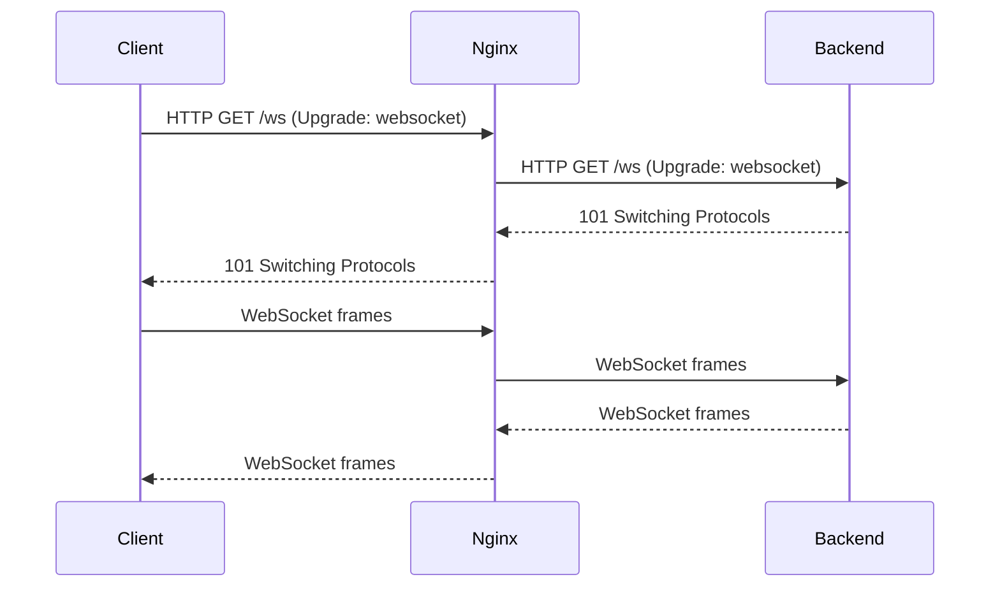

# How to Use Ansible to Set Up WebSocket Proxy with Nginx

Author: [nawazdhandala](https://www.github.com/nawazdhandala)

Tags: Ansible, Nginx, WebSocket, DevOps

Description: Automate the configuration of Nginx as a WebSocket reverse proxy using Ansible playbooks for real-time application deployments.

---

WebSocket connections are essential for real-time applications like chat systems, live dashboards, and collaborative editing tools. Nginx can act as a reverse proxy for WebSocket traffic, but the configuration requires specific HTTP upgrade headers that are not part of the default proxy setup. When you have multiple servers to configure, Ansible makes this deployment consistent and fast.

This post covers how to build an Ansible role that configures Nginx as a WebSocket-aware reverse proxy, including handling connection upgrades, timeouts, and health checks.

## How WebSocket Proxying Works in Nginx

WebSocket connections start as a regular HTTP request with an `Upgrade: websocket` header. The server responds with a `101 Switching Protocols` status, and the connection is upgraded from HTTP to a persistent WebSocket connection.

For Nginx to proxy this correctly, it needs to:

1. Pass the `Upgrade` and `Connection` headers to the backend.
2. Keep the connection alive long enough for WebSocket traffic.
3. Handle both regular HTTP and WebSocket traffic on the same server block.



## Project Layout

```
nginx-websocket/
  inventory/
    hosts.yml
  roles/
    nginx_websocket/
      tasks/
        main.yml
      templates/
        websocket_proxy.conf.j2
        upstream.conf.j2
      defaults/
        main.yml
      handlers/
        main.yml
  playbook.yml
```

## Default Variables

These variables control the WebSocket proxy behavior. The timeout values are particularly important because WebSocket connections are long-lived.

```yaml
# roles/nginx_websocket/defaults/main.yml
# WebSocket proxy configuration
nginx_ws_server_name: "ws.example.com"
nginx_ws_listen_port: 80
nginx_ws_ssl_enabled: false
nginx_ws_ssl_port: 443

# Backend servers running the WebSocket application
nginx_ws_backends:
  - address: "127.0.0.1"
    port: 8080

# Timeout for WebSocket connections (in seconds)
# Set this high enough for your use case - 3600 = 1 hour
nginx_ws_proxy_read_timeout: 3600
nginx_ws_proxy_send_timeout: 3600

# Path where WebSocket connections are accepted
nginx_ws_path: "/ws"

# Regular HTTP paths (non-WebSocket)
nginx_http_paths:
  - path: "/"
    backend_port: 8080

# Connection keepalive for upstream
nginx_ws_keepalive: 32
```

## Upstream Configuration Template

This template defines the upstream block with keepalive connections, which is important for WebSocket performance.

```nginx
# roles/nginx_websocket/templates/upstream.conf.j2
# Upstream definition for WebSocket backends
upstream websocket_backend {

    server {{ backend.address }}:{{ backend.port }};


    # Keep connections alive to reduce overhead
    keepalive {{ nginx_ws_keepalive }};
}
```

## WebSocket Proxy Template

The key part is the `map` block that sets the `Connection` header based on the incoming `Upgrade` header. This ensures WebSocket upgrade requests are handled correctly while normal HTTP requests still work.

```nginx
# roles/nginx_websocket/templates/websocket_proxy.conf.j2
# Map to handle WebSocket upgrade header
map $http_upgrade $connection_upgrade {
    default upgrade;
    ''      close;
}

server {
    listen {{ nginx_ws_listen_port }};

    listen {{ nginx_ws_ssl_port }} ssl;
    ssl_certificate /etc/nginx/ssl/{{ nginx_ws_server_name }}.crt;
    ssl_certificate_key /etc/nginx/ssl/{{ nginx_ws_server_name }}.key;

    server_name {{ nginx_ws_server_name }};

    # WebSocket proxy location
    location {{ nginx_ws_path }} {
        proxy_pass http://websocket_backend;
        proxy_http_version 1.1;

        # These two headers are required for the WebSocket upgrade
        proxy_set_header Upgrade $http_upgrade;
        proxy_set_header Connection $connection_upgrade;

        # Standard proxy headers
        proxy_set_header Host $host;
        proxy_set_header X-Real-IP $remote_addr;
        proxy_set_header X-Forwarded-For $proxy_add_x_forwarded_for;
        proxy_set_header X-Forwarded-Proto $scheme;

        # Timeouts for long-lived WebSocket connections
        proxy_read_timeout {{ nginx_ws_proxy_read_timeout }}s;
        proxy_send_timeout {{ nginx_ws_proxy_send_timeout }}s;

        # Disable buffering for real-time data
        proxy_buffering off;
        proxy_cache off;
    }


    # Regular HTTP traffic
    location {{ http_path.path }} {
        proxy_pass http://127.0.0.1:{{ http_path.backend_port }};
        proxy_set_header Host $host;
        proxy_set_header X-Real-IP $remote_addr;
        proxy_set_header X-Forwarded-For $proxy_add_x_forwarded_for;
        proxy_set_header X-Forwarded-Proto $scheme;
    }


    # Health check endpoint
    location /health {
        access_log off;
        return 200 "ok\n";
        add_header Content-Type text/plain;
    }
}
```

## Ansible Tasks

The task file installs Nginx, deploys the templates, and ensures the service is running.

```yaml
# roles/nginx_websocket/tasks/main.yml
---
- name: Install Nginx
  ansible.builtin.apt:
    name: nginx
    state: present
    update_cache: yes
  become: true

- name: Create SSL directory
  ansible.builtin.file:
    path: /etc/nginx/ssl
    state: directory
    owner: root
    group: root
    mode: "0700"
  become: true
  when: nginx_ws_ssl_enabled

- name: Deploy upstream configuration
  ansible.builtin.template:
    src: upstream.conf.j2
    dest: /etc/nginx/conf.d/websocket_upstream.conf
    owner: root
    group: root
    mode: "0644"
  become: true
  notify: Validate and reload nginx

- name: Deploy WebSocket proxy configuration
  ansible.builtin.template:
    src: websocket_proxy.conf.j2
    dest: /etc/nginx/sites-available/websocket_proxy.conf
    owner: root
    group: root
    mode: "0644"
  become: true
  notify: Validate and reload nginx

- name: Enable WebSocket proxy site
  ansible.builtin.file:
    src: /etc/nginx/sites-available/websocket_proxy.conf
    dest: /etc/nginx/sites-enabled/websocket_proxy.conf
    state: link
  become: true
  notify: Validate and reload nginx

- name: Remove default Nginx site
  ansible.builtin.file:
    path: /etc/nginx/sites-enabled/default
    state: absent
  become: true
  notify: Validate and reload nginx

- name: Ensure Nginx is started and enabled
  ansible.builtin.systemd:
    name: nginx
    state: started
    enabled: true
  become: true
```

## Handlers

Always validate the config before reloading to avoid breaking a running server.

```yaml
# roles/nginx_websocket/handlers/main.yml
---
- name: Validate and reload nginx
  ansible.builtin.command: nginx -t
  become: true
  changed_when: false
  notify: Reload nginx

- name: Reload nginx
  ansible.builtin.systemd:
    name: nginx
    state: reloaded
  become: true
```

## The Playbook

```yaml
# playbook.yml
---
- name: Set up Nginx WebSocket proxy
  hosts: webservers
  become: true
  vars:
    nginx_ws_server_name: "realtime.myapp.com"
    nginx_ws_backends:
      - address: "10.0.1.10"
        port: 3000
      - address: "10.0.1.11"
        port: 3000
    nginx_ws_proxy_read_timeout: 7200
    nginx_ws_path: "/socket"
  roles:
    - nginx_websocket
```

## Running It

```bash
# Deploy the WebSocket proxy configuration
ansible-playbook -i inventory/hosts.yml playbook.yml
```

## Testing the WebSocket Connection

You can test the WebSocket proxy using `wscat`, a command-line WebSocket client:

```bash
# Install wscat
npm install -g wscat

# Connect to the WebSocket endpoint through Nginx
wscat -c ws://realtime.myapp.com/socket

# If SSL is enabled
wscat -c wss://realtime.myapp.com/socket
```

You can also test with curl to verify the upgrade headers are being passed:

```bash
# Check that the upgrade request returns 101
curl -i -N \
  -H "Connection: Upgrade" \
  -H "Upgrade: websocket" \
  -H "Sec-WebSocket-Version: 13" \
  -H "Sec-WebSocket-Key: dGhlIHNhbXBsZSBub25jZQ==" \
  http://realtime.myapp.com/socket
```

## Handling Multiple WebSocket Paths

If your application has multiple WebSocket endpoints (for example, one for chat and one for notifications), extend the variables:

```yaml
nginx_ws_locations:
  - path: "/ws/chat"
    upstream: "chat_backend"
    timeout: 7200
  - path: "/ws/notifications"
    upstream: "notify_backend"
    timeout: 3600
```

Then loop over them in your template just like we did with the rate limit zones in the previous examples.

## Common Pitfalls

The most common issue with WebSocket proxying through Nginx is the connection dropping after 60 seconds. This happens because the default `proxy_read_timeout` is 60 seconds, and WebSocket connections are often idle between messages. The timeout values in our playbook default to 3600 seconds (one hour), but you should adjust these based on your application.

Another issue is forgetting to set `proxy_http_version 1.1`. WebSocket requires HTTP/1.1 for the upgrade mechanism, and Nginx defaults to HTTP/1.0 for upstream connections.

## Summary

Setting up Nginx as a WebSocket proxy with Ansible gives you a repeatable, version-controlled deployment process. The critical pieces are the `Upgrade` and `Connection` header passthrough, appropriate timeout values for long-lived connections, and disabling buffering so real-time data flows through without delay. With this role, you can deploy consistent WebSocket proxy configurations across any number of servers in minutes.
