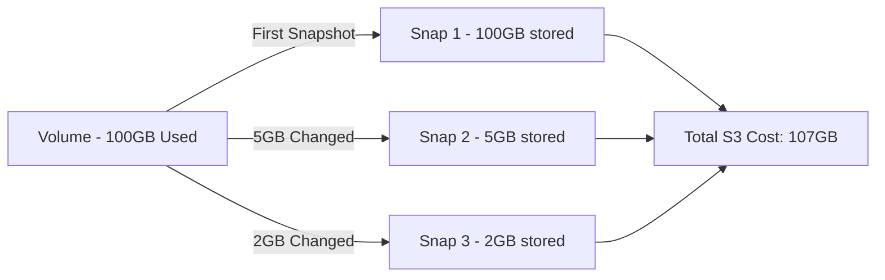

# How to Use Ansible to Snapshot AWS EBS Volumes

Author: [nawazdhandala](https://www.github.com/nawazdhandala)

Tags: Ansible, AWS, EBS, Snapshots, Backup

Description: Learn how to automate AWS EBS volume snapshots with Ansible including creation, lifecycle management, and cross-region copying.

---

Snapshots are your safety net for EBS volumes. They capture a point-in-time copy of your data and store it in S3, giving you the ability to restore volumes, create new ones from existing data, or copy data across regions. The problem is that manual snapshot management does not scale. You forget to take them, you forget to clean up old ones, and suddenly you are paying for hundreds of stale snapshots. Ansible lets you codify your snapshot strategy so it runs consistently every time.

## Prerequisites

Make sure you have the following ready:

- Ansible 2.9+ with the `amazon.aws` collection installed
- AWS credentials with `ec2:CreateSnapshot`, `ec2:DeleteSnapshot`, `ec2:DescribeSnapshots`, and `ec2:CopySnapshot` permissions
- At least one EBS volume to snapshot

```bash
# Install the required collection
ansible-galaxy collection install amazon.aws
```

## How EBS Snapshots Work

EBS snapshots are incremental. The first snapshot copies the entire volume, but subsequent snapshots only copy blocks that have changed since the last snapshot. This makes them efficient in terms of both time and storage cost.



Even though each snapshot can independently restore the full volume, you only pay for the changed blocks. This is why frequent snapshots are not as expensive as people assume.

## Creating a Single Snapshot

The `amazon.aws.ec2_snapshot` module is your primary tool. Here is the simplest case:

```yaml
# snapshot-volume.yml - Create a snapshot of a specific EBS volume
---
- name: Create EBS Snapshot
  hosts: localhost
  connection: local
  gather_facts: false

  vars:
    volume_id: "vol-0abc123def456789a"
    aws_region: us-east-1

  tasks:
    - name: Create a snapshot with descriptive tags
      amazon.aws.ec2_snapshot:
        region: "{{ aws_region }}"
        volume_id: "{{ volume_id }}"
        description: "Automated snapshot - {{ ansible_date_time.iso8601 | default(lookup('pipe', 'date -u +%Y-%m-%dT%H:%M:%SZ')) }}"
        snapshot_tags:
          Name: "snap-{{ volume_id }}-daily"
          CreatedBy: ansible
          Purpose: daily-backup
          VolumeId: "{{ volume_id }}"
        wait: true
        wait_timeout: 600
      register: snapshot_result

    - name: Show snapshot details
      ansible.builtin.debug:
        msg: "Snapshot {{ snapshot_result.snapshot_id }} created from {{ volume_id }}"
```

The `wait: true` parameter tells Ansible to block until the snapshot reaches the `completed` state. Without it, Ansible marks the task as done as soon as AWS accepts the snapshot request, which might be fine for fire-and-forget backups but problematic if subsequent tasks depend on the snapshot being ready. The `wait_timeout` gives AWS up to 600 seconds to complete, which is usually plenty for volumes under 500GB.

## Snapshotting All Volumes on an Instance

You often want to snapshot every volume attached to an instance, not just one specific volume. This requires gathering volume information first:

```yaml
# snapshot-instance-volumes.yml - Snapshot all volumes attached to an instance
---
- name: Snapshot All Volumes on an Instance
  hosts: localhost
  connection: local
  gather_facts: false

  vars:
    instance_id: "i-0abc123def456789"
    aws_region: us-east-1
    timestamp: "{{ lookup('pipe', 'date +%Y%m%d-%H%M%S') }}"

  tasks:
    - name: Get instance details to find attached volumes
      amazon.aws.ec2_instance_info:
        region: "{{ aws_region }}"
        instance_ids:
          - "{{ instance_id }}"
      register: instance_info

    - name: Extract volume IDs from block device mappings
      ansible.builtin.set_fact:
        attached_volumes: "{{ instance_info.instances[0].block_device_mappings | map(attribute='ebs.volume_id') | list }}"

    - name: Show volumes that will be snapshotted
      ansible.builtin.debug:
        msg: "Found {{ attached_volumes | length }} volumes: {{ attached_volumes }}"

    - name: Create snapshot for each attached volume
      amazon.aws.ec2_snapshot:
        region: "{{ aws_region }}"
        volume_id: "{{ item }}"
        description: "Instance {{ instance_id }} - Volume {{ item }} - {{ timestamp }}"
        snapshot_tags:
          Name: "snap-{{ instance_id }}-{{ item }}-{{ timestamp }}"
          InstanceId: "{{ instance_id }}"
          CreatedBy: ansible
          Timestamp: "{{ timestamp }}"
        wait: true
        wait_timeout: 900
      loop: "{{ attached_volumes }}"
      register: all_snapshots

    - name: List created snapshots
      ansible.builtin.debug:
        msg: "{{ item.item }} -> {{ item.snapshot_id }}"
      loop: "{{ all_snapshots.results }}"
```

## Application-Consistent Snapshots

For databases and other stateful applications, you want to flush data to disk before snapshotting. The approach is to freeze I/O on the instance, take the snapshot request (not wait for completion), then unfreeze:

```yaml
# consistent-snapshot.yml - Application-consistent snapshot for a database volume
---
- name: Application Consistent Snapshot
  hosts: db_servers
  become: true

  vars:
    db_volume_device: /dev/nvme1n1
    db_mount_point: /var/lib/postgresql
    volume_id: "vol-0abc123def456789a"
    aws_region: us-east-1

  tasks:
    - name: Flush PostgreSQL data to disk
      ansible.builtin.command: psql -c "SELECT pg_switch_wal();" -U postgres
      changed_when: true

    - name: Freeze the filesystem
      ansible.builtin.command: fsfreeze --freeze {{ db_mount_point }}
      changed_when: true

    - name: Create the snapshot (do not wait - we need to unfreeze quickly)
      amazon.aws.ec2_snapshot:
        region: "{{ aws_region }}"
        volume_id: "{{ volume_id }}"
        description: "DB consistent snapshot"
        snapshot_tags:
          Name: "db-consistent-snap"
          Consistent: "true"
        wait: false
      register: snap
      delegate_to: localhost
      connection: local

    - name: Unfreeze the filesystem immediately
      ansible.builtin.command: fsfreeze --unfreeze {{ db_mount_point }}
      changed_when: true

    - name: Report snapshot ID
      ansible.builtin.debug:
        msg: "Consistent snapshot initiated: {{ snap.snapshot_id }}"
```

Notice that `wait` is set to `false` here. The freeze/unfreeze window should be as short as possible to minimize application impact. The snapshot is guaranteed to be consistent from the moment AWS acknowledges the request, even if the actual data copy takes much longer.

## Cleaning Up Old Snapshots

Without cleanup, snapshots accumulate and your storage bill grows. Here is a playbook that deletes snapshots older than a specified retention period:

```yaml
# cleanup-snapshots.yml - Delete snapshots older than retention period
---
- name: Cleanup Old Snapshots
  hosts: localhost
  connection: local
  gather_facts: false

  vars:
    aws_region: us-east-1
    retention_days: 30
    owner_id: "123456789012"

  tasks:
    - name: Find all Ansible-managed snapshots
      amazon.aws.ec2_snapshot_info:
        region: "{{ aws_region }}"
        filters:
          "tag:CreatedBy": ansible
          "owner-id": "{{ owner_id }}"
      register: all_snapshots

    - name: Calculate cutoff date
      ansible.builtin.set_fact:
        cutoff_date: "{{ '%Y-%m-%d' | strftime(ansible_date_time.epoch | int - (retention_days * 86400)) | default(lookup('pipe', 'date -d \"' ~ retention_days ~ ' days ago\" +%Y-%m-%d')) }}"

    - name: Identify snapshots to delete
      ansible.builtin.set_fact:
        old_snapshots: "{{ all_snapshots.snapshots | selectattr('start_time', 'lt', cutoff_date) | map(attribute='snapshot_id') | list }}"

    - name: Report snapshots to be deleted
      ansible.builtin.debug:
        msg: "Found {{ old_snapshots | length }} snapshots older than {{ retention_days }} days"

    - name: Delete old snapshots
      amazon.aws.ec2_snapshot:
        region: "{{ aws_region }}"
        snapshot_id: "{{ item }}"
        state: absent
      loop: "{{ old_snapshots }}"
      when: old_snapshots | length > 0
```

Tagging your snapshots with `CreatedBy: ansible` in the creation step pays off here. It lets you filter precisely for snapshots that your automation created, so you do not accidentally delete snapshots that someone created manually for a specific reason.

## Copying Snapshots Across Regions

For disaster recovery, you need snapshots in multiple regions:

```yaml
# cross-region-copy.yml - Copy a snapshot to another region
---
- name: Cross-Region Snapshot Copy
  hosts: localhost
  connection: local
  gather_facts: false

  vars:
    source_region: us-east-1
    dest_region: us-west-2
    snapshot_id: "snap-0abc123def456789"

  tasks:
    - name: Copy snapshot to destination region
      amazon.aws.ec2_snapshot_copy:
        region: "{{ dest_region }}"
        source_region: "{{ source_region }}"
        source_snapshot_id: "{{ snapshot_id }}"
        description: "DR copy of {{ snapshot_id }} from {{ source_region }}"
        encrypted: true
        tags:
          Name: "dr-copy-{{ snapshot_id }}"
          SourceRegion: "{{ source_region }}"
          SourceSnapshot: "{{ snapshot_id }}"
        wait: true
        wait_timeout: 1800
      register: copy_result

    - name: Show copy result
      ansible.builtin.debug:
        msg: "Snapshot copied to {{ dest_region }}: {{ copy_result.snapshot_id }}"
```

The `wait_timeout` is set higher here (1800 seconds) because cross-region copies involve transferring data over AWS's internal network, and large volumes can take a while.

## Scheduling Snapshots with Ansible and Cron

To run snapshots on a schedule, combine your playbook with a cron job:

```yaml
# setup-snapshot-cron.yml - Set up automated snapshot scheduling
---
- name: Set Up Snapshot Cron Job
  hosts: ansible_controller
  become: true

  tasks:
    - name: Create daily snapshot cron job at 2 AM UTC
      ansible.builtin.cron:
        name: "Daily EBS Snapshots"
        minute: "0"
        hour: "2"
        job: "/usr/bin/ansible-playbook /opt/ansible/snapshot-instance-volumes.yml >> /var/log/ebs-snapshots.log 2>&1"
        user: ansible

    - name: Create weekly cleanup cron job on Sundays at 4 AM UTC
      ansible.builtin.cron:
        name: "Weekly Snapshot Cleanup"
        minute: "0"
        hour: "4"
        weekday: "0"
        job: "/usr/bin/ansible-playbook /opt/ansible/cleanup-snapshots.yml >> /var/log/snapshot-cleanup.log 2>&1"
        user: ansible
```

## Summary

Automating EBS snapshots with Ansible turns a forgettable manual task into a reliable, auditable process. The key pieces are: tag your snapshots for easy filtering, use application-consistent snapshot techniques for stateful workloads, always implement retention-based cleanup to control costs, and copy critical snapshots to a second region for disaster recovery. With these playbooks in your repository, your backup strategy runs itself.
