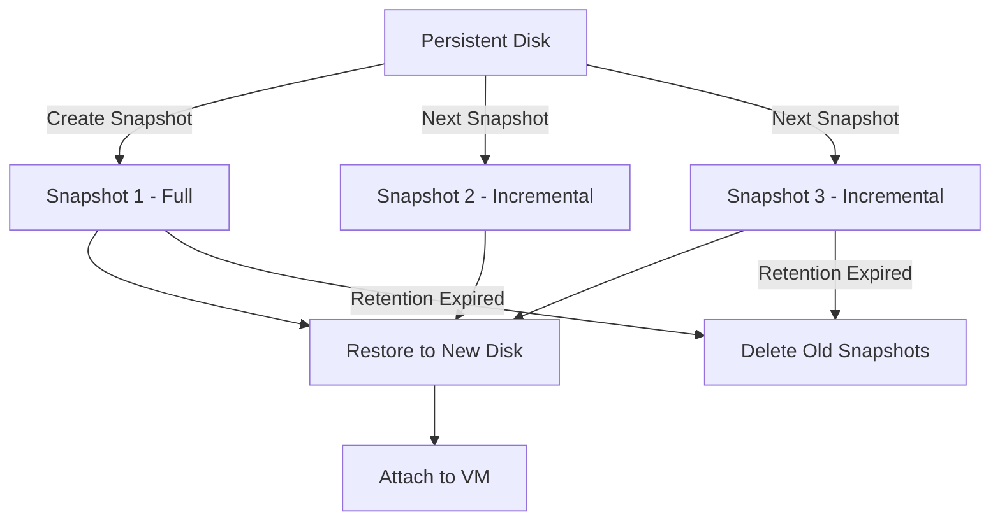

# How to Use Ansible to Snapshot GCP Disks

Author: [nawazdhandala](https://www.github.com/nawazdhandala)

Tags: Ansible, GCP, Disk Snapshots, Backup, Infrastructure as Code

Description: Learn how to automate GCP disk snapshots with Ansible for reliable backups, disaster recovery, and disk cloning across zones and regions.

---

Disk snapshots are one of the most important tools in your GCP backup strategy. They capture the state of a persistent disk at a point in time, and they are incremental, meaning each subsequent snapshot only stores the data that changed since the last one. This makes them both fast and cost-effective. In this post, we will automate snapshot management with Ansible so you can build reliable, repeatable backup workflows.

## Why Automate Snapshots?

Sure, you can take a snapshot from the GCP Console in about five clicks. But what about taking snapshots of 50 disks every night? Or creating a pre-deployment snapshot of your database disks before a release? Or cleaning up snapshots older than 30 days? Automation turns these from manual chores into hands-off processes.

## Prerequisites

You need:

- Ansible 2.10+ with the `google.cloud` collection installed
- A GCP service account with `compute.disks.createSnapshot` and `compute.snapshots.*` permissions
- The Compute Engine API enabled in your project

```bash
# Install the Google Cloud collection for Ansible
ansible-galaxy collection install google.cloud
```

## Taking a Basic Snapshot

The simplest case is snapshotting a single disk. The module is `google.cloud.gcp_compute_snapshot`.

```yaml
# snapshot-disk.yml - Take a snapshot of a single persistent disk
---
- name: Snapshot a GCP Persistent Disk
  hosts: localhost
  connection: local
  gather_facts: false

  vars:
    gcp_project: "my-project-id"
    gcp_auth_kind: "serviceaccount"
    gcp_service_account_file: "/path/to/service-account-key.json"
    zone: "us-central1-a"
    timestamp: "{{ lookup('pipe', 'date +%Y%m%d-%H%M%S') }}"

  tasks:
    - name: Get reference to the source disk
      google.cloud.gcp_compute_disk:
        name: "db-data-disk"
        zone: "{{ zone }}"
        project: "{{ gcp_project }}"
        auth_kind: "{{ gcp_auth_kind }}"
        service_account_file: "{{ gcp_service_account_file }}"
        state: present
      register: source_disk

    - name: Create a snapshot with timestamp in the name
      google.cloud.gcp_compute_snapshot:
        name: "db-data-disk-{{ timestamp }}"
        source_disk:
          selfLink: "{{ source_disk.selfLink }}"
        labels:
          source_disk: "db-data-disk"
          created_by: "ansible"
          environment: "production"
        project: "{{ gcp_project }}"
        auth_kind: "{{ gcp_auth_kind }}"
        service_account_file: "{{ gcp_service_account_file }}"
        state: present
      register: snapshot_result

    - name: Display snapshot info
      ansible.builtin.debug:
        msg: |
          Snapshot created: {{ snapshot_result.name }}
          Source disk: db-data-disk
          Storage bytes: {{ snapshot_result.storageBytes | default('calculating') }}
```

## Snapshotting Multiple Disks

Most applications have several disks. A database server might have separate disks for data, WAL logs, and backups. You want to snapshot all of them together.

```yaml
# snapshot-multiple-disks.yml - Snapshot a set of related disks
---
- name: Snapshot Multiple Disks for Database Server
  hosts: localhost
  connection: local
  gather_facts: false

  vars:
    gcp_project: "my-project-id"
    gcp_auth_kind: "serviceaccount"
    gcp_service_account_file: "/path/to/service-account-key.json"
    zone: "us-central1-a"
    timestamp: "{{ lookup('pipe', 'date +%Y%m%d-%H%M%S') }}"

    # List of disks to snapshot together
    disks_to_snapshot:
      - "postgres-data-disk"
      - "postgres-wal-disk"
      - "postgres-backup-disk"

  tasks:
    - name: Get disk references
      google.cloud.gcp_compute_disk:
        name: "{{ item }}"
        zone: "{{ zone }}"
        project: "{{ gcp_project }}"
        auth_kind: "{{ gcp_auth_kind }}"
        service_account_file: "{{ gcp_service_account_file }}"
        state: present
      loop: "{{ disks_to_snapshot }}"
      register: disk_refs

    - name: Create snapshots for all disks
      google.cloud.gcp_compute_snapshot:
        name: "{{ item.item }}-{{ timestamp }}"
        source_disk:
          selfLink: "{{ item.selfLink }}"
        labels:
          source_disk: "{{ item.item }}"
          snapshot_group: "postgres-{{ timestamp }}"
          created_by: "ansible"
        project: "{{ gcp_project }}"
        auth_kind: "{{ gcp_auth_kind }}"
        service_account_file: "{{ gcp_service_account_file }}"
        state: present
      loop: "{{ disk_refs.results }}"
      register: snapshot_results

    - name: List all created snapshots
      ansible.builtin.debug:
        msg: "Snapshot created: {{ item.name }}"
      loop: "{{ snapshot_results.results }}"
```

## Pre-Deployment Snapshots

One of the most valuable uses of automated snapshots is taking them right before a deployment. If something goes wrong, you have a clean rollback point.

```yaml
# pre-deploy-snapshot.yml - Take safety snapshots before a deployment
---
- name: Pre-Deployment Snapshot Workflow
  hosts: localhost
  connection: local
  gather_facts: false

  vars:
    gcp_project: "my-project-id"
    gcp_auth_kind: "serviceaccount"
    gcp_service_account_file: "/path/to/service-account-key.json"
    zone: "us-central1-a"
    deploy_version: "v2.5.0"
    timestamp: "{{ lookup('pipe', 'date +%Y%m%d-%H%M%S') }}"
    critical_disks:
      - "app-db-data"
      - "app-db-logs"

  tasks:
    - name: Announce snapshot start
      ansible.builtin.debug:
        msg: "Starting pre-deployment snapshots for release {{ deploy_version }}"

    - name: Get disk references for critical disks
      google.cloud.gcp_compute_disk:
        name: "{{ item }}"
        zone: "{{ zone }}"
        project: "{{ gcp_project }}"
        auth_kind: "{{ gcp_auth_kind }}"
        service_account_file: "{{ gcp_service_account_file }}"
        state: present
      loop: "{{ critical_disks }}"
      register: disk_info

    - name: Create pre-deployment snapshots
      google.cloud.gcp_compute_snapshot:
        name: "pre-deploy-{{ deploy_version }}-{{ item.item }}-{{ timestamp }}"
        source_disk:
          selfLink: "{{ item.selfLink }}"
        labels:
          type: "pre-deployment"
          deploy_version: "{{ deploy_version }}"
          source_disk: "{{ item.item }}"
          created_by: "ansible-deploy-pipeline"
        project: "{{ gcp_project }}"
        auth_kind: "{{ gcp_auth_kind }}"
        service_account_file: "{{ gcp_service_account_file }}"
        state: present
      loop: "{{ disk_info.results }}"
      register: snapshots

    - name: Confirm all snapshots completed
      ansible.builtin.debug:
        msg: |
          All pre-deployment snapshots created for {{ deploy_version }}.
          Snapshots: {{ snapshots.results | map(attribute='name') | list }}
          Proceed with deployment.
```

## Restoring from a Snapshot

Taking snapshots is only useful if you can restore from them. To restore, you create a new disk from the snapshot, then attach it to a VM.

```yaml
# restore-from-snapshot.yml - Create a new disk from a snapshot
---
- name: Restore Disk from Snapshot
  hosts: localhost
  connection: local
  gather_facts: false

  vars:
    gcp_project: "my-project-id"
    gcp_auth_kind: "serviceaccount"
    gcp_service_account_file: "/path/to/service-account-key.json"
    zone: "us-central1-a"
    snapshot_name: "pre-deploy-v2.5.0-app-db-data-20260220-143022"

  tasks:
    - name: Get the snapshot reference
      google.cloud.gcp_compute_snapshot_info:
        filters:
          - "name = {{ snapshot_name }}"
        project: "{{ gcp_project }}"
        auth_kind: "{{ gcp_auth_kind }}"
        service_account_file: "{{ gcp_service_account_file }}"
      register: snapshot_info

    - name: Create a new disk from the snapshot
      google.cloud.gcp_compute_disk:
        name: "restored-app-db-data"
        zone: "{{ zone }}"
        type: "pd-ssd"
        source_snapshot:
          selfLink: "{{ snapshot_info.resources[0].selfLink }}"
        labels:
          restored_from: "{{ snapshot_name }}"
          restored_by: "ansible"
        project: "{{ gcp_project }}"
        auth_kind: "{{ gcp_auth_kind }}"
        service_account_file: "{{ gcp_service_account_file }}"
        state: present
      register: restored_disk

    - name: Show restored disk info
      ansible.builtin.debug:
        msg: |
          Restored disk: {{ restored_disk.name }}
          Size: {{ restored_disk.sizeGb }} GB
          Source snapshot: {{ snapshot_name }}
          Ready to attach to a VM.
```

## Snapshot Lifecycle Diagram



## Cleaning Up Old Snapshots

Snapshots cost money for storage, so you should have a retention policy. Here is a playbook that deletes snapshots older than a specified number of days.

```yaml
# cleanup-old-snapshots.yml - Delete snapshots past their retention period
---
- name: Cleanup Old Snapshots
  hosts: localhost
  connection: local
  gather_facts: false

  vars:
    gcp_project: "my-project-id"
    gcp_auth_kind: "serviceaccount"
    gcp_service_account_file: "/path/to/service-account-key.json"
    retention_days: 30

  tasks:
    - name: Get all snapshots in the project
      google.cloud.gcp_compute_snapshot_info:
        project: "{{ gcp_project }}"
        auth_kind: "{{ gcp_auth_kind }}"
        service_account_file: "{{ gcp_service_account_file }}"
      register: all_snapshots

    - name: Calculate cutoff date
      ansible.builtin.set_fact:
        cutoff_date: "{{ '%Y-%m-%dT%H:%M:%S' | strftime(ansible_date_time.epoch | int - (retention_days * 86400)) }}"

    - name: Identify snapshots older than retention period
      ansible.builtin.set_fact:
        old_snapshots: >-
          {{ all_snapshots.resources
             | selectattr('creationTimestamp', 'lt', cutoff_date)
             | selectattr('labels.created_by', 'defined')
             | selectattr('labels.created_by', 'eq', 'ansible')
             | list }}

    - name: Show snapshots to be deleted
      ansible.builtin.debug:
        msg: "Will delete {{ old_snapshots | length }} snapshots older than {{ retention_days }} days"

    - name: Delete old snapshots
      google.cloud.gcp_compute_snapshot:
        name: "{{ item.name }}"
        source_disk:
          selfLink: "{{ item.sourceDisk }}"
        project: "{{ gcp_project }}"
        auth_kind: "{{ gcp_auth_kind }}"
        service_account_file: "{{ gcp_service_account_file }}"
        state: absent
      loop: "{{ old_snapshots }}"
      when: old_snapshots | length > 0
```

## Scheduling Snapshots with Ansible and Cron

You can use a cron job or your CI/CD system to run the snapshot playbook on a schedule:

```bash
# Add to crontab to run nightly snapshots at 2 AM
# crontab -e
0 2 * * * cd /opt/ansible && ansible-playbook snapshot-multiple-disks.yml >> /var/log/ansible-snapshots.log 2>&1
```

For more sophisticated scheduling, consider using GCP Snapshot Schedules (resource policies) which can also be managed through Ansible, or trigger the playbook from a CI/CD pipeline.

## Best Practices

1. **Use timestamps in snapshot names.** GCP snapshot names must be unique within a project. Timestamps prevent naming collisions.

2. **Label everything.** Labels on snapshots help you identify what they are for, what disk they came from, and who created them. This is critical when you have hundreds of snapshots.

3. **Snapshot before risky operations.** Any time you are about to do something that could lose data (deployments, migrations, schema changes), take a snapshot first.

4. **Implement retention policies.** Snapshots are cheap, but they are not free. Old snapshots you will never use are just wasted money.

5. **Test your restore process.** A snapshot you cannot restore from is worthless. Periodically test restoring from snapshots to make sure your process works.

6. **Consider application consistency.** For databases, it is better to flush data to disk and briefly pause writes before taking a snapshot. This gives you an application-consistent snapshot rather than a crash-consistent one.

## Conclusion

Automated disk snapshots with Ansible give you a solid backup strategy that runs without manual intervention. By combining regular scheduled snapshots, pre-deployment safety snapshots, and automated cleanup, you get reliable data protection without snapshot sprawl eating up your storage budget. The key is to start simple with a basic snapshot playbook, then layer on the retention and scheduling logic as your needs grow.
