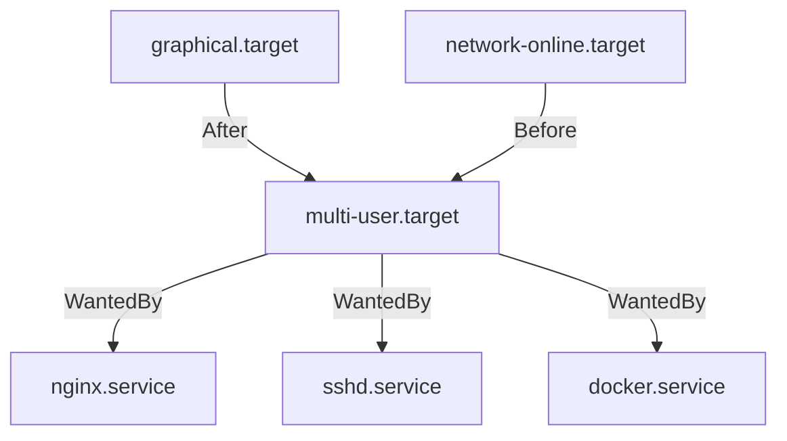

# How to Use Ansible to Start Services After Reboot

Author: [nawazdhandala](https://www.github.com/nawazdhandala)

Tags: Ansible, systemd, Boot Services, Linux, Service Management

Description: Learn how to ensure services start automatically after a reboot using Ansible, covering systemd enable, dependencies, and boot verification.

---

Rebooting a server should not be a stressful event. Every service your application depends on should come back up in the right order without manual intervention. But in practice, I have seen many setups where someone manually starts services after every reboot because they were never properly enabled, or the boot order was wrong, or a dependency was not available in time. Ansible can fix all of this by ensuring services are enabled, ordered correctly, and verified after boot.

## Enabling a Service to Start at Boot

The most basic step is enabling a service. An enabled service has a symlink in the appropriate systemd target directory.

Enable services to start at boot:

```yaml
---
- name: Ensure services start after reboot
  hosts: all
  become: yes
  tasks:
    - name: Enable critical services
      ansible.builtin.systemd:
        name: "{{ item }}"
        enabled: yes
        state: started
      loop:
        - sshd
        - nginx
        - docker
        - postgresql
        - redis-server
```

The `enabled: yes` parameter creates the symlink. The `state: started` parameter also starts the service immediately if it is not already running.

## Verifying Enabled State

Before you trust that a server will come back cleanly after reboot, verify the enabled state of all important services.

Check which services are enabled:

```yaml
- name: Gather service facts
  ansible.builtin.service_facts:

- name: Verify all required services are enabled
  ansible.builtin.assert:
    that:
      - "item in ansible_facts.services"
      - "ansible_facts.services[item]['status'] == 'enabled'"
    fail_msg: "{{ item }} is not enabled for boot!"
    success_msg: "{{ item }} is properly enabled"
  loop:
    - sshd.service
    - nginx.service
    - docker.service
    - postgresql.service
```

## Understanding WantedBy and RequiredBy

When you enable a systemd service, it creates a symlink based on the `[Install]` section of its unit file.



If your custom service unit has `WantedBy=multi-user.target`, enabling it creates a symlink in `/etc/systemd/system/multi-user.target.wants/`. This means it will start when the system reaches multi-user mode, which is the standard boot target for servers.

For services that need the network stack to be fully ready:

```yaml
- name: Deploy service that needs networking
  ansible.builtin.template:
    src: myapp.service.j2
    dest: /etc/systemd/system/myapp.service
  notify: Reload systemd

# In the template, make sure to include:
# [Unit]
# After=network-online.target
# Wants=network-online.target
```

The `network-online.target` is important. The plain `network.target` means the network interfaces are configured, but they might not actually have connectivity yet. `network-online.target` waits until the network is actually reachable.

## Handling Boot Order with Dependencies

If your application depends on a database, you need the database to start first.

Ensure correct boot order through unit file dependencies:

```yaml
---
- name: Configure service boot order
  hosts: app_servers
  become: yes
  tasks:
    - name: Deploy database service
      ansible.builtin.copy:
        dest: /etc/systemd/system/myapp-db.service
        content: |
          [Unit]
          Description=MyApp Database
          After=network-online.target
          Wants=network-online.target

          [Service]
          Type=simple
          ExecStart=/opt/myapp/bin/db-server
          Restart=on-failure

          [Install]
          WantedBy=multi-user.target
      notify: Reload systemd

    - name: Deploy application service
      ansible.builtin.copy:
        dest: /etc/systemd/system/myapp.service
        content: |
          [Unit]
          Description=MyApp Server
          After=network-online.target myapp-db.service
          Wants=network-online.target
          Requires=myapp-db.service

          [Service]
          Type=simple
          ExecStart=/opt/myapp/bin/server
          Restart=on-failure
          # Give the database time to be ready
          ExecStartPre=/opt/myapp/bin/wait-for-db.sh

          [Install]
          WantedBy=multi-user.target
      notify: Reload systemd

    - name: Flush handlers
      ansible.builtin.meta: flush_handlers

    - name: Enable both services
      ansible.builtin.systemd:
        name: "{{ item }}"
        enabled: yes
        state: started
        daemon_reload: yes
      loop:
        - myapp-db
        - myapp

  handlers:
    - name: Reload systemd
      ansible.builtin.systemd:
        daemon_reload: yes
```

## Using ExecStartPre for Boot Readiness

Sometimes a dependency is not just about service ordering but about actual readiness. A database service might be "started" but not accepting connections yet.

Wait for dependency readiness before starting:

```yaml
- name: Deploy wait-for-db script
  ansible.builtin.copy:
    dest: /opt/myapp/bin/wait-for-db.sh
    mode: '0755'
    content: |
      #!/bin/bash
      # Wait for PostgreSQL to accept connections
      MAX_TRIES=30
      TRIES=0
      until pg_isready -h localhost -p 5432 -q; do
        TRIES=$((TRIES + 1))
        if [ $TRIES -gt $MAX_TRIES ]; then
          echo "Database did not become ready in time"
          exit 1
        fi
        echo "Waiting for database... (attempt $TRIES/$MAX_TRIES)"
        sleep 2
      done
      echo "Database is ready"
```

## Rebooting and Verifying with Ansible

You can use the `reboot` module to restart a server and then verify services come back up.

Reboot and verify all services are running:

```yaml
---
- name: Reboot and verify boot services
  hosts: app_servers
  become: yes

  vars:
    critical_services:
      - sshd.service
      - nginx.service
      - myapp.service
      - myapp-db.service
      - docker.service

  tasks:
    - name: Reboot the server
      ansible.builtin.reboot:
        reboot_timeout: 300
        post_reboot_delay: 30
        msg: "Rebooting for kernel update"

    - name: Wait for all services to stabilize
      ansible.builtin.pause:
        seconds: 60

    - name: Gather service facts after reboot
      ansible.builtin.service_facts:

    - name: Verify all critical services are running
      ansible.builtin.assert:
        that:
          - "item in ansible_facts.services"
          - "ansible_facts.services[item]['state'] == 'running'"
        fail_msg: "CRITICAL: {{ item }} is not running after reboot!"
      loop: "{{ critical_services }}"

    - name: Verify application health
      ansible.builtin.uri:
        url: http://localhost:8080/health
      register: health
      retries: 10
      delay: 5
      until: health.status == 200
```

## Handling Services That Need Delayed Start

Some services need a delay after boot. Maybe they need other services to fully initialize, or they perform resource-intensive startup tasks that should not compete with other boot processes.

Configure a delayed start using a systemd timer:

```yaml
- name: Deploy delayed start timer
  ansible.builtin.copy:
    dest: /etc/systemd/system/myapp-delayed.timer
    content: |
      [Unit]
      Description=Delayed start for MyApp

      [Timer]
      OnBootSec=120
      Unit=myapp.service

      [Install]
      WantedBy=timers.target
  notify: Reload systemd

- name: Enable the delay timer instead of direct service enable
  ansible.builtin.systemd:
    name: myapp-delayed.timer
    enabled: yes
    daemon_reload: yes

# Also disable direct boot start since the timer handles it
- name: Disable direct boot start
  ansible.builtin.systemd:
    name: myapp.service
    enabled: no
```

This starts the application 2 minutes after boot, giving the database and other dependencies plenty of time to initialize.

## Rolling Reboot Across a Cluster

For production clusters, reboot one node at a time and verify before moving on.

Rolling reboot playbook with health checks:

```yaml
---
- name: Rolling reboot of web cluster
  hosts: web_servers
  become: yes
  serial: 1
  max_fail_percentage: 0

  tasks:
    - name: Drain connections from this node
      ansible.builtin.uri:
        url: "http://{{ lb_address }}/api/drain/{{ inventory_hostname }}"
        method: POST
      delegate_to: localhost

    - name: Wait for connections to drain
      ansible.builtin.pause:
        seconds: 30

    - name: Reboot the server
      ansible.builtin.reboot:
        reboot_timeout: 600
        post_reboot_delay: 30

    - name: Gather service facts
      ansible.builtin.service_facts:

    - name: Verify services are running
      ansible.builtin.assert:
        that:
          - "'nginx.service' in ansible_facts.services"
          - "ansible_facts.services['nginx.service']['state'] == 'running'"
          - "'myapp.service' in ansible_facts.services"
          - "ansible_facts.services['myapp.service']['state'] == 'running'"
        fail_msg: "Services did not come back after reboot on {{ inventory_hostname }}"

    - name: Verify application responds
      ansible.builtin.uri:
        url: http://localhost:8080/health
      register: health
      retries: 20
      delay: 5
      until: health.status == 200

    - name: Re-enable in load balancer
      ansible.builtin.uri:
        url: "http://{{ lb_address }}/api/enable/{{ inventory_hostname }}"
        method: POST
      delegate_to: localhost
```

## Debugging Boot Issues

If services fail to start after reboot, these tasks help diagnose the problem.

Diagnose boot order issues:

```yaml
- name: Check boot analysis
  ansible.builtin.command: systemd-analyze blame
  register: boot_blame
  changed_when: false

- name: Show slowest boot services
  ansible.builtin.debug:
    var: boot_blame.stdout_lines[:20]

- name: Check critical chain
  ansible.builtin.command: systemd-analyze critical-chain
  register: critical_chain
  changed_when: false

- name: Show critical chain
  ansible.builtin.debug:
    var: critical_chain.stdout_lines

- name: Check for failed services
  ansible.builtin.command: systemctl --failed --no-pager
  register: failed_services
  changed_when: false

- name: Report failed services
  ansible.builtin.debug:
    var: failed_services.stdout_lines
```

## Summary

Getting services to start reliably after reboot involves three things: enabling them with `enabled: yes`, configuring the right dependencies with `After` and `Requires` directives, and verifying they actually come up. Ansible gives you the tools to do all three. Use the `systemd` module to enable services, templates to deploy unit files with proper dependencies, and the `reboot` module followed by `service_facts` to verify everything comes back online. For production systems, always test the reboot path before relying on it.
