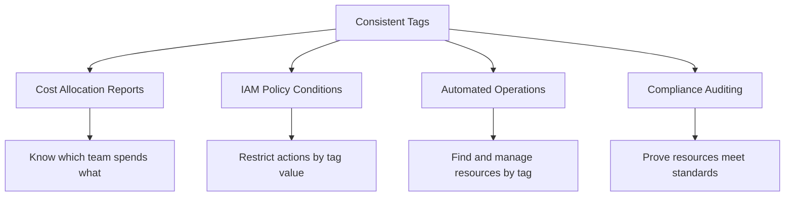

# How to Use Ansible to Tag AWS Resources

Author: [nawazdhandala](https://www.github.com/nawazdhandala)

Tags: Ansible, AWS, Tagging, Cost Management, Cloud Governance

Description: Automate AWS resource tagging at scale using Ansible to enforce governance policies, track costs, and maintain organized infrastructure.

---

Tagging is one of those things that everyone agrees is important but nobody wants to do manually. Tags drive cost allocation, access control, automation workflows, and compliance reporting in AWS. Without consistent tagging, your monthly bill is an opaque blob of charges, your security team cannot identify resource owners, and your automation scripts cannot find the resources they need to manage. Ansible provides several modules for applying and managing tags across different AWS resource types, making it possible to enforce your tagging strategy as code.

## Why Tagging Matters

Before jumping into playbooks, let's talk about what good tagging actually buys you:



AWS lets you use tags as conditions in IAM policies, which means you can say things like "developers can only stop instances tagged with Environment=dev." That is powerful, but only if the tags are actually there and correct.

## Prerequisites

- Ansible 2.9+ with the `amazon.aws` collection
- AWS credentials with tagging permissions for the resource types you want to tag
- Some existing AWS resources to practice on

```bash
# Install the AWS collection
ansible-galaxy collection install amazon.aws
```

## Defining a Tagging Standard

First, decide on your required tags. Here is a reasonable starting point that I have seen work well across several organizations:

```yaml
# vars/tagging-standard.yml - Define your organization's required tags
---
required_tags:
  - Name
  - Environment
  - Team
  - CostCenter
  - Application
  - ManagedBy

environment_values:
  - production
  - staging
  - development
  - sandbox

default_tags:
  ManagedBy: ansible
  Organization: mycompany
```

## Tagging EC2 Instances

The `amazon.aws.ec2_tag` module is the general-purpose tagging tool for EC2 resources:

```yaml
# tag-ec2-instances.yml - Apply tags to EC2 instances
---
- name: Tag EC2 Instances
  hosts: localhost
  connection: local
  gather_facts: false

  vars:
    aws_region: us-east-1

  tasks:
    - name: Find all instances missing the Team tag
      amazon.aws.ec2_instance_info:
        region: "{{ aws_region }}"
        filters:
          instance-state-name: running
      register: all_instances

    - name: Identify untagged instances
      ansible.builtin.set_fact:
        untagged_instances: "{{ all_instances.instances | selectattr('tags.Team', 'undefined') | map(attribute='instance_id') | list }}"

    - name: Report untagged instances
      ansible.builtin.debug:
        msg: "Found {{ untagged_instances | length }} instances without Team tag"

    - name: Apply default tags to untagged instances
      amazon.aws.ec2_tag:
        region: "{{ aws_region }}"
        resource: "{{ item }}"
        state: present
        tags:
          Team: unassigned
          ManagedBy: ansible
          TaggedOn: "{{ lookup('pipe', 'date +%Y-%m-%d') }}"
      loop: "{{ untagged_instances }}"
      when: untagged_instances | length > 0
```

This playbook finds running instances that are missing the `Team` tag and applies a default value. The `TaggedOn` date helps you track when the tag was applied, which is useful when following up with teams to assign proper ownership.

## Bulk Tagging by Instance ID

When you know exactly which instances need which tags:

```yaml
# bulk-tag-instances.yml - Apply specific tags to a list of instances
---
- name: Bulk Tag Instances
  hosts: localhost
  connection: local
  gather_facts: false

  vars:
    aws_region: us-east-1
    instance_tags:
      - id: "i-0abc123def456789"
        tags:
          Environment: production
          Team: platform
          Application: api-gateway
          CostCenter: CC-1234
      - id: "i-0def456abc789012"
        tags:
          Environment: staging
          Team: frontend
          Application: web-app
          CostCenter: CC-5678
      - id: "i-0ghi789def012345"
        tags:
          Environment: development
          Team: backend
          Application: worker-service
          CostCenter: CC-1234

  tasks:
    - name: Apply tags to each instance
      amazon.aws.ec2_tag:
        region: "{{ aws_region }}"
        resource: "{{ item.id }}"
        state: present
        tags: "{{ item.tags | combine({'ManagedBy': 'ansible'}) }}"
      loop: "{{ instance_tags }}"
```

The `combine` filter merges the instance-specific tags with the `ManagedBy` tag, so you do not have to repeat it in every entry.

## Tagging Multiple Resource Types

Tags are not just for instances. EBS volumes, security groups, VPCs, subnets, and many other resources support tags. The `ec2_tag` module works with any resource that has an AWS resource ID:

```yaml
# tag-multiple-resources.yml - Tag different resource types in one playbook
---
- name: Tag Multiple AWS Resource Types
  hosts: localhost
  connection: local
  gather_facts: false

  vars:
    aws_region: us-east-1
    common_tags:
      Environment: production
      Team: infrastructure
      ManagedBy: ansible

    resources_to_tag:
      # VPC
      - id: "vpc-0abc123def456789"
        extra_tags:
          Name: "production-vpc"
          NetworkTier: core
      # Subnet
      - id: "subnet-0def456abc789012"
        extra_tags:
          Name: "prod-private-subnet-1a"
          SubnetType: private
      # Security Group
      - id: "sg-0ghi789def012345"
        extra_tags:
          Name: "prod-web-sg"
          Purpose: web-traffic
      # EBS Volume
      - id: "vol-0jkl012ghi345678"
        extra_tags:
          Name: "prod-data-volume"
          Purpose: application-data

  tasks:
    - name: Apply common and resource-specific tags
      amazon.aws.ec2_tag:
        region: "{{ aws_region }}"
        resource: "{{ item.id }}"
        state: present
        tags: "{{ common_tags | combine(item.extra_tags) }}"
      loop: "{{ resources_to_tag }}"

    - name: Confirm tagging
      ansible.builtin.debug:
        msg: "Tagged {{ resources_to_tag | length }} resources with common + specific tags"
```

## Removing Specific Tags

Sometimes you need to remove tags, not just add them. Maybe a tag key was renamed or a value is no longer valid:

```yaml
# remove-tags.yml - Remove specific tags from resources
---
- name: Remove Tags
  hosts: localhost
  connection: local
  gather_facts: false

  vars:
    aws_region: us-east-1
    resource_id: "i-0abc123def456789"

  tasks:
    - name: Remove deprecated tags
      amazon.aws.ec2_tag:
        region: "{{ aws_region }}"
        resource: "{{ resource_id }}"
        state: absent
        tags:
          OldTagName: ""
          DeprecatedKey: ""

    - name: Purge all tags except specified ones
      amazon.aws.ec2_tag:
        region: "{{ aws_region }}"
        resource: "{{ resource_id }}"
        state: present
        purge_tags: true
        tags:
          Name: "web-server-01"
          Environment: production
          Team: platform
          ManagedBy: ansible
```

The `purge_tags: true` option is powerful and dangerous. It removes any tags on the resource that are not in your `tags` dictionary. Use it when you want to enforce an exact set of tags, but be careful in shared environments where other teams or tools might have added their own tags.

## Auditing Tag Compliance

Here is a playbook that checks whether resources comply with your tagging standard:

```yaml
# audit-tags.yml - Check tag compliance across EC2 instances
---
- name: Audit Tag Compliance
  hosts: localhost
  connection: local
  gather_facts: false

  vars:
    aws_region: us-east-1
    required_tags:
      - Name
      - Environment
      - Team
      - CostCenter

  tasks:
    - name: Get all running instances
      amazon.aws.ec2_instance_info:
        region: "{{ aws_region }}"
        filters:
          instance-state-name: running
      register: instances

    - name: Check each instance for required tags
      ansible.builtin.set_fact:
        compliance_report: >-
          {{
            compliance_report | default([]) + [{
              'instance_id': item.instance_id,
              'name': item.tags.Name | default('NO NAME'),
              'missing_tags': required_tags | difference(item.tags.keys() | list),
              'compliant': (required_tags | difference(item.tags.keys() | list)) | length == 0
            }]
          }}
      loop: "{{ instances.instances }}"

    - name: Show non-compliant instances
      ansible.builtin.debug:
        msg: "{{ item.instance_id }} ({{ item.name }}): Missing tags - {{ item.missing_tags | join(', ') }}"
      loop: "{{ compliance_report | default([]) }}"
      when: not item.compliant

    - name: Summary
      ansible.builtin.debug:
        msg: >
          Compliance: {{ (compliance_report | default([]) | selectattr('compliant') | list | length) }}
          / {{ compliance_report | default([]) | length }} instances are fully tagged
```

## Tagging Resources at Creation Time

The best approach to tagging is doing it at creation time rather than after the fact. Most AWS Ansible modules accept a `tags` parameter:

```yaml
# create-with-tags.yml - Create resources with tags from the start
---
- name: Create Tagged Resources
  hosts: localhost
  connection: local
  gather_facts: false

  vars:
    standard_tags:
      Environment: production
      Team: platform
      CostCenter: CC-1234
      ManagedBy: ansible

  tasks:
    - name: Create VPC with tags
      amazon.aws.ec2_vpc_net:
        region: us-east-1
        name: production-vpc
        cidr_block: 10.0.0.0/16
        tags: "{{ standard_tags | combine({'Name': 'production-vpc', 'Purpose': 'main-vpc'}) }}"
        state: present

    - name: Create security group with tags
      amazon.aws.ec2_security_group:
        region: us-east-1
        name: web-server-sg
        description: Security group for web servers
        vpc_id: vpc-0abc123def456789
        tags: "{{ standard_tags | combine({'Name': 'web-server-sg', 'Purpose': 'web-traffic'}) }}"
        state: present
```

By defining `standard_tags` as a variable and using `combine` to add resource-specific tags, you ensure every resource gets the full set without repeating yourself.

## Summary

Tagging is not glamorous work, but it is foundational to running AWS well. Ansible makes it possible to enforce tagging standards across your entire infrastructure, audit compliance, and fix gaps automatically. The key practices are: define your required tags in a shared variable file, apply them at resource creation time whenever possible, run regular compliance audits, and use `purge_tags` cautiously when you need to enforce an exact tag set. Once tagging is automated, cost allocation, access control, and operational tooling all become significantly easier.
