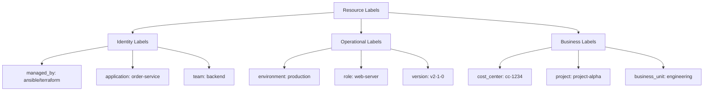

# How to Use Ansible to Tag GCP Resources with Labels

Author: [nawazdhandala](https://www.github.com/nawazdhandala)

Tags: Ansible, GCP, Labels, Resource Management, Cost Tracking

Description: Practical guide to applying and managing labels on GCP resources using Ansible for cost tracking, organization, and automated resource management.

---

Labels in GCP are key-value pairs that you attach to resources like VMs, disks, networks, and more. They are free to use and incredibly valuable for organizing resources, tracking costs, and automating operations. Despite this, labeling is often an afterthought. Teams create resources without labels, and months later nobody can figure out which team owns what or why a particular disk exists. Ansible can fix this by making labels a first-class part of your infrastructure definitions.

## Why Labels Matter

Labels serve several important purposes:

- **Cost allocation**: Break down your GCP bill by team, project, environment, or any other dimension.
- **Resource organization**: Find all resources belonging to a specific application or team.
- **Automation**: Use labels with dynamic inventory to target specific groups of resources.
- **Compliance**: Track which resources are managed by which tools.
- **Lifecycle management**: Identify resources that are candidates for cleanup.

## GCP Label Rules

Before we start writing playbooks, there are some rules to know:

- Keys and values must be lowercase
- Keys can be up to 63 characters
- Values can be up to 63 characters
- Keys must start with a letter
- Only letters, numbers, hyphens, and underscores are allowed
- Maximum of 64 labels per resource

## Labeling VMs at Creation

The best time to add labels is when you create the resource. Here is how to label VMs during creation.

```yaml
# create-labeled-vm.yml - Create a VM with comprehensive labels
---
- name: Create Labeled VM Instance
  hosts: localhost
  connection: local
  gather_facts: false

  vars:
    gcp_project: "my-project-id"
    gcp_auth_kind: "serviceaccount"
    gcp_service_account_file: "/path/to/service-account-key.json"
    zone: "us-central1-a"

    # Standard labels applied to all resources
    standard_labels:
      managed_by: "ansible"
      environment: "production"
      team: "platform"
      cost_center: "cc-1234"
      created_date: "2026-02-21"

  tasks:
    - name: Create VM with standard labels
      google.cloud.gcp_compute_instance:
        name: "web-server-01"
        zone: "{{ zone }}"
        machine_type: "e2-medium"
        disks:
          - auto_delete: true
            boot: true
            initialize_params:
              source_image: "projects/ubuntu-os-cloud/global/images/family/ubuntu-2204-lts"
              disk_size_gb: 20
        network_interfaces:
          - network:
              selfLink: "projects/{{ gcp_project }}/global/networks/default"
        # Apply comprehensive labels
        labels: "{{ standard_labels | combine({
          'role': 'web-server',
          'application': 'frontend',
          'version': 'v2-1-0'
        }) }}"
        project: "{{ gcp_project }}"
        auth_kind: "{{ gcp_auth_kind }}"
        service_account_file: "{{ gcp_service_account_file }}"
        state: present
      register: vm

    - name: Show VM labels
      ansible.builtin.debug:
        msg: "VM {{ vm.name }} created with labels: {{ vm.labels }}"
```

## Labeling Existing Resources

What about resources that already exist without labels? You can update them using the same Ansible modules. The key is to set the labels on the existing resource without changing other properties.

```yaml
# label-existing-resources.yml - Add labels to existing VMs and disks
---
- name: Label Existing GCP Resources
  hosts: localhost
  connection: local
  gather_facts: false

  vars:
    gcp_project: "my-project-id"
    gcp_auth_kind: "serviceaccount"
    gcp_service_account_file: "/path/to/service-account-key.json"
    zone: "us-central1-a"

    standard_labels:
      managed_by: "ansible"
      environment: "production"
      team: "backend"

  tasks:
    - name: Add labels to an existing VM
      google.cloud.gcp_compute_instance:
        name: "legacy-app-server"
        zone: "{{ zone }}"
        machine_type: "e2-medium"
        labels: "{{ standard_labels | combine({'role': 'app-server', 'application': 'legacy-app'}) }}"
        project: "{{ gcp_project }}"
        auth_kind: "{{ gcp_auth_kind }}"
        service_account_file: "{{ gcp_service_account_file }}"
        state: present

    - name: Add labels to an existing disk
      google.cloud.gcp_compute_disk:
        name: "legacy-data-disk"
        zone: "{{ zone }}"
        labels: "{{ standard_labels | combine({'purpose': 'data-storage', 'application': 'legacy-app'}) }}"
        project: "{{ gcp_project }}"
        auth_kind: "{{ gcp_auth_kind }}"
        service_account_file: "{{ gcp_service_account_file }}"
        state: present
```

## Bulk Labeling with a Loop

If you have many resources to label, loops keep the playbook concise.

```yaml
# bulk-label-vms.yml - Apply labels to multiple VMs
---
- name: Bulk Label VMs
  hosts: localhost
  connection: local
  gather_facts: false

  vars:
    gcp_project: "my-project-id"
    gcp_auth_kind: "serviceaccount"
    gcp_service_account_file: "/path/to/service-account-key.json"
    zone: "us-central1-a"

    # VMs to label with their specific labels
    vms_to_label:
      - name: "api-server-01"
        labels:
          role: "api-server"
          application: "order-service"
      - name: "api-server-02"
        labels:
          role: "api-server"
          application: "order-service"
      - name: "worker-01"
        labels:
          role: "worker"
          application: "batch-processor"
      - name: "cache-01"
        labels:
          role: "cache"
          application: "redis-cluster"

    # Labels applied to every resource
    base_labels:
      managed_by: "ansible"
      environment: "production"
      team: "backend"
      cost_center: "cc-5678"

  tasks:
    - name: Apply labels to all VMs
      google.cloud.gcp_compute_instance:
        name: "{{ item.name }}"
        zone: "{{ zone }}"
        labels: "{{ base_labels | combine(item.labels) }}"
        project: "{{ gcp_project }}"
        auth_kind: "{{ gcp_auth_kind }}"
        service_account_file: "{{ gcp_service_account_file }}"
        state: present
      loop: "{{ vms_to_label }}"

    - name: Report
      ansible.builtin.debug:
        msg: "Applied labels to {{ vms_to_label | length }} VMs"
```

## Labeling Strategy

Here is a labeling strategy that works well for most organizations:



## Labeling Multiple Resource Types

A complete labeling playbook should cover all your resource types, not just VMs.

```yaml
# comprehensive-labeling.yml - Label VMs, disks, networks, and more
---
- name: Comprehensive Resource Labeling
  hosts: localhost
  connection: local
  gather_facts: false

  vars:
    gcp_project: "my-project-id"
    gcp_auth_kind: "serviceaccount"
    gcp_service_account_file: "/path/to/service-account-key.json"
    zone: "us-central1-a"
    region: "us-central1"

    labels:
      managed_by: "ansible"
      environment: "production"
      team: "platform"

  tasks:
    - name: Label Compute Engine instances
      google.cloud.gcp_compute_instance:
        name: "{{ item }}"
        zone: "{{ zone }}"
        labels: "{{ labels | combine({'resource_type': 'compute'}) }}"
        project: "{{ gcp_project }}"
        auth_kind: "{{ gcp_auth_kind }}"
        service_account_file: "{{ gcp_service_account_file }}"
        state: present
      loop:
        - "web-server-01"
        - "web-server-02"
        - "api-server-01"

    - name: Label Persistent Disks
      google.cloud.gcp_compute_disk:
        name: "{{ item }}"
        zone: "{{ zone }}"
        labels: "{{ labels | combine({'resource_type': 'disk'}) }}"
        project: "{{ gcp_project }}"
        auth_kind: "{{ gcp_auth_kind }}"
        service_account_file: "{{ gcp_service_account_file }}"
        state: present
      loop:
        - "data-disk-01"
        - "log-disk-01"
        - "backup-disk-01"

    - name: Label Cloud SQL instances
      google.cloud.gcp_sql_instance:
        name: "main-database"
        settings:
          user_labels: "{{ labels | combine({'resource_type': 'cloudsql'}) }}"
        project: "{{ gcp_project }}"
        auth_kind: "{{ gcp_auth_kind }}"
        service_account_file: "{{ gcp_service_account_file }}"
        state: present

    - name: Label GCS buckets
      google.cloud.gcp_storage_bucket:
        name: "my-project-assets"
        labels: "{{ labels | combine({'resource_type': 'storage'}) }}"
        project: "{{ gcp_project }}"
        auth_kind: "{{ gcp_auth_kind }}"
        service_account_file: "{{ gcp_service_account_file }}"
        state: present
```

## Using Labels with Dynamic Inventory

Labels become even more powerful when combined with dynamic inventory. Your inventory groups are automatically created from labels.

```yaml
# inventory.gcp.yml - Group by labels for targeted operations
---
plugin: google.cloud.gcp_compute
auth_kind: serviceaccount
service_account_file: /path/to/service-account-key.json
projects:
  - my-project-id
filters:
  - status = RUNNING
keyed_groups:
  - key: labels.environment
    prefix: env
  - key: labels.role
    prefix: role
  - key: labels.team
    prefix: team
  - key: labels.application
    prefix: app
compose:
  ansible_host: networkInterfaces[0].networkIP
```

Then you can run playbooks against label-based groups:

```bash
# Deploy to all web servers in production
ansible-playbook -i inventory.gcp.yml deploy.yml --limit "env_production:&role_web-server"

# Patch all servers owned by the backend team
ansible-playbook -i inventory.gcp.yml patch.yml --limit "team_backend"

# Restart the order-service application
ansible-playbook -i inventory.gcp.yml restart.yml --limit "app_order-service"
```

## Enforcing Label Compliance

You can write a playbook that checks for unlabeled resources and reports them.

```yaml
# audit-labels.yml - Find resources missing required labels
---
- name: Audit Resource Labels
  hosts: localhost
  connection: local
  gather_facts: false

  vars:
    gcp_project: "my-project-id"
    gcp_auth_kind: "serviceaccount"
    gcp_service_account_file: "/path/to/service-account-key.json"
    required_labels:
      - "environment"
      - "team"
      - "managed_by"

  tasks:
    - name: Get all instances
      google.cloud.gcp_compute_instance_info:
        zone: "us-central1-a"
        project: "{{ gcp_project }}"
        auth_kind: "{{ gcp_auth_kind }}"
        service_account_file: "{{ gcp_service_account_file }}"
      register: all_instances

    - name: Check for missing labels
      ansible.builtin.debug:
        msg: >
          COMPLIANCE WARNING: Instance '{{ item.name }}'
          is missing labels: {{ required_labels | difference(item.labels | default({}) | list) }}
      loop: "{{ all_instances.resources }}"
      when: >
        (item.labels | default({})).keys() | list
        | intersect(required_labels)
        | length < required_labels | length
```

## Best Practices

1. **Define a labeling standard before you start.** Get all teams to agree on required labels and naming conventions.

2. **Use `base_labels` combined with resource-specific labels.** This pattern keeps your playbooks DRY while allowing per-resource customization.

3. **Remember labels are lowercase only.** Use hyphens or underscores instead of mixed case.

4. **Export labels to BigQuery for cost analysis.** GCP billing exports include labels, making it easy to build cost dashboards.

5. **Automate label compliance checks.** Run the audit playbook regularly and alert on non-compliant resources.

6. **Include a `managed_by` label.** This tells you (and everyone else) whether a resource was created by Ansible, Terraform, or manually.

## Conclusion

Labels are one of the simplest yet most impactful things you can do for your GCP infrastructure. They cost nothing, they make cost tracking possible, and they are the foundation of automated operations through dynamic inventory. By building labels into your Ansible playbooks from the start, you avoid the painful retroactive labeling exercise that every organization eventually faces. Start with a small set of required labels and expand from there as your needs grow.
