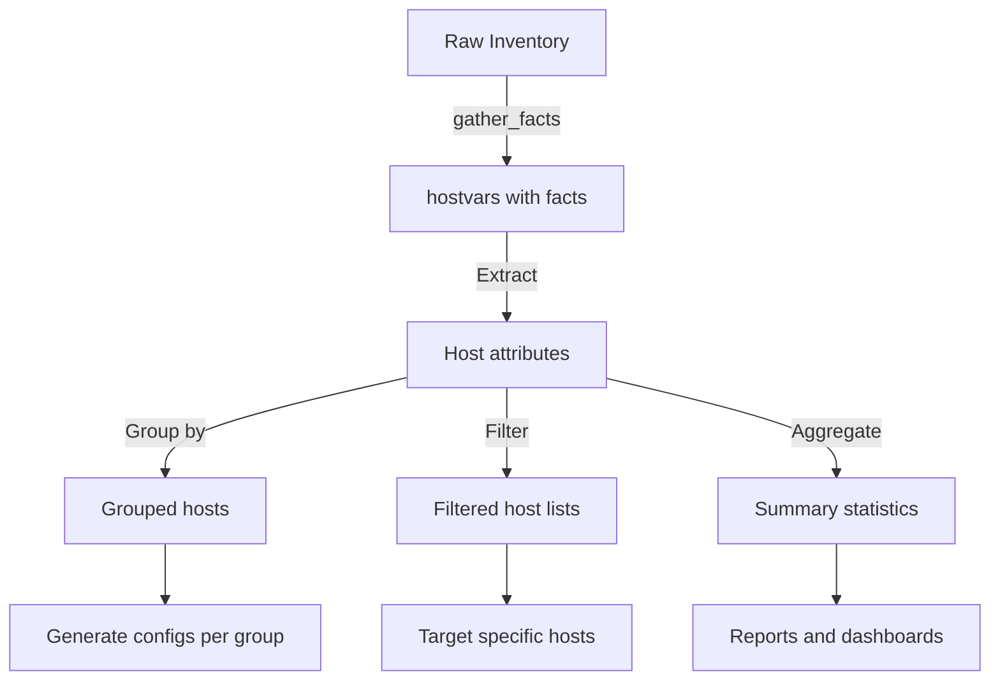

# How to Use Ansible to Transform Inventory Data

Author: [nawazdhandala](https://www.github.com/nawazdhandala)

Tags: Ansible, Inventory, Data Transformation, Automation

Description: Learn how to transform Ansible inventory data using hostvars, group_vars, and filters to reshape, aggregate, and enrich host information for playbooks.

---

Ansible inventory data is the foundation of every playbook. But raw inventory data often needs to be reshaped, filtered, aggregated, or enriched before it is useful for your automation tasks. This post covers practical patterns for transforming inventory data within your playbooks.

## Accessing Inventory Data

Ansible provides several built-in variables for working with inventory:

```yaml
# playbook-access-inventory.yml
# Shows how to access and display various inventory data structures
- name: Access inventory data
  hosts: all
  gather_facts: false

  tasks:
    - name: Show current host info
      ansible.builtin.debug:
        msg:
          hostname: "{{ inventory_hostname }}"
          short_name: "{{ inventory_hostname_short }}"
          groups: "{{ group_names }}"
      run_once: true

- name: Aggregate inventory from localhost
  hosts: localhost
  gather_facts: false

  tasks:
    - name: Show all groups
      ansible.builtin.debug:
        msg: "{{ groups.keys() | list }}"

    - name: Show hosts in webservers group
      ansible.builtin.debug:
        msg: "{{ groups['webservers'] | default([]) }}"

    - name: Show all hosts
      ansible.builtin.debug:
        msg: "{{ groups['all'] }}"
```

## Building a Host Summary from hostvars

The `hostvars` dictionary contains all variables for every host. You can use it to build cross-host data structures:

```yaml
# playbook-hostvars-transform.yml
# Builds a summary of all hosts from hostvars after gathering facts
- name: Gather facts first
  hosts: all
  gather_facts: true

- name: Transform inventory data
  hosts: localhost
  gather_facts: false

  tasks:
    - name: Build host summary from gathered facts
      ansible.builtin.set_fact:
        host_summary: >-
          
          
          
          
          
          
          
          {{ result }}

    - name: Display host summary
      ansible.builtin.debug:
        var: host_summary
```

## Grouping Hosts by Attributes

Transform flat inventory into grouped structures:

```yaml
# playbook-group-hosts.yml
# Groups hosts by OS family and by custom variables like environment
- name: Group hosts by attributes
  hosts: all
  gather_facts: true

- name: Process grouped data
  hosts: localhost
  gather_facts: false

  tasks:
    - name: Group hosts by OS family
      ansible.builtin.set_fact:
        by_os: >-
          
          
          
          
          
          
          
          
          {{ result }}

    - name: Show hosts grouped by OS
      ansible.builtin.debug:
        var: by_os

    - name: Group hosts by environment variable
      ansible.builtin.set_fact:
        by_environment: >-
          
          
          
          
          
          
          {{ result }}

    - name: Show hosts grouped by environment
      ansible.builtin.debug:
        var: by_environment
```

## Inventory Transformation Pipeline



## Filtering Inventory by Criteria

```yaml
# playbook-filter-inventory.yml
# Filters inventory hosts by various criteria like OS, memory, and group membership
- name: Filter inventory data
  hosts: all
  gather_facts: true

- name: Apply filters
  hosts: localhost
  gather_facts: false

  tasks:
    - name: Find hosts with less than 4GB RAM
      ansible.builtin.set_fact:
        low_memory_hosts: >-
          
          
          
          
          
          
          
          
          {{ result }}

    - name: Find Ubuntu hosts
      ansible.builtin.set_fact:
        ubuntu_hosts: >-
          
          
          
          
          
          
          
          
          {{ result }}

    - name: Show filtered results
      ansible.builtin.debug:
        msg:
          low_memory: "{{ low_memory_hosts }}"
          ubuntu: "{{ ubuntu_hosts }}"
```

## Enriching Inventory with External Data

Combine inventory data with external sources:

```yaml
# playbook-enrich-inventory.yml
# Enriches Ansible inventory with data from an external CMDB API
- name: Enrich inventory with CMDB data
  hosts: localhost
  gather_facts: false

  tasks:
    - name: Fetch CMDB data
      ansible.builtin.uri:
        url: "https://cmdb.internal/api/servers"
        headers:
          Authorization: "Bearer {{ lookup('env', 'CMDB_TOKEN') }}"
      register: cmdb_response

    - name: Build enriched inventory
      ansible.builtin.set_fact:
        enriched_inventory: >-
          
          
          
          
          
          
          
          
          
          {{ result }}

    - name: Show enriched inventory
      ansible.builtin.debug:
        var: enriched_inventory
```

## Generating Dynamic Group Lists

```yaml
# playbook-dynamic-groups.yml
# Creates dynamic groups based on host variables and gathered facts
- name: Create dynamic groups from inventory data
  hosts: all
  gather_facts: true

  tasks:
    - name: Group by disk space availability
      ansible.builtin.group_by:
        key: "disk_{{ 'low' if (ansible_facts.mounts | selectattr('mount', 'equalto', '/') | map(attribute='size_available') | first | default(0)) < 5368709120 else 'ok' }}"

    - name: Group by memory size
      ansible.builtin.group_by:
        key: "memory_{{ 'small' if ansible_facts.memtotal_mb < 4096 else 'medium' if ansible_facts.memtotal_mb < 16384 else 'large' }}"

- name: Use dynamic groups
  hosts: disk_low
  gather_facts: false

  tasks:
    - name: Alert on low disk space hosts
      ansible.builtin.debug:
        msg: "{{ inventory_hostname }} has low disk space"
```

## Cross-Host Data Collection

```yaml
# playbook-cross-host.yml
# Collects service information from all hosts and aggregates it
- name: Collect data from all hosts
  hosts: webservers
  gather_facts: false

  tasks:
    - name: Get running services
      ansible.builtin.shell: systemctl list-units --type=service --state=running --no-legend | awk '{print $1}'
      register: running_services
      changed_when: false

- name: Aggregate cross-host data
  hosts: localhost
  gather_facts: false

  tasks:
    - name: Build service matrix
      ansible.builtin.set_fact:
        service_matrix: >-
          
          
          
          
          
          
          {{ result }}

    - name: Find services common to all hosts
      ansible.builtin.set_fact:
        common_services: >-
          
          
          
          
          
          
          {{ result }}
          
          {{ [] }}
          

    - name: Show common services
      ansible.builtin.debug:
        var: common_services
```

## Practical Example: Generating Load Balancer Config

```yaml
# playbook-lb-config.yml
# Transforms inventory data into load balancer backend configuration
- name: Generate LB config from inventory
  hosts: localhost
  gather_facts: false

  tasks:
    - name: Build backend pool from webserver group
      ansible.builtin.set_fact:
        backends: >-
          
          
          
          
          {{ result }}

    - name: Generate HAProxy backend config
      ansible.builtin.copy:
        content: |
          backend webservers
              balance roundrobin
              option httpchk GET /health
          
              server {{ backend.name }} {{ backend.address }}:{{ backend.port }} weight {{ backend.weight }} check
          
        dest: /tmp/haproxy_backends.cfg
```

## Summary

Ansible inventory transformation is all about reshaping the data that Ansible already knows about your infrastructure. Use `hostvars` and `groups` to access inventory data, `ansible_facts` for gathered system information, and Jinja2 expressions to filter, group, and aggregate. Enrich inventory data by combining it with external sources via API calls. Use `group_by` to create dynamic groups based on runtime criteria. These patterns let you build configuration files, reports, and deployment plans that adapt automatically as your inventory changes.
