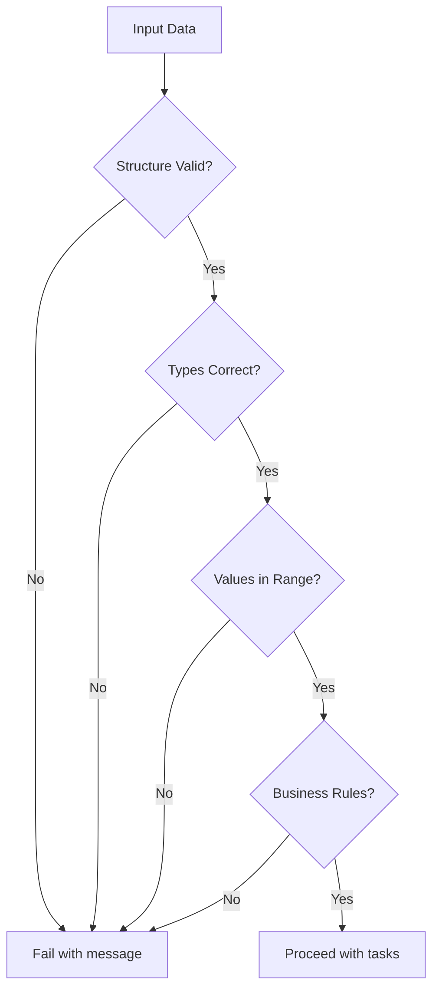

# How to Use Ansible to Validate Data Structures

Author: [nawazdhandala](https://www.github.com/nawazdhandala)

Tags: Ansible, Validation, Data Structures, Quality Assurance

Description: Learn how to validate data structures in Ansible using assert module, type checks, schema validation, and custom tests to ensure data integrity in playbooks.

---

Data validation is one of those things that saves you hours of debugging later. When your playbooks accept input from variable files, APIs, or user input, validating the data structure before using it prevents cryptic errors deep in your automation. Ansible provides several tools for validation, from simple assertions to full schema checking.

## Basic Assertions with assert

The `assert` module is the simplest validation tool. It checks conditions and fails with a message if they are not met:

```yaml
# playbook-basic-assert.yml
# Validates basic properties of input variables before proceeding
- name: Basic data validation
  hosts: localhost
  gather_facts: false
  vars:
    app_config:
      name: myapp
      port: 8080
      environment: production
      replicas: 3

  tasks:
    - name: Validate required fields exist
      ansible.builtin.assert:
        that:
          - app_config.name is defined
          - app_config.port is defined
          - app_config.environment is defined
          - app_config.replicas is defined
        fail_msg: "Missing required configuration fields"
        success_msg: "All required fields present"

    - name: Validate field types and values
      ansible.builtin.assert:
        that:
          - app_config.name is string
          - app_config.name | length > 0
          - app_config.port is number
          - app_config.port > 0
          - app_config.port < 65536
          - app_config.environment in ['development', 'staging', 'production']
          - app_config.replicas is number
          - app_config.replicas >= 1
          - app_config.replicas <= 100
        fail_msg: "Configuration validation failed"
        success_msg: "Configuration is valid"
```

## Validating Nested Structures

For nested data, validate at each level:

```yaml
# playbook-nested-validation.yml
# Validates a deeply nested configuration structure step by step
- name: Validate nested data
  hosts: localhost
  gather_facts: false
  vars:
    deployment:
      application:
        name: frontend
        version: "2.1.0"
      resources:
        cpu: "500m"
        memory: "512Mi"
      network:
        port: 8080
        protocol: tcp
        health_check:
          path: /health
          interval: 30

  tasks:
    - name: Validate top-level structure
      ansible.builtin.assert:
        that:
          - deployment.application is defined
          - deployment.application is mapping
          - deployment.resources is defined
          - deployment.resources is mapping
          - deployment.network is defined
          - deployment.network is mapping
        fail_msg: "Invalid top-level structure"

    - name: Validate application section
      ansible.builtin.assert:
        that:
          - deployment.application.name is string
          - deployment.application.name | length > 0
          - deployment.application.version is defined
          - deployment.application.version is match('^[0-9]+\.[0-9]+\.[0-9]+')
        fail_msg: "Invalid application section"

    - name: Validate network section
      ansible.builtin.assert:
        that:
          - deployment.network.port is number
          - deployment.network.port >= 1
          - deployment.network.port <= 65535
          - deployment.network.protocol in ['tcp', 'udp']
          - deployment.network.health_check is mapping
          - deployment.network.health_check.path is string
          - deployment.network.health_check.path is match('^/')
        fail_msg: "Invalid network section"
```

## Validating Lists

Check that lists have the right structure and contents:

```yaml
# playbook-list-validation.yml
# Validates a list of user definitions including each item's structure
- name: Validate list data
  hosts: localhost
  gather_facts: false
  vars:
    users:
      - username: alice
        role: admin
        email: alice@example.com
      - username: bob
        role: developer
        email: bob@example.com
      - username: carol
        role: viewer
        email: carol@example.com

  tasks:
    - name: Validate users list structure
      ansible.builtin.assert:
        that:
          - users is iterable
          - users | length > 0
          - users | length <= 1000
        fail_msg: "Users list is invalid or empty"

    - name: Validate each user entry
      ansible.builtin.assert:
        that:
          - item.username is defined
          - item.username is string
          - item.username | length >= 2
          - item.username | length <= 32
          - item.username is match('^[a-z][a-z0-9_]+$')
          - item.role is defined
          - item.role in ['admin', 'developer', 'viewer']
          - item.email is defined
          - item.email is match('.+@.+\..+')
        fail_msg: "Invalid user entry: {{ item }}"
      loop: "{{ users }}"
      loop_control:
        label: "{{ item.username }}"

    - name: Validate no duplicate usernames
      ansible.builtin.assert:
        that:
          - users | map(attribute='username') | list | unique | list | length == users | length
        fail_msg: "Duplicate usernames detected"
```

## Validation Flow



## Using the ansible.utils.validate Module

For JSON Schema validation, use the `ansible.utils.validate` module:

```yaml
# playbook-schema-validate.yml
# Validates data against a JSON Schema definition
- name: JSON Schema validation
  hosts: localhost
  gather_facts: false
  vars:
    server_config:
      hostname: web-01
      ip_address: 10.0.1.10
      port: 8080
      tags:
        - production
        - webserver

    config_schema:
      type: object
      required:
        - hostname
        - ip_address
        - port
      properties:
        hostname:
          type: string
          pattern: "^[a-z][a-z0-9-]+$"
        ip_address:
          type: string
          format: ipv4
        port:
          type: integer
          minimum: 1
          maximum: 65535
        tags:
          type: array
          items:
            type: string

  tasks:
    - name: Validate against JSON schema
      ansible.utils.validate:
        data: "{{ server_config }}"
        criteria:
          - "{{ config_schema }}"
        engine: ansible.utils.jsonschema
      register: validation_result
      ignore_errors: true

    - name: Report validation result
      ansible.builtin.debug:
        msg: "{{ 'Validation passed' if not validation_result.failed else 'Validation failed: ' ~ validation_result.msg }}"
```

## Custom Validation Role

Bundle your validations into a reusable role:

```yaml
# roles/validate_config/tasks/main.yml
# Reusable validation role that can be included in any playbook
- name: Validate config structure
  ansible.builtin.assert:
    that:
      - config is defined
      - config is mapping
    fail_msg: "config variable must be a dictionary"

- name: Validate required sections
  ansible.builtin.assert:
    that:
      - config[item] is defined
    fail_msg: "Missing required section: {{ item }}"
  loop: "{{ required_sections | default(['app', 'database']) }}"

- name: Validate port numbers
  ansible.builtin.assert:
    that:
      - item.value is number
      - item.value >= 1
      - item.value <= 65535
    fail_msg: "Invalid port {{ item.key }}: {{ item.value }}"
  loop: "{{ config | dict2items | selectattr('value', 'number') | list }}"
  when: item.key is match('.*port.*')
```

## Validating Inventory Variables

```yaml
# playbook-validate-inventory.yml
# Validates that all hosts have required inventory variables defined
- name: Validate inventory variables
  hosts: all
  gather_facts: false

  tasks:
    - name: Ensure required host vars are set
      ansible.builtin.assert:
        that:
          - ansible_host is defined
          - app_port is defined
          - app_port | int > 0
          - environment is defined
          - environment in ['dev', 'staging', 'prod']
        fail_msg: "Host {{ inventory_hostname }} is missing required variables"
        quiet: true

    - name: Validate SSH connectivity settings
      ansible.builtin.assert:
        that:
          - ansible_user is defined
          - ansible_ssh_private_key_file is defined or ansible_password is defined
        fail_msg: "Host {{ inventory_hostname }} has incomplete SSH configuration"
        quiet: true
```

## Practical Example: Deployment Pre-flight Check

```yaml
# playbook-preflight.yml
# Runs comprehensive validation before starting a deployment
- name: Pre-deployment validation
  hosts: localhost
  gather_facts: false
  vars:
    deploy_config:
      app_name: myapp
      version: "2.1.0"
      target_env: production
      rollback_enabled: true
      max_unavailable: 1
      health_check_url: "http://localhost:8080/health"
      notify:
        - slack
        - email

  tasks:
    - name: Validate deployment configuration
      block:
        - name: Check required fields
          ansible.builtin.assert:
            that:
              - deploy_config.app_name is string
              - deploy_config.version is match('^[0-9]+\.[0-9]+\.[0-9]+')
              - deploy_config.target_env in ['development', 'staging', 'production']
            fail_msg: "Invalid deployment configuration"

        - name: Extra checks for production
          ansible.builtin.assert:
            that:
              - deploy_config.rollback_enabled | bool == true
              - deploy_config.health_check_url is defined
              - deploy_config.health_check_url is match('^https?://')
            fail_msg: "Production deployments require rollback and health checks"
          when: deploy_config.target_env == 'production'

        - name: All validations passed
          ansible.builtin.debug:
            msg: "Pre-flight checks passed. Ready to deploy {{ deploy_config.app_name }} {{ deploy_config.version }} to {{ deploy_config.target_env }}"

      rescue:
        - name: Validation failed
          ansible.builtin.fail:
            msg: "Deployment blocked due to validation failures. Fix the configuration and try again."
```

## Summary

Data validation in Ansible prevents runtime errors and enforces consistency. The `assert` module handles most validation needs with its flexible `that` condition list. For each assertion, provide a clear `fail_msg` so operators know exactly what went wrong. Use `is defined`, `is string`, `is number`, `is mapping`, `is iterable`, and `is match()` for type checking. Use `in` for enumeration validation and comparison operators for range checks. For complex schemas, the `ansible.utils.validate` module with JSON Schema provides a formal validation framework. Bundle validations into roles for reuse, and always validate inputs at the start of your playbooks before making any changes.
