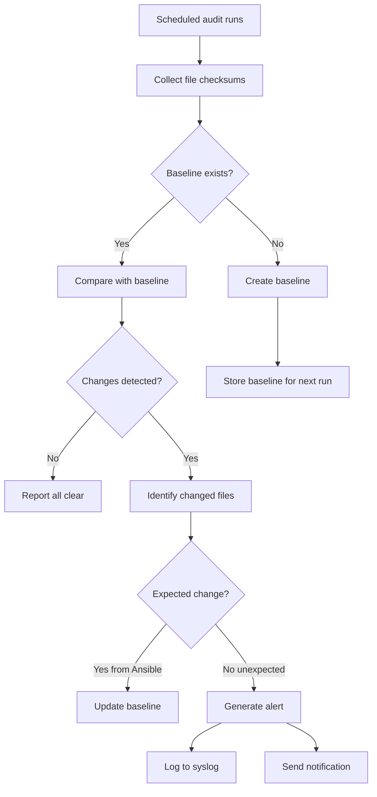

# How to Use Ansible to Watch for File Changes

Author: [nawazdhandala](https://www.github.com/nawazdhandala)

Tags: Ansible, Monitoring, DevOps, Linux

Description: Learn how to use Ansible to detect file changes on remote hosts, monitor configuration drift, and trigger actions when files are modified unexpectedly.

---

Knowing when files change on your servers is critical for security, compliance, and operational awareness. Configuration files should only change through your automation pipeline, and unexpected modifications could indicate a security breach, manual intervention, or a misbehaving process. While Ansible is not a real-time file monitoring tool like inotifywait or AIDE, it provides several powerful techniques for detecting file changes during playbook runs and for building scheduled change detection workflows.

## Detecting Changes with the stat Module

The `stat` module captures file metadata including checksums, modification times, and sizes. By storing and comparing these values between runs, you can detect changes.

```yaml
# Check if a critical file has changed since last audit
- name: Get current file metadata
  ansible.builtin.stat:
    path: /etc/ssh/sshd_config
    checksum_algorithm: sha256
  register: current_state

- name: Show file details
  ansible.builtin.debug:
    msg: >
      File: /etc/ssh/sshd_config
      Checksum: {{ current_state.stat.checksum }}
      Modified: {{ current_state.stat.mtime }}
      Size: {{ current_state.stat.size }} bytes
      Owner: {{ current_state.stat.pw_name }}
```

## Building a File Integrity Baseline

Create a baseline of file checksums and compare against it on subsequent runs.

```yaml
# Generate a baseline of file checksums and save to the controller
- name: Collect checksums of critical files
  ansible.builtin.stat:
    path: "{{ item }}"
    checksum_algorithm: sha256
  register: file_checksums
  loop:
    - /etc/ssh/sshd_config
    - /etc/passwd
    - /etc/shadow
    - /etc/sudoers
    - /etc/hosts
    - /etc/resolv.conf
    - /etc/fstab

- name: Build baseline dictionary
  ansible.builtin.set_fact:
    baseline: "{{ baseline | default({}) | combine({item.item: item.stat.checksum}) }}"
  loop: "{{ file_checksums.results }}"
  when: item.stat.exists

- name: Save baseline to controller
  ansible.builtin.copy:
    content: "{{ baseline | to_nice_json }}"
    dest: "{{ playbook_dir }}/baselines/{{ inventory_hostname }}.json"
  delegate_to: localhost
```

Then on subsequent runs, compare against the baseline.

```yaml
# Load and compare against the saved baseline
- name: Load saved baseline
  ansible.builtin.set_fact:
    saved_baseline: "{{ lookup('file', playbook_dir + '/baselines/' + inventory_hostname + '.json') | from_json }}"
  ignore_errors: yes

- name: Collect current checksums
  ansible.builtin.stat:
    path: "{{ item }}"
    checksum_algorithm: sha256
  register: current_checksums
  loop: "{{ saved_baseline.keys() | list }}"
  when: saved_baseline is defined

- name: Detect changed files
  ansible.builtin.debug:
    msg: "CHANGE DETECTED: {{ item.item }} has been modified!"
  loop: "{{ current_checksums.results }}"
  when:
    - saved_baseline is defined
    - item.stat.exists
    - item.stat.checksum != saved_baseline[item.item]
```

## Using find to Detect Recently Modified Files

The `find` module can locate files modified within a time window, which is useful for spotting unexpected changes.

```yaml
# Find files modified in the last 24 hours in critical directories
- name: Find recently modified files in /etc
  ansible.builtin.find:
    paths: /etc
    recurse: yes
    age: -1d
    file_type: file
  register: recently_modified

- name: Report recently modified system files
  ansible.builtin.debug:
    msg: "Modified in last 24h: {{ item.path }} ({{ item.mtime | int | strftime('%Y-%m-%d %H:%M:%S') }})"
  loop: "{{ recently_modified.files }}"
  when: recently_modified.matched > 0
```

```yaml
# Find config files modified outside of Ansible
# This looks for files NOT modified by our automation
- name: Find files modified in the last hour in application config
  ansible.builtin.find:
    paths: /etc/myapp
    recurse: yes
    age: -1h
    file_type: file
  register: recent_changes

- name: Alert on unexpected config changes
  ansible.builtin.debug:
    msg: >
      ALERT: {{ recent_changes.matched }} files were modified in /etc/myapp
      in the last hour. This may indicate unauthorized changes.
  when: recent_changes.matched > 0
```

## Monitoring Specific File Properties

Track more than just content changes. File permissions, ownership, and attributes can also be modified.

```yaml
# Monitor file properties for security-critical files
- name: Check critical file properties
  ansible.builtin.stat:
    path: "{{ item.path }}"
  register: file_properties
  loop:
    - { path: '/etc/passwd', expected_mode: '0644', expected_owner: 'root' }
    - { path: '/etc/shadow', expected_mode: '0640', expected_owner: 'root' }
    - { path: '/etc/sudoers', expected_mode: '0440', expected_owner: 'root' }
    - { path: '/etc/ssh/sshd_config', expected_mode: '0600', expected_owner: 'root' }

- name: Alert on permission changes
  ansible.builtin.debug:
    msg: >
      SECURITY ALERT: {{ item.0.path }} has mode {{ item.1.stat.mode }}
      (expected {{ item.0.expected_mode }})
  loop: "{{ file_properties.results | zip(file_properties.results) | list }}"
  # Simplified - in practice compare item.0 expected vs item.1 actual
  when: item.1.stat.mode != item.0.item.expected_mode
```

## Using check_mode for Drift Detection

Run your entire configuration playbook in check mode to detect drift across all managed files.

```yaml
# Drift detection playbook - run with --check
---
- name: Configuration Drift Detection
  hosts: all
  become: yes
  vars:
    drift_detected: false

  tasks:
    - name: Check sshd_config
      ansible.builtin.template:
        src: templates/sshd_config.j2
        dest: /etc/ssh/sshd_config
      check_mode: yes
      register: sshd_check

    - name: Check nginx config
      ansible.builtin.template:
        src: templates/nginx.conf.j2
        dest: /etc/nginx/nginx.conf
      check_mode: yes
      register: nginx_check

    - name: Check sysctl config
      ansible.builtin.template:
        src: templates/sysctl.conf.j2
        dest: /etc/sysctl.d/90-custom.conf
      check_mode: yes
      register: sysctl_check

    - name: Report drift
      ansible.builtin.debug:
        msg: "DRIFT: {{ item.name }} has been modified on {{ inventory_hostname }}"
      when: item.result.changed
      loop:
        - { name: "sshd_config", result: "{{ sshd_check }}" }
        - { name: "nginx.conf", result: "{{ nginx_check }}" }
        - { name: "sysctl.conf", result: "{{ sysctl_check }}" }
```

## Scheduled File Monitoring with Cron

Set up a scheduled Ansible run that checks for file changes and sends notifications.

```yaml
# Deploy a monitoring script that runs as a cron job
- name: Deploy file change monitoring script
  ansible.builtin.copy:
    content: |
      #!/bin/bash
      # File change monitoring script - deployed by Ansible
      BASELINE_DIR="/var/lib/file-monitor"
      ALERT_LOG="/var/log/file-changes.log"

      FILES_TO_MONITOR=(
        /etc/ssh/sshd_config
        /etc/passwd
        /etc/shadow
        /etc/sudoers
        /etc/hosts
        /etc/resolv.conf
      )

      mkdir -p "$BASELINE_DIR"

      for file in "${FILES_TO_MONITOR[@]}"; do
        if [ ! -f "$file" ]; then
          continue
        fi

        hash_file="$BASELINE_DIR/$(echo "$file" | tr '/' '_').sha256"
        current_hash=$(sha256sum "$file" | awk '{print $1}')

        if [ -f "$hash_file" ]; then
          saved_hash=$(cat "$hash_file")
          if [ "$current_hash" != "$saved_hash" ]; then
            echo "$(date -Iseconds) CHANGE: $file hash changed from $saved_hash to $current_hash" >> "$ALERT_LOG"
            logger -t file-monitor "ALERT: $file has been modified"
          fi
        fi

        echo "$current_hash" > "$hash_file"
      done
    dest: /usr/local/bin/file-monitor.sh
    mode: '0755'
    owner: root
    group: root

- name: Schedule file monitoring every 15 minutes
  ansible.builtin.cron:
    name: "File change monitoring"
    minute: "*/15"
    job: "/usr/local/bin/file-monitor.sh"
    user: root
```

## Watching for Changes in a Directory Tree

Monitor an entire directory tree for modifications.

```yaml
# Create a comprehensive directory snapshot
- name: Create directory snapshot for comparison
  ansible.builtin.command:
    cmd: "find /etc/myapp -type f -exec sha256sum {} +"
  register: directory_snapshot
  changed_when: false

- name: Save snapshot to file
  ansible.builtin.copy:
    content: "{{ directory_snapshot.stdout }}"
    dest: /var/lib/snapshots/myapp-config-snapshot.txt
    mode: '0600'
  register: snapshot_save

# On subsequent runs, compare
- name: Load previous snapshot
  ansible.builtin.slurp:
    src: /var/lib/snapshots/myapp-config-snapshot.txt
  register: previous_snapshot
  ignore_errors: yes

- name: Take current snapshot
  ansible.builtin.command:
    cmd: "find /etc/myapp -type f -exec sha256sum {} +"
  register: current_snapshot
  changed_when: false

- name: Compare snapshots
  ansible.builtin.debug:
    msg: "Configuration directory has changed since last snapshot!"
  when:
    - previous_snapshot is success
    - (previous_snapshot.content | b64decode) != current_snapshot.stdout
```

## Change Detection Workflow



## Integrating with AIDE

For production-grade file integrity monitoring, deploy AIDE (Advanced Intrusion Detection Environment) with Ansible.

```yaml
# Install and configure AIDE for file integrity monitoring
- name: Install AIDE
  ansible.builtin.package:
    name: aide
    state: present

- name: Deploy AIDE configuration
  ansible.builtin.template:
    src: templates/aide.conf.j2
    dest: /etc/aide/aide.conf
    owner: root
    group: root
    mode: '0600'

- name: Initialize AIDE database
  ansible.builtin.command:
    cmd: aide --init
    creates: /var/lib/aide/aide.db.new

- name: Move new database to active
  ansible.builtin.command:
    cmd: mv /var/lib/aide/aide.db.new /var/lib/aide/aide.db
    creates: /var/lib/aide/aide.db

- name: Schedule daily AIDE check
  ansible.builtin.cron:
    name: "AIDE file integrity check"
    special_time: daily
    job: "/usr/bin/aide --check >> /var/log/aide/aide-check.log 2>&1"
```

## Summary

While Ansible is not a real-time file watcher, it provides robust tools for periodic file change detection. Use `stat` checksums for individual file monitoring, `find` for detecting recently modified files, and `check_mode` for drift detection against your desired state. For production environments, combine Ansible-deployed baseline snapshots with scheduled cron-based monitoring scripts, or deploy a dedicated tool like AIDE for continuous file integrity monitoring. The key insight is that Ansible is best suited for periodic auditing and enforcement rather than real-time monitoring, so pair it with appropriate alerting when changes are detected outside your automation pipeline.
