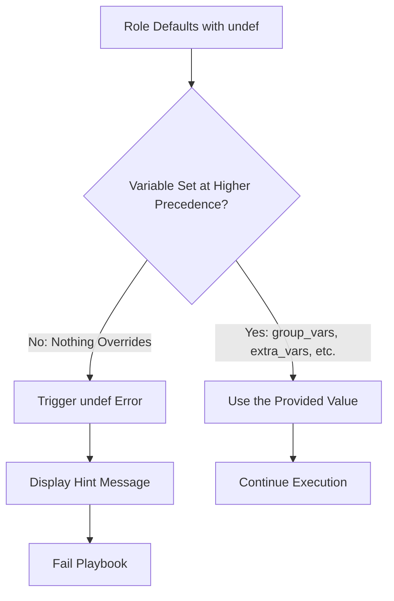

# How to Use Ansible undef Function to Mark Required Variables

Author: [nawazdhandala](https://www.github.com/nawazdhandala)

Tags: Ansible, Variables, undef, Required Variables, Best Practices

Description: Learn how to use the Ansible undef function to explicitly mark variables as required in defaults and catch missing values early.

---

When writing Ansible roles, you sometimes have variables that must be provided by the user and have no sensible default value. Before Ansible 2.12, the common workaround was to either leave them undefined (and hope for a cryptic error later) or use `assert` tasks at the beginning of the role. The `undef` function, introduced in Ansible 2.12, gives you a cleaner way to declare that a variable is required and must be set before the role runs.

## The Problem undef Solves

Consider a database role. The database password has no safe default. If you leave it out of `defaults/main.yml`, the variable is simply undefined, and the error shows up deep in the role execution with a generic "undefined variable" message. If you set it to an empty string or a placeholder, someone might accidentally deploy with that value.

```yaml
# roles/database/defaults/main.yml - The old way (problematic)

# Option 1: Leave it out entirely
# db_password is not defined here at all
# Error shows up as: "db_password is undefined" somewhere in the middle of execution

# Option 2: Empty placeholder
db_password: ""  # Dangerous: could deploy with empty password

# Option 3: Obvious placeholder
db_password: "CHANGE_ME"  # Still could slip through to production
```

## Using undef() for Required Variables

The `undef` function marks a variable as explicitly undefined with a helpful error message. If anyone tries to use the variable without setting it, Ansible fails immediately with your custom message.

```yaml
# roles/database/defaults/main.yml - The undef way
---
# Required variables (must be provided by the user)
db_password: "{{ undef(hint='You must set db_password for the database role') }}"
db_admin_user: "{{ undef(hint='Specify the database admin username') }}"

# Optional variables with sensible defaults
db_port: 5432
db_host: localhost
db_name: myapp
db_max_connections: 100
```

Now when someone uses this role without setting `db_password`:

```bash
TASK [database : Configure database] ****
fatal: [db-server]: FAILED! =>
  msg: "You must set db_password for the database role"
```

The error is clear, actionable, and points directly at the problem.

## Syntax Variations

The `undef` function accepts an optional `hint` parameter:

```yaml
# Different ways to use undef
---

# With a hint message (recommended)
api_key: "{{ undef(hint='Provide the API key for the monitoring service') }}"

# Without a hint (less helpful error message)
secret_token: "{{ undef() }}"
```

Always include a hint. The whole point of `undef` is to provide a better error message than the generic "variable is undefined" error.

## Practical Example: Application Deployment Role

Here is a complete role that uses `undef` for required variables alongside regular defaults for optional ones:

```yaml
# roles/app_deploy/defaults/main.yml
---
# ---- Required Variables (no sensible default) ----
app_deploy_version: "{{ undef(hint='Set app_deploy_version to the release tag (e.g., v2.1.0)') }}"
app_deploy_artifact_url: "{{ undef(hint='Set app_deploy_artifact_url to the download URL for the release') }}"
app_deploy_db_password: "{{ undef(hint='Set app_deploy_db_password for database connectivity') }}"

# ---- Optional Variables (sensible defaults provided) ----
app_deploy_user: app
app_deploy_group: app
app_deploy_dir: /opt/app
app_deploy_port: 8080
app_deploy_log_level: info
app_deploy_health_check_path: /health
app_deploy_health_check_timeout: 60
```

```yaml
# roles/app_deploy/tasks/main.yml
---
- name: Create application user
  ansible.builtin.user:
    name: "{{ app_deploy_user }}"
    group: "{{ app_deploy_group }}"
    system: true
    shell: /bin/false
  become: true

- name: Create deployment directory
  ansible.builtin.file:
    path: "{{ app_deploy_dir }}"
    state: directory
    owner: "{{ app_deploy_user }}"
    group: "{{ app_deploy_group }}"
    mode: '0755'
  become: true

- name: Download release artifact
  ansible.builtin.get_url:
    url: "{{ app_deploy_artifact_url }}"
    dest: "{{ app_deploy_dir }}/app-{{ app_deploy_version }}.tar.gz"
    owner: "{{ app_deploy_user }}"
    group: "{{ app_deploy_group }}"
    mode: '0644'
  become: true

- name: Deploy database configuration
  ansible.builtin.template:
    src: database.yml.j2
    dest: "{{ app_deploy_dir }}/config/database.yml"
    owner: "{{ app_deploy_user }}"
    group: "{{ app_deploy_group }}"
    mode: '0600'
  become: true
  no_log: true
```

Using the role correctly:

```yaml
# deploy.yml - Providing all required variables
---
- name: Deploy application
  hosts: app_servers
  roles:
    - role: app_deploy
      app_deploy_version: "v2.1.0"
      app_deploy_artifact_url: "https://releases.example.com/app/v2.1.0.tar.gz"
      app_deploy_db_password: "{{ vault_app_db_password }}"
```

## undef with Different Variable Sources

The `undef` function works regardless of where the variable gets set. It triggers only if no higher-precedence variable source provides a value.

```yaml
# group_vars/production.yml - Override the undef defaults
app_deploy_version: "v2.1.0"
app_deploy_artifact_url: "https://releases.example.com/app/v2.1.0.tar.gz"
app_deploy_db_password: "{{ vault_app_db_password }}"
```

The variable precedence chain still applies normally. If `app_deploy_version` is set in group_vars, host_vars, extra_vars, or directly in the play, the `undef` function in defaults never fires.



## Combining undef with Conditional Logic

You can use `undef` inside conditional expressions for variables that are only required under certain conditions:

```yaml
# roles/webserver/defaults/main.yml
---
webserver_ssl_enabled: false

# SSL cert is required only when SSL is enabled
webserver_ssl_cert: >-
  {{ undef(hint='Set webserver_ssl_cert when webserver_ssl_enabled is true')
     if webserver_ssl_enabled | bool
     else '' }}

webserver_ssl_key: >-
  {{ undef(hint='Set webserver_ssl_key when webserver_ssl_enabled is true')
     if webserver_ssl_enabled | bool
     else '' }}
```

When `webserver_ssl_enabled` is `false`, the variables default to empty strings. When it is `true`, they become required.

## Migration from assert to undef

If you have been using `assert` tasks to validate required variables, migrating to `undef` is straightforward:

```yaml
# Before: assert in tasks/main.yml
---
- name: Validate required variables
  ansible.builtin.assert:
    that:
      - db_password is defined
      - db_password | length > 0
    fail_msg: "db_password must be defined and non-empty"

- name: Validate API key
  ansible.builtin.assert:
    that:
      - api_key is defined
    fail_msg: "api_key must be set for this role"
```

```yaml
# After: undef in defaults/main.yml
---
db_password: "{{ undef(hint='db_password must be defined and non-empty') }}"
api_key: "{{ undef(hint='api_key must be set for this role') }}"
```

The `undef` approach is better because the error surfaces immediately when the variable is accessed, and it documents the requirement right in the defaults file where people look first. However, `assert` is still useful for validating value constraints (like minimum length or valid ranges) that go beyond simple existence checks.

## Things to Keep in Mind

The `undef` function requires Ansible 2.12 or later. If you need to support older versions, stick with `assert` tasks.

The hint message should be specific and actionable. Tell the user exactly what to set and why. Vague messages like "variable required" are not much better than the default undefined variable error.

The `undef` function only checks whether the variable is set. It does not validate the type or value. For that, use `argument_specs` or `assert` tasks in addition to `undef`.

One important note: `undef` in defaults works because defaults have the lowest variable precedence. If you put `undef` in a `vars/main.yml` file inside a role, it would have higher precedence than group_vars and host_vars, making it nearly impossible to override. Always put `undef` declarations in `defaults/main.yml`.

## Best Practices

Use `undef` for variables that have no safe default and must be consciously set by the consumer. Always include a descriptive `hint` parameter. Keep `undef` declarations in `defaults/main.yml` where they have the lowest precedence. Combine `undef` for existence requirements with `argument_specs` for type and value validation. Document which variables are required in your role's README by pointing to the defaults file.

The `undef` function is a small but significant improvement in how Ansible roles communicate their requirements. It turns "this variable is undefined" errors from debugging puzzles into clear instructions.
