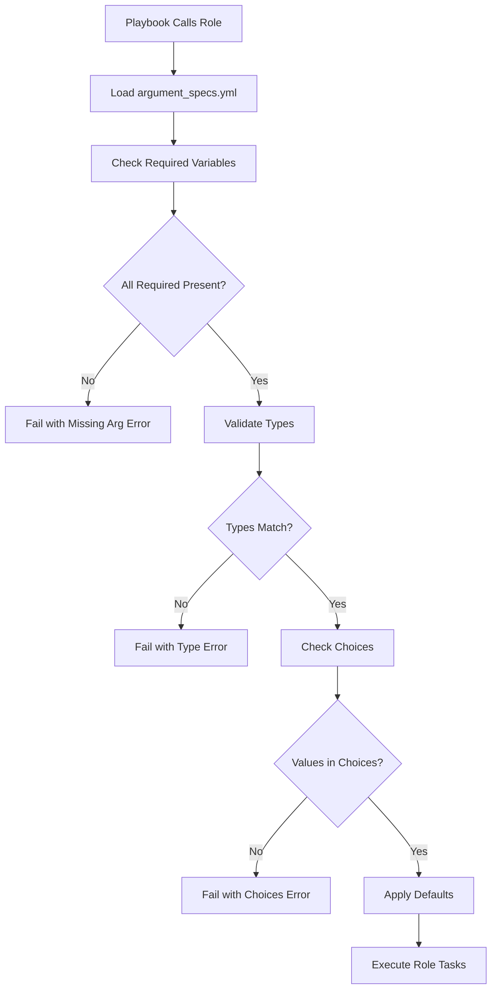

# How to Use Ansible validate_argument_spec for Role Variables

Author: [nawazdhandala](https://www.github.com/nawazdhandala)

Tags: Ansible, Roles, validate_argument_spec, Variable Validation

Description: Learn how to use Ansible validate_argument_spec to enforce variable types and constraints on role inputs for better reliability.

---

Before Ansible 2.11, validating role input variables meant writing a bunch of `assert` tasks at the top of your role. It worked, but it was tedious and inconsistent across roles. The `argument_spec` feature changed this by giving roles a declarative way to define what variables they expect, their types, default values, and constraints. Ansible validates these specs automatically before the role executes, producing clear error messages when something is wrong.

## Defining an Argument Spec

The argument spec lives in a file called `meta/argument_specs.yml` inside your role directory. Here is a basic example:

```yaml
# roles/webserver/meta/argument_specs.yml
---
argument_specs:
  main:
    short_description: Configure a web server
    description:
      - Installs and configures nginx with virtual hosts
      - Handles SSL certificate deployment
    options:
      webserver_port:
        description: The port nginx will listen on
        type: int
        default: 80
        required: false

      webserver_server_name:
        description: The server name for the default vhost
        type: str
        required: true

      webserver_document_root:
        description: Document root directory
        type: path
        default: /var/www/html

      webserver_ssl_enabled:
        description: Whether to enable SSL
        type: bool
        default: false

      webserver_ssl_cert_path:
        description: Path to the SSL certificate file
        type: path
        required: false

      webserver_worker_processes:
        description: Number of nginx worker processes
        type: int
        default: auto
        choices:
          - 1
          - 2
          - 4
          - 8
          - auto
```

## How Validation Works

When you call the role in a playbook, Ansible automatically validates the provided variables against the spec before executing any task in the role.

```yaml
# deploy.yml - Using a role with argument spec validation
---
- name: Configure web servers
  hosts: webservers
  become: true
  roles:
    - role: webserver
      webserver_server_name: "app.example.com"
      webserver_port: 443
      webserver_ssl_enabled: true
      webserver_ssl_cert_path: /etc/ssl/certs/app.pem
```

If you forget a required variable or provide the wrong type, Ansible stops before running the role:

```bash
# This would fail validation because webserver_server_name is required
ansible-playbook deploy.yml
# ERROR: missing required arguments: webserver_server_name
```

## Supported Type Options

The argument spec supports several data types that map to Python types:

```yaml
# roles/example/meta/argument_specs.yml - All supported types
---
argument_specs:
  main:
    options:
      # Basic types
      string_var:
        type: str
        description: A string value

      integer_var:
        type: int
        description: An integer value

      float_var:
        type: float
        description: A floating point number

      bool_var:
        type: bool
        description: A boolean value

      # Complex types
      list_var:
        type: list
        description: A list of items
        elements: str  # Type of list elements

      dict_var:
        type: dict
        description: A dictionary
        options:   # Define nested structure
          key1:
            type: str
            required: true
          key2:
            type: int
            default: 0

      # Path type (validates it looks like a file path)
      path_var:
        type: path
        description: A filesystem path

      # Raw type (no type checking)
      raw_var:
        type: raw
        description: Any type is accepted
```

## Nested Dictionary Validation

For complex configuration structures, you can define nested specs:

```yaml
# roles/database/meta/argument_specs.yml
---
argument_specs:
  main:
    short_description: Configure PostgreSQL database
    options:
      db_config:
        description: Database configuration
        type: dict
        required: true
        options:
          host:
            type: str
            required: true
          port:
            type: int
            default: 5432
          name:
            type: str
            required: true
          credentials:
            type: dict
            required: true
            options:
              username:
                type: str
                required: true
              password:
                type: str
                required: true
                no_log: true

      db_pools:
        description: Connection pool settings
        type: list
        elements: dict
        options:
          name:
            type: str
            required: true
          size:
            type: int
            default: 10
          timeout:
            type: int
            default: 30
```

Using this role:

```yaml
# playbook.yml
---
- name: Setup database
  hosts: db_servers
  roles:
    - role: database
      db_config:
        host: db.internal
        port: 5432
        name: myapp
        credentials:
          username: app_user
          password: "{{ vault_db_password }}"
      db_pools:
        - name: read_pool
          size: 20
          timeout: 15
        - name: write_pool
          size: 5
          timeout: 30
```

## Using choices for Enumerated Values

The `choices` parameter restricts a variable to a specific set of allowed values:

```yaml
# roles/monitoring/meta/argument_specs.yml
---
argument_specs:
  main:
    options:
      monitoring_log_level:
        description: Log verbosity level
        type: str
        default: info
        choices:
          - debug
          - info
          - warn
          - error
          - fatal

      monitoring_protocol:
        description: Protocol for metric collection
        type: str
        default: https
        choices:
          - http
          - https

      monitoring_retention_days:
        description: How many days to retain metrics
        type: int
        default: 30
        choices:
          - 7
          - 14
          - 30
          - 60
          - 90
```

## Multiple Entry Points

A role can have multiple entry points (task files), each with its own argument spec. This is useful for roles that support different operations.

```yaml
# roles/app/meta/argument_specs.yml
---
argument_specs:
  main:
    short_description: Full application deployment
    options:
      app_version:
        type: str
        required: true
      app_env:
        type: str
        required: true
        choices: [production, staging, development]

  configure:
    short_description: Configuration-only update
    options:
      app_config:
        type: dict
        required: true
      restart_after:
        type: bool
        default: true

  rollback:
    short_description: Rollback to previous version
    options:
      rollback_version:
        type: str
        required: true
      rollback_reason:
        type: str
        required: false
```

```yaml
# Use different entry points
---
- name: Full deployment
  hosts: app_servers
  roles:
    - role: app
      app_version: "2.0.0"
      app_env: production

- name: Configuration update only
  hosts: app_servers
  tasks:
    - name: Update configuration
      ansible.builtin.include_role:
        name: app
        tasks_from: configure
      vars:
        app_config:
          log_level: debug
          feature_flags:
            new_ui: true
        restart_after: false
```

## Using validate_argument_spec in Playbook Tasks

You can also use the `validate_argument_spec` module directly in tasks, outside of roles:

```yaml
# validate-in-tasks.yml - Use validate_argument_spec as a task
---
- name: Validate deployment inputs
  hosts: localhost
  gather_facts: false
  vars:
    deploy_version: "1.2.3"
    deploy_target: "production"
    deploy_replicas: 3
  tasks:
    - name: Validate deployment parameters
      ansible.builtin.validate_argument_spec:
        argument_spec:
          deploy_version:
            type: str
            required: true
          deploy_target:
            type: str
            required: true
            choices:
              - production
              - staging
              - development
          deploy_replicas:
            type: int
            default: 1
        provided_arguments:
          deploy_version: "{{ deploy_version }}"
          deploy_target: "{{ deploy_target }}"
          deploy_replicas: "{{ deploy_replicas }}"
```

## Validation Flow



## Migration from assert to argument_spec

If you have existing roles using `assert` for validation, here is how the migration looks:

```yaml
# Before: manual validation with assert
# roles/old_role/tasks/main.yml
- name: Validate inputs
  ansible.builtin.assert:
    that:
      - app_name is defined
      - app_name | length > 0
      - app_port | int > 0
      - app_env in ['prod', 'staging', 'dev']
```

```yaml
# After: declarative argument spec
# roles/new_role/meta/argument_specs.yml
argument_specs:
  main:
    options:
      app_name:
        type: str
        required: true
      app_port:
        type: int
        required: true
      app_env:
        type: str
        required: true
        choices: [prod, staging, dev]
```

The argument spec approach is cleaner, generates better error messages, and serves as documentation for your role's interface.

## Best Practices

Always define argument specs for roles that will be shared with other teams. Use `no_log: true` for sensitive variables like passwords. Provide sensible defaults where possible to reduce the number of required variables. Use `short_description` and `description` fields since they feed into `ansible-doc` output. Test your argument specs by intentionally providing wrong types or missing required fields to verify the error messages are helpful. Keep your argument specs in sync with your role's actual variable usage.

The `validate_argument_spec` feature brings the kind of input validation to Ansible roles that you would expect from a strongly typed API. It makes roles more self-documenting and catches configuration errors before they can cause damage.
