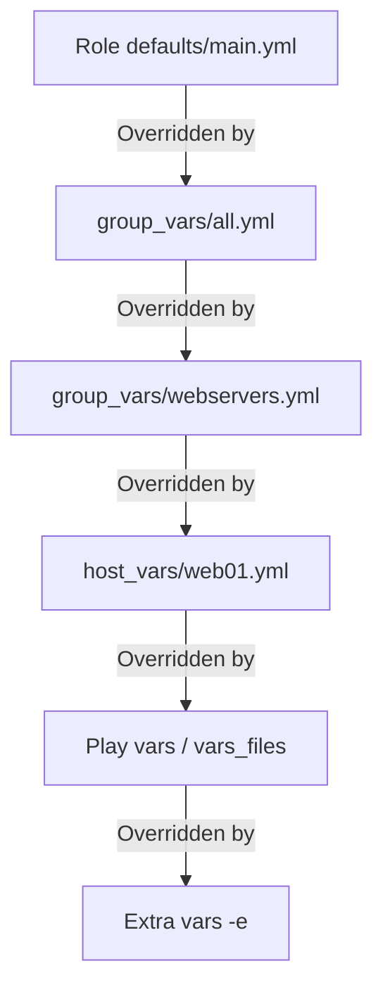

# How to Use Ansible Variable Precedence Rules

Author: [nawazdhandala](https://www.github.com/nawazdhandala)

Tags: Ansible, Variables, Precedence, DevOps, Configuration Management

Description: Learn the complete Ansible variable precedence order, from lowest to highest priority, to avoid unexpected overrides and debug variable resolution issues.

---

If you have ever set a variable in one place and been confused when Ansible used a completely different value, you have run into the variable precedence system. Ansible has over 20 levels of variable precedence, and understanding this order is critical for debugging and for designing your variable structure correctly. In this post, I will walk through the full precedence chain with practical examples so you can predict exactly which value Ansible will use.

## The Full Precedence Order

Here is the complete list from lowest to highest precedence. A variable defined at a higher level overrides the same variable defined at a lower level:

```yaml
# Ansible Variable Precedence (lowest to highest):
#
#  1.  command line values (e.g., -u my_user, not -e)
#  2.  role defaults (roles/x/defaults/main.yml)
#  3.  inventory file or script group vars
#  4.  inventory group_vars/all
#  5.  playbook group_vars/all
#  6.  inventory group_vars/*
#  7.  playbook group_vars/*
#  8.  inventory file or script host vars
#  9.  inventory host_vars/*
# 10.  playbook host_vars/*
# 11.  host facts / cached set_facts
# 12.  play vars
# 13.  play vars_prompt
# 14.  play vars_files
# 15.  role vars (roles/x/vars/main.yml)
# 16.  block vars (in a block/when task)
# 17.  task vars (only for the specific task)
# 18.  include_vars
# 19.  set_facts / registered vars
# 20.  role parameters (roles listed with vars)
# 21.  include parameters
# 22.  extra vars (-e on the command line) -- ALWAYS WIN
```

## Practical Demonstration

Let me show how this works with a concrete example. We will define the same variable `app_port` at multiple levels and see which one wins.

### Role Defaults (Level 2 - Lowest Useful Level)

```yaml
# roles/webapp/defaults/main.yml
# This is the "factory default" - override me!
app_port: 8080
```

### Inventory group_vars (Level 6)

```yaml
# inventory/group_vars/webservers.yml
# Overrides role defaults
app_port: 8000
```

### Inventory host_vars (Level 9)

```yaml
# inventory/host_vars/web01.yml
# Overrides group_vars for this specific host
app_port: 8001
```

### Play vars (Level 12)

```yaml
---
- hosts: webservers
  vars:
    # Overrides both group_vars and host_vars
    app_port: 9000
  roles:
    - webapp
```

### Role vars (Level 15)

```yaml
# roles/webapp/vars/main.yml
# Overrides play vars! This catches people off guard.
app_port: 7000
```

### Extra vars (Level 22 - Highest)

```bash
# Overrides everything, no exceptions
ansible-playbook deploy.yml -e "app_port=3000"
```

## The Three Levels That Matter Most

In daily work, you mostly deal with three levels:

### 1. Role Defaults (for customizable parameters)

```yaml
# roles/nginx/defaults/main.yml
# Users of this role SHOULD override these values.
# Put every tunable parameter here.

nginx_port: 80
nginx_worker_processes: auto
nginx_worker_connections: 1024
nginx_keepalive_timeout: 65
nginx_gzip_enabled: true
nginx_ssl_enabled: false
```

### 2. Group/Host vars (for environment-specific values)

```yaml
# group_vars/production/webservers.yml
# Override role defaults for production web servers

nginx_port: 443
nginx_ssl_enabled: true
nginx_worker_connections: 4096
```

### 3. Extra vars (for one-off overrides)

```bash
# Temporary override for testing
ansible-playbook deploy.yml -e "nginx_port=8443"
```

## Common Precedence Pitfalls

### Pitfall 1: role vars vs play vars

Many people assume play-level `vars` have higher precedence than everything in the role. This is wrong. `roles/x/vars/main.yml` overrides play vars:

```yaml
# This will NOT work as expected if the role has vars/main.yml
- hosts: webservers
  vars:
    nginx_config_dir: /opt/nginx/conf    # You want this
  roles:
    - nginx    # But if roles/nginx/vars/main.yml sets nginx_config_dir, it wins
```

The fix: role authors should put all user-configurable values in `defaults/main.yml`, not `vars/main.yml`. The `vars/main.yml` file is for internal implementation details that should not be overridden.

### Pitfall 2: include_vars Overriding Group/Host Vars

The `include_vars` module has higher precedence than group_vars and host_vars:

```yaml
# This include_vars will override your inventory variables
- name: Load OS-specific variables
  include_vars: "{{ ansible_os_family }}.yml"
```

If the included file defines a variable that is also in your `host_vars`, the `include_vars` value wins. Be aware of this when designing roles that dynamically load variables.

### Pitfall 3: set_fact Overriding Everything Below Extra Vars

Once you use `set_fact`, that value sticks for the rest of the play and overrides almost everything:

```yaml
# This set_fact overrides group_vars, play vars, and even role vars
- name: Override the port
  set_fact:
    app_port: 5555

# From this point on, app_port is 5555 regardless of other definitions
# Only extra vars (-e) can override a set_fact
```

## Debugging Variable Precedence

### Using the debug module

```yaml
# Show exactly what value a variable has and where it might come from
- name: Debug variable value
  debug:
    msg: |
      app_port = {{ app_port }}
      Defined in hostvars: {{ hostvars[inventory_hostname]['app_port'] | default('not in hostvars') }}
```

### Using ansible-inventory

```bash
# Show all variables for a host with their effective values
ansible-inventory -i inventory/ --host web01 --yaml

# Show the inventory graph with all variable assignments
ansible-inventory -i inventory/ --graph --vars
```

### Using -vvv Verbose Mode

```bash
# Verbose output shows where each variable is defined
ansible-playbook deploy.yml -vvv
```

## Designing Your Variable Strategy

Here is a recommended approach that works with the precedence system:



Put defaults in the role. Override by environment in group_vars. Override by host in host_vars. Use play vars sparingly. Use extra vars for temporary testing.

### Example Project Layout

```yaml
# roles/webapp/defaults/main.yml
# GOOD: All tunables live here
app_port: 8080
app_workers: 4
app_log_level: info
app_ssl_enabled: false
```

```yaml
# roles/webapp/vars/main.yml
# GOOD: Only internal constants live here
_webapp_service_name: webapp
_webapp_config_path: /etc/webapp
_webapp_supported_os:
  - Debian
  - RedHat
```

```yaml
# group_vars/all.yml
# GOOD: Organization-wide defaults
app_log_level: warn
monitoring_enabled: true
```

```yaml
# group_vars/production.yml
# GOOD: Production overrides
app_workers: 16
app_ssl_enabled: true
```

```yaml
# group_vars/staging.yml
# GOOD: Staging overrides
app_workers: 2
app_log_level: debug
```

```yaml
# host_vars/web01-prod.yml
# GOOD: Host-specific exceptions
app_workers: 32    # This server has more CPUs
```

## Quick Reference Table

| Where Defined | Precedence | Use For |
|---|---|---|
| Role defaults | Very low | Tunable parameters |
| group_vars/all | Low | Org-wide standards |
| group_vars/group | Medium-low | Group-level config |
| host_vars | Medium | Host-specific config |
| Play vars | Medium-high | Playbook-specific values |
| Role vars | High | Internal role constants |
| include_vars | High | Dynamic variable loading |
| set_fact | Very high | Runtime computed values |
| Extra vars (-e) | Highest | CLI overrides |

## Wrapping Up

Variable precedence in Ansible follows a consistent, well-documented order. The key takeaway is to design your variable structure to work with the precedence system, not against it. Role defaults for tunables, group_vars for environment overrides, host_vars for exceptions, and extra vars for emergencies. If you stick to this pattern and avoid putting user-configurable values in `vars/main.yml`, you will rarely be surprised by which value Ansible picks.
