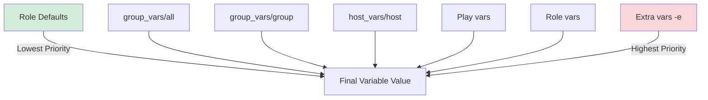

# How to Use Ansible Variables Best Practices

Author: [nawazdhandala](https://www.github.com/nawazdhandala)

Tags: Ansible, Variables, Configuration Management, Best Practices

Description: Master Ansible variable management with best practices for naming, scoping, precedence, and organizing variables across environments and roles.

---

Variables are how you make Ansible flexible, but they are also the most common source of confusion and bugs. Ansible has over 20 levels of variable precedence, and a misplaced variable definition can silently override what you expected. After debugging hundreds of variable-related issues, these are the practices that prevent headaches.

## Understand the Precedence Hierarchy

Ansible evaluates variables from many sources, and order matters. Here are the most important levels from lowest to highest priority:

```
1.  Role defaults (roles/x/defaults/main.yml)      <- Lowest
2.  Inventory group_vars/all
3.  Inventory group_vars/<group>
4.  Inventory host_vars/<host>
5.  Play vars
6.  Play vars_files
7.  Role vars (roles/x/vars/main.yml)
8.  Block vars
9.  Task vars
10. set_fact / registered vars
11. Extra vars (-e on command line)                  <- Highest
```

Use this to your advantage by defining variables at the appropriate level:

```yaml
# roles/nginx/defaults/main.yml
# LOWEST priority - safe fallback values
# Users SHOULD override these
nginx_worker_connections: 1024
nginx_client_max_body_size: 10m
nginx_ssl_protocols: "TLSv1.2 TLSv1.3"
```

```yaml
# roles/nginx/vars/main.yml
# HIGH priority - values that should NOT be overridden
# Use for internal role constants
nginx_config_dir: /etc/nginx
nginx_log_dir: /var/log/nginx
nginx_user: www-data
```

```yaml
# inventories/production/group_vars/webservers.yml
# MEDIUM priority - environment-specific values
nginx_worker_connections: 4096
nginx_client_max_body_size: 50m
```

## Prefix Variables with Role Names

This is the single most important variable practice. Without prefixes, two roles can define the same variable name and one silently overwrites the other.

```yaml
# BAD: Generic variable names cause collisions
# roles/nginx/defaults/main.yml
port: 80
config_dir: /etc/nginx

# roles/haproxy/defaults/main.yml
port: 443              # This overrides nginx's port!
config_dir: /etc/haproxy  # This overrides nginx's config_dir!
```

```yaml
# GOOD: Prefixed variables are safe from collisions
# roles/nginx/defaults/main.yml
nginx_port: 80
nginx_config_dir: /etc/nginx

# roles/haproxy/defaults/main.yml
haproxy_port: 443
haproxy_config_dir: /etc/haproxy
```

## Separate Secrets from Regular Variables

Keep secrets in vault-encrypted files separate from regular variables. Reference vault values with a `vault_` prefix:

```yaml
# inventories/production/group_vars/all.yml
# Regular variables - plain text, easy to read and review
db_host: db01.prod.example.com
db_port: 5432
db_name: appdb
db_user: "{{ vault_db_user }}"
db_password: "{{ vault_db_password }}"

smtp_host: smtp.example.com
smtp_port: 587
smtp_user: "{{ vault_smtp_user }}"
smtp_password: "{{ vault_smtp_password }}"
```

```yaml
# inventories/production/group_vars/vault.yml (ansible-vault encrypted)
# Secret values only - encrypted at rest
vault_db_user: prod_app_user
vault_db_password: correct-horse-battery-staple
vault_smtp_user: notifications@example.com
vault_smtp_password: smtp_secret_token_123
```

This separation means you can review regular variable changes without decrypting the vault.

## Use group_vars and host_vars Effectively

Organize variables by scope. Put shared values in `all`, group-specific values in the group directory, and host-specific exceptions in `host_vars`:

```yaml
# inventories/production/group_vars/all.yml
# Variables that apply to EVERY host in this environment
env_name: production
ntp_servers:
  - ntp1.example.com
  - ntp2.example.com
dns_servers:
  - 10.0.0.2
  - 10.0.0.3
monitoring_endpoint: https://metrics.example.com
log_level: warn
```

```yaml
# inventories/production/group_vars/webservers.yml
# Variables specific to web servers
nginx_worker_processes: auto
nginx_ssl_certificate: /etc/ssl/certs/prod-wildcard.crt
nginx_ssl_certificate_key: /etc/ssl/private/prod-wildcard.key
```

```yaml
# inventories/production/host_vars/web03.yml
# Exception: This host has different hardware
nginx_worker_processes: 16  # 16-core machine
nginx_worker_connections: 8192
```

## Avoid set_fact for Configuration

`set_fact` is useful for computed values during playbook execution, but it should not be used for configuration. Facts are not visible in variable files and are hard to track.

```yaml
# BAD: Using set_fact for configuration values
- name: Set database URL
  ansible.builtin.set_fact:
    database_url: "postgresql://{{ db_user }}:{{ db_password }}@{{ db_host }}/{{ db_name }}"

# GOOD: Compute derived values in variable files or templates
# group_vars/all.yml
database_url: "postgresql://{{ db_user }}:{{ db_password }}@{{ db_host }}/{{ db_name }}"
```

Use `set_fact` only when you need runtime computation:

```yaml
# GOOD use of set_fact: computing a value from gathered facts
- name: Calculate optimal shared_buffers
  ansible.builtin.set_fact:
    postgresql_shared_buffers: "{{ (ansible_memtotal_mb * 0.25) | int }}MB"
  when: postgresql_shared_buffers is not defined
```

## Use Default Filters Defensively

Protect against undefined variables with the `default` filter:

```yaml
# Provide fallback values when a variable might not exist
- name: Configure application
  ansible.builtin.template:
    src: app.conf.j2
    dest: /etc/myapp/app.conf
  vars:
    app_debug: "{{ app_debug_mode | default(false) }}"
    app_log_level: "{{ log_level | default('info') }}"
    app_workers: "{{ app_worker_count | default(ansible_processor_vcpus) }}"
```

In templates:

```jinja2
{# templates/app.conf.j2 #}
{# Use default filter for optional settings #}
[server]
host = {{ app_host | default('0.0.0.0') }}
port = {{ app_port | default(8080) }}
workers = {{ app_workers | default(4) }}


[ssl]
certificate = {{ app_ssl_cert }}
key = {{ app_ssl_key }}


[logging]
level = {{ app_log_level | default('info') }}

handler = {{ handler }}

```

## Variable Organization Diagram



## Validate Variables with assert

Catch missing or invalid variables early:

```yaml
# roles/app_deploy/tasks/validate.yml
# Validate required variables before proceeding
- name: Validate required variables are defined
  ansible.builtin.assert:
    that:
      - app_deploy_repo is defined
      - app_deploy_repo | length > 0
      - app_deploy_version is defined
      - app_deploy_port is defined
      - app_deploy_port | int > 0
      - app_deploy_port | int < 65536
    fail_msg: >
      Required variables are missing or invalid.
      app_deploy_repo must be a non-empty string.
      app_deploy_port must be between 1 and 65535.
    success_msg: "All required variables validated"
```

Include validation at the start of each role:

```yaml
# roles/app_deploy/tasks/main.yml
- name: Validate input variables
  ansible.builtin.include_tasks: validate.yml
  tags: [always]

- name: Deploy application
  ansible.builtin.include_tasks: deploy.yml
```

## Use vars_files for Structured Data

When you have complex variable structures, keep them in dedicated files:

```yaml
# vars/supported_platforms.yml
# Structured data that would clutter group_vars
supported_platforms:
  ubuntu:
    versions: [20.04, 22.04]
    package_manager: apt
    service_manager: systemd
  centos:
    versions: [8, 9]
    package_manager: dnf
    service_manager: systemd
  amazon:
    versions: [2, 2023]
    package_manager: yum
    service_manager: systemd
```

```yaml
# playbooks/setup.yml
- hosts: all
  vars_files:
    - vars/supported_platforms.yml
  tasks:
    - name: Verify platform is supported
      ansible.builtin.assert:
        that:
          - ansible_distribution | lower in supported_platforms
```

## Summary

Ansible variable management requires discipline. Prefix variables with role names. Use `defaults/main.yml` for values users should override and `vars/main.yml` for internal constants. Separate secrets into vault-encrypted files with a `vault_` prefix convention. Avoid `set_fact` for configuration. Validate required variables with assert tasks. Use the `default` filter defensively in templates. These practices prevent the silent variable override bugs that can waste hours of debugging time.
