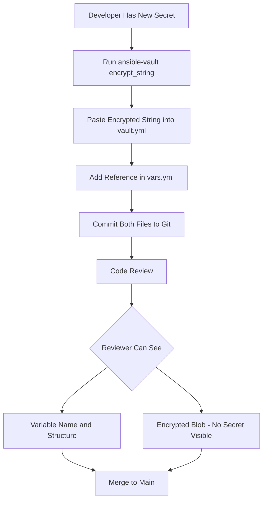

# How to Use Ansible Vault Encrypted Strings in Playbooks

Author: [nawazdhandala](https://www.github.com/nawazdhandala)

Tags: Ansible, Vault, Playbooks, Security, Encryption

Description: Learn how to embed vault-encrypted strings directly in Ansible playbooks and variable files for granular secret protection.

---

Ansible Vault encrypted strings let you protect individual secret values while keeping the rest of your YAML readable. Instead of encrypting an entire file (which makes diffs and code reviews impossible), you encrypt just the sensitive values and embed them inline. This approach gives you the best of both worlds: your configuration structure stays visible, and your secrets stay protected.

## How Encrypted Strings Work in YAML

An encrypted string in Ansible YAML uses the `!vault` tag followed by a pipe (`|`) for a multi-line block scalar. The encrypted payload replaces the plaintext value:

```yaml
# A normal YAML variable
app_port: 8080

# A vault-encrypted variable (the actual secret is encrypted inside)
db_password: !vault |
          $ANSIBLE_VAULT;1.1;AES256
          62313365396662343061393464336163383764316462616131633538343062376662
          31303031633534393463313865303732646463376565326435613066643831386237
          ...
```

When Ansible loads this file, it detects the `!vault` tag and decrypts the value at runtime using the provided vault password. To the playbook, `db_password` is just a regular string variable containing the plaintext secret.

## Creating Encrypted Strings

Use `ansible-vault encrypt_string` to generate encrypted strings:

```bash
# Encrypt a value and name it for easy pasting into YAML
ansible-vault encrypt_string \
  --vault-password-file vault_pass.txt \
  'MyDatabasePassword123' \
  --name 'db_password'
```

Output:

```yaml
db_password: !vault |
          $ANSIBLE_VAULT;1.1;AES256
          ...encrypted content...
```

For values that should not appear in shell history, use stdin:

```bash
# Read the secret from stdin (does not appear in shell history)
echo -n 'SensitiveAPIKey' | ansible-vault encrypt_string \
  --vault-password-file vault_pass.txt \
  --stdin-name 'api_key'
```

## Embedding in Playbooks

You can put encrypted strings directly in a playbook:

```yaml
# deploy.yml
# Playbook with inline encrypted secrets
---
- name: Deploy application
  hosts: webservers
  vars:
    app_name: customer-portal
    app_port: 3000
    app_env: production

    # Encrypted secrets embedded directly in the playbook
    db_password: !vault |
              $ANSIBLE_VAULT;1.1;AES256
              62313365396662343061393464336163383764316462616131633538343062376662
              31303031633534393463313865303732646463376565326435613066643831386237
              6337

    session_secret: !vault |
              $ANSIBLE_VAULT;1.1;AES256
              37326433653634623237386339383832653935653931323932356230363861333335
              35353465303162323932313030323864353636313632343136643464353431303233
              3439

  tasks:
    - name: Create configuration file
      ansible.builtin.template:
        src: config.env.j2
        dest: "/opt/{{ app_name }}/config.env"
        mode: '0600'
      no_log: true

    - name: Restart application
      ansible.builtin.systemd:
        name: "{{ app_name }}"
        state: restarted
```

## Using in Variable Files

The more common approach is to put encrypted strings in variable files rather than the playbook itself:

```yaml
# group_vars/production/vault.yml
# All sensitive values encrypted inline, file structure remains visible
---
vault_db_password: !vault |
          $ANSIBLE_VAULT;1.1;AES256
          62313365396662343061393464336163383764316462616131633538343062376662
          6337

vault_api_key: !vault |
          $ANSIBLE_VAULT;1.1;AES256
          37326433653634623237386339383832653935653931323932356230363861333335
          3439

vault_smtp_password: !vault |
          $ANSIBLE_VAULT;1.1;AES256
          34303133626261336162643664303038393537313334393363356537616531386338
          6662
```

Then reference them from a plaintext vars file:

```yaml
# group_vars/production/vars.yml
# Plaintext config referencing encrypted values from vault.yml
---
db_host: prod-db.internal.example.com
db_port: 5432
db_name: app_production
db_password: "{{ vault_db_password }}"

api_endpoint: https://api.example.com
api_key: "{{ vault_api_key }}"

smtp_host: smtp.sendgrid.net
smtp_port: 587
smtp_password: "{{ vault_smtp_password }}"
```

This separation keeps your configuration easy to review while protecting the actual secrets.

## Using Encrypted Strings in Roles

Encrypted strings work in role variable files too:

```yaml
# roles/database/defaults/main.yml
# Role defaults with an encrypted admin password
---
db_admin_user: postgres
db_admin_password: !vault |
          $ANSIBLE_VAULT;1.1;AES256
          62313365396662343061393464336163383764316462616131633538343062376662
          6337
db_max_connections: 100
db_port: 5432
```

Or in role vars for higher precedence:

```yaml
# roles/database/vars/production.yml
# Production-specific values with encrypted secrets
---
db_admin_password: !vault |
          $ANSIBLE_VAULT;1.1;AES256
          37326433653634623237386339383832653935653931323932356230363861333335
          3439
db_replication_password: !vault |
          $ANSIBLE_VAULT;1.1;AES256
          34303133626261336162643664303038393537313334393363356537616531386338
          6662
```

## Using Encrypted Strings in Inventory

Encrypted strings also work in YAML inventory files:

```yaml
# inventory/production.yml
# Inventory with per-host encrypted credentials
---
all:
  children:
    databases:
      hosts:
        db-primary:
          ansible_host: 10.0.1.10
          mysql_root_password: !vault |
                    $ANSIBLE_VAULT;1.1;AES256
                    62313365396662343061393464336163383764316462616131633538343062376662
                    6337
        db-replica:
          ansible_host: 10.0.1.11
          mysql_root_password: !vault |
                    $ANSIBLE_VAULT;1.1;AES256
                    37326433653634623237386339383832653935653931323932356230363861333335
                    3439
```

## Encrypted Strings with Vault IDs

Tag encrypted strings with vault IDs for multi-password environments:

```bash
# Encrypt with a specific vault ID
ansible-vault encrypt_string \
  --vault-id prod@prod_pass.txt \
  'ProductionSecret123' \
  --name 'vault_db_password'
```

The output includes the vault ID in the header:

```yaml
vault_db_password: !vault |
          $ANSIBLE_VAULT;1.2;AES256;prod
          62313365396662343061393464336163383764316462616131633538343062376662
          6337
```

## Running Playbooks with Encrypted Strings

Execute the playbook with the vault password:

```bash
# Run with a password file
ansible-playbook deploy.yml --vault-password-file vault_pass.txt

# Run with interactive prompt
ansible-playbook deploy.yml --ask-vault-pass

# Run with multiple vault IDs
ansible-playbook deploy.yml \
  --vault-id dev@dev_pass.txt \
  --vault-id prod@prod_pass.txt
```

## Debugging Encrypted String Values

Sometimes you need to check what value an encrypted string contains:

```bash
# Use the debug module to display a decrypted value
ansible localhost \
  -m debug \
  -a "var=vault_db_password" \
  -e "@group_vars/production/vault.yml" \
  --vault-password-file vault_pass.txt
```

Or add a debug task to your playbook:

```yaml
# Temporary debug task (remove before deploying to production)
- name: Show decrypted value for debugging
  ansible.builtin.debug:
    var: db_password
    verbosity: 2  # Only shows when running with -vv or higher
```

## Practical Workflow

Here is a typical workflow for managing encrypted strings in a team:



## Limitations

Encrypted strings have some limits you should know about:

You cannot use `ansible-vault rekey` to change the password on inline encrypted strings. Rekeying only works on fully encrypted files. To rotate passwords for inline encrypted strings, you must decrypt each one and re-encrypt with the new password.

`ansible-vault view` does not work with files containing inline encrypted strings. It only works on fully vault-encrypted files.

You cannot encrypt complex YAML structures (dictionaries or lists) as a single encrypted string. Each encrypted string replaces a single scalar value.

The `no_log: true` directive is important on any task that might print the decrypted value to the output. Without it, `ansible-playbook` will show the plaintext value in task output.

## Summary

Encrypted strings are the go-to approach when you need to protect specific values without losing visibility into your configuration structure. They work in playbooks, variable files, role variables, and inventory files. The `vault_` prefix convention combined with indirection through plaintext vars files gives you clean separation between configuration and secrets, making code reviews and debugging straightforward.
