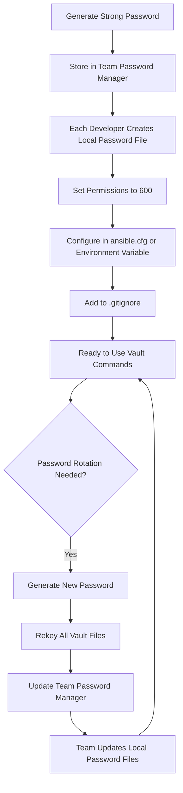

# How to Use Ansible Vault Password Files

Author: [nawazdhandala](https://www.github.com/nawazdhandala)

Tags: Ansible, Vault, Security, Automation

Description: Learn how to use Ansible Vault password files to automate decryption and avoid typing passwords manually for every playbook run.

---

Typing your vault password every single time you run a playbook gets tedious quickly, especially during development when you might run playbooks dozens of times a day. Ansible Vault password files eliminate this friction by storing the password in a file that Ansible reads automatically. This guide covers everything from basic setup to production-ready configurations.

## What Is a Vault Password File?

A vault password file is simply a text file containing your vault password on a single line. When you point Ansible at this file, it reads the password from it instead of prompting you interactively. The file can be a plain text file, or it can be an executable script that outputs the password to stdout.

## Creating a Basic Password File

The simplest approach is a plain text file with your password:

```bash
# Create a vault password file
# Use a strong, randomly generated password in production
echo "your-vault-password-here" > ~/.vault_pass.txt

# Set strict permissions so only your user can read it
chmod 600 ~/.vault_pass.txt

# Verify permissions (should show -rw-------)
ls -la ~/.vault_pass.txt
```

Important: the file must contain only the password on a single line, with no trailing whitespace or extra newlines. Some editors add trailing newlines, which can cause decryption failures.

## Using the Password File on the Command Line

Pass the password file to any ansible-vault or ansible-playbook command:

```bash
# Encrypt a file using a password file
ansible-vault encrypt --vault-password-file ~/.vault_pass.txt secrets.yml

# Decrypt a file using a password file
ansible-vault decrypt --vault-password-file ~/.vault_pass.txt secrets.yml

# View encrypted content without decrypting the file on disk
ansible-vault view --vault-password-file ~/.vault_pass.txt secrets.yml

# Run a playbook that uses vault-encrypted files
ansible-playbook site.yml --vault-password-file ~/.vault_pass.txt
```

## Configuring the Password File in ansible.cfg

To avoid passing `--vault-password-file` on every command, set it in your Ansible configuration:

```ini
# ansible.cfg
[defaults]
# Ansible will automatically use this file for vault operations
vault_password_file = ~/.vault_pass.txt
```

Now all vault commands work without specifying the password file:

```bash
# These all work without --vault-password-file thanks to ansible.cfg
ansible-vault encrypt secrets.yml
ansible-vault view secrets.yml
ansible-playbook site.yml
```

## Using an Environment Variable

You can also set the password file location through an environment variable, which takes precedence over `ansible.cfg`:

```bash
# Set the vault password file via environment variable
export ANSIBLE_VAULT_PASSWORD_FILE=~/.vault_pass.txt

# Now all vault commands pick up the password automatically
ansible-playbook site.yml
```

Add it to your shell profile for persistence:

```bash
# Add to ~/.bashrc or ~/.zshrc for automatic loading
echo 'export ANSIBLE_VAULT_PASSWORD_FILE=~/.vault_pass.txt' >> ~/.bashrc
source ~/.bashrc
```

## Password File Security Best Practices

Since the password file contains your vault password in plaintext, securing it is critical.

```bash
# Restrict permissions to owner only (read/write)
chmod 600 ~/.vault_pass.txt

# Verify the file is owned by the correct user
ls -la ~/.vault_pass.txt
# Expected: -rw------- 1 youruser yourgroup ... .vault_pass.txt
```

Never commit the password file to version control. Add it to `.gitignore`:

```gitignore
# .gitignore - prevent vault password files from being committed
.vault_pass*
*.vault_pass
vault_password*
```

Store the password file outside the project directory when possible. Keeping it in your home directory (`~/.vault_pass.txt`) rather than in the project root reduces the chance of accidental exposure.

## Executable Password Scripts

Instead of a plain text file, you can use an executable script. Ansible detects that the file is executable and runs it, capturing the password from stdout.

```bash
#!/bin/bash
# ~/.vault_pass_script.sh
# Retrieves vault password from the macOS keychain
# This avoids storing the password in a plain text file

security find-generic-password \
  -a "${USER}" \
  -s "ansible-vault-password" \
  -w
```

On Linux, you could use `pass`, `secret-tool`, or any other password manager CLI:

```bash
#!/bin/bash
# ~/.vault_pass_script.sh
# Retrieves vault password from the pass password manager

pass show ansible/vault-password
```

Make the script executable and configure it:

```bash
# Make the script executable (required for Ansible to run it)
chmod 700 ~/.vault_pass_script.sh

# Use it just like a regular password file
ansible-vault view --vault-password-file ~/.vault_pass_script.sh secrets.yml

# Or set it in ansible.cfg
# vault_password_file = ~/.vault_pass_script.sh
```

## Using Vault Password Files with Vault IDs

When working with multiple vault passwords, combine password files with vault IDs:

```bash
# Create separate password files per environment
echo "dev-password-here" > ~/.vault_pass_dev
echo "prod-password-here" > ~/.vault_pass_prod
chmod 600 ~/.vault_pass_dev ~/.vault_pass_prod

# Encrypt files with specific vault IDs and password files
ansible-vault encrypt --vault-id dev@~/.vault_pass_dev group_vars/dev/vault.yml
ansible-vault encrypt --vault-id prod@~/.vault_pass_prod group_vars/prod/vault.yml

# Run playbook with both vault IDs
ansible-playbook site.yml \
  --vault-id dev@~/.vault_pass_dev \
  --vault-id prod@~/.vault_pass_prod
```

Configure multiple vault IDs in `ansible.cfg`:

```ini
# ansible.cfg
[defaults]
vault_identity_list = dev@~/.vault_pass_dev, prod@~/.vault_pass_prod
```

## Project-Level Password Files

Some teams keep a project-level password file that is distributed out-of-band (not through git):

```
project/
  ansible.cfg           # references .vault_pass
  .vault_pass           # git-ignored, distributed separately
  .gitignore            # excludes .vault_pass
  group_vars/
    production/
      vault.yml         # encrypted with vault password
```

```ini
# ansible.cfg - references the project-level password file
[defaults]
vault_password_file = .vault_pass
```

New team members receive the `.vault_pass` file through a secure channel (password manager, encrypted email, etc.) and drop it into their project checkout.

## Troubleshooting Common Issues

If decryption fails when using a password file, check these common causes:

```bash
# Check for trailing newlines or whitespace
# The file should contain exactly one line with no trailing spaces
cat -A ~/.vault_pass.txt
# Expected output: your-password-here$
# The $ marks the end of line. If you see extra spaces or ^M characters, that's the problem.

# Check file encoding (should be UTF-8 or ASCII)
file ~/.vault_pass.txt
# Expected: ASCII text

# For executable scripts, check that they output only the password
~/.vault_pass_script.sh
# Should output just the password, nothing else

# Check permissions
ls -la ~/.vault_pass.txt
# Should be -rw------- (600) for text files
# Should be -rwx------ (700) for executable scripts
```

## Password File Workflow

Here is the typical workflow for a team using vault password files:



## Summary

Vault password files remove the friction of manual password entry while maintaining security. Use plain text files for simplicity, executable scripts for integration with password managers, and vault IDs for multi-environment setups. The key is to keep these files out of version control, lock down their permissions, and have a clear process for distributing and rotating them within your team.
