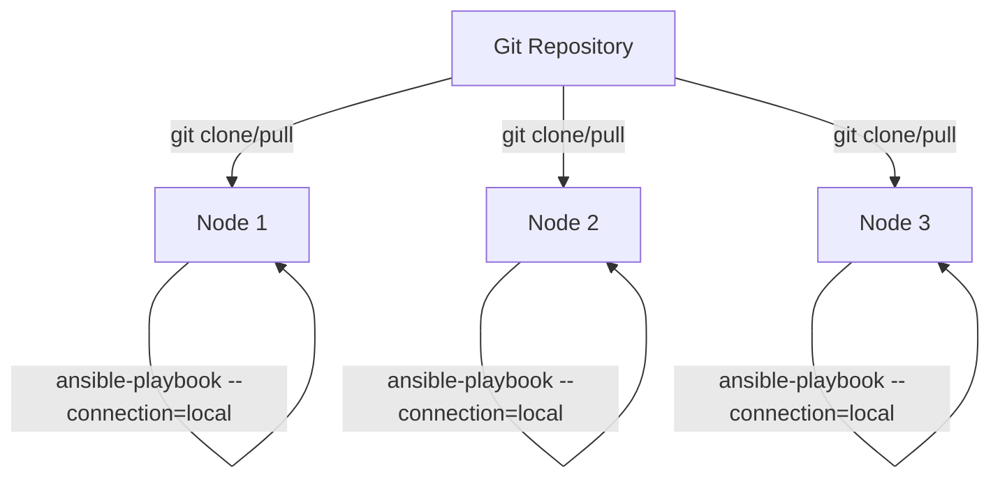

# How to Use Ansible Vault with ansible-pull

Author: [nawazdhandala](https://www.github.com/nawazdhandala)

Tags: Ansible, Vault, ansible-pull, Security, Configuration Management

Description: Learn how to securely use Ansible Vault encrypted secrets with ansible-pull for node-based self-provisioning and configuration.

---

`ansible-pull` inverts the typical Ansible push model. Instead of a central controller connecting to managed nodes, each node pulls its configuration from a Git repository and applies it locally. This is useful for auto-scaling environments, initial node provisioning, and scenarios where a central controller is not practical. But using vault-encrypted secrets with `ansible-pull` requires careful handling because each node needs access to the vault password independently.

## How ansible-pull Works

In the standard Ansible model, you run `ansible-playbook` from a controller machine. With `ansible-pull`, each managed node runs a command that:

1. Clones or updates a Git repository containing the playbooks
2. Runs a specified playbook locally against itself



## The Challenge with Vault Secrets

In the push model, the vault password lives on the controller. One password file, one location to secure. With `ansible-pull`, every node needs the vault password, which means you need a secure way to distribute it to potentially hundreds of machines without putting it in the Git repository.

## Method 1: Pre-provisioned Password File

The simplest approach is to place the vault password file on each node before `ansible-pull` runs. This works well when you have a base image or cloud-init provisioning step.

```bash
# During initial node provisioning (e.g., in a Packer template or cloud-init)
# Write the vault password to a secure location
echo "your-vault-password" > /etc/ansible/vault_pass.txt
chmod 600 /etc/ansible/vault_pass.txt
chown root:root /etc/ansible/vault_pass.txt
```

Then run `ansible-pull` with the password file:

```bash
# ansible-pull with a pre-provisioned vault password file
ansible-pull \
  -U https://github.com/your-org/ansible-config.git \
  -i localhost, \
  --vault-password-file /etc/ansible/vault_pass.txt \
  local.yml
```

### Cloud-Init Example

For AWS EC2 instances, pass the vault password through cloud-init user data:

```yaml
#cloud-config
# Provision the vault password and set up ansible-pull
write_files:
  - path: /etc/ansible/vault_pass.txt
    permissions: '0600'
    owner: root:root
    content: |
      your-vault-password-here

  - path: /etc/cron.d/ansible-pull
    permissions: '0644'
    content: |
      */15 * * * * root ansible-pull -U https://github.com/your-org/ansible-config.git -i localhost, --vault-password-file /etc/ansible/vault_pass.txt local.yml >> /var/log/ansible-pull.log 2>&1

runcmd:
  - pip3 install ansible
  - ansible-pull -U https://github.com/your-org/ansible-config.git -i localhost, --vault-password-file /etc/ansible/vault_pass.txt local.yml
```

## Method 2: Password from Cloud Metadata Service

A more secure approach retrieves the vault password from a cloud secrets service at runtime:

```bash
#!/bin/bash
# /usr/local/bin/vault_pass.sh
# Retrieves vault password from AWS Secrets Manager
# The EC2 instance needs an IAM role with secretsmanager:GetSecretValue permission

REGION=$(curl -s http://169.254.169.254/latest/meta-data/placement/region)

PASSWORD=$(aws secretsmanager get-secret-value \
  --secret-id "ansible/vault-password" \
  --region "${REGION}" \
  --query 'SecretString' \
  --output text 2>/dev/null)

if [ $? -ne 0 ] || [ -z "${PASSWORD}" ]; then
  echo "ERROR: Failed to retrieve vault password from Secrets Manager" >&2
  exit 1
fi

echo "${PASSWORD}"
```

```bash
# Make executable and use with ansible-pull
chmod 700 /usr/local/bin/vault_pass.sh

ansible-pull \
  -U https://github.com/your-org/ansible-config.git \
  -i localhost, \
  --vault-password-file /usr/local/bin/vault_pass.sh \
  local.yml
```

This approach is better because:
- No password stored on disk
- IAM roles control access (no static credentials)
- Password can be rotated in Secrets Manager without touching nodes

## Method 3: Environment Variable on the Node

Pass the vault password through an environment variable:

```bash
#!/bin/bash
# /usr/local/bin/vault_pass_env.sh
# Reads vault password from environment variable
if [ -z "${ANSIBLE_VAULT_PASS}" ]; then
  echo "ERROR: ANSIBLE_VAULT_PASS not set" >&2
  exit 1
fi
echo "${ANSIBLE_VAULT_PASS}"
```

Set the environment variable in a systemd service or cron job:

```ini
# /etc/systemd/system/ansible-pull.service
[Unit]
Description=Ansible Pull Configuration
After=network-online.target
Wants=network-online.target

[Service]
Type=oneshot
Environment=ANSIBLE_VAULT_PASS=your-vault-password
ExecStart=/usr/bin/ansible-pull \
  -U https://github.com/your-org/ansible-config.git \
  -i localhost, \
  --vault-password-file /usr/local/bin/vault_pass_env.sh \
  local.yml
StandardOutput=journal
StandardError=journal

[Install]
WantedBy=multi-user.target
```

```ini
# /etc/systemd/system/ansible-pull.timer
# Runs ansible-pull every 15 minutes
[Unit]
Description=Run Ansible Pull periodically

[Timer]
OnBootSec=2min
OnUnitActiveSec=15min
RandomizedDelaySec=5min

[Install]
WantedBy=timers.target
```

## Setting Up the Playbook Repository

Your Git repository needs a playbook that works with local connections:

```yaml
# local.yml (the default playbook ansible-pull looks for)
---
- name: Configure this node
  hosts: localhost
  connection: local
  become: true

  vars_files:
    - vars/common.yml

  pre_tasks:
    - name: Determine node role from tags or facts
      ansible.builtin.set_fact:
        node_role: "{{ ansible_local.role.name | default('base') }}"

  roles:
    - role: base
    - role: "{{ node_role }}"
      when: node_role != 'base'
```

Keep vault-encrypted variables in the standard locations:

```yaml
# vars/vault.yml (vault-encrypted)
---
vault_monitoring_api_key: "encrypted-value-here"
vault_log_shipping_token: "encrypted-value-here"
vault_backup_encryption_key: "encrypted-value-here"
```

```yaml
# vars/common.yml (plaintext, references vault vars)
---
monitoring_api_key: "{{ vault_monitoring_api_key }}"
log_shipping_token: "{{ vault_log_shipping_token }}"
backup_encryption_key: "{{ vault_backup_encryption_key }}"
```

## Complete Bootstrap Script

Here is a complete bootstrap script that sets up `ansible-pull` with vault support on a fresh node:

```bash
#!/bin/bash
# bootstrap.sh
# Sets up ansible-pull with vault password on a new node
# Usage: curl -s https://raw.githubusercontent.com/your-org/ansible-config/main/bootstrap.sh | bash

set -euo pipefail

REPO="https://github.com/your-org/ansible-config.git"
VAULT_PASS_SCRIPT="/usr/local/bin/vault_pass.sh"
PLAYBOOK="local.yml"

echo "Installing Ansible..."
apt-get update -qq && apt-get install -y -qq python3-pip git
pip3 install ansible boto3

echo "Setting up vault password script..."
cat > "${VAULT_PASS_SCRIPT}" << 'SCRIPT'
#!/bin/bash
# Retrieve vault password from AWS Secrets Manager
REGION=$(curl -s http://169.254.169.254/latest/meta-data/placement/region)
aws secretsmanager get-secret-value \
  --secret-id "ansible/vault-password" \
  --region "${REGION}" \
  --query 'SecretString' \
  --output text
SCRIPT
chmod 700 "${VAULT_PASS_SCRIPT}"

echo "Running initial ansible-pull..."
ansible-pull \
  -U "${REPO}" \
  -i localhost, \
  --vault-password-file "${VAULT_PASS_SCRIPT}" \
  "${PLAYBOOK}"

echo "Setting up periodic ansible-pull via systemd timer..."
cat > /etc/systemd/system/ansible-pull.service << EOF
[Unit]
Description=Ansible Pull
After=network-online.target

[Service]
Type=oneshot
ExecStart=/usr/bin/ansible-pull -U ${REPO} -i localhost, --vault-password-file ${VAULT_PASS_SCRIPT} ${PLAYBOOK}
StandardOutput=journal
StandardError=journal
EOF

cat > /etc/systemd/system/ansible-pull.timer << 'EOF'
[Unit]
Description=Periodic Ansible Pull

[Timer]
OnBootSec=5min
OnUnitActiveSec=15min
RandomizedDelaySec=5min

[Install]
WantedBy=timers.target
EOF

systemctl daemon-reload
systemctl enable --now ansible-pull.timer

echo "Bootstrap complete. Ansible-pull will run every 15 minutes."
```

## Security Considerations

With `ansible-pull`, each node is its own attack surface for vault secrets. Keep these points in mind:

- Limit the scope of secrets. A web server should not have the database admin password. Use vault IDs and separate vault files per role.
- Use IAM roles (or equivalent) rather than static credentials for retrieving vault passwords from cloud services.
- Encrypt the disk on nodes that store vault passwords locally.
- Monitor for failed `ansible-pull` runs, which could indicate a vault password mismatch after rotation.

## Debugging ansible-pull Vault Issues

When vault decryption fails on a node:

```bash
# Run ansible-pull manually with verbose output
ansible-pull \
  -U https://github.com/your-org/ansible-config.git \
  -i localhost, \
  --vault-password-file /usr/local/bin/vault_pass.sh \
  local.yml \
  -vvv

# Test the vault password script independently
/usr/local/bin/vault_pass.sh
echo "Exit code: $?"

# Check if the vault file can be decrypted
# (after ansible-pull has cloned the repo)
ansible-vault view \
  --vault-password-file /usr/local/bin/vault_pass.sh \
  /root/.ansible/pull/$(hostname)/vars/vault.yml
```

## Summary

Using Ansible Vault with `ansible-pull` requires distributing the vault password to each node. The best approach depends on your infrastructure: pre-provisioned password files for static environments, cloud secrets services for dynamic environments, and environment variables for containerized setups. Whichever method you choose, keep the password off disk when possible, use IAM-based access control, and limit each node's access to only the secrets it needs.
