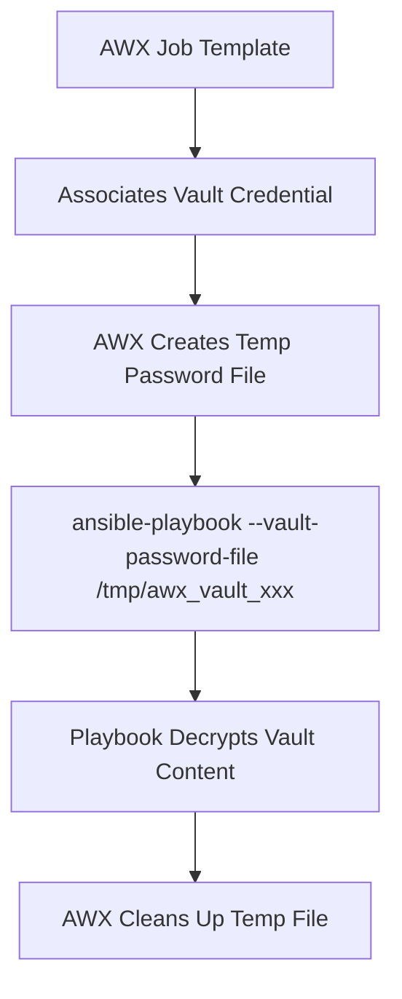
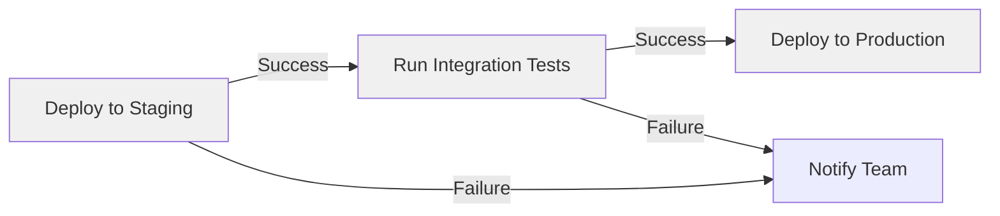

# How to Use Ansible Vault with AWX/Tower

Author: [nawazdhandala](https://www.github.com/nawazdhandala)

Tags: Ansible, Vault, AWX, Tower, Automation

Description: Learn how to integrate Ansible Vault encrypted files with AWX and Ansible Tower using credentials, surveys, and project configurations.

---

AWX (the open-source upstream of Red Hat Ansible Automation Platform, formerly Tower) provides a web-based interface and API for running Ansible playbooks. It has its own credential management system that works alongside Ansible Vault. Understanding how these two systems interact is important because AWX handles vault passwords differently than the command line. This guide covers how to configure AWX to decrypt vault-encrypted content in your playbooks and projects.

## How AWX Handles Vault Passwords

When you run a playbook from the command line, you pass `--vault-password-file` or `--ask-vault-pass`. AWX replaces this mechanism with its credential system. You create a "Vault" credential in AWX, and it automatically provides the vault password to `ansible-playbook` when it runs your job template.



## Creating a Vault Credential in AWX

### Through the Web Interface

1. Navigate to **Resources** > **Credentials**
2. Click **Add**
3. Set the credential type to **Vault**
4. Fill in the fields:
   - **Name**: A descriptive name (e.g., "Production Vault Password")
   - **Vault Password**: The actual vault password
   - **Vault Identifier**: The vault ID label (optional, for multi-password setups)

### Through the API

```bash
# Create a vault credential using the AWX API
curl -X POST "https://awx.example.com/api/v2/credentials/" \
  -H "Content-Type: application/json" \
  -H "Authorization: Bearer ${AWX_TOKEN}" \
  -d '{
    "name": "Production Vault Password",
    "credential_type": 3,
    "organization": 1,
    "inputs": {
      "vault_password": "your-vault-password-here",
      "vault_id": "prod"
    }
  }'
```

### Using the awx CLI

```bash
# Create a vault credential using the awx CLI tool
awx credentials create \
  --name "Production Vault Password" \
  --credential_type "Vault" \
  --organization "Default" \
  --inputs '{"vault_password": "your-vault-password-here", "vault_id": "prod"}'
```

## Attaching Vault Credentials to Job Templates

### Single Vault Password

For projects that use a single vault password:

```bash
# Create a job template with a vault credential
awx job_templates create \
  --name "Deploy Production" \
  --project "My Project" \
  --playbook "site.yml" \
  --inventory "Production" \
  --credential "Machine Credential" \
  --vault_credential "Production Vault Password"
```

Or through the API:

```bash
# Associate a vault credential with an existing job template
curl -X POST "https://awx.example.com/api/v2/job_templates/42/credentials/" \
  -H "Content-Type: application/json" \
  -H "Authorization: Bearer ${AWX_TOKEN}" \
  -d '{"id": 15}'
```

### Multiple Vault Passwords

AWX supports multiple vault credentials on a single job template, matching the multi-vault-ID command-line workflow:

```bash
# Create separate vault credentials for each environment
awx credentials create \
  --name "Dev Vault" \
  --credential_type "Vault" \
  --organization "Default" \
  --inputs '{"vault_password": "dev-password", "vault_id": "dev"}'

awx credentials create \
  --name "Staging Vault" \
  --credential_type "Vault" \
  --organization "Default" \
  --inputs '{"vault_password": "staging-password", "vault_id": "staging"}'

awx credentials create \
  --name "Prod Vault" \
  --credential_type "Vault" \
  --organization "Default" \
  --inputs '{"vault_password": "prod-password", "vault_id": "prod"}'
```

Associate all of them with the job template:

```bash
# Associate multiple vault credentials with a job template
# Each credential maps to a different vault ID
curl -X POST "https://awx.example.com/api/v2/job_templates/42/credentials/" \
  -H "Content-Type: application/json" \
  -H "Authorization: Bearer ${AWX_TOKEN}" \
  -d '{"id": 10}'  # Dev Vault credential ID

curl -X POST "https://awx.example.com/api/v2/job_templates/42/credentials/" \
  -H "Content-Type: application/json" \
  -H "Authorization: Bearer ${AWX_TOKEN}" \
  -d '{"id": 11}'  # Staging Vault credential ID

curl -X POST "https://awx.example.com/api/v2/job_templates/42/credentials/" \
  -H "Content-Type: application/json" \
  -H "Authorization: Bearer ${AWX_TOKEN}" \
  -d '{"id": 12}'  # Prod Vault credential ID
```

## Project Structure for AWX

AWX syncs your playbook project from a Git repository. Your vault-encrypted files live in the repository just as they would for command-line usage:

```
project-repo/
  site.yml
  group_vars/
    all/
      vars.yml
    production/
      vars.yml
      vault.yml          # encrypted with vault ID 'prod'
    staging/
      vars.yml
      vault.yml          # encrypted with vault ID 'staging'
  roles/
    webserver/
      tasks/main.yml
      vars/
        vault.yml        # encrypted with vault ID 'prod'
```

AWX pulls this repository, and when it runs the playbook, it uses the associated vault credentials to decrypt the vault files automatically.

## Using AWX Surveys Instead of Vault

For some use cases, AWX surveys can replace vault-encrypted variables entirely. Surveys prompt the user for input when launching a job, and survey answers can be marked as passwords (hidden and encrypted by AWX).

```json
{
  "name": "Database Deployment",
  "description": "Deploy database with credentials",
  "spec": [
    {
      "question_name": "Database Password",
      "question_description": "The password for the application database user",
      "variable": "db_password",
      "type": "password",
      "required": true,
      "min": 8,
      "max": 64
    },
    {
      "question_name": "API Key",
      "question_description": "The API key for the monitoring service",
      "variable": "monitoring_api_key",
      "type": "password",
      "required": true
    }
  ]
}
```

When the job runs, AWX sets these as extra variables. No vault encryption needed because AWX manages the secrets internally.

## Custom Credential Types

AWX lets you define custom credential types for specific integrations. For example, a custom credential for a cloud API key:

```yaml
# Custom credential type: Input configuration
fields:
  - id: api_key
    type: string
    label: API Key
    secret: true
  - id: api_endpoint
    type: string
    label: API Endpoint

# Custom credential type: Injector configuration
extra_vars:
  monitoring_api_key: '{{ api_key }}'
  monitoring_endpoint: '{{ api_endpoint }}'
```

This injects the API key as a variable without needing vault encryption. AWX encrypts the credential in its database.

## Migrating from CLI Vault to AWX Credentials

If you are moving from command-line Ansible to AWX:

1. **Keep your vault-encrypted files** in the Git repository. AWX can use them.
2. **Create vault credentials** in AWX matching your vault IDs.
3. **Associate credentials** with your job templates.
4. **Gradually move secrets** to AWX credentials/surveys if you want to reduce reliance on vault files.

You do not have to choose one or the other. AWX works with vault-encrypted files in your repository AND its own credential system simultaneously.

## RBAC for Vault Credentials

AWX has fine-grained access control for credentials:

```bash
# Grant a team access to use (but not see) a vault credential
awx roles grant \
  --type credential \
  --credential "Production Vault Password" \
  --team "Developers" \
  --role "Use"
```

Access levels:
- **Admin**: Can view, edit, and delete the credential
- **Use**: Can use the credential in job templates but cannot see the password
- **Read**: Can see the credential exists but cannot use or view the password

This is a significant advantage over command-line vault, where anyone with the password file has full access.

## Troubleshooting Vault in AWX

Common issues and solutions:

```
ERROR: Decryption failed (no vault secrets were found that could decrypt)
```
This means the vault credential is missing or the vault ID does not match. Check:
- Is a vault credential associated with the job template?
- Does the vault ID in the credential match the vault ID in the encrypted file header?

```
ERROR: Vault password file not found
```
AWX creates temporary vault password files automatically. This error usually indicates an AWX configuration problem rather than a vault problem.

To debug, check the job's output with verbosity set to 4 (maximum) in the job template settings. This shows the vault-related command-line arguments AWX passes to `ansible-playbook`.

## AWX Workflow Job Templates

For complex deployments that span multiple environments:



Each node in the workflow can use different vault credentials:
- "Deploy to Staging" uses the staging vault credential
- "Deploy to Production" uses the production vault credential

## Summary

AWX replaces the `--vault-password-file` flag with its credential system. Create vault credentials in AWX matching your vault IDs, associate them with job templates, and AWX handles the rest. You get RBAC for credential access, audit logging, and the ability to combine vault-encrypted files with AWX surveys and custom credentials. For teams already using AWX, this is the natural way to manage vault passwords rather than distributing password files.
