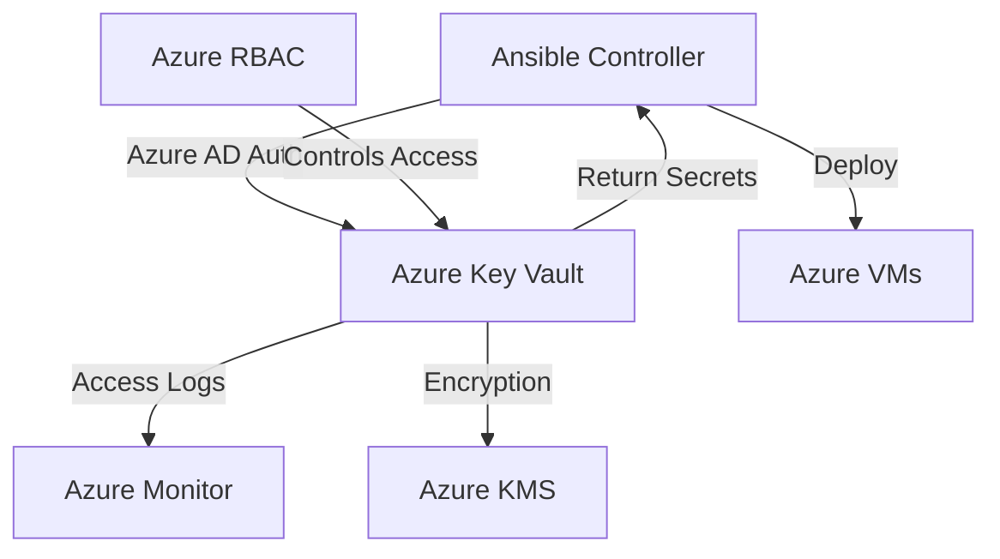

# How to Use Ansible Vault with Azure Key Vault

Author: [nawazdhandala](https://www.github.com/nawazdhandala)

Tags: Ansible, Azure, Key Vault, Security, Cloud

Description: Learn how to integrate Ansible with Azure Key Vault to securely retrieve secrets, keys, and certificates during playbook execution.

---

Azure Key Vault is Microsoft's cloud-based secrets management service. It stores secrets, encryption keys, and certificates with full access control through Azure Active Directory and RBAC. Integrating it with Ansible means your playbooks can pull secrets at runtime from a centralized, audited store rather than relying on encrypted files in your repository. This guide covers the setup, authentication, and practical usage patterns.

## Prerequisites

Install the Azure Ansible collection and required Python packages:

```bash
# Install the Azure collection for Ansible
ansible-galaxy collection install azure.azcollection

# Install required Python dependencies
pip install azure-identity azure-keyvault-secrets azure-mgmt-keyvault
```

You also need an Azure Key Vault instance:

```bash
# Create a resource group (if you don't have one)
az group create --name rg-ansible --location eastus

# Create a Key Vault
az keyvault create \
  --name my-ansible-keyvault \
  --resource-group rg-ansible \
  --location eastus \
  --enable-rbac-authorization true
```

## Storing Secrets in Azure Key Vault

Add secrets using the Azure CLI:

```bash
# Store a database password
az keyvault secret set \
  --vault-name my-ansible-keyvault \
  --name "db-password" \
  --value "ProductionDBPassword123"

# Store an API key
az keyvault secret set \
  --vault-name my-ansible-keyvault \
  --name "api-key" \
  --value "sk-live-abc123def456"

# Store a connection string
az keyvault secret set \
  --vault-name my-ansible-keyvault \
  --name "redis-connection" \
  --value "redis://:strongpassword@redis.example.com:6380/0?ssl=true"
```

## Authentication Methods

Azure Key Vault requires Azure AD authentication. There are several options for Ansible.

### Service Principal (Recommended for Automation)

Create a service principal and grant it access to the Key Vault:

```bash
# Create a service principal
az ad sp create-for-rbac \
  --name "ansible-automation" \
  --role "Key Vault Secrets User" \
  --scopes "/subscriptions/<sub-id>/resourceGroups/rg-ansible/providers/Microsoft.KeyVault/vaults/my-ansible-keyvault"
```

Set the credentials as environment variables:

```bash
# Set Azure authentication environment variables
export AZURE_CLIENT_ID="your-client-id"
export AZURE_SECRET="your-client-secret"
export AZURE_SUBSCRIPTION_ID="your-subscription-id"
export AZURE_TENANT="your-tenant-id"
```

### Managed Identity (For Azure VMs)

If Ansible runs on an Azure VM, use managed identity for passwordless authentication:

```bash
# Assign a managed identity to the VM
az vm identity assign \
  --resource-group rg-ansible \
  --name my-ansible-vm

# Grant the managed identity access to Key Vault
az role assignment create \
  --role "Key Vault Secrets User" \
  --assignee <managed-identity-principal-id> \
  --scope "/subscriptions/<sub-id>/resourceGroups/rg-ansible/providers/Microsoft.KeyVault/vaults/my-ansible-keyvault"
```

## Fetching Secrets with the azure_keyvault_secret Lookup

The Azure collection provides a lookup plugin for Key Vault secrets:

```yaml
# playbook.yml
# Retrieve secrets from Azure Key Vault at runtime
---
- name: Deploy with Azure Key Vault secrets
  hosts: webservers
  vars:
    keyvault_name: my-ansible-keyvault

  tasks:
    - name: Fetch database password from Key Vault
      ansible.builtin.set_fact:
        db_password: "{{ lookup('azure.azcollection.azure_keyvault_secret',
          'db-password',
          vault_url='https://' + keyvault_name + '.vault.azure.net'
        ) }}"

    - name: Fetch API key from Key Vault
      ansible.builtin.set_fact:
        api_key: "{{ lookup('azure.azcollection.azure_keyvault_secret',
          'api-key',
          vault_url='https://' + keyvault_name + '.vault.azure.net'
        ) }}"

    - name: Deploy application configuration
      ansible.builtin.template:
        src: app.conf.j2
        dest: /etc/myapp/app.conf
        mode: '0600'
      no_log: true
```

## Using the azure_rm_keyvaultsecret Module

For full CRUD operations on Key Vault secrets:

```yaml
# Read a secret using the module
- name: Get secret from Azure Key Vault
  azure.azcollection.azure_rm_keyvaultsecret_info:
    vault_uri: "https://my-ansible-keyvault.vault.azure.net"
    name: "db-password"
  register: kv_secret

- name: Use the retrieved secret
  ansible.builtin.debug:
    msg: "Secret value retrieved successfully"
  when: kv_secret.secrets | length > 0
```

You can also create or update secrets from Ansible:

```yaml
# Store a new secret in Key Vault
- name: Create a secret in Azure Key Vault
  azure.azcollection.azure_rm_keyvaultsecret:
    secret_name: "app-session-key"
    secret_value: "{{ lookup('password', '/dev/null length=32 chars=ascii_letters,digits') }}"
    keyvault_uri: "https://my-ansible-keyvault.vault.azure.net"
    tags:
      environment: production
      managed_by: ansible
```

## Complete Deployment Example

Here is a full playbook deploying a web application with secrets from Azure Key Vault:

```yaml
# deploy_azure.yml
# Full deployment using Azure Key Vault for secrets
---
- name: Deploy web application on Azure
  hosts: webservers
  vars:
    keyvault_url: "https://my-ansible-keyvault.vault.azure.net"
    app_name: customer-api

  tasks:
    - name: Fetch all application secrets
      ansible.builtin.set_fact:
        db_password: "{{ lookup('azure.azcollection.azure_keyvault_secret',
          'db-password', vault_url=keyvault_url) }}"
        redis_password: "{{ lookup('azure.azcollection.azure_keyvault_secret',
          'redis-password', vault_url=keyvault_url) }}"
        jwt_secret: "{{ lookup('azure.azcollection.azure_keyvault_secret',
          'jwt-secret', vault_url=keyvault_url) }}"
        smtp_password: "{{ lookup('azure.azcollection.azure_keyvault_secret',
          'smtp-password', vault_url=keyvault_url) }}"

    - name: Create application directory structure
      ansible.builtin.file:
        path: "{{ item }}"
        state: directory
        owner: appuser
        group: appuser
        mode: '0755'
      loop:
        - "/opt/{{ app_name }}"
        - "/opt/{{ app_name }}/config"
        - "/var/log/{{ app_name }}"

    - name: Deploy environment configuration
      ansible.builtin.template:
        src: dotenv.j2
        dest: "/opt/{{ app_name }}/.env"
        owner: appuser
        group: appuser
        mode: '0600'
      no_log: true
      notify: restart app

    - name: Deploy systemd service file
      ansible.builtin.template:
        src: app.service.j2
        dest: "/etc/systemd/system/{{ app_name }}.service"
        mode: '0644'
      notify:
        - reload systemd
        - restart app

  handlers:
    - name: reload systemd
      ansible.builtin.systemd:
        daemon_reload: true

    - name: restart app
      ansible.builtin.systemd:
        name: "{{ app_name }}"
        state: restarted
        enabled: true
```

The environment file template:

```jinja2
{# dotenv.j2 - Application environment variables #}
NODE_ENV=production
DB_HOST=proddb.postgres.database.azure.com
DB_PORT=5432
DB_USER=app_user
DB_PASSWORD={{ db_password }}
DB_NAME=app_production
DB_SSL=true
REDIS_URL=rediss://:{{ redis_password }}@prod-redis.redis.cache.windows.net:6380/0
JWT_SECRET={{ jwt_secret }}
SMTP_HOST=smtp.sendgrid.net
SMTP_USER=apikey
SMTP_PASSWORD={{ smtp_password }}
```

## Storing Ansible Vault Password in Azure Key Vault

If you want to keep using Ansible Vault encrypted files but store the password in Azure Key Vault:

```bash
#!/bin/bash
# vault_pass_azure.sh
# Retrieves Ansible Vault password from Azure Key Vault

KEYVAULT_NAME="my-ansible-keyvault"
SECRET_NAME="ansible-vault-password"

# Uses Azure CLI authentication (az login)
PASSWORD=$(az keyvault secret show \
  --vault-name "${KEYVAULT_NAME}" \
  --name "${SECRET_NAME}" \
  --query "value" \
  --output tsv 2>/dev/null)

if [ $? -ne 0 ] || [ -z "${PASSWORD}" ]; then
  echo "ERROR: Failed to retrieve vault password from Azure Key Vault" >&2
  exit 1
fi

echo "${PASSWORD}"
```

```bash
# Store the Ansible Vault password in Azure Key Vault
az keyvault secret set \
  --vault-name my-ansible-keyvault \
  --name "ansible-vault-password" \
  --value "your-ansible-vault-password"

# Use the script
chmod 700 vault_pass_azure.sh
ansible-playbook site.yml --vault-password-file ./vault_pass_azure.sh
```

## Architecture



## RBAC Best Practices

Azure Key Vault supports fine-grained RBAC. Use the most restrictive role possible:

| Role | Capabilities | Use Case |
|------|-------------|----------|
| Key Vault Secrets User | Read secrets only | Ansible deployment |
| Key Vault Secrets Officer | Full CRUD on secrets | Secret management automation |
| Key Vault Administrator | Full control | Initial setup only |

```bash
# Grant minimal read-only access to the Ansible service principal
az role assignment create \
  --role "Key Vault Secrets User" \
  --assignee "${AZURE_CLIENT_ID}" \
  --scope "/subscriptions/<sub-id>/resourceGroups/rg-ansible/providers/Microsoft.KeyVault/vaults/my-ansible-keyvault"
```

## Error Handling

Handle scenarios where secrets might not exist or authentication might fail:

```yaml
# Robust secret retrieval with error handling
- name: Try to fetch optional secret
  block:
    - name: Fetch secret
      ansible.builtin.set_fact:
        optional_secret: "{{ lookup('azure.azcollection.azure_keyvault_secret',
          'optional-feature-key', vault_url=keyvault_url) }}"
  rescue:
    - name: Set default when secret is missing
      ansible.builtin.set_fact:
        optional_secret: ""
    - name: Log the missing secret
      ansible.builtin.debug:
        msg: "Optional secret 'optional-feature-key' not found, using default"
```

## Summary

Azure Key Vault integrates naturally with Ansible through the `azure.azcollection` collection. Use managed identities for Azure-hosted Ansible controllers and service principals for external automation. The lookup plugin is the simplest way to fetch secrets at runtime, while the module provides full CRUD capabilities. Combined with Azure RBAC and monitoring, this gives you audited, access-controlled secrets management that scales with your Azure infrastructure.
