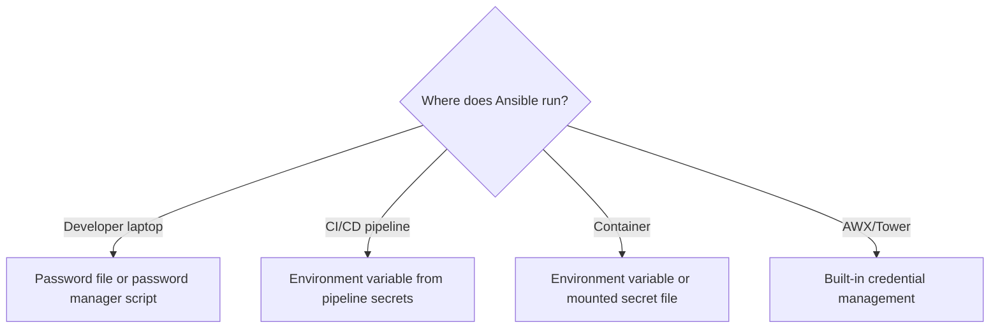

# How to Use Ansible Vault with Environment Variable Passwords

Author: [nawazdhandala](https://www.github.com/nawazdhandala)

Tags: Ansible, Vault, Security, Environment Variables, CI/CD

Description: Learn how to pass Ansible Vault passwords through environment variables for automated workflows and CI/CD pipeline integration.

---

Storing vault passwords in environment variables is one of the most practical approaches for automated workflows. It works naturally with CI/CD pipelines, container orchestration, and any situation where you cannot interactively type a password. This guide walks through the setup, common patterns, and pitfalls of using environment variables for Ansible Vault password delivery.

## Why Environment Variables?

Environment variables solve several problems at once. CI/CD platforms like Jenkins, GitLab CI, and GitHub Actions all have built-in mechanisms for injecting secrets as environment variables. Containers accept configuration through environment variables by convention. And unlike password files, environment variables leave no artifacts on disk that could be accidentally committed or left behind after a job finishes.

## The Basic Approach: A Password Script

Ansible Vault does not natively read passwords from environment variables. It reads from interactive prompts, password files, or executable scripts. To bridge the gap, you create a tiny script that reads the environment variable and outputs it to stdout.

```bash
#!/bin/bash
# vault_pass.sh - reads vault password from environment variable
# Ansible calls this script and captures stdout as the password

echo "${ANSIBLE_VAULT_PASS}"
```

Make it executable and use it:

```bash
# Make the script executable
chmod 700 vault_pass.sh

# Set the environment variable with your vault password
export ANSIBLE_VAULT_PASS="your-strong-password-here"

# Use the script as a vault password file
ansible-playbook site.yml --vault-password-file ./vault_pass.sh
```

## A More Robust Password Script

The basic version works, but a production script should validate that the variable is actually set:

```bash
#!/bin/bash
# vault_pass.sh - production-grade vault password script
# Exits with an error if the required environment variable is not set

if [ -z "${ANSIBLE_VAULT_PASS}" ]; then
  echo "ERROR: ANSIBLE_VAULT_PASS environment variable is not set" >&2
  exit 1
fi

echo "${ANSIBLE_VAULT_PASS}"
```

The error message goes to stderr (using `>&2`) so it does not get captured as the password. The non-zero exit code tells Ansible that the password retrieval failed.

## Configuring in ansible.cfg

Point your `ansible.cfg` at the script to avoid typing the flag every time:

```ini
# ansible.cfg
[defaults]
# Use the vault password script for all vault operations
vault_password_file = ./vault_pass.sh
```

Now set the environment variable and run:

```bash
export ANSIBLE_VAULT_PASS="your-strong-password-here"
ansible-playbook site.yml
```

## Multiple Environments with Separate Variables

For multi-environment setups, use different environment variables per vault ID:

```bash
#!/bin/bash
# vault_pass_dev.sh - reads dev vault password from environment
if [ -z "${VAULT_PASS_DEV}" ]; then
  echo "ERROR: VAULT_PASS_DEV not set" >&2
  exit 1
fi
echo "${VAULT_PASS_DEV}"
```

```bash
#!/bin/bash
# vault_pass_prod.sh - reads prod vault password from environment
if [ -z "${VAULT_PASS_PROD}" ]; then
  echo "ERROR: VAULT_PASS_PROD not set" >&2
  exit 1
fi
echo "${VAULT_PASS_PROD}"
```

Configure both in `ansible.cfg`:

```ini
# ansible.cfg
[defaults]
vault_identity_list = dev@./vault_pass_dev.sh, prod@./vault_pass_prod.sh
```

```bash
# Set both environment variables
export VAULT_PASS_DEV="dev-password"
export VAULT_PASS_PROD="prod-password"

# Run with automatic multi-environment vault decryption
ansible-playbook site.yml
```

## CI/CD Pipeline Examples

### GitHub Actions

```yaml
# .github/workflows/deploy.yml
name: Deploy with Ansible
on:
  push:
    branches: [main]

jobs:
  deploy:
    runs-on: ubuntu-latest
    steps:
      - uses: actions/checkout@v4

      - name: Install Ansible
        run: pip install ansible

      - name: Run Ansible Playbook
        env:
          # VAULT_PASSWORD is stored in GitHub repository secrets
          ANSIBLE_VAULT_PASS: ${{ secrets.VAULT_PASSWORD }}
        run: |
          chmod +x vault_pass.sh
          ansible-playbook site.yml --vault-password-file ./vault_pass.sh
```

### GitLab CI

```yaml
# .gitlab-ci.yml
deploy:
  stage: deploy
  image: python:3.11
  variables:
    # VAULT_PASSWORD is set in GitLab CI/CD variables (masked)
    ANSIBLE_VAULT_PASS: ${VAULT_PASSWORD}
  before_script:
    - pip install ansible
    - chmod +x vault_pass.sh
  script:
    - ansible-playbook site.yml --vault-password-file ./vault_pass.sh
```

### Jenkins Pipeline

```groovy
// Jenkinsfile
pipeline {
    agent any
    stages {
        stage('Deploy') {
            steps {
                // VAULT_PASSWORD is stored in Jenkins credentials
                withCredentials([string(credentialsId: 'ansible-vault-pass', variable: 'ANSIBLE_VAULT_PASS')]) {
                    sh '''
                        chmod +x vault_pass.sh
                        ansible-playbook site.yml --vault-password-file ./vault_pass.sh
                    '''
                }
            }
        }
    }
}
```

## Using a Python Script for Cross-Platform Compatibility

If your team works across Linux and macOS (or even Windows with WSL), a Python script avoids shell compatibility issues:

```python
#!/usr/bin/env python3
"""vault_pass.py - reads vault password from environment variable."""
import os
import sys

password = os.environ.get('ANSIBLE_VAULT_PASS')

if not password:
    print("ERROR: ANSIBLE_VAULT_PASS environment variable is not set", file=sys.stderr)
    sys.exit(1)

# Print password without trailing newline
print(password, end='')
```

```bash
chmod +x vault_pass.py
export ANSIBLE_VAULT_PASS="your-password"
ansible-playbook site.yml --vault-password-file ./vault_pass.py
```

## Security Considerations

Environment variables have some security properties you should understand.

Environment variables are visible to anyone who can inspect the process environment. On Linux, the `/proc/<pid>/environ` file exposes them. Any process running as the same user (or root) can read them.

```bash
# Demonstrating that environment variables can be read from /proc
# This is why you should restrict access to the machine running Ansible
cat /proc/$$/environ | tr '\0' '\n' | grep ANSIBLE_VAULT_PASS
```

To mitigate this:

1. Run Ansible in isolated environments (containers, dedicated CI runners).
2. Limit who has SSH access to the machines where Ansible runs.
3. Clear the variable after use in scripts:

```bash
# Clear the password from the environment after use
unset ANSIBLE_VAULT_PASS
```

4. In CI/CD, use the platform's secret masking feature to prevent the password from appearing in logs.

## Environment Variable vs. Other Methods

Here is a comparison to help you decide when environment variables are the right choice:



Environment variables are the sweet spot for CI/CD and containerized execution. For developer workstations, a password file or password manager integration is usually more convenient. For AWX or Tower, use their built-in credential management instead.

## Debugging Environment Variable Issues

When things go wrong, these checks help isolate the problem:

```bash
# Verify the environment variable is set (without printing the actual value)
if [ -n "${ANSIBLE_VAULT_PASS}" ]; then
  echo "ANSIBLE_VAULT_PASS is set (length: ${#ANSIBLE_VAULT_PASS})"
else
  echo "ANSIBLE_VAULT_PASS is NOT set"
fi

# Test the password script directly
./vault_pass.sh
# Should output the password. If it outputs nothing or an error, fix the script.

# Run Ansible with verbose output to see vault-related messages
ansible-playbook site.yml --vault-password-file ./vault_pass.sh -vvv
```

## Summary

Environment variables provide a clean way to deliver vault passwords in automated pipelines. The pattern is simple: store the password in an environment variable, write a small script that echoes it to stdout, and point Ansible at that script. This works consistently across all major CI/CD platforms and containerized environments. Just remember that environment variables are not invisible to other processes on the same machine, so pair this approach with proper access controls on the execution environment.
