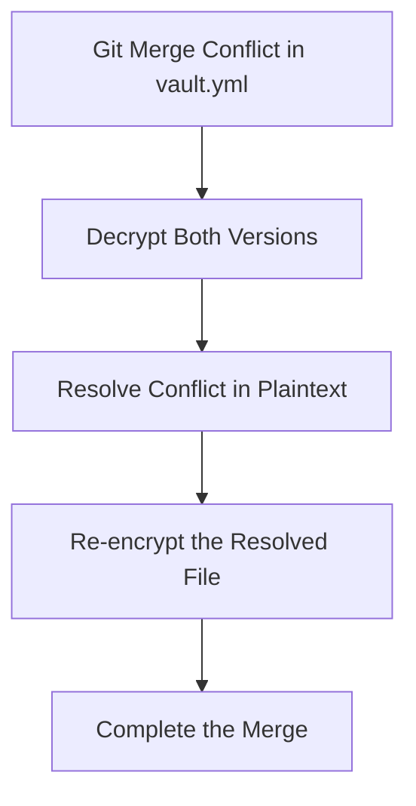
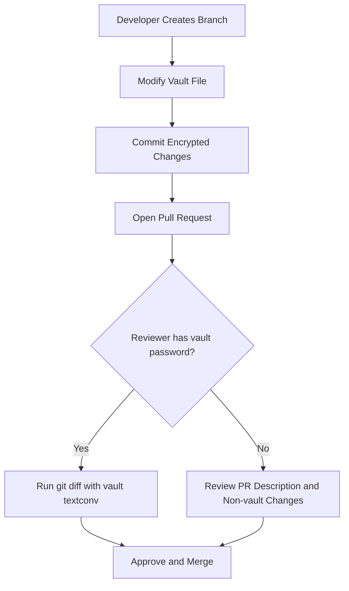

# How to Use Ansible Vault with Git for Team Collaboration

Author: [nawazdhandala](https://www.github.com/nawazdhandala)

Tags: Ansible, Vault, Git, Team Collaboration, DevOps

Description: Learn best practices for managing Ansible Vault encrypted files in Git repositories so teams can collaborate on infrastructure code securely.

---

Committing vault-encrypted files to Git is how most teams share Ansible secrets. The encrypted content is safe to store in version control because it is just AES-256 encrypted text. But there are practical challenges: diffs are useless on encrypted files, merge conflicts are painful, and the vault password distribution itself needs careful handling. This guide covers the workflows and tooling that make Ansible Vault and Git work well together for teams.

## Why Vault-Encrypted Files in Git Work

Vault-encrypted files are plain text (base64-encoded encrypted data with a header). Git handles them perfectly well. They are not binary blobs. The encrypted text diffs, merges, and transfers over the wire just like any other text file.

The real question is not whether to put them in Git, but how to organize them so your team stays productive.

## Recommended Repository Structure

Separate encrypted values from plaintext configuration. This is the single most important structural decision:

```
project/
  ansible.cfg
  site.yml
  .gitignore
  vault_pass.sh             # committed (contains no secrets)
  group_vars/
    all/
      vars.yml              # plaintext shared config
    dev/
      vars.yml              # plaintext dev config
      vault.yml             # vault-encrypted dev secrets
    staging/
      vars.yml              # plaintext staging config
      vault.yml             # vault-encrypted staging secrets
    prod/
      vars.yml              # plaintext prod config
      vault.yml             # vault-encrypted prod secrets
```

The `vars.yml` files are fully readable and diffable. The `vault.yml` files contain encrypted secrets. Both are committed.

## Essential .gitignore Configuration

Keep sensitive files out of the repository:

```gitignore
# .gitignore

# Never commit plain text vault password files
*.vault_pass
.vault_pass*
vault_pass.txt
vault_password*

# Never commit temporary decrypted files
*.decrypted
*.plain

# Ignore editor backup files that might contain decrypted content
*~
*.swp
*.swo
*.bak

# Ignore any .env files with credentials
.env
.env.*
```

## Setting Up Git Diff for Vault Files

By default, `git diff` shows the raw encrypted text, which is meaningless. Configure Git to show decrypted diffs instead:

```bash
# Add to your project's .gitattributes file
# This tells Git to use the 'ansible-vault' diff driver for vault.yml files
echo "*/vault.yml diff=ansible-vault" >> .gitattributes
```

Then configure the diff driver in your Git config:

```bash
# Configure the ansible-vault diff driver (per-user)
git config --global diff.ansible-vault.textconv "ansible-vault view"

# Or configure it per-repository
git config diff.ansible-vault.textconv "ansible-vault view"
```

Now `git diff` and `git log -p` will show the decrypted content for vault files, making code reviews actually useful:

```bash
# This now shows meaningful diffs for vault-encrypted files
git diff HEAD~1 group_vars/prod/vault.yml
```

For this to work, you need the vault password available (via `ansible.cfg` or environment variable).

## Handling Merge Conflicts

Merge conflicts in vault-encrypted files cannot be resolved by editing the encrypted text directly. Here is the workflow:



Step by step:

```bash
# When a merge conflict occurs in a vault file:

# Step 1: Save both versions
git show :2:group_vars/prod/vault.yml > /tmp/vault_ours.yml
git show :3:group_vars/prod/vault.yml > /tmp/vault_theirs.yml

# Step 2: Decrypt both versions
ansible-vault decrypt --vault-password-file vault_pass.sh /tmp/vault_ours.yml
ansible-vault decrypt --vault-password-file vault_pass.sh /tmp/vault_theirs.yml

# Step 3: Resolve the conflict manually in plaintext
# Compare and merge the two decrypted files
diff /tmp/vault_ours.yml /tmp/vault_theirs.yml
# Edit to create the correct merged version
vi /tmp/vault_ours.yml

# Step 4: Re-encrypt and replace the conflicted file
ansible-vault encrypt --vault-password-file vault_pass.sh /tmp/vault_ours.yml
cp /tmp/vault_ours.yml group_vars/prod/vault.yml

# Step 5: Stage and complete the merge
git add group_vars/prod/vault.yml
git merge --continue

# Step 6: Clean up
rm /tmp/vault_ours.yml /tmp/vault_theirs.yml
```

## Custom Git Merge Driver for Vault Files

Automate conflict resolution with a custom merge driver:

```bash
#!/bin/bash
# vault_merge_driver.sh
# Custom Git merge driver for Ansible Vault files
# Usage in .git/config: [merge "ansible-vault"] driver = ./vault_merge_driver.sh %O %A %B

BASE="$1"    # Common ancestor
OURS="$2"    # Our version
THEIRS="$3"  # Their version

VAULT_PASS_FILE="$(git rev-parse --show-toplevel)/vault_pass.sh"

# Decrypt all three versions
ansible-vault decrypt --vault-password-file "${VAULT_PASS_FILE}" "${BASE}" 2>/dev/null
ansible-vault decrypt --vault-password-file "${VAULT_PASS_FILE}" "${OURS}" 2>/dev/null
ansible-vault decrypt --vault-password-file "${VAULT_PASS_FILE}" "${THEIRS}" 2>/dev/null

# Use standard text merge on decrypted content
git merge-file "${OURS}" "${BASE}" "${THEIRS}"
MERGE_STATUS=$?

# Re-encrypt the result
ansible-vault encrypt --vault-password-file "${VAULT_PASS_FILE}" "${OURS}" 2>/dev/null

exit ${MERGE_STATUS}
```

Register the merge driver:

```bash
# .gitattributes
*/vault.yml merge=ansible-vault

# .git/config (or global git config)
# [merge "ansible-vault"]
#     driver = ./vault_merge_driver.sh %O %A %B
```

## Pre-commit Hooks

Prevent accidental commits of plaintext secrets:

```bash
#!/bin/bash
# .git/hooks/pre-commit
# Prevents committing unencrypted files that should be vault-encrypted

VAULT_FILES=$(git diff --cached --name-only | grep "vault\.yml$")

for file in ${VAULT_FILES}; do
  if [ -f "${file}" ]; then
    header=$(head -1 "${file}")
    if [[ "${header}" != '$ANSIBLE_VAULT'* ]]; then
      echo "ERROR: ${file} is not vault-encrypted!"
      echo "Run: ansible-vault encrypt ${file}"
      exit 1
    fi
  fi
done

# Also check for accidentally staged password files
PASS_FILES=$(git diff --cached --name-only | grep -i "vault.pass\|vault_pass\|\.vault_pass")
if [ -n "${PASS_FILES}" ]; then
  echo "ERROR: Attempting to commit vault password files:"
  echo "${PASS_FILES}"
  echo "These files should NEVER be committed."
  exit 1
fi
```

Make the hook executable:

```bash
chmod +x .git/hooks/pre-commit
```

## Distributing Vault Passwords to Team Members

The vault password itself should never be in Git. Here are common distribution methods:

**Team Password Manager**: Store the vault password in 1Password, Bitwarden, or LastPass. Team members retrieve it and create their local password file.

**GPG-Encrypted Password File**: Encrypt the vault password with each team member's GPG key and commit the encrypted file. (See the GPG + Ansible Vault guide for details.)

**Onboarding Script**: Create a script that sets up the vault password for new team members:

```bash
#!/bin/bash
# setup_vault.sh
# Run this after cloning the repository

echo "Enter the Ansible Vault password (get it from the team password manager):"
read -s VAULT_PASS

echo "${VAULT_PASS}" > .vault_pass
chmod 600 .vault_pass

echo "Vault password configured. Verify by running:"
echo "  ansible-vault view group_vars/dev/vault.yml"
```

## Pull Request Workflow



In the PR description, explain what secrets changed and why. Reviewers who have the vault password can use the configured diff driver to see the actual changes. Reviewers without it can still review the structural changes in `vars.yml`.

## Branch Protection Considerations

If your vault-encrypted files change frequently, consider these branch protection settings:

1. Require PR reviews for changes to `vault.yml` files
2. Run CI/CD that verifies vault decryption works (a canary test)
3. Require the Ansible lint check to pass before merge

```yaml
# .github/workflows/vault-check.yml
# CI check that verifies vault files can be decrypted
name: Vault Integrity Check
on: pull_request

jobs:
  check:
    runs-on: ubuntu-latest
    steps:
      - uses: actions/checkout@v4
      - run: pip install ansible
      - name: Verify vault files decrypt successfully
        env:
          ANSIBLE_VAULT_PASSWORD: ${{ secrets.VAULT_PASSWORD }}
        run: |
          chmod +x vault_pass.sh
          for f in $(grep -rl '^\$ANSIBLE_VAULT' --include="*.yml" .); do
            echo "Checking: $f"
            ansible-vault view --vault-password-file ./vault_pass.sh "$f" > /dev/null
          done
          echo "All vault files verified."
```

## Summary

Ansible Vault and Git work well together with the right setup. Separate encrypted and plaintext files. Configure Git diff drivers for meaningful code reviews. Use pre-commit hooks to prevent accidents. Distribute vault passwords through a password manager, not through Git. And when merge conflicts happen (they will), follow the decrypt-resolve-re-encrypt workflow rather than trying to edit encrypted text. These practices let teams collaborate on infrastructure code with secrets without compromising security or developer productivity.
