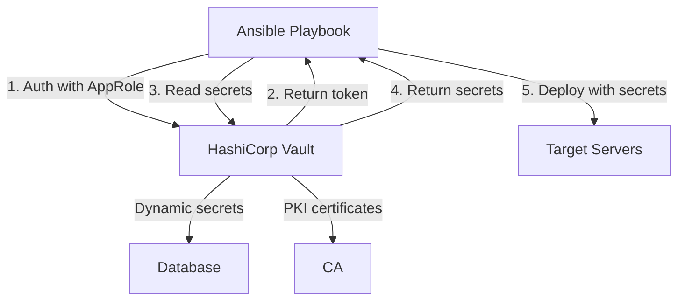

# How to Use Ansible Vault with HashiCorp Vault

Author: [nawazdhandala](https://www.github.com/nawazdhandala)

Tags: Ansible, HashiCorp Vault, Security, Secrets Management

Description: Learn how to integrate Ansible with HashiCorp Vault to pull secrets dynamically at runtime instead of storing them in encrypted files.

---

Ansible Vault and HashiCorp Vault are two different tools that solve related but distinct problems. Ansible Vault encrypts files and strings at rest using symmetric encryption. HashiCorp Vault is a dedicated secrets management server with access control, audit logging, dynamic secrets, and secret rotation. Using them together gives you the best of both worlds: HashiCorp Vault manages your secrets centrally, and Ansible pulls them at runtime during playbook execution.

## Two Integration Patterns

There are two main ways to combine Ansible with HashiCorp Vault:

1. **Use HashiCorp Vault to store the Ansible Vault password.** This keeps your existing vault-encrypted files but pulls the decryption password from HashiCorp Vault instead of a file.

2. **Use HashiCorp Vault directly in playbooks.** Skip Ansible Vault encryption entirely and fetch secrets from HashiCorp Vault at runtime using the `hashi_vault` lookup plugin.

Both patterns have their place, and many teams use a combination.

## Pattern 1: HashiCorp Vault Stores the Ansible Vault Password

This is the simpler integration. Your Ansible-vault-encrypted files stay as they are, but the vault password is stored in HashiCorp Vault instead of a local file.

First, store the Ansible Vault password in HashiCorp Vault:

```bash
# Store the Ansible Vault password in HashiCorp Vault's KV secrets engine
vault kv put secret/ansible/vault-password value="your-ansible-vault-password"
```

Then create a password script that retrieves it:

```bash
#!/bin/bash
# vault_pass_hcv.sh
# Retrieves the Ansible Vault password from HashiCorp Vault
# Requires: VAULT_ADDR and VAULT_TOKEN environment variables

if [ -z "${VAULT_ADDR}" ] || [ -z "${VAULT_TOKEN}" ]; then
  echo "ERROR: VAULT_ADDR and VAULT_TOKEN must be set" >&2
  exit 1
fi

# Fetch the password from HashiCorp Vault KV v2 engine
PASSWORD=$(vault kv get -field=value secret/ansible/vault-password 2>/dev/null)

if [ $? -ne 0 ] || [ -z "${PASSWORD}" ]; then
  echo "ERROR: Failed to retrieve Ansible Vault password from HashiCorp Vault" >&2
  exit 1
fi

echo "${PASSWORD}"
```

```bash
chmod 700 vault_pass_hcv.sh

# Set HashiCorp Vault connection details
export VAULT_ADDR="https://vault.example.com:8200"
export VAULT_TOKEN="hvs.your-vault-token"

# Use with Ansible
ansible-playbook site.yml --vault-password-file ./vault_pass_hcv.sh
```

## Pattern 2: Fetching Secrets Directly from HashiCorp Vault

The `community.hashi_vault` collection provides lookup plugins and modules that fetch secrets directly from HashiCorp Vault during playbook execution. This eliminates the need for Ansible Vault encryption entirely for those secrets.

Install the collection:

```bash
# Install the HashiCorp Vault collection for Ansible
ansible-galaxy collection install community.hashi_vault

# Also install the required Python library
pip install hvac
```

## Basic Lookup Plugin Usage

The simplest way to fetch a secret:

```yaml
# playbook.yml
# Fetches database credentials from HashiCorp Vault at runtime
---
- name: Deploy application with secrets from HashiCorp Vault
  hosts: webservers
  vars:
    vault_addr: "https://vault.example.com:8200"

  tasks:
    - name: Get database password from HashiCorp Vault
      ansible.builtin.set_fact:
        db_password: "{{ lookup('community.hashi_vault.hashi_vault',
          'secret/data/database/production:password',
          url=vault_addr,
          token=lookup('env', 'VAULT_TOKEN')
        ) }}"

    - name: Deploy database configuration
      ansible.builtin.template:
        src: db_config.j2
        dest: /etc/myapp/db.conf
        mode: '0600'
```

## Authentication Methods

HashiCorp Vault supports many authentication methods. Here are the most common ones used with Ansible.

### Token Authentication

```yaml
# Using a token from an environment variable
- name: Fetch secret using token auth
  ansible.builtin.debug:
    msg: "{{ lookup('community.hashi_vault.hashi_vault',
      'secret/data/myapp/config:api_key',
      url='https://vault.example.com:8200',
      token=lookup('env', 'VAULT_TOKEN')
    ) }}"
```

### AppRole Authentication

AppRole is the recommended method for machine-to-machine authentication:

```yaml
# Using AppRole auth (common for CI/CD and automation)
- name: Fetch secret using AppRole auth
  ansible.builtin.debug:
    msg: "{{ lookup('community.hashi_vault.hashi_vault',
      'secret/data/myapp/config:api_key',
      url='https://vault.example.com:8200',
      auth_method='approle',
      role_id=lookup('env', 'VAULT_ROLE_ID'),
      secret_id=lookup('env', 'VAULT_SECRET_ID')
    ) }}"
```

### AWS IAM Authentication

For Ansible running on AWS infrastructure:

```yaml
# Using AWS IAM auth (no credentials to manage)
- name: Fetch secret using AWS IAM auth
  ansible.builtin.debug:
    msg: "{{ lookup('community.hashi_vault.hashi_vault',
      'secret/data/myapp/config:api_key',
      url='https://vault.example.com:8200',
      auth_method='aws_iam',
      role_id='my-ansible-role'
    ) }}"
```

## Fetching Multiple Secrets

Rather than making individual lookups for each secret, fetch entire secret paths:

```yaml
# Fetch all key-value pairs from a single secret path
- name: Get all database secrets at once
  ansible.builtin.set_fact:
    db_secrets: "{{ lookup('community.hashi_vault.hashi_vault',
      'secret/data/database/production',
      url='https://vault.example.com:8200',
      token=lookup('env', 'VAULT_TOKEN')
    ) }}"

# Use individual values from the fetched secret
- name: Configure database connection
  ansible.builtin.template:
    src: db.conf.j2
    dest: /etc/myapp/db.conf
    mode: '0600'
  vars:
    db_host: "{{ db_secrets.host }}"
    db_port: "{{ db_secrets.port }}"
    db_user: "{{ db_secrets.username }}"
    db_pass: "{{ db_secrets.password }}"
```

## Using the hashi_vault_secret Module

For a more structured approach, use the module instead of the lookup plugin:

```yaml
# Using the vault_read module for better error handling
- name: Read database credentials from Vault
  community.hashi_vault.vault_read:
    url: "https://vault.example.com:8200"
    path: "secret/data/database/production"
    auth_method: token
    token: "{{ lookup('env', 'VAULT_TOKEN') }}"
  register: db_secret

- name: Display fetched credentials (for debugging only)
  ansible.builtin.debug:
    msg: "DB user: {{ db_secret.data.data.username }}"
```

## Dynamic Secrets

One of HashiCorp Vault's most powerful features is dynamic secrets. Instead of storing static credentials, Vault generates short-lived credentials on demand:

```yaml
# Generate dynamic database credentials
# Vault creates a temporary user with a TTL
- name: Generate dynamic PostgreSQL credentials
  community.hashi_vault.vault_read:
    url: "https://vault.example.com:8200"
    path: "database/creds/readonly"
    auth_method: token
    token: "{{ lookup('env', 'VAULT_TOKEN') }}"
  register: dynamic_db_creds

- name: Configure application with dynamic credentials
  ansible.builtin.template:
    src: app_config.j2
    dest: /etc/myapp/config.yml
    mode: '0600'
  vars:
    db_user: "{{ dynamic_db_creds.data.username }}"
    db_pass: "{{ dynamic_db_creds.data.password }}"
    # These credentials expire after the lease TTL
    db_lease_id: "{{ dynamic_db_creds.data.lease_id }}"
```

## Complete Playbook Example

Here is a full playbook that ties everything together:

```yaml
# deploy_with_vault.yml
# Full deployment using HashiCorp Vault for all secrets
---
- name: Deploy application with HashiCorp Vault integration
  hosts: webservers
  vars:
    vault_url: "https://vault.example.com:8200"
    vault_token: "{{ lookup('env', 'VAULT_TOKEN') }}"

  tasks:
    - name: Fetch application secrets from Vault
      community.hashi_vault.vault_read:
        url: "{{ vault_url }}"
        path: "secret/data/myapp/{{ env }}"
        auth_method: token
        token: "{{ vault_token }}"
      register: app_secrets

    - name: Fetch TLS certificate from Vault
      community.hashi_vault.vault_read:
        url: "{{ vault_url }}"
        path: "pki/issue/webserver"
        auth_method: token
        token: "{{ vault_token }}"
      register: tls_cert

    - name: Deploy application configuration
      ansible.builtin.template:
        src: app.conf.j2
        dest: /etc/myapp/app.conf
        mode: '0600'
      vars:
        app_config: "{{ app_secrets.data.data }}"

    - name: Deploy TLS certificate
      ansible.builtin.copy:
        content: "{{ tls_cert.data.data.certificate }}"
        dest: /etc/ssl/certs/myapp.crt
        mode: '0644'

    - name: Deploy TLS private key
      ansible.builtin.copy:
        content: "{{ tls_cert.data.data.private_key }}"
        dest: /etc/ssl/private/myapp.key
        mode: '0600'
      no_log: true

    - name: Restart application
      ansible.builtin.systemd:
        name: myapp
        state: restarted
```

## Architecture Overview



## When to Use Which Approach

Use Ansible Vault (with HashiCorp Vault storing the password) when:
- You have existing vault-encrypted files and want to improve password management
- Your secrets do not change often
- You want to keep secrets in git alongside your code

Use HashiCorp Vault lookup plugins when:
- You want dynamic, short-lived secrets
- You need audit logging of secret access
- You want centralized secret management across multiple tools
- You need secret rotation without redeploying configuration

Both approaches work together. Many teams use Ansible Vault for less sensitive configuration and HashiCorp Vault for critical production secrets like database credentials and TLS certificates.
