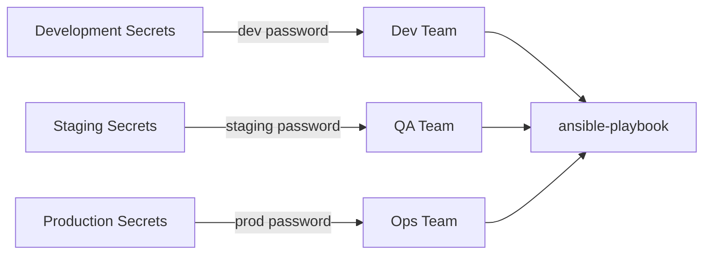

# How to Use Ansible Vault with Multiple Passwords

Author: [nawazdhandala](https://www.github.com/nawazdhandala)

Tags: Ansible, Vault, Security, Multi-Environment

Description: Learn how to manage multiple Ansible Vault passwords for different environments, teams, and sensitivity levels in your infrastructure.

---

Real-world infrastructure rarely gets by with a single vault password. You probably have separate passwords for development, staging, and production environments. Your database team might manage their own secrets independently from the application team. Ansible supports multiple vault passwords through the vault ID system, and understanding how to set this up properly can save you from the headache of sharing a single password across too many people and systems.

## Why Multiple Passwords Matter

A single vault password shared across all environments creates several problems. Everyone who needs access to dev secrets also gets access to production secrets. If one password leaks, everything is compromised. You cannot revoke access for one team without affecting everyone else.

Multiple passwords let you segment access based on environment, team, or sensitivity level:



## Vault IDs: The Foundation of Multiple Passwords

Vault IDs are labels attached to encrypted content. When you encrypt something with a vault ID, Ansible stores that label in the encrypted file header, so it knows which password to use for decryption.

```bash
# Encrypt a file with the 'dev' vault ID
ansible-vault encrypt --vault-id dev@prompt secrets_dev.yml

# Encrypt a file with the 'prod' vault ID
ansible-vault encrypt --vault-id prod@prompt secrets_prod.yml
```

The `@prompt` suffix tells Ansible to ask for the password interactively. You can replace it with a path to a password file.

## Setting Up Password Files Per Environment

Create separate password files for each environment:

```bash
# Create password files for each environment
# In production, generate strong random passwords
echo "dev-vault-password-2024" > ~/.vault_pass_dev
echo "staging-vault-password-2024" > ~/.vault_pass_staging
echo "prod-vault-password-2024" > ~/.vault_pass_prod

# Lock down permissions
chmod 600 ~/.vault_pass_dev ~/.vault_pass_staging ~/.vault_pass_prod
```

Now encrypt your environment-specific variable files:

```bash
# Encrypt dev secrets with the dev vault ID
ansible-vault encrypt \
  --vault-id dev@~/.vault_pass_dev \
  group_vars/dev/vault.yml

# Encrypt staging secrets with the staging vault ID
ansible-vault encrypt \
  --vault-id staging@~/.vault_pass_staging \
  group_vars/staging/vault.yml

# Encrypt production secrets with the prod vault ID
ansible-vault encrypt \
  --vault-id prod@~/.vault_pass_prod \
  group_vars/prod/vault.yml
```

## Running Playbooks with Multiple Vault IDs

When your playbook touches multiple environments, supply all relevant vault IDs:

```bash
# Provide multiple vault IDs on the command line
# Ansible will try each password against each encrypted blob
ansible-playbook site.yml \
  --vault-id dev@~/.vault_pass_dev \
  --vault-id staging@~/.vault_pass_staging \
  --vault-id prod@~/.vault_pass_prod
```

Ansible matches vault IDs by label. When it encounters encrypted content labeled `prod`, it uses the password associated with the `prod` vault ID. If no vault ID matches, it falls back to trying all available passwords.

## Configuring Vault IDs in ansible.cfg

Typing multiple `--vault-id` flags every time gets old fast. Configure them in `ansible.cfg`:

```ini
# ansible.cfg
[defaults]
# Comma-separated list of vault identity sources
vault_identity_list = dev@~/.vault_pass_dev, staging@~/.vault_pass_staging, prod@~/.vault_pass_prod
```

With this configuration, you can run playbooks without specifying vault passwords on the command line:

```bash
# No --vault-id flags needed, ansible.cfg provides them
ansible-playbook site.yml
```

## Organizing Secrets by Environment

A clean project structure separates secrets by environment:

```
project/
  ansible.cfg
  site.yml
  group_vars/
    all/
      vars.yml              # shared plaintext config
    dev/
      vars.yml              # dev-specific plaintext config
      vault.yml             # encrypted with vault ID 'dev'
    staging/
      vars.yml              # staging-specific plaintext config
      vault.yml             # encrypted with vault ID 'staging'
    prod/
      vars.yml              # production-specific plaintext config
      vault.yml             # encrypted with vault ID 'prod'
```

Each `vault.yml` is encrypted with its environment-specific vault ID:

```yaml
# group_vars/prod/vault.yml (before encryption)
# These values will be encrypted with the 'prod' vault ID
vault_db_password: "production-db-strong-password"
vault_api_key: "prod-api-key-value"
vault_redis_password: "prod-redis-password"
```

The corresponding `vars.yml` references the vault variables:

```yaml
# group_vars/prod/vars.yml (plaintext, always readable)
db_host: prod-db.internal.example.com
db_port: 5432
db_name: app_production
db_password: "{{ vault_db_password }}"
api_key: "{{ vault_api_key }}"
redis_password: "{{ vault_redis_password }}"
```

## Mixing Vault IDs with Inline Encrypted Strings

You can use vault IDs with inline encrypted strings too:

```bash
# Create an inline encrypted string with the prod vault ID
ansible-vault encrypt_string \
  --vault-id prod@~/.vault_pass_prod \
  'RealProductionPassword' \
  --name 'vault_db_password'
```

The resulting encrypted blob includes the vault ID in its header:

```yaml
vault_db_password: !vault |
          $ANSIBLE_VAULT;1.2;AES256;prod
          ...encrypted payload...
```

## Team-Based Password Segmentation

Beyond environments, you can segment by team responsibility:

```bash
# DBA team manages database credentials
ansible-vault encrypt \
  --vault-id dba@~/.vault_pass_dba \
  roles/database/vars/vault.yml

# Security team manages TLS certificates
ansible-vault encrypt \
  --vault-id security@~/.vault_pass_security \
  roles/tls/vars/vault.yml

# App team manages application secrets
ansible-vault encrypt \
  --vault-id app@~/.vault_pass_app \
  roles/webapp/vars/vault.yml
```

Each team only needs their own vault password. The operations team running the full playbook needs all passwords configured in their `ansible.cfg`.

## Handling the Default Vault ID

Files encrypted without a vault ID (the older way, before vault IDs existed) use the `default` vault ID internally. You can still work with them alongside labeled vault IDs:

```bash
# This handles legacy vault files plus new vault-ID-labeled files
ansible-playbook site.yml \
  --vault-id default@~/.vault_pass_legacy \
  --vault-id prod@~/.vault_pass_prod
```

## Password Priority and Fallback Behavior

When Ansible encounters encrypted content, it follows this logic:

1. If the encrypted content has a vault ID label, Ansible tries the password with the matching vault ID first.
2. If that fails (or there is no matching vault ID), Ansible tries all available passwords in the order they were provided.
3. If no password succeeds, Ansible raises a decryption error.

This fallback behavior means that even slightly misconfigured vault IDs will usually still work, but it can mask configuration problems. Run with `-v` to see which vault ID Ansible uses for each decryption:

```bash
# Verbose output shows vault ID matching details
ansible-playbook site.yml -v
```

## Security Considerations

When using multiple vault passwords, keep these guidelines in mind:

Never store password files in the repository. Add them to `.gitignore`:

```gitignore
# .gitignore
# Never commit vault password files
.vault_pass_*
*.vault_pass
vault_password_*
```

Use different passwords that are genuinely independent. If your dev and prod passwords are just variations of each other (like "password-dev" and "password-prod"), you lose much of the security benefit.

Document which vault IDs exist and who has access to each. A simple table in your project's internal documentation helps:

| Vault ID | Purpose | Access |
|----------|---------|--------|
| dev | Development secrets | All developers |
| staging | Staging secrets | Dev leads + QA |
| prod | Production secrets | Ops team only |
| dba | Database credentials | DBA team + Ops |

Multiple vault passwords add a layer of access control that a single password simply cannot provide. Combined with vault IDs, you get labeled, segmented secret management that scales with your organization.
