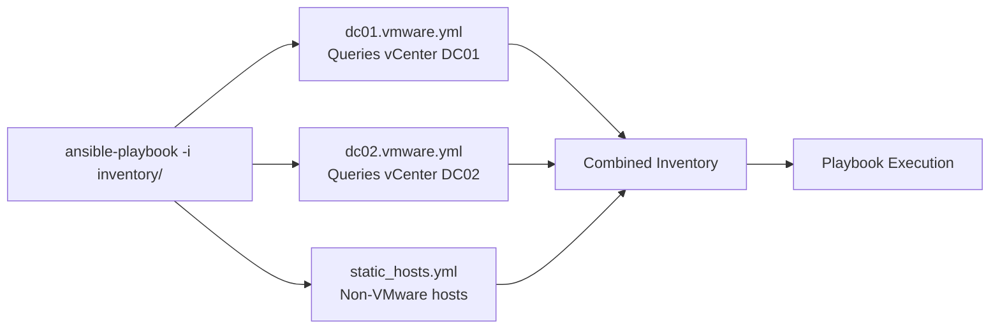

# How to Use Ansible VMware Dynamic Inventory

Author: [nawazdhandala](https://www.github.com/nawazdhandala)

Tags: Ansible, VMware, Dynamic Inventory, vSphere, Automation

Description: Learn how to set up and configure the Ansible VMware dynamic inventory plugin to automatically discover VMs and build inventory from vCenter.

---

Static inventory files work until they do not. When VMs are created, destroyed, and moved regularly, keeping a static inventory in sync with reality becomes a full-time job. The VMware dynamic inventory plugin for Ansible queries vCenter directly and builds the inventory on the fly, so you always have an accurate, up-to-date picture of your VMs. In this guide, I will walk through setting up the plugin, configuring grouping and filtering, and using it effectively in playbooks.

## Why Dynamic Inventory

With static inventory, you maintain a file that lists every host.

```ini
# Static inventory - manual updates required
[webservers]
10.100.1.10
10.100.1.11
10.100.1.12

[databases]
10.100.1.20
```

Every time someone creates or destroys a VM, this file needs updating. With dynamic inventory, the plugin queries vCenter and builds the inventory automatically. New VMs appear immediately, destroyed VMs disappear.

## Setting Up the VMware Inventory Plugin

First, install the required dependencies.

```bash
# Install the VMware collection and Python dependencies
pip install ansible-core pyVmomi
ansible-galaxy collection install community.vmware
```

## Basic Inventory Configuration

Create an inventory file with the `.vmware.yml` or `.vmware.yaml` extension. The extension tells Ansible to use the VMware inventory plugin.

```yaml
# inventory/vmware_inventory.vmware.yml
plugin: community.vmware.vmware_vm_inventory
strict: false

# vCenter connection settings
hostname: "vcenter.example.com"
username: "administrator@vsphere.local"
password: "{{ lookup('env', 'VMWARE_PASSWORD') }}"
validate_certs: false

# Use VM name as the inventory hostname
hostnames:
  - config.name

# Gather these properties for each VM
properties:
  - name
  - config.name
  - config.uuid
  - guest.ipAddress
  - guest.guestId
  - runtime.powerState
  - config.guestFullName
  - config.hardware.memoryMB
  - config.hardware.numCPU
  - summary.config.annotation
```

Enable the plugin in your `ansible.cfg`.

```ini
# ansible.cfg
[inventory]
enable_plugins = community.vmware.vmware_vm_inventory, auto
```

## Testing the Inventory

Verify that the plugin can connect to vCenter and retrieve VM information.

```bash
# Set the vCenter password as an environment variable
export VMWARE_PASSWORD="your-vcenter-password"

# List all discovered hosts
ansible-inventory -i inventory/vmware_inventory.vmware.yml --list

# Show a graph of the inventory structure
ansible-inventory -i inventory/vmware_inventory.vmware.yml --graph

# Get details for a specific host
ansible-inventory -i inventory/vmware_inventory.vmware.yml --host prod-web-01
```

## Grouping VMs Automatically

The power of dynamic inventory is in automatic grouping. Use `keyed_groups` to create Ansible groups based on VM properties.

```yaml
# inventory/vmware_inventory.vmware.yml
plugin: community.vmware.vmware_vm_inventory
strict: false
hostname: "vcenter.example.com"
username: "administrator@vsphere.local"
password: "{{ lookup('env', 'VMWARE_PASSWORD') }}"
validate_certs: false

hostnames:
  - config.name

properties:
  - name
  - config.name
  - guest.ipAddress
  - runtime.powerState
  - config.guestFullName
  - config.hardware.memoryMB
  - config.hardware.numCPU
  - guest.guestId

# Create groups based on VM properties
keyed_groups:
  # Group by power state (poweredOn, poweredOff, suspended)
  - key: runtime.powerState
    prefix: power
    separator: "_"

  # Group by guest OS family
  - key: guest.guestId
    prefix: os
    separator: "_"

  # Group by CPU count
  - key: config.hardware.numCPU
    prefix: cpus
    separator: "_"

# Create static groups based on conditions
groups:
  # VMs with more than 16 GB RAM
  high_memory: config.hardware.memoryMB >= 16384
  # All powered-on VMs
  running: runtime.powerState == "poweredOn"
  # Linux VMs based on guest ID patterns
  linux_vms: "'linux' in (guest.guestId | default('') | lower)"
  # Windows VMs
  windows_vms: "'windows' in (guest.guestId | default('') | lower)"
```

This configuration creates groups like `power_poweredOn`, `os_rhel9_64Guest`, and `cpus_4`, plus the custom groups `high_memory`, `running`, `linux_vms`, and `windows_vms`.

## Tag-Based Grouping

If you use VMware tags (which I highly recommend), group VMs by their tags.

```yaml
# inventory/vmware_tagged_inventory.vmware.yml
plugin: community.vmware.vmware_vm_inventory
strict: false
hostname: "vcenter.example.com"
username: "administrator@vsphere.local"
password: "{{ lookup('env', 'VMWARE_PASSWORD') }}"
validate_certs: false

hostnames:
  - config.name

# Include tag information
with_tags: true

properties:
  - name
  - config.name
  - guest.ipAddress
  - runtime.powerState
  - tags

keyed_groups:
  # Group by Environment tag
  - key: tags.Environment | default([])
    prefix: env
    separator: "_"
  # Group by Application tag
  - key: tags.Application | default([])
    prefix: app
    separator: "_"
  # Group by BackupPolicy tag
  - key: tags.BackupPolicy | default([])
    prefix: backup
    separator: "_"

# This creates groups like:
# env_Production, env_Staging, env_Development
# app_WebFrontend, app_Database, app_Cache
# backup_Daily, backup_Weekly, backup_NoBackup
```

## Filtering VMs

You probably do not want every VM in vCenter in your inventory. Use filters to include only relevant VMs.

```yaml
# inventory/filtered_inventory.vmware.yml
plugin: community.vmware.vmware_vm_inventory
strict: false
hostname: "vcenter.example.com"
username: "administrator@vsphere.local"
password: "{{ lookup('env', 'VMWARE_PASSWORD') }}"
validate_certs: false

hostnames:
  - config.name

properties:
  - name
  - config.name
  - guest.ipAddress
  - runtime.powerState
  - config.guestFullName

# Only include VMs that match these filters
filters:
  # Only powered-on VMs
  - runtime.powerState == "poweredOn"
  # Only VMs with an IP address (skips templates and uninitialized VMs)
  - guest.ipAddress is defined
  - guest.ipAddress != ""

# Exclude specific VMs by name pattern
compose:
  # Set the ansible_host to the guest IP address
  ansible_host: guest.ipAddress
```

## Folder-Based Filtering

If your VMs are organized in folders, filter by folder path.

```yaml
# inventory/folder_filtered.vmware.yml
plugin: community.vmware.vmware_vm_inventory
strict: false
hostname: "vcenter.example.com"
username: "administrator@vsphere.local"
password: "{{ lookup('env', 'VMWARE_PASSWORD') }}"
validate_certs: false

hostnames:
  - config.name

properties:
  - name
  - config.name
  - guest.ipAddress
  - runtime.powerState

# Only scan specific folders
resources:
  - datacenter: "DC01"
    resources:
      - type: vm
        path: "Production"
      - type: vm
        path: "Staging"
```

## Using Dynamic Inventory in Playbooks

Once configured, use the dynamic inventory just like any other inventory.

```bash
# Run a playbook against all production web servers (tag-based group)
ansible-playbook -i inventory/vmware_inventory.vmware.yml playbooks/update-web.yml --limit env_Production

# Run against all Linux VMs
ansible-playbook -i inventory/vmware_inventory.vmware.yml playbooks/security-patch.yml --limit linux_vms

# Run against a specific host
ansible-playbook -i inventory/vmware_inventory.vmware.yml playbooks/debug.yml --limit prod-web-01
```

## Setting Connection Variables

Configure how Ansible connects to discovered VMs using the `compose` section.

```yaml
# inventory/vmware_with_connections.vmware.yml
plugin: community.vmware.vmware_vm_inventory
strict: false
hostname: "vcenter.example.com"
username: "administrator@vsphere.local"
password: "{{ lookup('env', 'VMWARE_PASSWORD') }}"
validate_certs: false

hostnames:
  - config.name

properties:
  - name
  - config.name
  - guest.ipAddress
  - runtime.powerState
  - guest.guestId

# Set connection variables based on VM properties
compose:
  # Use the guest IP for SSH/WinRM connections
  ansible_host: guest.ipAddress

  # Set connection type based on OS
  ansible_connection: >-
    {{ 'winrm' if 'windows' in (guest.guestId | default('') | lower) else 'ssh' }}

  # Set the appropriate user
  ansible_user: >-
    {{ 'Administrator' if 'windows' in (guest.guestId | default('') | lower) else 'ansible' }}

filters:
  - runtime.powerState == "poweredOn"
  - guest.ipAddress is defined
```

## Caching for Performance

Querying vCenter on every Ansible run can be slow if you have thousands of VMs. Enable caching to speed things up.

```ini
# ansible.cfg - Enable inventory caching
[inventory]
enable_plugins = community.vmware.vmware_vm_inventory
cache = true
cache_plugin = jsonfile
cache_prefix = vmware_inventory
cache_connection = /tmp/ansible_inventory_cache
cache_timeout = 3600  # Cache for 1 hour
```

```bash
# Force a cache refresh when you need current data
ansible-inventory -i inventory/vmware_inventory.vmware.yml --list --flush-cache
```

## Multiple Inventory Sources

You can combine multiple inventory files for different environments or datacenters.

```bash
# Use multiple inventory sources
ansible-playbook -i inventory/dc01.vmware.yml -i inventory/dc02.vmware.yml playbook.yml

# Or put all inventory files in a directory
ansible-playbook -i inventory/ playbook.yml
```



Dynamic inventory eliminates the drift between your inventory files and reality. Once set up, it is completely hands-off. VMs are automatically discovered, grouped, and available to your playbooks the moment they are created in vCenter. Spend the time upfront to get the grouping and filtering right, and you will never manually edit an inventory file for your VMware environment again.
