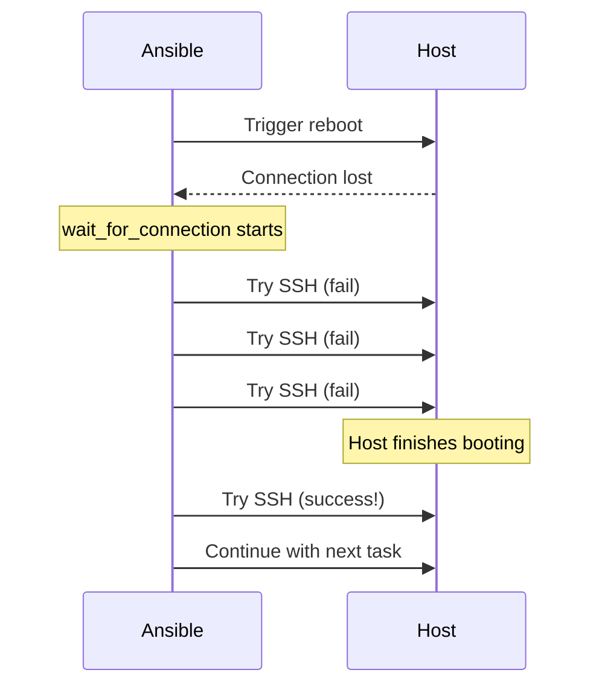

# How to Use Ansible wait_for_connection After Reboot

Author: [nawazdhandala](https://www.github.com/nawazdhandala)

Tags: Ansible, Reboot, Connection Management, DevOps

Description: Learn how to use the Ansible wait_for_connection module to safely reconnect to hosts after reboots, network changes, or SSH restarts.

---

When you reboot a server from an Ansible playbook, the SSH connection drops and Ansible loses contact with the host. If the next task tries to run immediately, it fails because the host is still coming back up. The `ansible.builtin.wait_for_connection` module solves this by repeatedly trying to establish a connection to the host until it succeeds or times out. It is the proper way to handle any situation where connectivity to a managed host is temporarily lost.

## The Problem

Here is what happens without `wait_for_connection`:

```yaml
# This will fail!
- name: Reboot the server
  ansible.builtin.command: /sbin/reboot
  async: 1
  poll: 0

- name: Run a task after reboot
  ansible.builtin.command: uptime
  # FAILS because the host is still rebooting
```

The reboot command disconnects Ansible, and the next task immediately tries to connect to a host that is not available yet.

## Basic Usage

The simplest pattern for handling a reboot:

```yaml
---
- name: Reboot and reconnect
  hosts: all
  become: yes
  tasks:
    - name: Reboot the server
      ansible.builtin.command: /sbin/reboot
      async: 1
      poll: 0
      ignore_errors: yes

    - name: Wait for the server to come back
      ansible.builtin.wait_for_connection:
        delay: 30
        timeout: 300

    - name: Verify the server is back
      ansible.builtin.command: uptime
      register: uptime_result

    - name: Show uptime
      ansible.builtin.debug:
        var: uptime_result.stdout
```

The `delay` parameter waits 30 seconds before starting to poll. This avoids wasting connection attempts while the server is still shutting down. The `timeout` parameter sets the maximum wait time.

## Module Parameters

| Parameter | Default | Description |
|-----------|---------|-------------|
| `delay` | 0 | Seconds to wait before first connection attempt |
| `timeout` | 600 | Maximum seconds to wait for connection |
| `sleep` | 1 | Seconds between connection attempts |
| `connect_timeout` | 5 | Timeout for each individual connection attempt |

## wait_for_connection vs wait_for

These two modules serve different purposes:

- `wait_for` checks for a specific port, file, or condition on a host that Ansible can already reach.
- `wait_for_connection` waits for Ansible's own connection (SSH/WinRM) to the host to be re-established.



## Using with the reboot Module

The `ansible.builtin.reboot` module has built-in connection waiting, but sometimes you want more control.

The reboot module with its own wait parameters:

```yaml
- name: Reboot using the reboot module
  ansible.builtin.reboot:
    reboot_timeout: 600
    pre_reboot_delay: 5
    post_reboot_delay: 30
    msg: "Rebooting for kernel update"
    connect_timeout: 10
    test_command: uptime
```

The `reboot` module automatically handles disconnection and reconnection. But there are cases where you need `wait_for_connection` separately, such as after a network reconfiguration or SSH restart.

## After SSH Restart

Restarting the SSH daemon drops your Ansible connection just like a reboot.

Reconnect after SSH restart:

```yaml
- name: Update SSH configuration
  ansible.builtin.template:
    src: sshd_config.j2
    dest: /etc/ssh/sshd_config
    validate: "sshd -t -f %s"

- name: Restart SSH
  ansible.builtin.systemd:
    name: sshd
    state: restarted
  async: 1
  poll: 0

- name: Wait for SSH to come back
  ansible.builtin.wait_for_connection:
    delay: 5
    timeout: 60
    sleep: 2

- name: Verify SSH is working
  ansible.builtin.ping:
```

Note the `async: 1` and `poll: 0` on the restart task. This fires the restart in the background, because if Ansible waited synchronously for the restart to complete, the task would fail when the connection drops mid-restart.

## After Network Configuration Changes

Changing network settings can cause temporary connectivity loss.

Handle network reconfiguration gracefully:

```yaml
- name: Update network configuration
  ansible.builtin.template:
    src: netplan-config.yaml.j2
    dest: /etc/netplan/01-config.yaml

- name: Apply network changes
  ansible.builtin.command: netplan apply
  async: 1
  poll: 0

- name: Wait for network to stabilize
  ansible.builtin.wait_for_connection:
    delay: 10
    timeout: 120
    connect_timeout: 10
  vars:
    # If the IP changed, update the connection info
    ansible_host: "{{ new_ip_address | default(ansible_host) }}"
```

## Handling IP Address Changes

If a reboot or network change results in a new IP address, you need to update the connection target.

Wait for connection at a new IP address:

```yaml
- name: Reconfigure network interface with new IP
  ansible.builtin.template:
    src: interfaces.j2
    dest: /etc/network/interfaces

- name: Apply and reboot
  ansible.builtin.reboot:
    reboot_timeout: 600

- name: Wait for host at new IP
  ansible.builtin.wait_for_connection:
    delay: 30
    timeout: 300
  vars:
    ansible_host: "{{ target_ip }}"

- name: Verify connectivity at new address
  ansible.builtin.setup:
    gather_subset:
      - network
  register: net_facts

- name: Confirm IP change
  ansible.builtin.debug:
    msg: "Host is now at {{ net_facts.ansible_facts.ansible_default_ipv4.address }}"
```

## Rolling Reboot Pattern

For clusters, reboot one node at a time with connection verification.

Rolling reboot with health checks:

```yaml
---
- name: Rolling reboot of cluster
  hosts: cluster_nodes
  become: yes
  serial: 1
  max_fail_percentage: 0

  tasks:
    - name: Record pre-reboot uptime
      ansible.builtin.command: cat /proc/uptime
      register: pre_uptime
      changed_when: false

    - name: Reboot the node
      ansible.builtin.reboot:
        reboot_timeout: 600
        post_reboot_delay: 30

    # Extra verification beyond what reboot module does
    - name: Wait for full connectivity
      ansible.builtin.wait_for_connection:
        delay: 10
        timeout: 120

    - name: Verify the host actually rebooted
      ansible.builtin.command: cat /proc/uptime
      register: post_uptime
      changed_when: false

    - name: Confirm reboot happened
      ansible.builtin.assert:
        that:
          - "post_uptime.stdout.split('.')[0] | int < pre_uptime.stdout.split('.')[0] | int"
        fail_msg: "Server does not appear to have rebooted (uptime did not reset)"

    - name: Wait for all services to come up
      ansible.builtin.wait_for:
        port: "{{ item }}"
        timeout: 60
      loop:
        - 22    # SSH
        - 80    # HTTP
        - 443   # HTTPS

    - name: Run application health check
      ansible.builtin.uri:
        url: http://localhost:8080/health
      register: health
      retries: 10
      delay: 5
      until: health.status == 200
```

## Error Handling for Connection Failures

What if the server does not come back? You need proper error handling.

Handle permanent connection failure:

```yaml
- name: Reboot the server
  ansible.builtin.command: /sbin/reboot
  async: 1
  poll: 0

- name: Wait for the server to come back
  ansible.builtin.wait_for_connection:
    delay: 30
    timeout: 300
  register: connection_result
  ignore_errors: yes

- name: Handle failed reconnection
  when: connection_result is failed
  block:
    - name: Log the failure
      ansible.builtin.debug:
        msg: >
          CRITICAL: {{ inventory_hostname }} did not come back after reboot.
          Timeout after 300 seconds. Manual intervention required.

    - name: Notify operations team
      ansible.builtin.uri:
        url: "{{ alerting_webhook }}"
        method: POST
        body_format: json
        body:
          alert: "Server {{ inventory_hostname }} unreachable after reboot"
          severity: critical
      delegate_to: localhost

    - name: Fail the play for this host
      ansible.builtin.fail:
        msg: "Server unreachable after reboot"
```

## After Cloud Instance Stop/Start

In cloud environments, stopping and starting an instance may change its public IP.

Handle cloud instance restart with changing IPs:

```yaml
- name: Stop the EC2 instance
  amazon.aws.ec2_instance:
    instance_ids: "{{ ec2_instance_id }}"
    state: stopped
  delegate_to: localhost

- name: Start the EC2 instance
  amazon.aws.ec2_instance:
    instance_ids: "{{ ec2_instance_id }}"
    state: running
  register: ec2_start
  delegate_to: localhost

- name: Update host address with new public IP
  ansible.builtin.set_fact:
    ansible_host: "{{ ec2_start.instances[0].public_ip_address }}"

- name: Wait for SSH on new IP
  ansible.builtin.wait_for_connection:
    delay: 30
    timeout: 300
    connect_timeout: 10
```

## Tuning Connection Parameters

For slow-booting servers (like those with large RAID arrays or many disks to fsck), you might need to adjust timing.

Tuned parameters for slow-booting hardware:

```yaml
- name: Wait for slow server to reboot
  ansible.builtin.wait_for_connection:
    delay: 120      # Server takes 2 minutes minimum to POST
    timeout: 900    # Allow up to 15 minutes total
    sleep: 10       # Check every 10 seconds (not every second)
    connect_timeout: 10  # Give SSH 10 seconds per attempt
```

## Summary

`wait_for_connection` is the standard way to handle connectivity interruptions in Ansible playbooks. Use it after reboots, SSH restarts, network reconfigurations, and cloud instance stop/start cycles. The key parameters are `delay` (how long to wait before trying), `timeout` (how long to keep trying), and `connect_timeout` (how long each attempt gets). Always pair it with post-connection verification tasks to make sure the host is not just reachable but actually healthy and ready for work.
