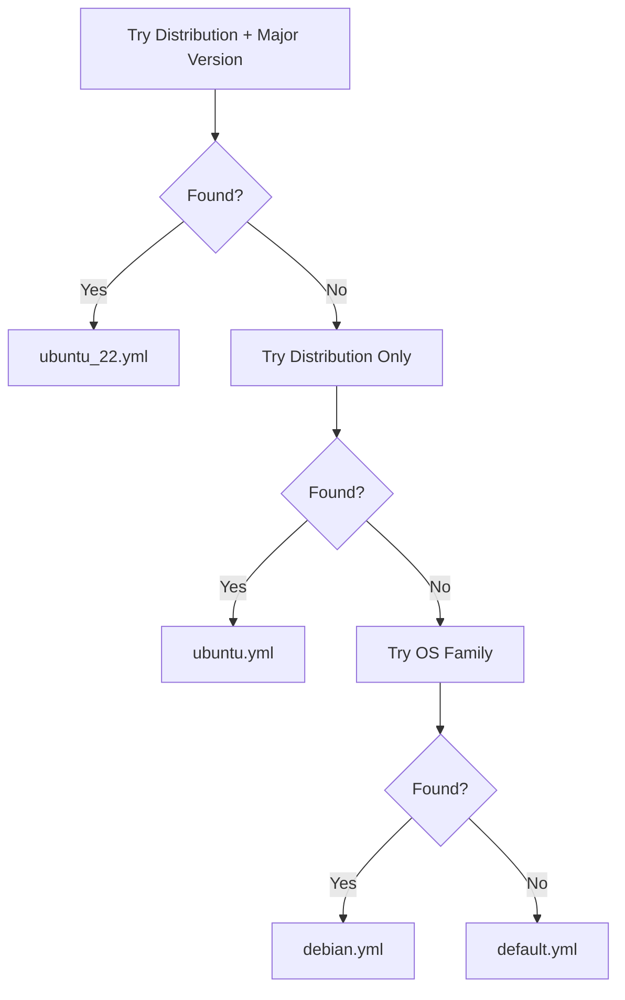

# How to Use Ansible when with ansible_distribution

Author: [nawazdhandala](https://www.github.com/nawazdhandala)

Tags: Ansible, Conditionals, ansible_distribution, Cross-Platform, Linux

Description: Learn how to use ansible_distribution and related facts to target specific Linux distributions and versions in Ansible tasks.

---

While `ansible_os_family` groups distributions into broad categories, sometimes you need finer control. Ubuntu and Debian are both in the "Debian" family, but they have different package repositories, different default versions of software, and different release cycles. The `ansible_distribution` fact gives you the specific distribution name, and combined with `ansible_distribution_version` and `ansible_distribution_major_version`, you can target your automation with precision.

## The Distribution Facts

Ansible gathers several distribution-related facts during setup:

```yaml
# show-distribution.yml - Display distribution facts
---
- name: Show distribution information
  hosts: all
  gather_facts: true
  tasks:
    - name: Display all distribution facts
      ansible.builtin.debug:
        msg:
          - "Distribution: {{ ansible_distribution }}"
          - "Version: {{ ansible_distribution_version }}"
          - "Major Version: {{ ansible_distribution_major_version }}"
          - "Release: {{ ansible_distribution_release }}"
          - "OS Family: {{ ansible_os_family }}"
```

Example outputs for different systems:

```
# Ubuntu 22.04
Distribution: Ubuntu
Version: 22.04
Major Version: 22
Release: jammy
OS Family: Debian

# Rocky Linux 9
Distribution: Rocky
Version: 9.3
Major Version: 9
Release: Blue Onyx
OS Family: RedHat

# Amazon Linux 2023
Distribution: Amazon
Version: 2023
Major Version: 2023
Release: NA
OS Family: RedHat
```

## Targeting Specific Distributions

When different distributions within the same OS family need different handling:

```yaml
# distribution-specific.yml - Distribution-level conditionals
---
- name: Distribution-specific tasks
  hosts: all
  gather_facts: true
  become: true
  tasks:
    - name: Add Docker repo on Ubuntu
      ansible.builtin.apt_repository:
        repo: "deb [arch=amd64] https://download.docker.com/linux/ubuntu {{ ansible_distribution_release }} stable"
        state: present
      when: ansible_distribution == "Ubuntu"

    - name: Add Docker repo on Debian
      ansible.builtin.apt_repository:
        repo: "deb [arch=amd64] https://download.docker.com/linux/debian {{ ansible_distribution_release }} stable"
        state: present
      when: ansible_distribution == "Debian"

    - name: Add Docker repo on CentOS/Rocky
      ansible.builtin.yum_repository:
        name: docker-ce
        description: Docker CE Repository
        baseurl: "https://download.docker.com/linux/centos/$releasever/$basearch/stable"
        gpgcheck: true
        gpgkey: https://download.docker.com/linux/centos/gpg
      when: ansible_distribution in ["CentOS", "Rocky", "AlmaLinux"]

    - name: Add Docker repo on Fedora
      ansible.builtin.yum_repository:
        name: docker-ce
        description: Docker CE Repository
        baseurl: "https://download.docker.com/linux/fedora/$releasever/$basearch/stable"
        gpgcheck: true
        gpgkey: https://download.docker.com/linux/fedora/gpg
      when: ansible_distribution == "Fedora"
```

## Version-Specific Conditionals

Some tasks should only run on certain versions of a distribution. The `version` test lets you do clean version comparisons:

```yaml
# version-specific.yml - Version-based conditionals
---
- name: Version-specific tasks
  hosts: all
  gather_facts: true
  become: true
  tasks:
    # Only Ubuntu 22.04 and later
    - name: Enable Ubuntu Pro features
      ansible.builtin.command:
        cmd: pro enable esm-infra
      when:
        - ansible_distribution == "Ubuntu"
        - ansible_distribution_version is version('22.04', '>=')
      changed_when: true

    # CentOS 7 specific (legacy)
    - name: Use yum on CentOS 7
      ansible.builtin.yum:
        name: epel-release
        state: present
      when:
        - ansible_distribution == "CentOS"
        - ansible_distribution_major_version == "7"

    # CentOS/Rocky 8+ uses dnf
    - name: Use dnf on CentOS/Rocky 8+
      ansible.builtin.dnf:
        name: epel-release
        state: present
      when:
        - ansible_distribution in ["CentOS", "Rocky", "AlmaLinux"]
        - ansible_distribution_major_version | int >= 8

    # Amazon Linux 2 vs Amazon Linux 2023
    - name: Amazon Linux 2 specific config
      ansible.builtin.command:
        cmd: amazon-linux-extras install docker
      when:
        - ansible_distribution == "Amazon"
        - ansible_distribution_major_version == "2"
      changed_when: true

    - name: Amazon Linux 2023 uses dnf
      ansible.builtin.dnf:
        name: docker
        state: present
      when:
        - ansible_distribution == "Amazon"
        - ansible_distribution_major_version == "2023"
```

## Using the Release Codename

Ubuntu and Debian use release codenames (jammy, focal, bookworm, bullseye). These are available via `ansible_distribution_release`:

```yaml
# codename-usage.yml - Using distribution release codenames
---
- name: Codename-based configuration
  hosts: all
  gather_facts: true
  become: true
  tasks:
    - name: Configure APT sources with codename
      ansible.builtin.template:
        src: sources.list.j2
        dest: /etc/apt/sources.list
        mode: '0644'
      when: ansible_distribution in ["Ubuntu", "Debian"]

    - name: Install version-specific package
      ansible.builtin.apt:
        name: "python3-{{ '10' if ansible_distribution_release == 'focal' else '11' if ansible_distribution_release == 'jammy' else '12' }}"
        state: present
      when: ansible_distribution == "Ubuntu"
```

```jinja2
# templates/sources.list.j2
# Managed by Ansible - do not edit manually

deb http://archive.ubuntu.com/ubuntu {{ ansible_distribution_release }} main restricted
deb http://archive.ubuntu.com/ubuntu {{ ansible_distribution_release }}-updates main restricted
deb http://archive.ubuntu.com/ubuntu {{ ansible_distribution_release }}-security main restricted
deb http://archive.ubuntu.com/ubuntu {{ ansible_distribution_release }} universe

deb http://deb.debian.org/debian {{ ansible_distribution_release }} main
deb http://deb.debian.org/debian {{ ansible_distribution_release }}-updates main
deb http://security.debian.org/debian-security {{ ansible_distribution_release }}-security main

```

## Loading Distribution-Specific Variables

A scalable approach is to load variable files that match the distribution:

```yaml
# roles/webserver/tasks/main.yml - Load distro-specific vars
---
- name: Load distribution-specific variables
  ansible.builtin.include_vars: "{{ item }}"
  with_first_found:
    - "vars/{{ ansible_distribution | lower }}_{{ ansible_distribution_major_version }}.yml"
    - "vars/{{ ansible_distribution | lower }}.yml"
    - "vars/{{ ansible_os_family | lower }}.yml"
    - "vars/default.yml"
```

```yaml
# roles/webserver/vars/ubuntu_22.yml
php_version: "8.1"
php_packages:
  - php8.1-fpm
  - php8.1-cli
  - php8.1-mysql
```

```yaml
# roles/webserver/vars/ubuntu_24.yml
php_version: "8.3"
php_packages:
  - php8.3-fpm
  - php8.3-cli
  - php8.3-mysql
```

```yaml
# roles/webserver/vars/debian.yml
php_version: "8.2"
php_packages:
  - php8.2-fpm
  - php8.2-cli
  - php8.2-mysql
```

## Variable Lookup Priority



## Practical Example: Node.js Installation

Different distributions require different approaches to install Node.js:

```yaml
# install-nodejs.yml - Cross-distribution Node.js installation
---
- name: Install Node.js 20
  hosts: all
  gather_facts: true
  become: true
  vars:
    node_version: "20"
  tasks:
    - name: Install Node.js on Ubuntu/Debian
      when: ansible_distribution in ["Ubuntu", "Debian"]
      block:
        - name: Install prerequisites
          ansible.builtin.apt:
            name:
              - ca-certificates
              - curl
              - gnupg
            state: present

        - name: Add NodeSource GPG key
          ansible.builtin.apt_key:
            url: "https://deb.nodesource.com/gpgkey/nodesource-repo.gpg.key"
            state: present

        - name: Add NodeSource repository
          ansible.builtin.apt_repository:
            repo: "deb https://deb.nodesource.com/node_{{ node_version }}.x nodistro main"
            state: present

        - name: Install Node.js
          ansible.builtin.apt:
            name: nodejs
            state: present
            update_cache: true

    - name: Install Node.js on RedHat family
      when: ansible_os_family == "RedHat"
      block:
        - name: Add NodeSource repository
          ansible.builtin.command:
            cmd: "curl -fsSL https://rpm.nodesource.com/setup_{{ node_version }}.x | bash -"
            creates: /etc/yum.repos.d/nodesource-el.repo

        - name: Install Node.js
          ansible.builtin.dnf:
            name: nodejs
            state: present

    - name: Install Node.js on Alpine
      when: ansible_distribution == "Alpine"
      community.general.apk:
        name: "nodejs={{ node_version }}"
        state: present

    - name: Verify installation
      ansible.builtin.command:
        cmd: node --version
      register: node_check
      changed_when: false

    - name: Show installed version
      ansible.builtin.debug:
        msg: "Node.js {{ node_check.stdout }} installed on {{ ansible_distribution }} {{ ansible_distribution_version }}"
```

## Handling Distribution Transitions

CentOS to Rocky/AlmaLinux migration is a real-world scenario:

```yaml
# rhel-family.yml - Handle the CentOS to Rocky/Alma transition
---
- name: Handle RHEL family distributions
  hosts: all
  gather_facts: true
  become: true
  tasks:
    - name: Define RHEL-compatible distributions
      ansible.builtin.set_fact:
        is_rhel_compatible: >-
          {{ ansible_distribution in ['RedHat', 'CentOS', 'Rocky', 'AlmaLinux', 'OracleLinux'] }}

    - name: Install packages on any RHEL-compatible distro
      ansible.builtin.dnf:
        name:
          - vim
          - tmux
          - htop
        state: present
      when:
        - is_rhel_compatible
        - ansible_distribution_major_version | int >= 8
```

## Best Practices

Use `ansible_os_family` for broad checks (package manager selection) and `ansible_distribution` for specific adjustments (repository URLs, codenames). Use `with_first_found` to load the most specific variable file available with fallbacks to more general ones. The `version` test is safer than string comparison for version numbers, as it handles semantic versioning correctly. Always account for the CentOS to Rocky/AlmaLinux transition if you support RedHat-family systems. Group multiple distribution-specific tasks in blocks to reduce duplication of `when` clauses. Test your playbooks against all supported distributions using containers or VMs before deploying to production.

Distribution-aware automation is what makes your Ansible playbooks production-ready. It is the difference between playbooks that work on your test environment and playbooks that work everywhere.
