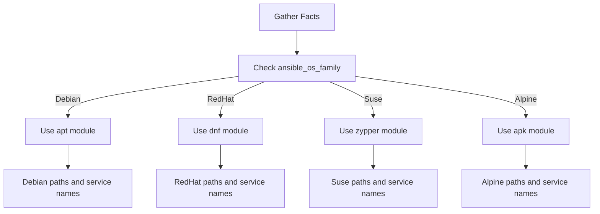

# How to Use Ansible when with ansible_os_family

Author: [nawazdhandala](https://www.github.com/nawazdhandala)

Tags: Ansible, Conditionals, ansible_os_family, Cross-Platform, Configuration Management

Description: Learn how to use ansible_os_family in when clauses to write cross-platform Ansible playbooks that work across Linux distributions.

---

If you manage a mixed fleet of Linux distributions, you already know that package managers, service management, file paths, and configuration formats differ between Debian-based and RedHat-based systems. The `ansible_os_family` fact lets you write playbooks that detect the OS family at runtime and execute the appropriate tasks for each platform.

## What is ansible_os_family?

The `ansible_os_family` fact groups distributions into families. This is more useful than checking individual distributions because many distros within a family share the same package manager and conventions.

Common values:

| OS Family | Distributions |
|---|---|
| Debian | Ubuntu, Debian, Linux Mint, Pop!_OS |
| RedHat | RHEL, CentOS, Rocky, AlmaLinux, Fedora, Amazon Linux |
| Suse | SLES, openSUSE |
| Archlinux | Arch Linux, Manjaro |
| Alpine | Alpine Linux |
| FreeBSD | FreeBSD |
| Darwin | macOS |
| Windows | Windows Server, Windows 10/11 |

```yaml
# show-os-family.yml - Display OS family information
---
- name: Show OS family
  hosts: all
  gather_facts: true
  tasks:
    - name: Display OS family and related facts
      ansible.builtin.debug:
        msg:
          - "OS Family: {{ ansible_os_family }}"
          - "Distribution: {{ ansible_distribution }}"
          - "Distribution Version: {{ ansible_distribution_version }}"
          - "Distribution Major Version: {{ ansible_distribution_major_version }}"
```

## Basic Cross-Platform Package Installation

The most common use case is installing packages with the right package manager:

```yaml
# cross-platform-packages.yml - Install packages based on OS family
---
- name: Install packages on mixed OS fleet
  hosts: all
  gather_facts: true
  become: true
  tasks:
    - name: Install packages on Debian/Ubuntu
      ansible.builtin.apt:
        name:
          - nginx
          - curl
          - jq
          - unzip
        state: present
        update_cache: true
      when: ansible_os_family == "Debian"

    - name: Install packages on RedHat/CentOS
      ansible.builtin.dnf:
        name:
          - nginx
          - curl
          - jq
          - unzip
        state: present
      when: ansible_os_family == "RedHat"

    - name: Install packages on Alpine
      community.general.apk:
        name:
          - nginx
          - curl
          - jq
          - unzip
        state: present
      when: ansible_os_family == "Alpine"
```

## Using the package Module for Simpler Cases

Ansible's `package` module automatically selects the right package manager. For packages with the same name across distros, this simplifies things:

```yaml
# generic-package.yml - Using the generic package module
---
- name: Install common packages
  hosts: all
  gather_facts: true
  become: true
  tasks:
    # For packages with the same name across distros
    - name: Install curl and wget
      ansible.builtin.package:
        name:
          - curl
          - wget
        state: present

    # For packages with different names per OS family
    - name: Install Apache
      ansible.builtin.package:
        name: "{{ 'apache2' if ansible_os_family == 'Debian' else 'httpd' }}"
        state: present
```

## Service Management Differences

Service names and configuration paths often differ between OS families:

```yaml
# cross-platform-services.yml - OS-family-specific service management
---
- name: Configure web server across platforms
  hosts: webservers
  gather_facts: true
  become: true
  vars:
    apache_service:
      Debian: apache2
      RedHat: httpd
    apache_config_dir:
      Debian: /etc/apache2
      RedHat: /etc/httpd
    apache_user:
      Debian: www-data
      RedHat: apache
  tasks:
    - name: Install Apache
      ansible.builtin.package:
        name: "{{ apache_service[ansible_os_family] }}"
        state: present

    - name: Deploy Apache configuration
      ansible.builtin.template:
        src: apache.conf.j2
        dest: "{{ apache_config_dir[ansible_os_family] }}/conf/httpd.conf"
        owner: root
        group: root
        mode: '0644'
      notify: "restart {{ apache_service[ansible_os_family] }}"

    - name: Start and enable Apache
      ansible.builtin.systemd:
        name: "{{ apache_service[ansible_os_family] }}"
        state: started
        enabled: true

  handlers:
    - name: restart apache2
      ansible.builtin.systemd:
        name: apache2
        state: restarted

    - name: restart httpd
      ansible.builtin.systemd:
        name: httpd
        state: restarted
```

## Using Blocks for OS-Family-Specific Task Groups

When you have several related tasks for each OS family, blocks keep things organized:

```yaml
# os-family-blocks.yml - Grouped tasks per OS family
---
- name: Platform-specific setup
  hosts: all
  gather_facts: true
  become: true
  tasks:
    - name: Debian family setup
      when: ansible_os_family == "Debian"
      block:
        - name: Add APT repository key
          ansible.builtin.apt_key:
            url: https://packages.example.com/gpg-key
            state: present

        - name: Add APT repository
          ansible.builtin.apt_repository:
            repo: "deb https://packages.example.com/apt stable main"
            state: present

        - name: Install from custom repo
          ansible.builtin.apt:
            name: myapp
            state: present
            update_cache: true

    - name: RedHat family setup
      when: ansible_os_family == "RedHat"
      block:
        - name: Add YUM repository
          ansible.builtin.yum_repository:
            name: myapp
            description: MyApp Repository
            baseurl: https://packages.example.com/rpm
            gpgcheck: true
            gpgkey: https://packages.example.com/gpg-key

        - name: Install from custom repo
          ansible.builtin.dnf:
            name: myapp
            state: present
```

## Loading OS-Family-Specific Variables

A clean pattern is to load variable files based on the OS family:

```yaml
# vars-by-os.yml - Load OS-specific variables
---
- name: Configure with OS-specific variables
  hosts: all
  gather_facts: true
  become: true
  tasks:
    - name: Load OS-family-specific variables
      ansible.builtin.include_vars:
        file: "vars/{{ ansible_os_family | lower }}.yml"

    - name: Install packages
      ansible.builtin.package:
        name: "{{ packages }}"
        state: present

    - name: Configure firewall
      ansible.builtin.template:
        src: "templates/firewall-{{ ansible_os_family | lower }}.j2"
        dest: "{{ firewall_config_path }}"
        mode: '0644'
```

```yaml
# vars/debian.yml
---
packages:
  - nginx
  - ufw
  - fail2ban
firewall_config_path: /etc/ufw/user.rules
```

```yaml
# vars/redhat.yml
---
packages:
  - nginx
  - firewalld
  - fail2ban
firewall_config_path: /etc/firewalld/firewalld.conf
```

## Role Pattern: OS-Family Task Files

Inside roles, you can include OS-specific task files:

```yaml
# roles/base/tasks/main.yml
---
- name: Include OS-family-specific tasks
  ansible.builtin.include_tasks: "{{ ansible_os_family | lower }}.yml"
```

```yaml
# roles/base/tasks/debian.yml
---
- name: Configure APT
  ansible.builtin.copy:
    content: |
      APT::Install-Recommends "false";
      APT::Install-Suggests "false";
    dest: /etc/apt/apt.conf.d/99norecommends
    mode: '0644'

- name: Install Debian base packages
  ansible.builtin.apt:
    name:
      - apt-transport-https
      - ca-certificates
      - software-properties-common
    state: present
    update_cache: true
```

```yaml
# roles/base/tasks/redhat.yml
---
- name: Install EPEL repository
  ansible.builtin.dnf:
    name: epel-release
    state: present

- name: Install RedHat base packages
  ansible.builtin.dnf:
    name:
      - yum-utils
      - policycoreutils-python-utils
    state: present
```

## The Decision Flow



## Handling Unsupported OS Families

Always have a fallback for unexpected OS families:

```yaml
# unsupported-os.yml - Handle unsupported platforms
---
- name: Platform-aware setup with fallback
  hosts: all
  gather_facts: true
  tasks:
    - name: Fail on unsupported OS family
      ansible.builtin.fail:
        msg: >
          Unsupported OS family: {{ ansible_os_family }}.
          This playbook supports Debian and RedHat only.
      when: ansible_os_family not in ["Debian", "RedHat"]

    - name: Continue with supported OS
      ansible.builtin.debug:
        msg: "Running on supported {{ ansible_os_family }} system"
```

## Firewall Configuration Example

Firewalls are completely different between Debian (ufw) and RedHat (firewalld):

```yaml
# cross-platform-firewall.yml - OS-specific firewall configuration
---
- name: Configure firewall
  hosts: all
  gather_facts: true
  become: true
  vars:
    open_ports:
      - 22
      - 80
      - 443
  tasks:
    - name: Configure UFW on Debian
      when: ansible_os_family == "Debian"
      block:
        - name: Install UFW
          ansible.builtin.apt:
            name: ufw
            state: present

        - name: Allow required ports
          community.general.ufw:
            rule: allow
            port: "{{ item }}"
            proto: tcp
          loop: "{{ open_ports }}"

        - name: Enable UFW
          community.general.ufw:
            state: enabled
            policy: deny

    - name: Configure firewalld on RedHat
      when: ansible_os_family == "RedHat"
      block:
        - name: Install and start firewalld
          ansible.builtin.dnf:
            name: firewalld
            state: present

        - name: Start firewalld
          ansible.builtin.systemd:
            name: firewalld
            state: started
            enabled: true

        - name: Allow required ports
          ansible.posix.firewalld:
            port: "{{ item }}/tcp"
            permanent: true
            state: enabled
          loop: "{{ open_ports }}"
          notify: reload firewalld

  handlers:
    - name: reload firewalld
      ansible.builtin.command:
        cmd: firewall-cmd --reload
      changed_when: true
```

## Best Practices

Use `ansible_os_family` for broad platform distinctions and `ansible_distribution` when you need distribution-specific behavior within a family. Load OS-specific variables from separate files rather than cluttering tasks with inline conditionals. Use blocks to group OS-family-specific tasks together. Always include a check for unsupported OS families to fail early with a clear message. Consider using the `package` module for packages that share names across distributions to reduce conditional code.

The `ansible_os_family` fact is the backbone of cross-platform Ansible automation. Using it consistently across your roles and playbooks means your automation works whether you are deploying to Ubuntu, Rocky Linux, or any other supported distribution.
