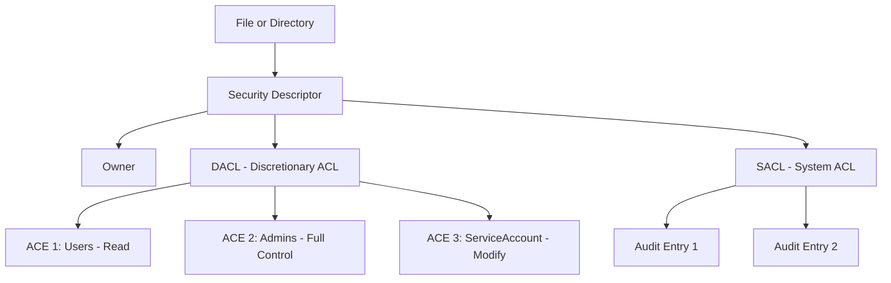

# How to Use Ansible win_acl Module

Author: [nawazdhandala](https://www.github.com/nawazdhandala)

Tags: Ansible, Windows, Security, File Permissions

Description: Learn how to manage Windows file and directory permissions using the Ansible win_acl module with practical NTFS ACL examples.

---

Managing file permissions on Windows is a different beast compared to Linux. Instead of simple owner/group/other with rwx bits, Windows uses Access Control Lists (ACLs) built on top of the NTFS file system. Each file or directory has a security descriptor containing a list of Access Control Entries (ACEs) that define who can do what. Managing these by hand across dozens or hundreds of servers is painful. The Ansible `win_acl` module lets you automate this.

## How Windows ACLs Work

Before jumping into Ansible, it helps to understand the Windows permissions model at a high level.



The DACL is what controls access. Each ACE in the DACL specifies a user or group, a permission level, and whether to allow or deny that permission. The `win_acl` module lets you add, modify, or remove these ACEs.

## Prerequisites

Make sure you have the `ansible.windows` collection installed:

```bash
# Install the Windows collection
ansible-galaxy collection install ansible.windows
```

Your Ansible user account on the Windows target needs sufficient privileges to modify ACLs, typically local administrator or equivalent.

## Basic Usage: Grant Read Access

Let's start with a simple case: granting read access to a group on a directory.

```yaml
# playbook-grant-read.yml
# Grants read-only access to the AppReaders group on the application directory
- name: Set read permissions
  hosts: windows
  tasks:
    - name: Grant read access to AppReaders group
      ansible.windows.win_acl:
        path: C:\Application\Data
        user: DOMAIN\AppReaders
        rights: Read
        type: allow
        state: present
```

The key parameters here are:

- **path**: The file or directory to modify
- **user**: The user or group to apply the ACE to
- **rights**: The permission level (Read, Write, Modify, FullControl, etc.)
- **type**: Either `allow` or `deny`
- **state**: `present` to add the ACE, `absent` to remove it

## Available Permission Rights

The `rights` parameter accepts these values, which map directly to the Windows filesystem permission constants:

| Right | What It Grants |
|-------|---------------|
| `FullControl` | Everything, including changing permissions and taking ownership |
| `Modify` | Read, write, execute, and delete |
| `ReadAndExecute` | Read files and run executables |
| `Read` | View file contents and properties |
| `Write` | Create files and write data |
| `ExecuteFile` | Run executables |
| `Delete` | Delete the file or directory |
| `ChangePermissions` | Modify the ACL |
| `TakeOwnership` | Change the owner |

You can combine multiple rights by passing a comma-separated list: `rights: Read,Write`.

## Setting Permissions with Inheritance

Inheritance controls whether permissions propagate from a parent directory to its children. This is critical for setting up directory structures where you want permissions to flow down automatically.

```yaml
# playbook-inheritance.yml
# Sets up a shared folder with proper inheritance for child objects
- name: Configure folder with inheritance
  hosts: windows
  tasks:
    - name: Grant Modify to deployment service account with inheritance
      ansible.windows.win_acl:
        path: C:\WebApp
        user: DOMAIN\svc-deploy
        rights: Modify
        type: allow
        state: present
        inherit: ContainerInherit, ObjectInherit
        propagation: None

    - name: Grant ReadAndExecute to web service account
      ansible.windows.win_acl:
        path: C:\WebApp
        user: DOMAIN\svc-webapp
        rights: ReadAndExecute
        type: allow
        state: present
        inherit: ContainerInherit, ObjectInherit
        propagation: None
```

The `inherit` parameter accepts these flags:

- **ContainerInherit**: Subdirectories inherit this ACE
- **ObjectInherit**: Files inherit this ACE
- **None**: No inheritance (applies only to the target)

The `propagation` parameter controls how inheritance is applied:

- **None**: ACE applies to the target and all children
- **InheritOnly**: ACE applies only to children, not the target itself
- **NoPropagateInherit**: ACE applies to immediate children only, not grandchildren

## Deny Rules

Sometimes you need to explicitly deny access. Deny ACEs take precedence over allow ACEs in the Windows security model.

```yaml
# playbook-deny.yml
# Blocks a specific user from accessing sensitive financial data
- name: Apply deny rules
  hosts: windows
  tasks:
    - name: Deny access to contractor group on sensitive folder
      ansible.windows.win_acl:
        path: C:\FinancialReports
        user: DOMAIN\Contractors
        rights: FullControl
        type: deny
        state: present
        inherit: ContainerInherit, ObjectInherit
        propagation: None
```

Be careful with deny rules. They can be difficult to troubleshoot, and they override allow rules. In most cases, it is better to simply not grant access rather than explicitly denying it.

## Removing Permissions

To remove an ACE, set `state: absent` and match the exact user and rights:

```yaml
# playbook-remove-acl.yml
# Removes previously granted permissions for a decommissioned service account
- name: Remove old permissions
  hosts: windows
  tasks:
    - name: Remove old service account access
      ansible.windows.win_acl:
        path: C:\Application
        user: DOMAIN\svc-old-app
        rights: Modify
        type: allow
        state: absent
```

## Managing Inheritance on a Directory

The related `win_acl_inheritance` module controls whether a directory inherits permissions from its parent. This is useful for creating isolated directories that do not inherit broad parent permissions.

```yaml
# playbook-inheritance-control.yml
# Creates a locked-down directory that does not inherit parent permissions
- name: Set up isolated secure directory
  hosts: windows
  tasks:
    - name: Create the secure directory
      ansible.windows.win_file:
        path: C:\SecureData
        state: directory

    - name: Disable inheritance and remove inherited ACEs
      ansible.windows.win_acl_inheritance:
        path: C:\SecureData
        state: absent
        reorganize: true

    - name: Grant access only to authorized group
      ansible.windows.win_acl:
        path: C:\SecureData
        user: DOMAIN\SecureDataAdmins
        rights: FullControl
        type: allow
        state: present
        inherit: ContainerInherit, ObjectInherit
        propagation: None

    - name: Grant read access to auditors
      ansible.windows.win_acl:
        path: C:\SecureData
        user: DOMAIN\Auditors
        rights: Read
        type: allow
        state: present
        inherit: ContainerInherit, ObjectInherit
        propagation: None
```

When `reorganize: true` is set with `state: absent`, inherited ACEs are copied as explicit ACEs before inheritance is disabled. This preserves existing access while allowing you to then modify the explicit ACEs.

## Complete Example: Application Deployment Permissions

Here is a real-world playbook that sets up a full permission structure for a web application deployment:

```yaml
# playbook-app-permissions.yml
# Sets up the complete permission structure for a web application
- name: Configure application directory permissions
  hosts: windows
  vars:
    app_root: C:\inetpub\MyWebApp
    deploy_account: DOMAIN\svc-deploy
    app_pool_account: IIS APPPOOL\MyWebApp
    dev_team: DOMAIN\DevTeam
    ops_team: DOMAIN\OpsTeam

  tasks:
    - name: Create application directory
      ansible.windows.win_file:
        path: "{{ app_root }}"
        state: directory

    - name: Break inheritance from parent
      ansible.windows.win_acl_inheritance:
        path: "{{ app_root }}"
        state: absent
        reorganize: false

    - name: Grant Administrators full control
      ansible.windows.win_acl:
        path: "{{ app_root }}"
        user: BUILTIN\Administrators
        rights: FullControl
        type: allow
        state: present
        inherit: ContainerInherit, ObjectInherit
        propagation: None

    - name: Grant deploy account modify rights
      ansible.windows.win_acl:
        path: "{{ app_root }}"
        user: "{{ deploy_account }}"
        rights: Modify
        type: allow
        state: present
        inherit: ContainerInherit, ObjectInherit
        propagation: None

    - name: Grant app pool read and execute
      ansible.windows.win_acl:
        path: "{{ app_root }}"
        user: "{{ app_pool_account }}"
        rights: ReadAndExecute
        type: allow
        state: present
        inherit: ContainerInherit, ObjectInherit
        propagation: None

    - name: Grant app pool write to logs directory
      ansible.windows.win_acl:
        path: "{{ app_root }}\\logs"
        user: "{{ app_pool_account }}"
        rights: Modify
        type: allow
        state: present
        inherit: ContainerInherit, ObjectInherit
        propagation: None

    - name: Grant dev team read access for troubleshooting
      ansible.windows.win_acl:
        path: "{{ app_root }}"
        user: "{{ dev_team }}"
        rights: Read
        type: allow
        state: present
        inherit: ContainerInherit, ObjectInherit
        propagation: None

    - name: Grant ops team modify access
      ansible.windows.win_acl:
        path: "{{ app_root }}"
        user: "{{ ops_team }}"
        rights: Modify
        type: allow
        state: present
        inherit: ContainerInherit, ObjectInherit
        propagation: None
```

## Troubleshooting Tips

**Permission denied errors**: Your Ansible user needs to be a local administrator or have the "Manage auditing and security log" privilege to modify ACLs.

**User not found**: Use the full format `DOMAIN\Username` for domain accounts. For local accounts, use `SERVERNAME\Username` or `BUILTIN\GroupName` for built-in groups.

**Inheritance conflicts**: If you set permissions but they seem to not take effect, check whether inheritance from a parent directory is overriding your changes. Use `win_acl_inheritance` to break inheritance if needed.

**Testing changes**: Always run with `--check` first. ACL changes can lock you out of directories if done incorrectly, and recovering from that situation requires console access or a different admin account.

The `win_acl` module gives you the building blocks for managing Windows permissions at scale. Combined with `win_acl_inheritance`, you can set up secure, well-organized permission structures that would take hours to configure manually through the GUI.
