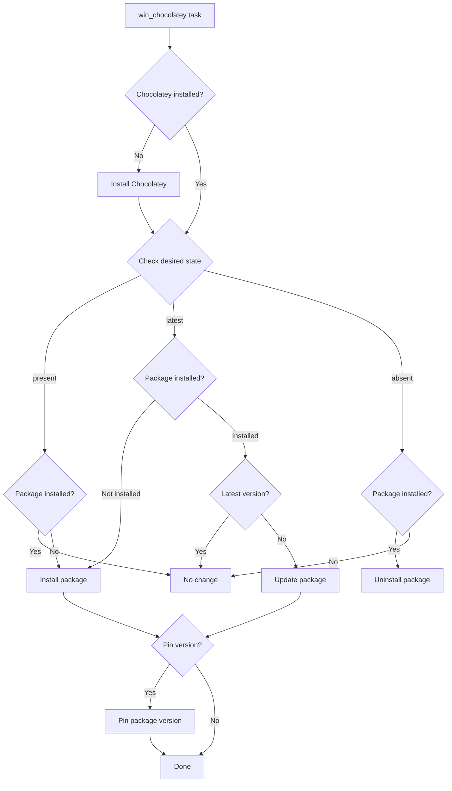

# How to Use Ansible win_chocolatey Module

Author: [nawazdhandala](https://www.github.com/nawazdhandala)

Tags: Ansible, Windows, Chocolatey, Package Management, Automation

Description: Install, update, and manage Windows software packages using the Ansible win_chocolatey module with the Chocolatey package manager.

---

Chocolatey is the package manager that Windows has always needed. Think of it as apt or yum for Windows. The `win_chocolatey` module integrates Chocolatey directly into your Ansible playbooks, letting you install, update, pin, and remove software packages on Windows hosts with a single task. No more downloading installers, figuring out silent switches, or tracking product IDs.

## Installing Chocolatey

Before you can use `win_chocolatey`, the Chocolatey client needs to be installed on the target host. The module can install Chocolatey automatically, but you can also handle it explicitly.

```yaml
# install-chocolatey.yml - Ensure Chocolatey is installed
---
- name: Install Chocolatey
  hosts: windows_servers
  tasks:
    # The win_chocolatey module installs Chocolatey automatically
    # if it is not present, but you can also do it explicitly
    - name: Install Chocolatey via PowerShell
      ansible.windows.win_shell: |
        if (-not (Get-Command choco -ErrorAction SilentlyContinue)) {
            Set-ExecutionPolicy Bypass -Scope Process -Force
            [System.Net.ServicePointManager]::SecurityProtocol = [System.Net.ServicePointManager]::SecurityProtocol -bor 3072
            Invoke-Expression ((New-Object System.Net.WebClient).DownloadString('https://community.chocolatey.org/install.ps1'))
        } else {
            Write-Output "Chocolatey already installed"
        }
      register: choco_install

    - name: Verify Chocolatey installation
      ansible.windows.win_command: choco --version
      register: choco_version

    - name: Show Chocolatey version
      ansible.builtin.debug:
        msg: "Chocolatey {{ choco_version.stdout | trim }} installed"
```

## Installing Packages

Installing a package with Chocolatey is simple and handles all the download, silent install, and PATH configuration automatically.

```yaml
# install-packages.yml - Install software via Chocolatey
---
- name: Install packages via Chocolatey
  hosts: windows_servers
  tasks:
    # Install a single package (latest version)
    - name: Install 7-Zip
      chocolatey.chocolatey.win_chocolatey:
        name: 7zip
        state: present

    # Install a specific version
    - name: Install Notepad++ version 8.6.2
      chocolatey.chocolatey.win_chocolatey:
        name: notepadplusplus
        version: '8.6.2'
        state: present

    # Install multiple packages at once
    - name: Install common utilities
      chocolatey.chocolatey.win_chocolatey:
        name: "{{ item }}"
        state: present
      loop:
        - googlechrome
        - firefox
        - vscode
        - git
        - python3
        - nodejs-lts
        - postman
        - winscp
```

## Installing with Package Parameters

Many Chocolatey packages support custom installation parameters.

```yaml
# package-params.yml - Install with custom parameters
---
- name: Install packages with custom parameters
  hosts: windows_servers
  tasks:
    # Install Git with specific options
    - name: Install Git with custom configuration
      chocolatey.chocolatey.win_chocolatey:
        name: git
        state: present
        package_params: /GitAndUnixToolsOnPath /NoAutoCrlf /WindowsTerminal

    # Install Visual Studio Code with extensions support
    - name: Install VS Code with context menu entries
      chocolatey.chocolatey.win_chocolatey:
        name: vscode
        state: present
        package_params: /NoDesktopIcon /NoQuicklaunchIcon

    # Install .NET SDK to a specific directory
    - name: Install .NET 8 SDK
      chocolatey.chocolatey.win_chocolatey:
        name: dotnet-8.0-sdk
        state: present
```

## Updating Packages

Keep packages up to date across your fleet.

```yaml
# update-packages.yml - Update Chocolatey packages
---
- name: Update packages
  hosts: windows_servers
  tasks:
    # Update a specific package to latest
    - name: Update Git to latest version
      chocolatey.chocolatey.win_chocolatey:
        name: git
        state: latest

    # Update all installed packages
    - name: Update all Chocolatey packages
      chocolatey.chocolatey.win_chocolatey:
        name: all
        state: latest
      register: update_result
      ignore_errors: true

    - name: Show update results
      ansible.builtin.debug:
        var: update_result
```

## Pinning Package Versions

In production, you might want to lock a specific version to prevent automatic upgrades.

```yaml
# pin-packages.yml - Pin package versions
---
- name: Pin package versions
  hosts: production_servers
  tasks:
    # Install a specific version and pin it
    - name: Install and pin Java 17
      chocolatey.chocolatey.win_chocolatey:
        name: openjdk17
        version: '17.0.9'
        state: present
        pinned: yes

    # Pin an already-installed package
    - name: Pin current Node.js version
      chocolatey.chocolatey.win_chocolatey:
        name: nodejs-lts
        state: present
        pinned: yes
```

## Removing Packages

Uninstall packages that are no longer needed.

```yaml
# remove-packages.yml - Remove Chocolatey packages
---
- name: Remove packages
  hosts: windows_servers
  tasks:
    # Remove a single package
    - name: Remove Adobe Reader
      chocolatey.chocolatey.win_chocolatey:
        name: adobereader
        state: absent

    # Remove multiple packages
    - name: Remove deprecated tools
      chocolatey.chocolatey.win_chocolatey:
        name: "{{ item }}"
        state: absent
      loop:
        - flashplayerplugin
        - jre8
        - silverlight
```

## Configuring Chocolatey Sources

You can add internal package sources (like a private NuGet feed) for corporate packages.

```yaml
# configure-sources.yml - Manage Chocolatey package sources
---
- name: Configure Chocolatey sources
  hosts: windows_servers
  tasks:
    # Add a private package source
    - name: Add internal Chocolatey repository
      chocolatey.chocolatey.win_chocolatey_source:
        name: InternalRepo
        source: https://chocolatey.corp.local/nuget/packages
        priority: 1
        state: present

    # Add an authenticated source
    - name: Add authenticated repository
      chocolatey.chocolatey.win_chocolatey_source:
        name: PrivateRepo
        source: https://packages.corp.local/chocolatey
        source_username: "{{ vault_choco_user }}"
        source_password: "{{ vault_choco_password }}"
        priority: 2
        state: present

    # Disable the public community repository (for air-gapped environments)
    - name: Disable community repository
      chocolatey.chocolatey.win_chocolatey_source:
        name: chocolatey
        state: disabled
```

## Configuring Chocolatey Features

Control Chocolatey behavior through its feature settings.

```yaml
# configure-features.yml - Configure Chocolatey features
---
- name: Configure Chocolatey features
  hosts: windows_servers
  tasks:
    # Disable confirmation prompts
    - name: Enable allow global confirmation
      chocolatey.chocolatey.win_chocolatey_feature:
        name: allowGlobalConfirmation
        state: enabled

    # Enable automatic uninstaller
    - name: Enable auto uninstaller
      chocolatey.chocolatey.win_chocolatey_feature:
        name: autoUninstaller
        state: enabled

    # Disable progress output during installs
    - name: Disable show download progress
      chocolatey.chocolatey.win_chocolatey_feature:
        name: showDownloadProgress
        state: disabled
```

## Real-World Example: Development Workstation Setup

Here is a comprehensive playbook that sets up a development workstation with all the tools a developer needs.

```yaml
# dev-workstation.yml - Complete development workstation setup
---
- name: Set Up Development Workstation
  hosts: dev_machines
  vars:
    base_tools:
      - 7zip
      - notepadplusplus
      - vscode
      - git
      - winscp
      - putty
      - sysinternals
      - procexp

    development_tools:
      - python3
      - nodejs-lts
      - openjdk17
      - maven
      - gradle
      - dotnet-8.0-sdk
      - golang
      - rust

    docker_tools:
      - docker-desktop
      - kubernetes-cli
      - helm
      - k9s

    database_tools:
      - dbeaver
      - redis-desktop-manager
      - mongodb-compass

  tasks:
    # Configure Chocolatey settings
    - name: Configure Chocolatey for automation
      chocolatey.chocolatey.win_chocolatey_feature:
        name: allowGlobalConfirmation
        state: enabled

    # Install base tools
    - name: Install base tools
      chocolatey.chocolatey.win_chocolatey:
        name: "{{ item }}"
        state: present
      loop: "{{ base_tools }}"
      register: base_result
      ignore_errors: true

    # Install development tools
    - name: Install development tools
      chocolatey.chocolatey.win_chocolatey:
        name: "{{ item }}"
        state: present
      loop: "{{ development_tools }}"
      register: dev_result
      ignore_errors: true

    # Install Docker and Kubernetes tools
    - name: Install container tools
      chocolatey.chocolatey.win_chocolatey:
        name: "{{ item }}"
        state: present
      loop: "{{ docker_tools }}"
      register: docker_result
      ignore_errors: true

    # Install database tools
    - name: Install database tools
      chocolatey.chocolatey.win_chocolatey:
        name: "{{ item }}"
        state: present
      loop: "{{ database_tools }}"
      register: db_result
      ignore_errors: true

    # Install Git with custom configuration
    - name: Configure Git
      ansible.windows.win_shell: |
        git config --global core.autocrlf false
        git config --global init.defaultBranch main

    # Generate setup report
    - name: List all installed Chocolatey packages
      ansible.windows.win_command: choco list --local-only
      register: installed_packages

    - name: Show installed packages
      ansible.builtin.debug:
        var: installed_packages.stdout_lines
```

## Package Management Flow

Here is how `win_chocolatey` processes package operations.



## Auditing Installed Packages

Keep track of what is installed across your fleet.

```yaml
# audit-packages.yml - Audit Chocolatey packages
---
- name: Audit Chocolatey Packages
  hosts: windows_servers
  tasks:
    - name: Get installed packages with versions
      ansible.windows.win_shell: |
        choco list --local-only --exact -r |
          ForEach-Object {
              $parts = $_ -split '\|'
              [PSCustomObject]@{
                  Package = $parts[0]
                  Version = $parts[1]
              }
          } | ConvertTo-Json
      register: package_list

    - name: Check for outdated packages
      ansible.windows.win_command: choco outdated -r
      register: outdated

    - name: Report outdated packages
      ansible.builtin.debug:
        msg: |
          Installed packages: {{ (package_list.stdout | from_json) | length }}
          Outdated packages:
          {{ outdated.stdout }}
```

## Summary

The `win_chocolatey` module combined with the Chocolatey package manager transforms Windows software management into something as clean as apt-get on Linux. You get dependency resolution, silent installation, version pinning, and a massive public repository of packages. For corporate environments, add a private Chocolatey source to host approved packages. Whether you are setting up developer workstations, configuring build servers, or standardizing production server software, Chocolatey through Ansible is the most efficient approach for Windows package management.
