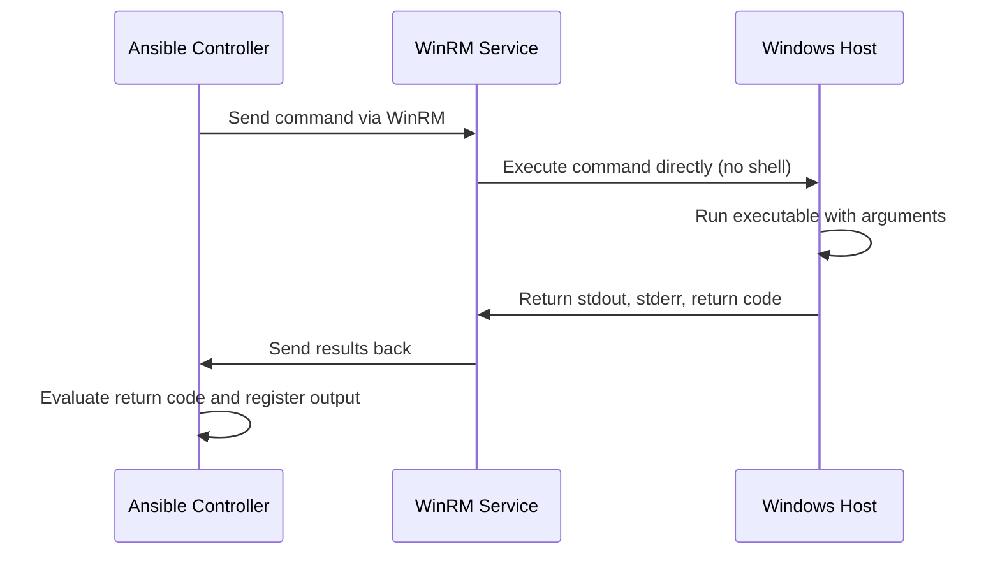

# How to Use Ansible win_command Module

Author: [nawazdhandala](https://www.github.com/nawazdhandala)

Tags: Ansible, Windows, PowerShell, Automation, DevOps

Description: Learn how to use the Ansible win_command module to run commands on Windows hosts, including practical examples for system administration tasks.

---

The `win_command` module is one of the most fundamental modules for managing Windows hosts with Ansible. It runs commands directly on Windows machines without going through the shell, which makes it both predictable and secure. If you have ever needed to execute a quick command on dozens of Windows servers at once, this module is your starting point.

## What win_command Does and When to Use It

The `win_command` module executes a command on a Windows host and returns the output. Unlike `win_shell`, it does not process the command through the Windows command shell (cmd.exe or PowerShell). This means you cannot use shell features like pipes, redirects, or environment variable expansion directly in the command string.

Use `win_command` when:
- You need to run a single executable with arguments
- You want predictable behavior without shell interpretation
- Security matters and you want to avoid shell injection risks

Use `win_shell` instead when:
- You need piping, redirection, or shell built-ins
- You need environment variable expansion in the command

## Basic Syntax

Here is the simplest way to use `win_command` in a playbook.

```yaml
# basic-command.yml - Run a simple command on Windows hosts
---
- name: Run basic commands on Windows
  hosts: windows_servers
  tasks:
    - name: Check the hostname
      ansible.windows.win_command: hostname
      register: hostname_result

    - name: Display the hostname
      ansible.builtin.debug:
        msg: "Server hostname is {{ hostname_result.stdout_lines[0] }}"
```

## Running Commands with Arguments

You can pass arguments to executables just like you would on the command line.

```yaml
# command-with-args.yml - Run commands with various arguments
---
- name: Execute commands with arguments
  hosts: windows_servers
  tasks:
    # Check IP configuration on the host
    - name: Get IP configuration
      ansible.windows.win_command: ipconfig /all
      register: ip_info

    # Query a specific Windows service status
    - name: Check Windows Update service status
      ansible.windows.win_command: sc query wuauserv
      register: wu_status

    # Run netstat to find listening ports
    - name: List listening TCP ports
      ansible.windows.win_command: netstat -an -p TCP
      register: listening_ports

    - name: Show listening ports
      ansible.builtin.debug:
        var: listening_ports.stdout_lines
```

## Using chdir to Set Working Directory

The `chdir` parameter lets you specify the directory where the command should run. This is useful when a command depends on being in a specific directory.

```yaml
# chdir-example.yml - Run commands from a specific directory
---
- name: Run commands in specific directories
  hosts: windows_servers
  tasks:
    # List files in the Windows Temp directory
    - name: List temp directory contents
      ansible.windows.win_command: cmd /c dir
      args:
        chdir: C:\Windows\Temp
      register: temp_files

    # Run a script that expects to be in a certain folder
    - name: Run application installer
      ansible.windows.win_command: setup.exe /quiet /norestart
      args:
        chdir: C:\Installers\MyApp
```

## Conditional Execution with creates and removes

The `creates` and `removes` parameters let you make command execution idempotent. The command only runs if a file does or does not exist.

```yaml
# idempotent-commands.yml - Only run commands when needed
---
- name: Idempotent command execution
  hosts: windows_servers
  tasks:
    # Only run the installer if the application is not already installed
    - name: Install application only if not present
      ansible.windows.win_command: C:\Installers\app-setup.exe /silent
      args:
        creates: C:\Program Files\MyApp\myapp.exe

    # Only run cleanup if the log file exists
    - name: Clean up old log files
      ansible.windows.win_command: cmd /c del C:\Logs\old_application.log
      args:
        removes: C:\Logs\old_application.log
```

## Capturing and Using Output

The `register` keyword stores the command output, which you can use in subsequent tasks.

```yaml
# capture-output.yml - Capture command output and act on it
---
- name: Capture and use command output
  hosts: windows_servers
  tasks:
    # Get the system uptime using systeminfo
    - name: Get system information
      ansible.windows.win_command: systeminfo
      register: sysinfo

    # Parse the output to find the OS version
    - name: Show OS version from systeminfo
      ansible.builtin.debug:
        msg: "{{ sysinfo.stdout_lines | select('match', '.*OS Name.*') | list }}"

    # Check disk space using wmic
    - name: Check disk space
      ansible.windows.win_command: wmic logicaldisk get size,freespace,caption
      register: disk_info

    - name: Display disk information
      ansible.builtin.debug:
        var: disk_info.stdout_lines
```

## Error Handling

By default, `win_command` considers any non-zero return code as a failure. You can customize this behavior.

```yaml
# error-handling.yml - Handle errors gracefully
---
- name: Handle command errors
  hosts: windows_servers
  tasks:
    # Some commands return non-zero codes for legitimate reasons
    - name: Run a command that might fail
      ansible.windows.win_command: robocopy C:\Source C:\Dest /MIR
      register: robocopy_result
      # Robocopy returns 1 for successful copies, so we ignore errors
      failed_when: robocopy_result.rc > 7

    # Continue even if this command fails
    - name: Try to stop a service that might not exist
      ansible.windows.win_command: net stop NonExistentService
      register: stop_result
      ignore_errors: true

    - name: Report if service was not found
      ansible.builtin.debug:
        msg: "Service not found, skipping"
      when: stop_result.rc != 0
```

## Real-World Example: System Health Check

Here is a complete playbook that runs a health check across your Windows fleet.

```yaml
# health-check.yml - Comprehensive Windows health check
---
- name: Windows Server Health Check
  hosts: windows_servers
  gather_facts: false
  tasks:
    - name: Get hostname
      ansible.windows.win_command: hostname
      register: host_name

    - name: Check DNS resolution
      ansible.windows.win_command: nslookup google.com
      register: dns_check
      ignore_errors: true

    - name: Get uptime via net statistics
      ansible.windows.win_command: net statistics server
      register: uptime_info

    - name: Check available memory
      ansible.windows.win_command: >
        wmic OS get FreePhysicalMemory,TotalVisibleMemorySize /value
      register: memory_info

    - name: Check critical services
      ansible.windows.win_command: "sc query {{ item }}"
      register: service_checks
      loop:
        - W3SVC
        - MSSQLSERVER
        - wuauserv
      ignore_errors: true

    - name: Build health report
      ansible.builtin.debug:
        msg: |
          === Health Report for {{ host_name.stdout | trim }} ===
          DNS Resolution: {{ 'OK' if dns_check.rc == 0 else 'FAILED' }}
          Memory Info: {{ memory_info.stdout | trim }}
```

## Execution Flow

Here is how the `win_command` module processes a command.



## Common Pitfalls

There are a few things that trip people up when using `win_command`:

1. **No shell features**: You cannot use `|`, `>`, `<`, or `&&` in the command. If you need those, use `win_shell`.
2. **No environment variable expansion**: `%TEMP%` will not expand. Use the `environment` keyword in the task instead.
3. **Path separators**: Use backslashes for Windows paths, or forward slashes which Windows also accepts.
4. **Long commands**: If your command is getting complex, consider writing a PowerShell script and using `win_script` instead.

## win_command vs win_shell Quick Reference

| Feature | win_command | win_shell |
|---------|------------|-----------|
| Shell interpretation | No | Yes |
| Pipes and redirects | No | Yes |
| Environment variables | No | Yes |
| Security | Higher | Lower |
| Predictability | Higher | Lower |

## Summary

The `win_command` module is the safest way to run executables on Windows hosts through Ansible. It skips the shell layer entirely, which eliminates a whole category of potential issues. For straightforward command execution where you do not need shell features, always prefer `win_command` over `win_shell`. Combine it with `creates`, `removes`, and `register` to build robust, idempotent automation workflows for your Windows infrastructure.
