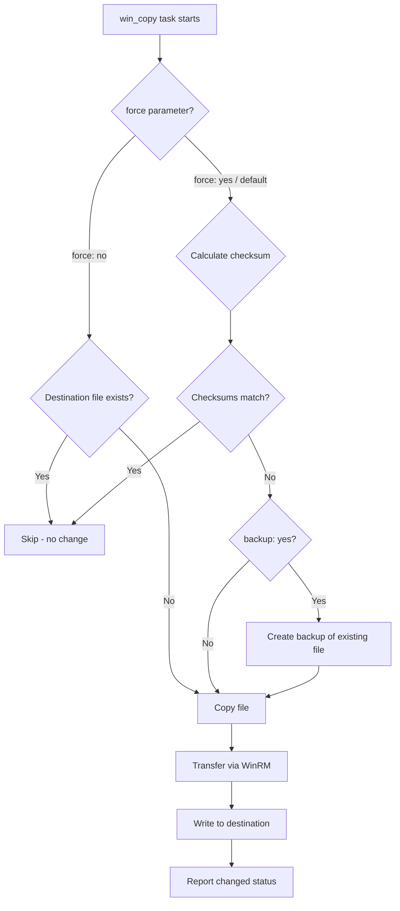

# How to Use Ansible win_copy Module

Author: [nawazdhandala](https://www.github.com/nawazdhandala)

Tags: Ansible, Windows, File Management, Automation

Description: Learn how to use the Ansible win_copy module to transfer files and content to Windows hosts with practical deployment examples.

---

Deploying configuration files, scripts, and application binaries to Windows servers is a daily task for most ops teams. The `win_copy` module handles this by transferring files from your Ansible controller to Windows hosts over WinRM. It supports copying local files, directories, and even inline content directly to the remote machine.

## How win_copy Works

The `win_copy` module reads a file from the Ansible controller (or generates content from a string) and writes it to a specified path on the Windows host. It uses WinRM to transfer the data, which means the file gets base64-encoded during transit. For large files, this can be slower than SCP/SFTP on Linux, so keep that in mind when planning transfers of multi-gigabyte files.

## Copying a Single File

The most basic operation is copying one file from the controller to a Windows host.

```yaml
# copy-single-file.yml - Copy a configuration file to Windows
---
- name: Copy files to Windows servers
  hosts: windows_servers
  tasks:
    # Copy a config file to the application directory
    - name: Deploy application config
      ansible.windows.win_copy:
        src: files/app-config.xml
        dest: C:\Program Files\MyApp\config.xml
```

The `src` path is relative to the playbook's `files/` directory by default, following standard Ansible file lookup rules. You can also specify an absolute path on the controller.

## Copying with Content

Sometimes you do not have a file on disk. You just want to write a string to a file on the remote host. The `content` parameter handles this.

```yaml
# copy-content.yml - Write inline content to a remote file
---
- name: Write content directly to Windows hosts
  hosts: windows_servers
  tasks:
    # Create a simple batch script from inline content
    - name: Create startup batch script
      ansible.windows.win_copy:
        content: |
          @echo off
          REM Application startup script
          cd /d C:\App
          echo Starting application at %DATE% %TIME% >> C:\App\startup.log
          start /B myapp.exe --config config.xml
        dest: C:\App\start.bat

    # Write a JSON config file from a variable
    - name: Write JSON configuration
      ansible.windows.win_copy:
        content: "{{ app_config | to_nice_json }}"
        dest: C:\App\settings.json
```

## Copying Directories

You can copy entire directory trees by pointing `src` at a directory. Pay attention to the trailing slash behavior.

```yaml
# copy-directory.yml - Copy directories to Windows hosts
---
- name: Copy directories to Windows
  hosts: windows_servers
  tasks:
    # Without trailing slash: copies the directory itself
    # Result: C:\Deploy\web-assets\css\, C:\Deploy\web-assets\js\, etc.
    - name: Copy web assets directory
      ansible.windows.win_copy:
        src: web-assets
        dest: C:\Deploy\

    # With trailing slash: copies only the contents
    # Result: C:\Deploy\css\, C:\Deploy\js\, etc.
    - name: Copy web assets contents only
      ansible.windows.win_copy:
        src: web-assets/
        dest: C:\Deploy\
```

The trailing slash distinction is important. Without it, the directory name becomes part of the destination path. With it, only the contents are copied.

## Backup Before Overwriting

The `backup` parameter creates a timestamped backup of the existing file before overwriting it.

```yaml
# copy-with-backup.yml - Create backups before overwriting files
---
- name: Copy with backup
  hosts: windows_servers
  tasks:
    # Back up the existing config before deploying new one
    - name: Deploy new config with backup
      ansible.windows.win_copy:
        src: files/web.config
        dest: C:\inetpub\wwwroot\web.config
        backup: yes
      register: copy_result

    - name: Show backup file path
      ansible.builtin.debug:
        msg: "Backup created at {{ copy_result.backup_file }}"
      when: copy_result.backup_file is defined
```

## Setting File Permissions

You can control who can access the copied file on the remote host.

```yaml
# copy-permissions.yml - Copy files with specific permissions
---
- name: Copy files with permissions
  hosts: windows_servers
  tasks:
    # Copy a sensitive file and restrict access
    - name: Deploy database connection string file
      ansible.windows.win_copy:
        src: files/db-connection.config
        dest: C:\App\db-connection.config

    # After copying, set strict permissions
    - name: Restrict file access
      ansible.windows.win_acl:
        path: C:\App\db-connection.config
        user: BUILTIN\Users
        rights: Read
        type: deny
        state: present
```

## Forced and Conditional Copy

By default, `win_copy` uses checksums to determine whether a file needs to be updated. You can control this behavior.

```yaml
# conditional-copy.yml - Control when files get copied
---
- name: Conditional file copying
  hosts: windows_servers
  tasks:
    # Force copy even if the file has not changed
    - name: Always overwrite the file
      ansible.windows.win_copy:
        src: files/always-fresh.txt
        dest: C:\App\always-fresh.txt
        force: yes

    # Only copy if the destination does not exist
    - name: Copy only if missing
      ansible.windows.win_copy:
        src: files/initial-config.xml
        dest: C:\App\config.xml
        force: no
```

Setting `force: no` is useful for deploying default configurations that should not be overwritten if someone has customized them on the server.

## Real-World Example: Application Deployment

Here is a complete playbook that deploys a web application to Windows IIS servers.

```yaml
# deploy-webapp.yml - Full web application deployment
---
- name: Deploy Web Application
  hosts: iis_servers
  vars:
    app_name: "CustomerPortal"
    app_path: "C:\\inetpub\\{{ app_name }}"
    deploy_version: "3.2.1"

  tasks:
    - name: Create application directory
      ansible.windows.win_file:
        path: "{{ app_path }}"
        state: directory

    - name: Stop IIS site before deployment
      ansible.windows.win_shell: |
        Import-Module WebAdministration
        Stop-Website -Name "{{ app_name }}"
      ignore_errors: true

    - name: Back up current deployment
      ansible.windows.win_copy:
        src: "{{ app_path }}\\"
        dest: "C:\\Backups\\{{ app_name }}\\{{ ansible_date_time.iso8601_basic }}\\"
        remote_src: true
      ignore_errors: true

    - name: Deploy application files
      ansible.windows.win_copy:
        src: "builds/{{ deploy_version }}/"
        dest: "{{ app_path }}\\"
        force: yes

    - name: Deploy environment-specific config
      ansible.windows.win_copy:
        content: |
          <?xml version="1.0" encoding="utf-8"?>
          <configuration>
            <connectionStrings>
              <add name="DefaultConnection"
                   connectionString="{{ db_connection_string }}" />
            </connectionStrings>
            <appSettings>
              <add key="Environment" value="{{ env_name }}" />
              <add key="Version" value="{{ deploy_version }}" />
            </appSettings>
          </configuration>
        dest: "{{ app_path }}\\web.config"
        backup: yes

    - name: Start IIS site after deployment
      ansible.windows.win_shell: |
        Import-Module WebAdministration
        Start-Website -Name "{{ app_name }}"
```

## Copy Process Flow

Here is how `win_copy` decides whether to transfer a file.



## Performance Tips

WinRM file transfers are not the fastest because of the base64 encoding overhead. Here are some practical tips:

- For files over 50 MB, consider using `win_get_url` to download from a file share or HTTP server instead.
- Use `win_copy` with `remote_src: true` to copy files that already exist on the Windows host to a new location without transferring over the network.
- When deploying many small files, consider zipping them first, copying the archive, and extracting on the remote host.

## Summary

The `win_copy` module is your primary tool for getting files onto Windows hosts through Ansible. Between direct file copies, inline content, directory transfers, and backup support, it covers the majority of file deployment scenarios. For large files, combine it with `win_get_url` or network shares, and always use `backup: yes` when overwriting critical configuration files in production.
