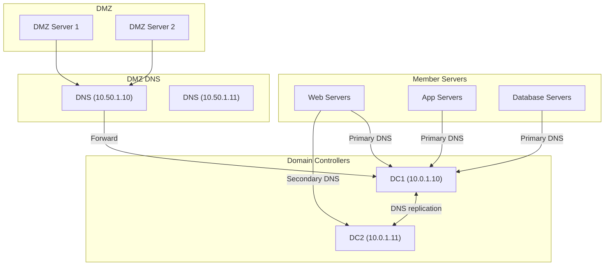

# How to Use Ansible win_dns_client Module

Author: [nawazdhandala](https://www.github.com/nawazdhandala)

Tags: Ansible, Windows, DNS, Networking, Automation

Description: Configure DNS client settings on Windows hosts using the Ansible win_dns_client module for network adapter DNS server assignments.

---

DNS configuration is one of those foundational settings that, when wrong, breaks everything. Applications cannot find databases, servers cannot authenticate against Active Directory, and monitoring tools go blind. The `win_dns_client` module lets you set DNS server addresses on specific network adapters across your Windows fleet, keeping DNS configuration consistent and correct.

## How win_dns_client Works

The module configures the DNS server list for a specified network adapter on a Windows host. It directly sets the DNS server IP addresses that the adapter uses to resolve domain names. This is equivalent to changing the DNS settings in the Network Adapter properties dialog, but automated and consistent.

## Setting DNS Servers on an Adapter

The basic operation sets one or more DNS server addresses on a network adapter.

```yaml
# basic-dns.yml - Set DNS servers on a network adapter
---
- name: Configure DNS client settings
  hosts: windows_servers
  tasks:
    # Set primary and secondary DNS servers
    - name: Configure DNS on Ethernet adapter
      ansible.windows.win_dns_client:
        adapter_names: Ethernet
        dns_servers:
          - 10.0.1.10
          - 10.0.1.11
```

The adapter name must match exactly what Windows shows in Network Connections. Common names include `Ethernet`, `Ethernet0`, `Local Area Connection`, or custom names assigned by your organization.

## Discovering Adapter Names

If you are not sure what the adapter names are, you can discover them first.

```yaml
# discover-adapters.yml - Find network adapter names
---
- name: Discover network adapters
  hosts: windows_servers
  tasks:
    # List all network adapters
    - name: Get network adapter names
      ansible.windows.win_shell: |
        Get-NetAdapter | Select-Object Name, InterfaceDescription, Status, MacAddress |
          Format-Table -AutoSize
      register: adapters

    - name: Show adapters
      ansible.builtin.debug:
        var: adapters.stdout_lines

    # Get current DNS configuration
    - name: Get current DNS settings
      ansible.windows.win_shell: |
        Get-DnsClientServerAddress -AddressFamily IPv4 |
          Select-Object InterfaceAlias, ServerAddresses |
          Format-Table -AutoSize
      register: dns_settings

    - name: Show current DNS
      ansible.builtin.debug:
        var: dns_settings.stdout_lines
```

## Configuring Multiple Adapters

Servers with multiple network adapters (management, production, backup) often need different DNS settings on each one.

```yaml
# multi-adapter-dns.yml - Configure DNS on multiple adapters
---
- name: Configure DNS on multiple adapters
  hosts: windows_servers
  tasks:
    # Production network adapter
    - name: Configure production network DNS
      ansible.windows.win_dns_client:
        adapter_names: "Production Network"
        dns_servers:
          - 10.0.1.10
          - 10.0.1.11
          - 10.0.2.10

    # Management network adapter
    - name: Configure management network DNS
      ansible.windows.win_dns_client:
        adapter_names: "Management Network"
        dns_servers:
          - 10.100.1.10
          - 10.100.1.11

    # Backup network - use the same DNS or disable
    - name: Configure backup network DNS
      ansible.windows.win_dns_client:
        adapter_names: "Backup Network"
        dns_servers:
          - 10.200.1.10
```

## Using Wildcards for Adapter Names

You can use the wildcard `*` to apply DNS settings to all adapters at once.

```yaml
# wildcard-dns.yml - Set DNS on all adapters
---
- name: Set DNS on all network adapters
  hosts: windows_servers
  tasks:
    # Apply DNS to all adapters
    - name: Set DNS on all adapters
      ansible.windows.win_dns_client:
        adapter_names: '*'
        dns_servers:
          - 10.0.1.10
          - 10.0.1.11
```

This is convenient for simple setups where all adapters should use the same DNS servers.

## Setting DNS to DHCP

To revert to DHCP-assigned DNS servers, pass an empty list.

```yaml
# dhcp-dns.yml - Revert to DHCP-assigned DNS
---
- name: Revert DNS to DHCP
  hosts: windows_servers
  tasks:
    - name: Set adapter to use DHCP DNS
      ansible.windows.win_dns_client:
        adapter_names: Ethernet
        dns_servers: []
```

## Real-World Example: Data Center DNS Configuration

Here is a practical playbook that configures DNS across different server tiers in a data center.

```yaml
# datacenter-dns.yml - Configure DNS for all server tiers
---
- name: Configure DNS for Domain Controllers
  hosts: domain_controllers
  tasks:
    # Domain controllers should point to each other
    - name: Set DNS on DC1
      ansible.windows.win_dns_client:
        adapter_names: Ethernet
        dns_servers:
          - 10.0.1.11
          - 10.0.1.10
          - 127.0.0.1
      when: inventory_hostname == 'dc01'

    - name: Set DNS on DC2
      ansible.windows.win_dns_client:
        adapter_names: Ethernet
        dns_servers:
          - 10.0.1.10
          - 10.0.1.11
          - 127.0.0.1
      when: inventory_hostname == 'dc02'

- name: Configure DNS for Member Servers
  hosts: member_servers
  vars:
    primary_dns: 10.0.1.10
    secondary_dns: 10.0.1.11
    tertiary_dns: 10.0.2.10

  tasks:
    - name: Set DNS on all member servers
      ansible.windows.win_dns_client:
        adapter_names: Ethernet
        dns_servers:
          - "{{ primary_dns }}"
          - "{{ secondary_dns }}"
          - "{{ tertiary_dns }}"

    # Verify DNS resolution works
    - name: Test DNS resolution
      ansible.windows.win_command: nslookup corp.local
      register: dns_test
      failed_when: dns_test.rc != 0

    - name: Test external DNS resolution
      ansible.windows.win_command: nslookup google.com
      register: external_dns_test
      failed_when: external_dns_test.rc != 0

- name: Configure DNS for DMZ Servers
  hosts: dmz_servers
  tasks:
    # DMZ servers use different DNS that can resolve external names
    - name: Set DMZ DNS servers
      ansible.windows.win_dns_client:
        adapter_names: '*'
        dns_servers:
          - 10.50.1.10
          - 10.50.1.11
```

## DNS Configuration Architecture

Here is how DNS typically flows in a multi-tier Windows environment.



## Combining with Other DNS Settings

The `win_dns_client` module handles DNS server addresses. For other DNS settings like suffixes and search order, use `win_shell` with PowerShell cmdlets.

```yaml
# full-dns-config.yml - Complete DNS client configuration
---
- name: Complete DNS client configuration
  hosts: windows_servers
  vars:
    dns_servers:
      - 10.0.1.10
      - 10.0.1.11
    dns_suffix: corp.local
    dns_search_list:
      - corp.local
      - dev.corp.local
      - prod.corp.local

  tasks:
    # Set DNS server addresses
    - name: Configure DNS servers
      ansible.windows.win_dns_client:
        adapter_names: Ethernet
        dns_servers: "{{ dns_servers }}"

    # Set DNS suffix search list
    - name: Configure DNS suffix search list
      ansible.windows.win_shell: |
        Set-DnsClientGlobalSetting -SuffixSearchList @('{{ dns_search_list | join("','") }}')

    # Set connection-specific DNS suffix
    - name: Set connection DNS suffix
      ansible.windows.win_shell: |
        Set-DnsClient -InterfaceAlias "Ethernet" -ConnectionSpecificSuffix "{{ dns_suffix }}"

    # Register this host in DNS
    - name: Register DNS
      ansible.windows.win_shell: |
        Register-DnsClient

    # Verify the configuration
    - name: Verify DNS configuration
      ansible.windows.win_shell: |
        $config = @{
            DNSServers = (Get-DnsClientServerAddress -InterfaceAlias "Ethernet" -AddressFamily IPv4).ServerAddresses
            SuffixSearchList = (Get-DnsClientGlobalSetting).SuffixSearchList
            ConnectionSuffix = (Get-DnsClient -InterfaceAlias "Ethernet").ConnectionSpecificSuffix
        }
        $config | ConvertTo-Json
      register: dns_verify

    - name: Show DNS configuration
      ansible.builtin.debug:
        var: dns_verify.stdout | from_json
```

## Troubleshooting DNS Issues

Here is a quick diagnostic playbook you can run when DNS is not working correctly.

```yaml
# dns-troubleshoot.yml - Diagnose DNS issues
---
- name: Troubleshoot DNS Configuration
  hosts: windows_servers
  tasks:
    - name: Show current DNS configuration
      ansible.windows.win_shell: |
        Get-DnsClientServerAddress -AddressFamily IPv4 |
          Select-Object InterfaceAlias, ServerAddresses | Format-List
      register: current_dns

    - name: Test internal DNS resolution
      ansible.windows.win_shell: |
        Resolve-DnsName -Name corp.local -Type A -ErrorAction SilentlyContinue |
          Select-Object Name, IPAddress | Format-Table
      register: internal_dns
      ignore_errors: true

    - name: Test external DNS resolution
      ansible.windows.win_shell: |
        Resolve-DnsName -Name google.com -Type A -ErrorAction SilentlyContinue |
          Select-Object Name, IPAddress | Format-Table
      register: external_dns
      ignore_errors: true

    - name: Check DNS cache
      ansible.windows.win_shell: |
        Get-DnsClientCache | Select-Object -First 20 Entry, RecordName, Data | Format-Table
      register: dns_cache

    - name: Report DNS status
      ansible.builtin.debug:
        msg: |
          DNS Configuration: {{ current_dns.stdout }}
          Internal Resolution: {{ 'OK' if internal_dns.rc == 0 else 'FAILED' }}
          External Resolution: {{ 'OK' if external_dns.rc == 0 else 'FAILED' }}
```

## Summary

The `win_dns_client` module is a focused tool that does one thing well: it sets DNS server addresses on Windows network adapters. In a Windows Active Directory environment, correct DNS is absolutely critical for authentication, group policy, and service location. Use this module to ensure every server in your fleet points to the right DNS servers, and combine it with PowerShell commands for more advanced DNS client settings like suffix search lists and dynamic registration.
