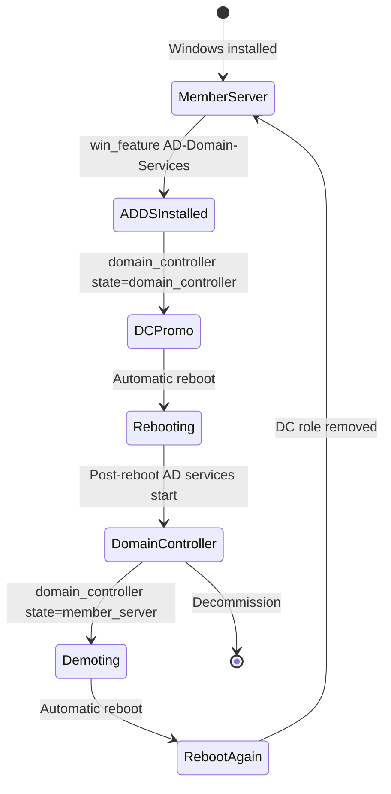

# How to Use Ansible win_domain_controller Module

Author: [nawazdhandala](https://www.github.com/nawazdhandala)

Tags: Ansible, Windows, Active Directory, Domain Controller, Automation

Description: Promote and demote Windows servers as domain controllers using the Ansible win_domain_controller module for AD infrastructure automation.

---

A single domain controller is a single point of failure for your entire Active Directory environment. You need at least two DCs per domain, and larger organizations run many more spread across data centers and sites. The `win_domain_controller` module handles promoting member servers to domain controllers and demoting DCs back to member servers, all through Ansible.

## What win_domain_controller Does

This module manages the domain controller role on a Windows server. It can:
- Promote a member server to a domain controller (adding it to an existing domain)
- Promote a server as a read-only domain controller (RODC)
- Demote a domain controller back to a member server
- Configure the DC's DNS and Global Catalog settings

## Prerequisites

Before promoting a server, install the AD DS role and configure DNS.

```yaml
# dc-prerequisites.yml - Prepare a server for DC promotion
---
- name: Prepare server for DC promotion
  hosts: new_dc
  vars:
    primary_dns: 10.0.1.10
    domain_name: corp.example.com

  tasks:
    # Point DNS to an existing DC
    - name: Configure DNS to point to existing DC
      ansible.windows.win_dns_client:
        adapter_names: Ethernet
        dns_servers:
          - "{{ primary_dns }}"

    # Verify DNS resolution for the domain
    - name: Verify domain DNS resolution
      ansible.windows.win_command: nslookup {{ domain_name }}
      register: dns_test
      failed_when: dns_test.rc != 0

    # Install AD DS role
    - name: Install Active Directory Domain Services
      ansible.windows.win_feature:
        name:
          - AD-Domain-Services
          - RSAT-AD-Tools
        include_management_tools: yes
        state: present
      register: adds_install

    - name: Reboot if AD DS installation requires it
      ansible.windows.win_reboot:
      when: adds_install.reboot_required
```

## Promoting a Member Server to Domain Controller

Here is how to add a new domain controller to an existing domain.

```yaml
# promote-dc.yml - Promote server to domain controller
---
- name: Promote Server to Domain Controller
  hosts: new_dc
  vars:
    domain_name: corp.example.com
    domain_admin: CORP\Administrator
    domain_admin_password: "{{ vault_domain_admin_password }}"
    dsrm_password: "{{ vault_dsrm_password }}"

  tasks:
    - name: Install AD DS role
      ansible.windows.win_feature:
        name: AD-Domain-Services
        include_management_tools: yes
        state: present
      register: role_install

    - name: Reboot if needed
      ansible.windows.win_reboot:
      when: role_install.reboot_required

    # Promote to domain controller
    - name: Promote to domain controller
      microsoft.ad.domain_controller:
        dns_domain_name: "{{ domain_name }}"
        domain_admin_user: "{{ domain_admin }}"
        domain_admin_password: "{{ domain_admin_password }}"
        safe_mode_password: "{{ dsrm_password }}"
        install_dns: true
        state: domain_controller
      register: dc_promo

    # The server reboots after promotion
    - name: Reboot after DC promotion
      ansible.windows.win_reboot:
        reboot_timeout: 900
        post_reboot_delay: 120
      when: dc_promo.reboot_required

    # Verify the DC is operational
    - name: Verify DC promotion
      ansible.windows.win_shell: |
        Get-ADDomainController -Identity $env:COMPUTERNAME |
          Select-Object Name, Domain, Forest, Site, IsGlobalCatalog, IsReadOnly |
          Format-List
      register: dc_verify

    - name: Show DC info
      ansible.builtin.debug:
        var: dc_verify.stdout_lines
```

## Promoting a Read-Only Domain Controller

Read-only domain controllers (RODCs) are used in branch offices and remote sites where physical security is limited.

```yaml
# promote-rodc.yml - Promote server as RODC
---
- name: Promote Server as Read-Only Domain Controller
  hosts: branch_office_dc
  vars:
    domain_name: corp.example.com
    domain_admin: CORP\Administrator
    domain_admin_password: "{{ vault_domain_admin_password }}"
    dsrm_password: "{{ vault_dsrm_password }}"

  tasks:
    - name: Install AD DS role
      ansible.windows.win_feature:
        name: AD-Domain-Services
        include_management_tools: yes
        state: present
      register: role_install

    - name: Reboot if needed
      ansible.windows.win_reboot:
      when: role_install.reboot_required

    # Promote as RODC
    - name: Promote as read-only domain controller
      microsoft.ad.domain_controller:
        dns_domain_name: "{{ domain_name }}"
        domain_admin_user: "{{ domain_admin }}"
        domain_admin_password: "{{ domain_admin_password }}"
        safe_mode_password: "{{ dsrm_password }}"
        install_dns: true
        read_only: true
        site_name: BranchOffice01
        state: domain_controller
      register: rodc_promo

    - name: Reboot after RODC promotion
      ansible.windows.win_reboot:
        reboot_timeout: 900
        post_reboot_delay: 120
      when: rodc_promo.reboot_required
```

## Demoting a Domain Controller

When decommissioning a DC, you need to demote it first to properly clean up AD replication and metadata.

```yaml
# demote-dc.yml - Demote a domain controller
---
- name: Demote Domain Controller
  hosts: old_dc
  vars:
    local_admin_password: "{{ vault_local_admin_password }}"
    domain_admin: CORP\Administrator
    domain_admin_password: "{{ vault_domain_admin_password }}"

  tasks:
    # Verify this is not the last DC in the domain
    - name: Check remaining DCs
      ansible.windows.win_shell: |
        (Get-ADDomainController -Filter *).Count
      register: dc_count

    - name: Fail if this is the last DC
      ansible.builtin.fail:
        msg: "Cannot demote the last domain controller in the domain!"
      when: dc_count.stdout | trim | int <= 1

    # Transfer FSMO roles if this DC holds any
    - name: Check FSMO role holders
      ansible.windows.win_shell: |
        $dc = $env:COMPUTERNAME
        $forest = Get-ADForest
        $domain = Get-ADDomain
        $roles = @()
        if ($forest.SchemaMaster -match $dc) { $roles += "Schema Master" }
        if ($forest.DomainNamingMaster -match $dc) { $roles += "Domain Naming Master" }
        if ($domain.PDCEmulator -match $dc) { $roles += "PDC Emulator" }
        if ($domain.RIDMaster -match $dc) { $roles += "RID Master" }
        if ($domain.InfrastructureMaster -match $dc) { $roles += "Infrastructure Master" }
        $roles -join ","
      register: fsmo_check

    - name: Warn about FSMO roles
      ansible.builtin.debug:
        msg: "WARNING: This DC holds FSMO roles: {{ fsmo_check.stdout | trim }}. Transfer them before demotion."
      when: fsmo_check.stdout | trim | length > 0

    # Demote the DC
    - name: Demote domain controller
      microsoft.ad.domain_controller:
        domain_admin_user: "{{ domain_admin }}"
        domain_admin_password: "{{ domain_admin_password }}"
        local_admin_password: "{{ local_admin_password }}"
        state: member_server
      register: demote_result

    - name: Reboot after demotion
      ansible.windows.win_reboot:
        reboot_timeout: 600
        post_reboot_delay: 60
      when: demote_result.reboot_required
```

## Real-World Example: Multi-Site DC Deployment

Here is a playbook that deploys domain controllers across multiple AD sites.

```yaml
# multi-site-dc.yml - Deploy DCs to multiple sites
---
- name: Deploy Domain Controllers Across Sites
  hosts: new_domain_controllers
  serial: 1
  vars:
    domain_name: corp.example.com
    domain_admin: CORP\Administrator
    domain_admin_password: "{{ vault_domain_admin_password }}"
    dsrm_password: "{{ vault_dsrm_password }}"

  tasks:
    # Configure DNS to point to existing DCs
    - name: Configure DNS
      ansible.windows.win_dns_client:
        adapter_names: Ethernet
        dns_servers: "{{ existing_dc_ips }}"

    - name: Install AD DS
      ansible.windows.win_feature:
        name: AD-Domain-Services
        include_management_tools: yes
        state: present
      register: role_install

    - name: Reboot if needed
      ansible.windows.win_reboot:
      when: role_install.reboot_required

    # Promote using host-specific variables for site name
    - name: Promote to domain controller
      microsoft.ad.domain_controller:
        dns_domain_name: "{{ domain_name }}"
        domain_admin_user: "{{ domain_admin }}"
        domain_admin_password: "{{ domain_admin_password }}"
        safe_mode_password: "{{ dsrm_password }}"
        install_dns: true
        site_name: "{{ ad_site_name }}"
        state: domain_controller
      register: dc_promo

    - name: Reboot after promotion
      ansible.windows.win_reboot:
        reboot_timeout: 900
        post_reboot_delay: 120
      when: dc_promo.reboot_required

    # Post-promotion health check
    - name: Wait for AD replication
      ansible.windows.win_shell: |
        $maxWait = 300
        $elapsed = 0
        while ($elapsed -lt $maxWait) {
            $repl = repadmin /showrepl /csv | ConvertFrom-Csv
            $failures = $repl | Where-Object { $_.'Number of Failures' -gt 0 }
            if (-not $failures) {
                Write-Output "Replication healthy"
                exit 0
            }
            Start-Sleep -Seconds 30
            $elapsed += 30
        }
        Write-Output "Replication may still be syncing"
      register: repl_check

    - name: Show replication status
      ansible.builtin.debug:
        var: repl_check.stdout_lines
```

## DC Promotion and Demotion Lifecycle

Here is the lifecycle of a domain controller.



## Best Practices

A few things I have learned from deploying DCs with Ansible:

1. **Serial execution**: Always use `serial: 1` when promoting multiple DCs. Promoting them simultaneously can cause replication conflicts.
2. **DNS first**: Make sure DNS resolves the domain name before attempting promotion. Most promotion failures are DNS-related.
3. **DSRM password**: Store it in Ansible Vault and document it separately. You will need it for disaster recovery, and if you lose it, recovery becomes much harder.
4. **Post-promotion delay**: Give AD at least 2 minutes after reboot to fully initialize. The services come up gradually.
5. **FSMO roles**: Before demoting a DC, always check and transfer FSMO roles. Losing FSMO roles can cause domain-wide issues.

## Summary

The `win_domain_controller` module automates the promotion and demotion of domain controllers. Whether you are adding redundancy to your AD infrastructure, deploying to branch offices with RODCs, or decommissioning old hardware, this module handles the heavy lifting. Combined with proper DNS configuration, FSMO role management, and health checks, you can manage your entire AD DC infrastructure through Ansible playbooks.
