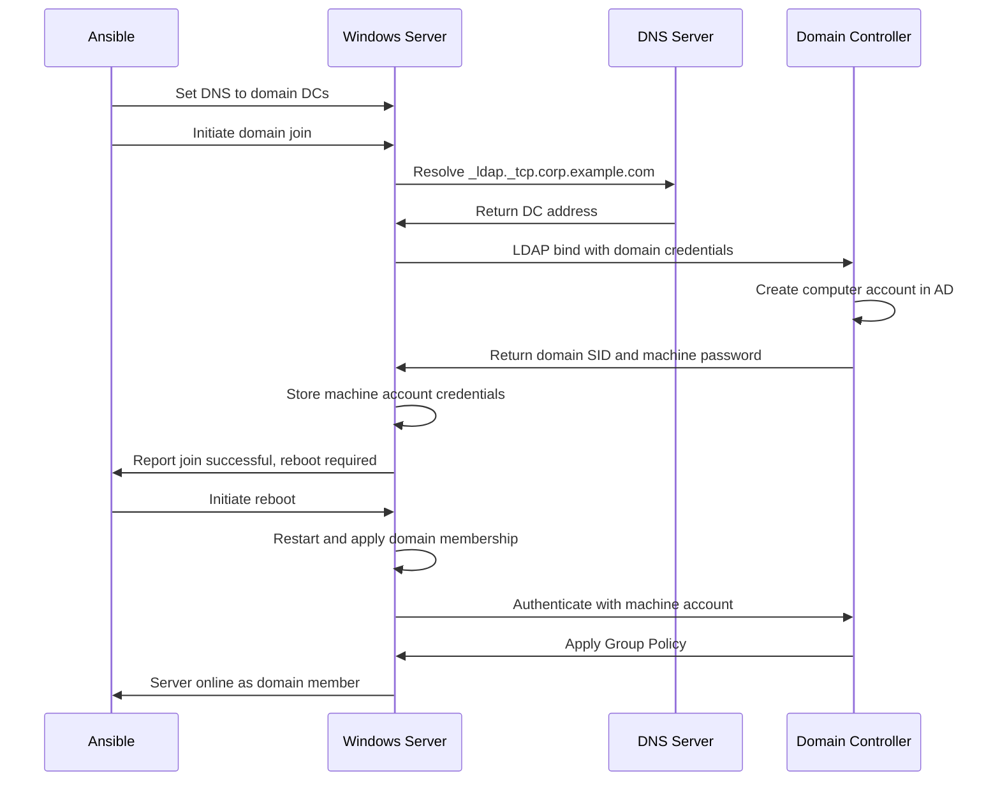

# How to Use Ansible win_domain_membership Module

Author: [nawazdhandala](https://www.github.com/nawazdhandala)

Tags: Ansible, Windows, Active Directory, Domain Join, Automation

Description: Join Windows servers to Active Directory domains and manage domain membership with the Ansible win_domain_membership module.

---

Every Windows server in a corporate environment needs to join an Active Directory domain to participate in centralized authentication, group policy, and management. Doing this manually through System Properties works for one machine, but when you are provisioning 50 servers at once, you need automation. The `win_domain_membership` module handles joining servers to domains, moving them between OUs, and removing them from domains.

## Joining a Server to a Domain

The basic operation is joining a standalone server to an existing AD domain.

```yaml
# join-domain.yml - Join a Windows server to a domain
---
- name: Join Server to Domain
  hosts: new_servers
  vars:
    domain_name: corp.example.com
    domain_admin: CORP\domain_joiner
    domain_admin_password: "{{ vault_domain_joiner_password }}"

  tasks:
    # Configure DNS to point to domain controllers first
    - name: Set DNS to domain controllers
      ansible.windows.win_dns_client:
        adapter_names: Ethernet
        dns_servers:
          - 10.0.1.10
          - 10.0.1.11

    # Verify DNS can resolve the domain
    - name: Verify domain DNS resolution
      ansible.windows.win_command: nslookup {{ domain_name }}
      register: dns_test
      failed_when: dns_test.rc != 0

    # Join the domain
    - name: Join server to domain
      microsoft.ad.membership:
        dns_domain_name: "{{ domain_name }}"
        domain_admin_user: "{{ domain_admin }}"
        domain_admin_password: "{{ domain_admin_password }}"
        state: domain
      register: domain_join

    # Reboot is required after domain join
    - name: Reboot after domain join
      ansible.windows.win_reboot:
        reboot_timeout: 600
        post_reboot_delay: 30
      when: domain_join.reboot_required
```

The reboot is mandatory after joining a domain. The server needs to restart to apply the new domain membership and start receiving Group Policy.

## Joining to a Specific OU

By default, new computer accounts land in the default Computers container. You can place them in a specific Organizational Unit during the join.

```yaml
# join-with-ou.yml - Join domain and place in specific OU
---
- name: Join Server to Domain in Specific OU
  hosts: new_web_servers
  vars:
    domain_name: corp.example.com
    domain_admin: CORP\domain_joiner
    domain_admin_password: "{{ vault_domain_joiner_password }}"
    target_ou: "OU=WebServers,OU=Servers,DC=corp,DC=example,DC=com"

  tasks:
    - name: Set DNS servers
      ansible.windows.win_dns_client:
        adapter_names: Ethernet
        dns_servers:
          - 10.0.1.10
          - 10.0.1.11

    # Join domain and place in the WebServers OU
    - name: Join domain in specific OU
      microsoft.ad.membership:
        dns_domain_name: "{{ domain_name }}"
        domain_admin_user: "{{ domain_admin }}"
        domain_admin_password: "{{ domain_admin_password }}"
        domain_ou_path: "{{ target_ou }}"
        state: domain
      register: domain_join

    - name: Reboot after domain join
      ansible.windows.win_reboot:
        reboot_timeout: 600
        post_reboot_delay: 30
      when: domain_join.reboot_required
```

## Renaming and Joining Simultaneously

You can set the hostname before or during the domain join.

```yaml
# rename-and-join.yml - Set hostname and join domain
---
- name: Rename and Join Domain
  hosts: new_servers
  vars:
    domain_name: corp.example.com
    domain_admin: CORP\domain_joiner
    domain_admin_password: "{{ vault_domain_joiner_password }}"

  tasks:
    # Set the hostname first if needed
    - name: Set server hostname
      ansible.windows.win_hostname:
        name: "{{ target_hostname }}"
      register: hostname_change

    - name: Reboot after hostname change
      ansible.windows.win_reboot:
      when: hostname_change.reboot_required

    # Now join the domain
    - name: Join domain
      microsoft.ad.membership:
        dns_domain_name: "{{ domain_name }}"
        domain_admin_user: "{{ domain_admin }}"
        domain_admin_password: "{{ domain_admin_password }}"
        hostname: "{{ target_hostname }}"
        state: domain
      register: domain_join

    - name: Reboot after domain join
      ansible.windows.win_reboot:
        reboot_timeout: 600
        post_reboot_delay: 30
      when: domain_join.reboot_required
```

## Removing a Server from a Domain

When decommissioning a server, you should remove it from the domain to clean up the computer account.

```yaml
# leave-domain.yml - Remove server from domain
---
- name: Remove Server from Domain
  hosts: decommissioned_servers
  vars:
    domain_admin: CORP\domain_joiner
    domain_admin_password: "{{ vault_domain_joiner_password }}"
    workgroup_name: WORKGROUP

  tasks:
    # Remove from domain and join a workgroup
    - name: Remove from domain
      microsoft.ad.membership:
        domain_admin_user: "{{ domain_admin }}"
        domain_admin_password: "{{ domain_admin_password }}"
        workgroup_name: "{{ workgroup_name }}"
        state: workgroup
      register: domain_leave

    - name: Reboot after leaving domain
      ansible.windows.win_reboot:
      when: domain_leave.reboot_required

    # Clean up the computer account in AD
    - name: Remove computer account from AD
      ansible.windows.win_shell: |
        Remove-ADComputer -Identity "{{ inventory_hostname }}" -Confirm:$false
      delegate_to: "{{ groups['domain_controllers'][0] }}"
      ignore_errors: true
```

## Real-World Example: Bulk Server Provisioning

Here is a complete playbook for provisioning multiple servers with different roles into the appropriate OUs.

```yaml
# bulk-provision.yml - Provision multiple servers to their correct OUs
---
- name: Bulk Server Domain Join
  hosts: new_infrastructure
  serial: 5
  vars:
    domain_name: corp.example.com
    domain_admin: CORP\svc_provisioning
    domain_admin_password: "{{ vault_svc_provisioning_password }}"
    dns_servers:
      - 10.0.1.10
      - 10.0.1.11

    # Map server roles to OUs
    ou_map:
      web: "OU=WebServers,OU=Servers,DC=corp,DC=example,DC=com"
      app: "OU=AppServers,OU=Servers,DC=corp,DC=example,DC=com"
      db: "OU=DatabaseServers,OU=Servers,DC=corp,DC=example,DC=com"
      file: "OU=FileServers,OU=Servers,DC=corp,DC=example,DC=com"

  tasks:
    # Configure DNS
    - name: Set DNS servers
      ansible.windows.win_dns_client:
        adapter_names: '*'
        dns_servers: "{{ dns_servers }}"

    # Verify connectivity
    - name: Verify domain DNS resolution
      ansible.windows.win_command: nslookup _ldap._tcp.{{ domain_name }}
      register: ldap_check
      failed_when: ldap_check.rc != 0
      retries: 3
      delay: 5

    # Check if already joined
    - name: Check current domain membership
      ansible.windows.win_shell: |
        (Get-WmiObject Win32_ComputerSystem).Domain
      register: current_domain

    # Join the domain with role-appropriate OU
    - name: Join server to domain
      microsoft.ad.membership:
        dns_domain_name: "{{ domain_name }}"
        domain_admin_user: "{{ domain_admin }}"
        domain_admin_password: "{{ domain_admin_password }}"
        domain_ou_path: "{{ ou_map[server_role] }}"
        state: domain
      register: domain_join
      when: current_domain.stdout | trim | lower != domain_name | lower

    - name: Reboot after domain join
      ansible.windows.win_reboot:
        reboot_timeout: 600
        post_reboot_delay: 45
      when: domain_join is changed

    # Verify domain membership
    - name: Verify domain membership
      ansible.windows.win_shell: |
        $cs = Get-WmiObject Win32_ComputerSystem
        [PSCustomObject]@{
            ComputerName = $cs.Name
            Domain = $cs.Domain
            DomainRole = switch ($cs.DomainRole) {
                0 { "Standalone Workstation" }
                1 { "Member Workstation" }
                2 { "Standalone Server" }
                3 { "Member Server" }
                4 { "Backup DC" }
                5 { "Primary DC" }
            }
        } | ConvertTo-Json
      register: membership_verify

    - name: Show membership status
      ansible.builtin.debug:
        var: membership_verify.stdout | from_json
```

## Domain Join Process

Here is what happens during a domain join operation.



## Troubleshooting Domain Joins

When domain joins fail, it is almost always one of these issues.

```yaml
# troubleshoot-join.yml - Diagnose domain join issues
---
- name: Troubleshoot Domain Join
  hosts: problem_server
  tasks:
    - name: Check DNS resolution
      ansible.windows.win_shell: |
        Write-Output "=== DNS Servers ==="
        Get-DnsClientServerAddress -AddressFamily IPv4 | Format-Table InterfaceAlias, ServerAddresses
        Write-Output "`n=== Domain SRV Records ==="
        Resolve-DnsName -Name _ldap._tcp.dc._msdcs.corp.example.com -Type SRV -ErrorAction SilentlyContinue | Format-Table
        Write-Output "`n=== Domain A Record ==="
        Resolve-DnsName -Name corp.example.com -Type A -ErrorAction SilentlyContinue | Format-Table
      register: dns_diag

    - name: Check network connectivity to DC
      ansible.windows.win_shell: |
        Test-NetConnection -ComputerName 10.0.1.10 -Port 389
        Test-NetConnection -ComputerName 10.0.1.10 -Port 88
        Test-NetConnection -ComputerName 10.0.1.10 -Port 53
      register: net_diag

    - name: Check time synchronization
      ansible.windows.win_shell: |
        w32tm /query /status
      register: time_diag

    - name: Show all diagnostics
      ansible.builtin.debug:
        msg: |
          DNS: {{ dns_diag.stdout }}
          Network: {{ net_diag.stdout }}
          Time: {{ time_diag.stdout }}
```

Common domain join failures:
- **DNS failure**: The server cannot resolve the domain name. Fix DNS settings first.
- **Network connectivity**: Firewall blocking LDAP (389), Kerberos (88), or DNS (53).
- **Time skew**: Kerberos requires clocks to be within 5 minutes. Check NTP sync.
- **Credential issues**: The join account does not have permission to add computers.
- **Duplicate accounts**: A computer account with the same name already exists.

## Summary

The `win_domain_membership` module automates one of the most common tasks in Windows server provisioning. Whether you are joining a single server or 100 servers at once, it handles the domain join, OU placement, and subsequent reboot. Always configure DNS first, verify connectivity to domain controllers, and handle the mandatory reboot in your playbooks. For bulk provisioning, use the `serial` keyword to avoid overwhelming your DCs with simultaneous join requests.
