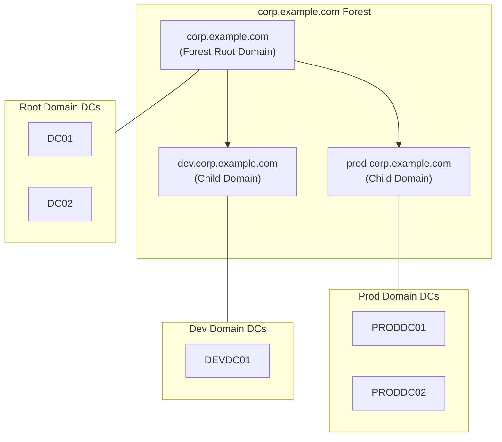

# How to Use Ansible win_domain Module

Author: [nawazdhandala](https://www.github.com/nawazdhandala)

Tags: Ansible, Windows, Active Directory, Domain, Automation

Description: Create and configure Active Directory domains with the Ansible win_domain module including forest creation and domain setup.

---

Setting up an Active Directory domain is typically a multi-step process involving Server Manager, configuration wizards, and reboots. The `win_domain` module compresses this into a single Ansible task, letting you create new AD forests and domains as part of your infrastructure-as-code pipeline. This is particularly valuable for spinning up test environments, disaster recovery scenarios, and greenfield deployments.

## What win_domain Does

The `win_domain` module creates a new Active Directory domain. It can:
- Create a new AD forest with a root domain
- Create a child domain in an existing forest
- Create a new tree in an existing forest

It handles installing the required AD DS role, running dcpromo (or its modern equivalent), and setting up the initial domain configuration.

## Prerequisites

Before using `win_domain`, the target server needs the AD DS role installed. You can use `win_feature` for this.

```yaml
# prerequisites.yml - Install AD DS prerequisites
---
- name: Install AD DS prerequisites
  hosts: new_domain_controllers
  tasks:
    # Install Active Directory Domain Services role
    - name: Install AD DS role
      ansible.windows.win_feature:
        name:
          - AD-Domain-Services
          - RSAT-AD-Tools
          - RSAT-ADDS
        include_management_tools: yes
        state: present
      register: adds_install

    - name: Reboot after AD DS installation
      ansible.windows.win_reboot:
      when: adds_install.reboot_required
```

## Creating a New Forest

The most common operation is creating a brand new AD forest. This is your first domain controller.

```yaml
# new-forest.yml - Create a new AD forest
---
- name: Create New Active Directory Forest
  hosts: first_dc
  tasks:
    - name: Install AD DS role
      ansible.windows.win_feature:
        name: AD-Domain-Services
        include_management_tools: yes
        state: present
      register: adds_install

    - name: Reboot if needed after AD DS install
      ansible.windows.win_reboot:
      when: adds_install.reboot_required

    # Create the new forest and root domain
    - name: Create new AD forest
      microsoft.ad.domain:
        dns_domain_name: corp.example.com
        safe_mode_password: "{{ vault_dsrm_password }}"
        domain_netbios_name: CORP
        install_dns: true
        database_path: C:\Windows\NTDS
        log_path: C:\Windows\NTDS
        sysvol_path: C:\Windows\SYSVOL
      register: domain_result

    # The server will reboot automatically as part of domain creation
    - name: Reboot after domain creation
      ansible.windows.win_reboot:
        reboot_timeout: 900
        post_reboot_delay: 120
      when: domain_result.reboot_required

    # Verify the domain is operational
    - name: Wait for AD DS to be fully operational
      ansible.windows.win_shell: |
        $maxRetries = 30
        $retryCount = 0
        while ($retryCount -lt $maxRetries) {
            try {
                $domain = Get-ADDomain -ErrorAction Stop
                Write-Output "Domain: $($domain.DNSRoot)"
                Write-Output "Forest: $($domain.Forest)"
                Write-Output "DomainMode: $($domain.DomainMode)"
                break
            } catch {
                $retryCount++
                Start-Sleep -Seconds 10
            }
        }
        if ($retryCount -eq $maxRetries) {
            Write-Error "AD DS did not become operational in time"
            exit 1
        }
      register: ad_verify

    - name: Show domain information
      ansible.builtin.debug:
        var: ad_verify.stdout_lines
```

## Creating a Child Domain

You can create a child domain within an existing forest.

```yaml
# child-domain.yml - Create a child domain
---
- name: Create Child Domain
  hosts: child_dc
  tasks:
    - name: Install AD DS role
      ansible.windows.win_feature:
        name: AD-Domain-Services
        include_management_tools: yes
        state: present
      register: adds_install

    - name: Reboot if needed
      ansible.windows.win_reboot:
      when: adds_install.reboot_required

    # Create child domain under existing forest
    - name: Create child domain
      microsoft.ad.domain:
        dns_domain_name: dev.corp.example.com
        safe_mode_password: "{{ vault_dsrm_password }}"
        domain_netbios_name: DEV
        parent_domain_name: corp.example.com
        domain_admin_user: CORP\Administrator
        domain_admin_password: "{{ vault_parent_admin_password }}"
        install_dns: true
      register: child_domain_result

    - name: Reboot after child domain creation
      ansible.windows.win_reboot:
        reboot_timeout: 900
        post_reboot_delay: 120
      when: child_domain_result.reboot_required
```

## Complete Forest Setup Playbook

Here is a comprehensive playbook that creates a new forest with proper DNS configuration.

```yaml
# complete-forest.yml - Full AD forest setup
---
- name: Complete AD Forest Setup
  hosts: first_dc
  vars:
    domain_name: corp.example.com
    netbios_name: CORP
    dsrm_password: "{{ vault_dsrm_password }}"
    dns_forwarder: 8.8.8.8

  tasks:
    # Step 1: Configure static IP (required before domain creation)
    - name: Set static DNS to localhost
      ansible.windows.win_dns_client:
        adapter_names: Ethernet
        dns_servers:
          - 127.0.0.1

    # Step 2: Install prerequisites
    - name: Install AD DS and DNS roles
      ansible.windows.win_feature:
        name:
          - AD-Domain-Services
          - DNS
        include_management_tools: yes
        state: present
      register: role_install

    - name: Reboot if needed
      ansible.windows.win_reboot:
      when: role_install.reboot_required

    # Step 3: Create the forest
    - name: Create AD forest
      microsoft.ad.domain:
        dns_domain_name: "{{ domain_name }}"
        safe_mode_password: "{{ dsrm_password }}"
        domain_netbios_name: "{{ netbios_name }}"
        install_dns: true
        forest_mode: WinThreshold
        domain_mode: WinThreshold
      register: forest_result

    - name: Reboot after forest creation
      ansible.windows.win_reboot:
        reboot_timeout: 900
        post_reboot_delay: 120
      when: forest_result.reboot_required

    # Step 4: Configure DNS forwarders
    - name: Set DNS forwarders for internet resolution
      ansible.windows.win_shell: |
        Add-DnsServerForwarder -IPAddress {{ dns_forwarder }}

    # Step 5: Create initial OU structure
    - name: Create organizational units
      ansible.windows.win_shell: |
        $OUs = @(
            "OU=Servers,DC=corp,DC=example,DC=com",
            "OU=Workstations,DC=corp,DC=example,DC=com",
            "OU=Users,OU=Corp,DC=corp,DC=example,DC=com",
            "OU=Groups,OU=Corp,DC=corp,DC=example,DC=com",
            "OU=ServiceAccounts,DC=corp,DC=example,DC=com"
        )
        foreach ($ou in $OUs) {
            try {
                New-ADOrganizationalUnit -Path ($ou -replace '^OU=[^,]+,', '') -Name ($ou -replace '^OU=([^,]+),.*', '$1') -ErrorAction Stop
                Write-Output "Created: $ou"
            } catch [Microsoft.ActiveDirectory.Management.ADException] {
                Write-Output "Already exists: $ou"
            }
        }
      register: ou_creation

    - name: Show OU creation results
      ansible.builtin.debug:
        var: ou_creation.stdout_lines
```

## AD Forest Architecture

Here is a typical AD forest structure that you might create with Ansible.



## Post-Creation Verification

After domain creation, run a comprehensive verification.

```yaml
# verify-domain.yml - Verify AD domain is healthy
---
- name: Verify AD Domain Health
  hosts: domain_controllers
  tasks:
    - name: Run dcdiag
      ansible.windows.win_shell: |
        dcdiag /v /c /d /e /s:{{ inventory_hostname }}
      register: dcdiag_result
      ignore_errors: true

    - name: Check AD replication
      ansible.windows.win_shell: |
        repadmin /showrepl
      register: repl_status

    - name: Verify DNS SRV records
      ansible.windows.win_shell: |
        Resolve-DnsName -Name _ldap._tcp.dc._msdcs.corp.example.com -Type SRV
      register: srv_records

    - name: Check FSMO roles
      ansible.windows.win_shell: |
        netdom query fsmo
      register: fsmo_roles

    - name: Domain health summary
      ansible.builtin.debug:
        msg: |
          DCDiag: {{ 'PASSED' if 'passed test' in dcdiag_result.stdout else 'CHECK RESULTS' }}
          FSMO Roles: {{ fsmo_roles.stdout_lines }}
```

## Important Considerations

A few critical things to keep in mind:

1. **DSRM Password**: The Directory Services Restore Mode password is used for disaster recovery. Store it securely in Ansible Vault and document its location for your team.
2. **DNS**: The first domain controller typically runs DNS too. Make sure the server's DNS points to itself (127.0.0.1) before creating the forest.
3. **Reboot timing**: Domain creation triggers a reboot. The post_reboot_delay should be generous (120+ seconds) because AD DS services take time to initialize after reboot.
4. **Idempotency**: The `win_domain` module is idempotent. Running it again on an existing domain controller will not recreate the domain.
5. **Network**: The server must have a static IP before becoming a domain controller. DHCP addresses on DCs cause all kinds of issues.

## Summary

The `win_domain` module automates one of the most critical infrastructure tasks: creating Active Directory domains and forests. Combined with `win_feature` for role installation and `win_domain_controller` for adding additional DCs, you can fully automate your AD infrastructure deployment. This is especially valuable for test environments where you need to spin up and tear down AD forests frequently, and for disaster recovery procedures where speed and consistency matter most.
