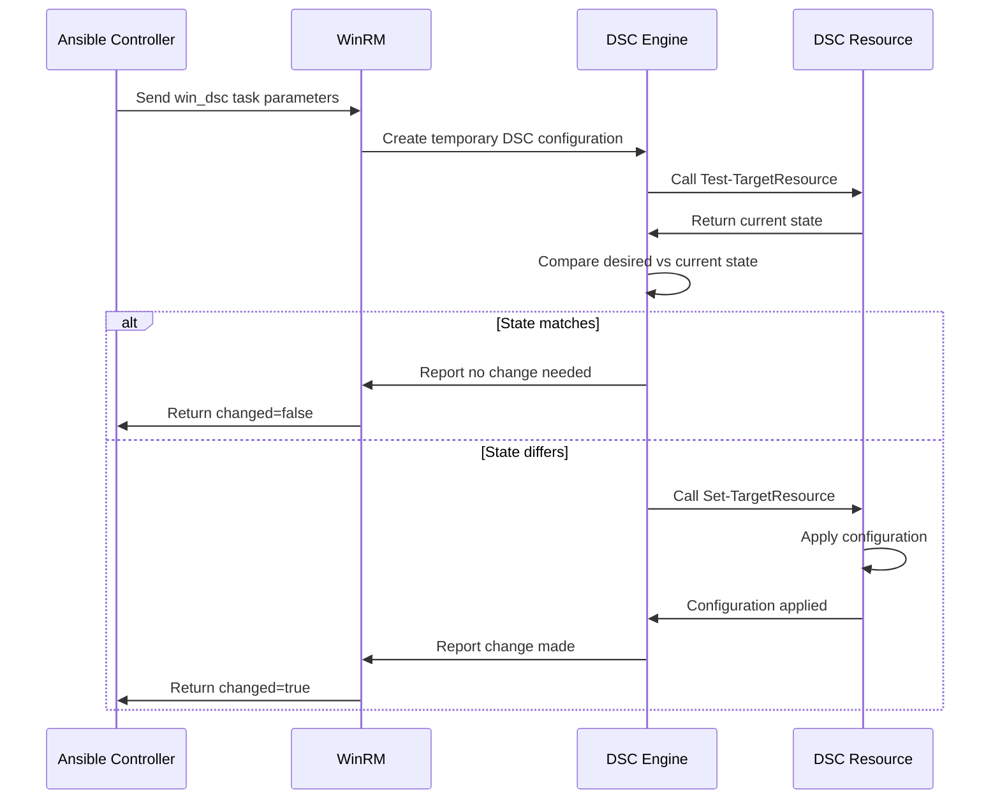

# How to Use Ansible win_dsc Module for Desired State Configuration

Author: [nawazdhandala](https://www.github.com/nawazdhandala)

Tags: Ansible, Windows, DSC, Configuration Management, PowerShell

Description: Leverage PowerShell DSC resources within Ansible playbooks using the win_dsc module for advanced Windows configuration management.

---

PowerShell Desired State Configuration (DSC) is Microsoft's configuration management framework built into Windows. It has hundreds of resources for configuring everything from IIS sites to SQL Server instances. The `win_dsc` module lets you use these DSC resources directly from Ansible playbooks, giving you access to a massive library of Windows configuration capabilities without writing custom Ansible modules.

## Why Use DSC Through Ansible?

You might wonder why you would use DSC through Ansible instead of using DSC directly. The answer is that Ansible provides orchestration, inventory management, and cross-platform playbooks, while DSC provides deep Windows-specific configuration resources. Using them together gives you the best of both worlds: Ansible handles the workflow and DSC handles the Windows-specific configuration.

## How win_dsc Works

The `win_dsc` module calls a DSC resource class on the target Windows host. You specify the DSC resource name and its properties as module parameters. Ansible translates these into a DSC configuration, applies it, and reports back whether changes were made.

## Basic Usage

Here is a simple example using the built-in `File` DSC resource.

```yaml
# basic-dsc.yml - Use a DSC resource through Ansible
---
- name: Use DSC resources through Ansible
  hosts: windows_servers
  tasks:
    # Use the File DSC resource to ensure a directory exists
    - name: Ensure application directory exists
      ansible.windows.win_dsc:
        resource_name: File
        DestinationPath: C:\Applications\MyApp
        Type: Directory
        Ensure: Present

    # Use the File DSC resource to create a file with content
    - name: Create a configuration file
      ansible.windows.win_dsc:
        resource_name: File
        DestinationPath: C:\Applications\MyApp\settings.ini
        Contents: |
          [General]
          AppName=MyApplication
          Version=3.0
          LogLevel=Info
        Type: File
        Ensure: Present
```

The `resource_name` parameter specifies which DSC resource to use. All other parameters map directly to the DSC resource's properties.

## Using the WindowsFeature DSC Resource

The built-in `WindowsFeature` resource is one of the most commonly used DSC resources.

```yaml
# dsc-windows-feature.yml - Install Windows features via DSC
---
- name: Install features via DSC
  hosts: windows_servers
  tasks:
    # Install IIS using the WindowsFeature DSC resource
    - name: Install IIS Web Server
      ansible.windows.win_dsc:
        resource_name: WindowsFeature
        Name: Web-Server
        Ensure: Present
        IncludeAllSubFeature: true

    # Install .NET Framework
    - name: Install .NET 4.5
      ansible.windows.win_dsc:
        resource_name: WindowsFeature
        Name: NET-Framework-45-Core
        Ensure: Present

    # Remove a feature
    - name: Remove Telnet Client
      ansible.windows.win_dsc:
        resource_name: WindowsFeature
        Name: Telnet-Client
        Ensure: Absent
```

## Using the Service DSC Resource

Manage Windows services through DSC.

```yaml
# dsc-service.yml - Manage services via DSC
---
- name: Manage services with DSC
  hosts: windows_servers
  tasks:
    # Ensure a service is running and set to automatic
    - name: Configure IIS service
      ansible.windows.win_dsc:
        resource_name: Service
        Name: W3SVC
        State: Running
        StartupType: Automatic

    # Configure a service with a specific account
    - name: Configure application service
      ansible.windows.win_dsc:
        resource_name: Service
        Name: MyAppService
        State: Running
        StartupType: Automatic
        Credential_username: "{{ svc_account_user }}"
        Credential_password: "{{ svc_account_password }}"
```

Notice the credential properties use the `_username` and `_password` suffix pattern. This is how `win_dsc` handles PSCredential objects.

## Using the Registry DSC Resource

Configure registry values through DSC for consistent system settings.

```yaml
# dsc-registry.yml - Manage registry via DSC
---
- name: Manage registry settings with DSC
  hosts: windows_servers
  tasks:
    # Set a registry value
    - name: Configure RDP timeout
      ansible.windows.win_dsc:
        resource_name: Registry
        Key: HKEY_LOCAL_MACHINE\SYSTEM\CurrentControlSet\Control\Terminal Server\WinStations\RDP-Tcp
        ValueName: MaxIdleTime
        ValueData: '600000'
        ValueType: DWord
        Ensure: Present

    # Set multiple registry values for security hardening
    - name: Disable SMBv1 server
      ansible.windows.win_dsc:
        resource_name: Registry
        Key: HKEY_LOCAL_MACHINE\SYSTEM\CurrentControlSet\Services\LanmanServer\Parameters
        ValueName: SMB1
        ValueData: '0'
        ValueType: DWord
        Ensure: Present
```

## Installing DSC Resources from PowerShell Gallery

Many DSC resources are not built into Windows and need to be installed from the PowerShell Gallery.

```yaml
# install-dsc-resources.yml - Install DSC resources from gallery
---
- name: Install and use community DSC resources
  hosts: windows_servers
  tasks:
    # Install the SqlServerDsc module from PowerShell Gallery
    - name: Install SqlServerDsc module
      ansible.windows.win_shell: |
        if (-not (Get-Module -ListAvailable -Name SqlServerDsc)) {
            Install-Module -Name SqlServerDsc -Force -AllowClobber
        }

    # Install xWebAdministration for IIS management
    - name: Install xWebAdministration module
      ansible.windows.win_shell: |
        if (-not (Get-Module -ListAvailable -Name xWebAdministration)) {
            Install-Module -Name xWebAdministration -Force -AllowClobber
        }

    # Now use the xWebsite resource to configure an IIS site
    - name: Configure IIS website
      ansible.windows.win_dsc:
        resource_name: xWebsite
        Name: MyWebApplication
        PhysicalPath: C:\inetpub\MyApp
        State: Started
        BindingInfo:
          - Protocol: http
            Port: 8080
            HostName: myapp.corp.local

    # Use xWebAppPool to configure an application pool
    - name: Configure application pool
      ansible.windows.win_dsc:
        resource_name: xWebAppPool
        Name: MyAppPool
        State: Started
        managedRuntimeVersion: v4.0
        identityType: SpecificUser
        Credential_username: "{{ svc_account_user }}"
        Credential_password: "{{ svc_account_password }}"
```

## Real-World Example: Complete IIS Configuration

Here is a full playbook that configures IIS using various DSC resources.

```yaml
# iis-dsc-config.yml - Configure IIS using DSC resources
---
- name: Configure IIS with DSC Resources
  hosts: web_servers
  vars:
    site_name: ProductionSite
    site_path: C:\inetpub\ProductionSite
    app_pool_name: ProdAppPool
    host_header: www.example.com
    cert_thumbprint: "{{ vault_ssl_thumbprint }}"

  tasks:
    # Install required DSC modules
    - name: Install xWebAdministration DSC module
      ansible.windows.win_shell: |
        Install-Module -Name xWebAdministration -Force -AllowClobber -ErrorAction SilentlyContinue

    # Ensure IIS features are installed
    - name: Install IIS
      ansible.windows.win_dsc:
        resource_name: WindowsFeature
        Name: Web-Server
        Ensure: Present
        IncludeAllSubFeature: false

    - name: Install ASP.NET 4.5
      ansible.windows.win_dsc:
        resource_name: WindowsFeature
        Name: Web-Asp-Net45
        Ensure: Present

    # Create the site directory
    - name: Create website directory
      ansible.windows.win_dsc:
        resource_name: File
        DestinationPath: "{{ site_path }}"
        Type: Directory
        Ensure: Present

    # Configure the application pool
    - name: Configure application pool
      ansible.windows.win_dsc:
        resource_name: xWebAppPool
        Name: "{{ app_pool_name }}"
        State: Started
        managedRuntimeVersion: v4.0
        enable32BitAppOnWin64: false
        managedPipelineMode: Integrated
        startMode: AlwaysRunning
        idleTimeout: "00:00:00"

    # Remove the default website
    - name: Remove default website
      ansible.windows.win_dsc:
        resource_name: xWebsite
        Name: "Default Web Site"
        Ensure: Absent

    # Create the production website
    - name: Configure production website
      ansible.windows.win_dsc:
        resource_name: xWebsite
        Name: "{{ site_name }}"
        PhysicalPath: "{{ site_path }}"
        ApplicationPool: "{{ app_pool_name }}"
        State: Started
        BindingInfo:
          - Protocol: https
            Port: 443
            HostName: "{{ host_header }}"
            CertificateThumbprint: "{{ cert_thumbprint }}"
            CertificateStoreName: My
          - Protocol: http
            Port: 80
            HostName: "{{ host_header }}"

    # Ensure IIS service is configured
    - name: Configure IIS service
      ansible.windows.win_dsc:
        resource_name: Service
        Name: W3SVC
        State: Running
        StartupType: Automatic
```

## DSC Resource Discovery

Here is a useful playbook to discover what DSC resources are available on your hosts.

```yaml
# discover-dsc.yml - List available DSC resources
---
- name: Discover available DSC resources
  hosts: windows_servers
  tasks:
    - name: List installed DSC resources
      ansible.windows.win_shell: |
        Get-DscResource | Select-Object Name, Module, Version |
          Sort-Object Module, Name |
          Format-Table -AutoSize
      register: dsc_resources

    - name: Show available resources
      ansible.builtin.debug:
        var: dsc_resources.stdout_lines
```

## How win_dsc Integrates with Ansible

Here is the flow when Ansible executes a DSC resource.



## Tips for Using win_dsc

Some practical advice based on real usage:

1. **Check resource availability first**: Not all DSC resources are built in. Use `Get-DscResource` to see what is available and install additional modules as needed.
2. **Credential handling**: For PSCredential parameters, use `PropertyName_username` and `PropertyName_password` suffixes.
3. **Boolean values**: Use `true` and `false` (lowercase YAML booleans), not PowerShell-style `$true`/`$false`.
4. **Complex types**: For array and hashtable properties, check the Ansible documentation for the correct YAML structure.
5. **Debugging**: If a DSC resource fails, check the Windows Event Log under `Microsoft-Windows-DSC/Operational` for detailed error messages.

## Summary

The `win_dsc` module bridges the gap between Ansible and the extensive PowerShell DSC ecosystem. Instead of waiting for a native Ansible module for every Windows configuration need, you can tap into hundreds of existing DSC resources. This is particularly valuable for complex Windows workloads like IIS, SQL Server, and Active Directory configuration where DSC resources have been battle-tested by the Windows community for years. Use Ansible for orchestration and inventory, and let DSC handle the deep Windows configuration.
