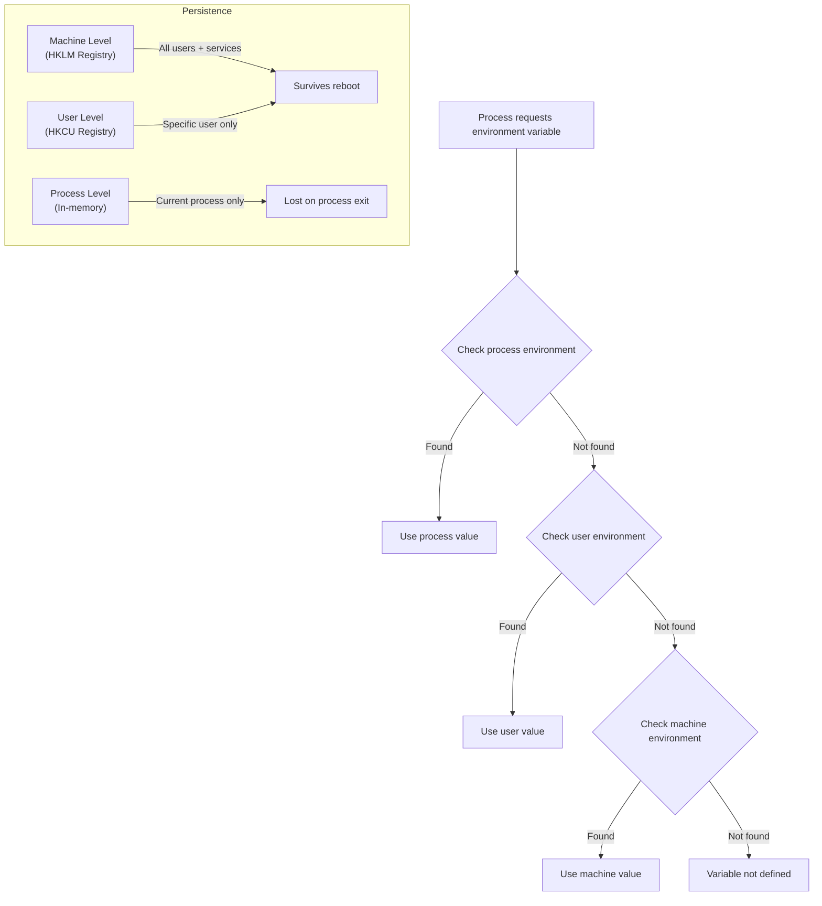

# How to Use Ansible win_environment Module

Author: [nawazdhandala](https://www.github.com/nawazdhandala)

Tags: Ansible, Windows, Environment Variables, Configuration, Automation

Description: Set and manage Windows environment variables at the system and user level using the Ansible win_environment module.

---

Environment variables on Windows control how applications find libraries, where temporary files go, what proxy servers to use, and countless other runtime settings. The `win_environment` module lets you create, update, and remove environment variables at both the machine level (affecting all users) and the user level. This is essential for application deployments, build server configuration, and standardizing server settings across your fleet.

## How Windows Environment Variables Work

Windows has three scopes for environment variables:
- **Machine (System)**: Stored in the registry under HKLM. Available to all users and services. Changes require a new process to take effect.
- **User**: Stored under HKCU. Only available to the specific user. Also requires a new process.
- **Process**: Only exists for the current running process. Not persistent across reboots.

The `win_environment` module manages machine and user level variables, which persist across reboots.

## Setting Environment Variables

Here is how to set environment variables at different scopes.

```yaml
# set-env-vars.yml - Set environment variables
---
- name: Configure environment variables
  hosts: windows_servers
  tasks:
    # Set a machine-level (system) environment variable
    - name: Set JAVA_HOME
      ansible.windows.win_environment:
        name: JAVA_HOME
        value: C:\Program Files\Java\jdk-17
        level: machine
        state: present

    # Set another system-level variable
    - name: Set MAVEN_HOME
      ansible.windows.win_environment:
        name: MAVEN_HOME
        value: C:\Tools\apache-maven-3.9.6
        level: machine
        state: present

    # Set a user-level environment variable
    - name: Set user-specific temp directory
      ansible.windows.win_environment:
        name: MY_APP_TEMP
        value: C:\Users\svc_myapp\AppData\Local\Temp\MyApp
        level: user
        state: present
```

## Setting Multiple Variables for an Application

Most applications need several environment variables. Here is a clean way to configure them all.

```yaml
# app-env-vars.yml - Set all environment variables for an application
---
- name: Configure application environment
  hosts: app_servers
  vars:
    app_environment:
      APP_HOME: C:\Applications\OrderProcessor
      APP_CONFIG: C:\Applications\OrderProcessor\config
      APP_LOG_DIR: C:\Logs\OrderProcessor
      APP_ENV: production
      APP_DB_HOST: sql01.corp.local
      APP_DB_PORT: "1433"
      APP_MAX_CONNECTIONS: "50"
      APP_LOG_LEVEL: INFO

  tasks:
    # Set all application environment variables
    - name: Configure application environment variables
      ansible.windows.win_environment:
        name: "{{ item.key }}"
        value: "{{ item.value }}"
        level: machine
        state: present
      loop: "{{ app_environment | dict2items }}"
      loop_control:
        label: "{{ item.key }}"
```

## Removing Environment Variables

Clean up variables that are no longer needed.

```yaml
# remove-env-vars.yml - Remove environment variables
---
- name: Remove obsolete environment variables
  hosts: windows_servers
  tasks:
    # Remove a single variable
    - name: Remove old application variable
      ansible.windows.win_environment:
        name: OLD_APP_HOME
        level: machine
        state: absent

    # Remove multiple deprecated variables
    - name: Remove deprecated variables
      ansible.windows.win_environment:
        name: "{{ item }}"
        level: machine
        state: absent
      loop:
        - LEGACY_DB_HOST
        - LEGACY_API_KEY
        - OLD_CONFIG_PATH
        - TEMP_DEPLOY_FLAG
```

## Configuring Proxy Settings

A common use case is setting proxy environment variables for servers that need to reach the internet through a corporate proxy.

```yaml
# proxy-settings.yml - Configure proxy environment variables
---
- name: Configure proxy settings
  hosts: windows_servers
  vars:
    proxy_server: http://proxy.corp.local:8080
    no_proxy_list: "localhost,127.0.0.1,.corp.local,10.0.0.0/8"

  tasks:
    # Set HTTP proxy
    - name: Set HTTP_PROXY
      ansible.windows.win_environment:
        name: HTTP_PROXY
        value: "{{ proxy_server }}"
        level: machine
        state: present

    - name: Set http_proxy (lowercase variant)
      ansible.windows.win_environment:
        name: http_proxy
        value: "{{ proxy_server }}"
        level: machine
        state: present

    # Set HTTPS proxy
    - name: Set HTTPS_PROXY
      ansible.windows.win_environment:
        name: HTTPS_PROXY
        value: "{{ proxy_server }}"
        level: machine
        state: present

    - name: Set https_proxy (lowercase variant)
      ansible.windows.win_environment:
        name: https_proxy
        value: "{{ proxy_server }}"
        level: machine
        state: present

    # Set no-proxy exclusions
    - name: Set NO_PROXY
      ansible.windows.win_environment:
        name: NO_PROXY
        value: "{{ no_proxy_list }}"
        level: machine
        state: present

    - name: Set no_proxy (lowercase variant)
      ansible.windows.win_environment:
        name: no_proxy
        value: "{{ no_proxy_list }}"
        level: machine
        state: present
```

Both uppercase and lowercase proxy variables are set because different tools check different cases. Curl uses lowercase, while some .NET applications use uppercase.

## Build Server Configuration

Build servers and CI/CD agents need specific environment variables for tools and SDKs.

```yaml
# build-server-env.yml - Configure CI/CD agent environment
---
- name: Configure Build Server Environment
  hosts: build_agents
  vars:
    tool_versions:
      JAVA_HOME: C:\Program Files\Java\jdk-17
      MAVEN_HOME: C:\Tools\apache-maven-3.9.6
      GRADLE_HOME: C:\Tools\gradle-8.5
      NODE_HOME: C:\Program Files\nodejs
      PYTHON_HOME: C:\Python312
      DOTNET_ROOT: C:\Program Files\dotnet
      GOROOT: C:\Go
      GOPATH: C:\GoWorkspace
      RUST_HOME: C:\Users\buildagent\.rustup

    build_config:
      CI: "true"
      BUILD_AGENT: "true"
      ARTIFACT_DIR: C:\BuildArtifacts
      NUGET_PACKAGES: C:\NuGetCache
      NPM_CACHE: C:\NpmCache
      MAVEN_OPTS: "-Xmx2g -XX:+UseG1GC"

  tasks:
    # Set tool home directories
    - name: Configure tool environments
      ansible.windows.win_environment:
        name: "{{ item.key }}"
        value: "{{ item.value }}"
        level: machine
        state: present
      loop: "{{ tool_versions | dict2items }}"
      loop_control:
        label: "{{ item.key }}"

    # Set build configuration variables
    - name: Configure build settings
      ansible.windows.win_environment:
        name: "{{ item.key }}"
        value: "{{ item.value }}"
        level: machine
        state: present
      loop: "{{ build_config | dict2items }}"
      loop_control:
        label: "{{ item.key }}"

    # Create cache and artifact directories
    - name: Create build directories
      ansible.windows.win_file:
        path: "{{ item }}"
        state: directory
      loop:
        - C:\BuildArtifacts
        - C:\NuGetCache
        - C:\NpmCache
```

## Real-World Example: Environment-Specific Configuration

Here is a playbook that configures environment variables differently based on the deployment environment.

```yaml
# env-specific-config.yml - Set variables based on environment
---
- name: Configure Environment-Specific Variables
  hosts: app_servers
  vars:
    environments:
      development:
        APP_ENV: development
        APP_DEBUG: "true"
        APP_LOG_LEVEL: DEBUG
        APP_DB_HOST: devdb.corp.local
        APP_CACHE_ENABLED: "false"
      staging:
        APP_ENV: staging
        APP_DEBUG: "false"
        APP_LOG_LEVEL: INFO
        APP_DB_HOST: stagingdb.corp.local
        APP_CACHE_ENABLED: "true"
      production:
        APP_ENV: production
        APP_DEBUG: "false"
        APP_LOG_LEVEL: WARN
        APP_DB_HOST: proddb.corp.local
        APP_CACHE_ENABLED: "true"

  tasks:
    # Set environment variables based on the deploy_env host variable
    - name: Configure environment variables for {{ deploy_env }}
      ansible.windows.win_environment:
        name: "{{ item.key }}"
        value: "{{ item.value }}"
        level: machine
        state: present
      loop: "{{ environments[deploy_env] | dict2items }}"
      loop_control:
        label: "{{ item.key }}={{ item.value }}"

    # Verify the configuration
    - name: Verify environment variables
      ansible.windows.win_shell: |
        $vars = @('APP_ENV', 'APP_DEBUG', 'APP_LOG_LEVEL', 'APP_DB_HOST', 'APP_CACHE_ENABLED')
        foreach ($var in $vars) {
            $value = [Environment]::GetEnvironmentVariable($var, 'Machine')
            Write-Output "${var}=${value}"
        }
      register: env_verify

    - name: Show configured environment
      ansible.builtin.debug:
        var: env_verify.stdout_lines
```

## Environment Variable Scoping

Here is how environment variables are resolved on Windows.



## Auditing Environment Variables

Here is a playbook to audit environment variables for compliance.

```yaml
# audit-env.yml - Audit environment variables
---
- name: Audit Environment Variables
  hosts: windows_servers
  tasks:
    - name: Get all machine-level environment variables
      ansible.windows.win_shell: |
        [Environment]::GetEnvironmentVariables('Machine') |
          ForEach-Object { $_.GetEnumerator() } |
          Sort-Object Name |
          ForEach-Object { "$($_.Name)=$($_.Value)" }
      register: machine_env

    - name: Check for sensitive data in environment variables
      ansible.windows.win_shell: |
        $sensitive = @('PASSWORD', 'SECRET', 'KEY', 'TOKEN', 'CREDENTIAL')
        $envVars = [Environment]::GetEnvironmentVariables('Machine')
        $findings = @()
        foreach ($var in $envVars.GetEnumerator()) {
            foreach ($keyword in $sensitive) {
                if ($var.Name -like "*$keyword*") {
                    $findings += "$($var.Name) (contains '$keyword')"
                }
            }
        }
        if ($findings) {
            Write-Output "WARNING: Found potentially sensitive environment variables:"
            $findings | ForEach-Object { Write-Output "  - $_" }
        } else {
            Write-Output "No potentially sensitive variable names found"
        }
      register: sensitive_check

    - name: Report findings
      ansible.builtin.debug:
        var: sensitive_check.stdout_lines
```

## Important Notes

A few things to keep in mind:

1. **Process restart required**: New environment variable values only take effect in new processes. Running services will not see changes until they restart.
2. **Value types**: All environment variable values are strings. If you need a number, pass it as a string (`"8080"`).
3. **Do not store secrets**: Environment variables are readable by all processes running under the same user. Use Ansible Vault, Windows Credential Manager, or a secrets manager for sensitive data.
4. **PATH is special**: Use `win_path` instead of `win_environment` for the PATH variable, because `win_path` handles the semicolon-delimited list correctly.
5. **Broadcasting changes**: The module broadcasts a `WM_SETTINGCHANGE` message so that some applications (like Explorer) pick up changes without restart.

## Summary

The `win_environment` module gives you clean, idempotent management of Windows environment variables through Ansible. Whether you are configuring application settings, proxy servers, build tool paths, or environment-specific variables, this module ensures consistency across your server fleet. Use machine-level scope for settings that should apply to all users and services, and user-level scope for user-specific preferences. Always remember that running processes need to be restarted to pick up new environment variable values.
