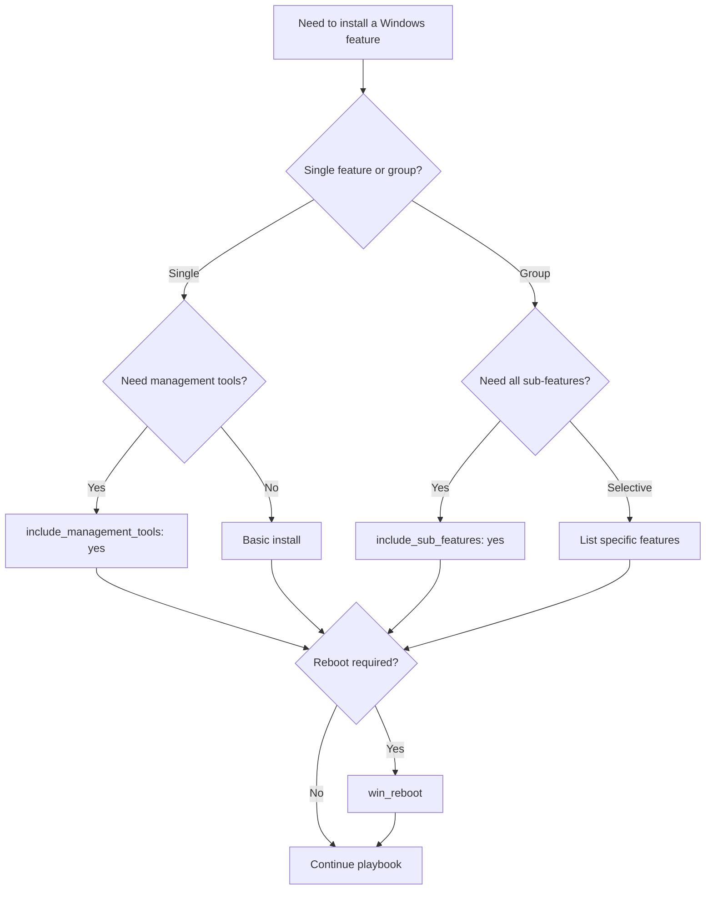

# How to Use Ansible win_feature Module for Windows Features

Author: [nawazdhandala](https://www.github.com/nawazdhandala)

Tags: Ansible, Windows, Server Roles, IIS, Automation

Description: Install and remove Windows Server roles and features using the Ansible win_feature module with real examples for IIS, DNS, and more.

---

Windows Server ships with dozens of optional roles and features like IIS, DNS, Hyper-V, .NET Framework, and SNMP. Manually clicking through Server Manager on each server is not scalable. The `win_feature` module lets you install and remove these features through Ansible, making server provisioning consistent and repeatable across your entire fleet.

## How Windows Features Work

Windows Server features are managed through the Server Manager framework. Each feature has an internal name (like `Web-Server` for IIS) that you use in Ansible. Features can have sub-features and dependencies that get installed automatically when needed.

You can discover available feature names by running this PowerShell command on a Windows host.

```powershell
# List all available features and their install state
Get-WindowsFeature | Format-Table Name, DisplayName, InstallState
```

## Installing a Single Feature

Here is the most basic usage: installing a single Windows feature.

```yaml
# install-feature.yml - Install a Windows feature
---
- name: Install Windows features
  hosts: windows_servers
  tasks:
    # Install the IIS Web Server role
    - name: Install IIS
      ansible.windows.win_feature:
        name: Web-Server
        state: present
      register: iis_install

    # Reboot if the feature installation requires it
    - name: Reboot if needed
      ansible.windows.win_reboot:
      when: iis_install.reboot_required
```

The `reboot_required` return value tells you whether the feature needs a reboot to complete installation. Always check this and handle it in your playbooks.

## Installing Multiple Features

Most server roles need several related features. You can install them all at once.

```yaml
# install-multiple.yml - Install multiple features together
---
- name: Install multiple Windows features
  hosts: web_servers
  tasks:
    # Install IIS with common sub-features
    - name: Install IIS with management tools and common features
      ansible.windows.win_feature:
        name:
          - Web-Server
          - Web-Common-Http
          - Web-Asp-Net45
          - Web-Net-Ext45
          - Web-ISAPI-Ext
          - Web-ISAPI-Filter
          - Web-Mgmt-Console
          - Web-Mgmt-Service
          - Web-Log-Libraries
          - Web-Request-Monitor
          - Web-Http-Tracing
          - Web-Security
          - Web-Filtering
          - Web-Stat-Compression
          - Web-Dyn-Compression
        state: present
      register: web_features

    - name: Reboot after feature installation
      ansible.windows.win_reboot:
      when: web_features.reboot_required
```

## Including All Sub-Features

Instead of listing every sub-feature manually, you can use `include_sub_features` to install everything under a parent feature.

```yaml
# include-sub-features.yml - Install feature with all sub-features
---
- name: Install features with sub-features
  hosts: windows_servers
  tasks:
    # Install IIS with ALL sub-features
    - name: Install complete IIS installation
      ansible.windows.win_feature:
        name: Web-Server
        state: present
        include_sub_features: yes
      register: full_iis

    - name: Reboot if needed
      ansible.windows.win_reboot:
      when: full_iis.reboot_required
```

Be careful with `include_sub_features` on large feature groups. You might install features you do not need, which increases your attack surface and resource usage.

## Including Management Tools

Many features come with management tools (GUI consoles, PowerShell modules) that are useful for troubleshooting.

```yaml
# management-tools.yml - Install features with their management tools
---
- name: Install features with management tools
  hosts: windows_servers
  tasks:
    # Install DNS Server with its management tools
    - name: Install DNS Server role
      ansible.windows.win_feature:
        name: DNS
        state: present
        include_management_tools: yes
      register: dns_install

    # Install DHCP with management tools
    - name: Install DHCP Server role
      ansible.windows.win_feature:
        name: DHCP
        state: present
        include_management_tools: yes
      register: dhcp_install

    - name: Reboot if any features require it
      ansible.windows.win_reboot:
      when: dns_install.reboot_required or dhcp_install.reboot_required
```

## Removing Features

You can uninstall features that are not needed. This is useful for security hardening.

```yaml
# remove-features.yml - Remove unnecessary features
---
- name: Remove unnecessary Windows features
  hosts: windows_servers
  tasks:
    # Remove features that increase attack surface
    - name: Remove unnecessary features for security hardening
      ansible.windows.win_feature:
        name: "{{ item }}"
        state: absent
      loop:
        - Telnet-Client
        - TFTP-Client
        - PowerShell-V2
        - SMB1Protocol
      register: removal_results

    - name: Reboot if any removals require it
      ansible.windows.win_reboot:
      when: removal_results.results | selectattr('reboot_required') | list | length > 0
```

## Installing from a Source

Some features require installation media (the Windows source files). You can specify the source path.

```yaml
# install-from-source.yml - Install features from a specific source
---
- name: Install features from source
  hosts: windows_servers
  tasks:
    # Install .NET 3.5 which often requires source media
    - name: Install .NET Framework 3.5
      ansible.windows.win_feature:
        name: NET-Framework-Core
        state: present
        source: D:\Sources\SxS
      register: dotnet35

    - name: Reboot if required
      ansible.windows.win_reboot:
      when: dotnet35.reboot_required
```

The `source` parameter points to the `\sources\sxs` folder on the Windows installation media or a network share.

## Real-World Example: Full Web Server Provisioning

Here is a complete playbook that provisions a Windows web server from scratch.

```yaml
# provision-webserver.yml - Full IIS web server provisioning
---
- name: Provision Windows Web Server
  hosts: new_web_servers
  vars:
    web_features:
      - Web-Server
      - Web-Common-Http
      - Web-Default-Doc
      - Web-Dir-Browsing
      - Web-Http-Errors
      - Web-Static-Content
      - Web-Http-Redirect
      - Web-Asp-Net45
      - Web-Net-Ext45
      - Web-ISAPI-Ext
      - Web-ISAPI-Filter
      - Web-Mgmt-Console
      - Web-Scripting-Tools
      - Web-Log-Libraries
      - Web-Request-Monitor
      - Web-Security
      - Web-Filtering
      - Web-Basic-Auth
      - Web-Windows-Auth
      - Web-Stat-Compression
      - Web-Dyn-Compression

    security_features_to_remove:
      - Telnet-Client
      - PowerShell-V2
      - SMB1Protocol

    dotnet_features:
      - NET-Framework-45-Core
      - NET-Framework-45-ASPNET
      - NET-WCF-HTTP-Activation45

  tasks:
    - name: Install .NET Framework features
      ansible.windows.win_feature:
        name: "{{ dotnet_features }}"
        state: present
      register: dotnet_result

    - name: Install IIS and web features
      ansible.windows.win_feature:
        name: "{{ web_features }}"
        state: present
      register: iis_result

    - name: Remove unnecessary features
      ansible.windows.win_feature:
        name: "{{ security_features_to_remove }}"
        state: absent
      register: removal_result

    - name: Reboot if any changes require it
      ansible.windows.win_reboot:
        reboot_timeout: 600
      when: >
        dotnet_result.reboot_required or
        iis_result.reboot_required or
        removal_result.reboot_required

    - name: Verify IIS is running
      ansible.windows.win_service:
        name: W3SVC
        state: started
        start_mode: auto

    - name: Verify IIS responds
      ansible.windows.win_uri:
        url: http://localhost/
        status_code: 200
      register: iis_check
      retries: 3
      delay: 10
```

## Feature Installation Decision Tree

Here is how to decide which options to use when installing features.



## Common Feature Names Reference

Here are the most frequently used feature names for Ansible playbooks.

| Feature Name | Description |
|-------------|-------------|
| Web-Server | IIS Web Server |
| DNS | DNS Server |
| DHCP | DHCP Server |
| AD-Domain-Services | Active Directory Domain Services |
| NET-Framework-Core | .NET Framework 3.5 |
| NET-Framework-45-Core | .NET Framework 4.5 |
| FS-FileServer | File Server |
| SNMP-Service | SNMP Service |
| Telnet-Client | Telnet Client |
| Windows-Defender | Windows Defender |
| Hyper-V | Hyper-V |

## Summary

The `win_feature` module is your primary tool for installing Windows Server roles and features at scale. Whether you are setting up IIS web servers, DNS infrastructure, or hardening servers by removing unnecessary features, this module handles it all. Always check the `reboot_required` flag and handle reboots in your playbooks. For new server provisioning, combine `win_feature` with service configuration, firewall rules, and security hardening for a complete, repeatable setup process.
