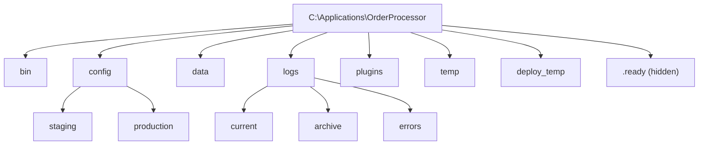

# How to Use Ansible win_file Module

Author: [nawazdhandala](https://www.github.com/nawazdhandala)

Tags: Ansible, Windows, File Management, DevOps

Description: Use the Ansible win_file module to create, delete, and manage files and directories on Windows hosts with practical automation examples.

---

Managing files and directories on Windows servers is one of the most common automation tasks. The `win_file` module lets you create directories, remove files, and manage file attributes on Windows hosts through Ansible. If you have worked with the Linux `file` module, the Windows version follows the same patterns with a few platform-specific differences.

## What win_file Does

The `win_file` module manages the state of files and directories on Windows. It can:

- Create directories (including nested paths)
- Delete files and directories
- Touch files (create empty files or update timestamps)
- Manage file attributes (hidden, read-only, etc.)

It does not copy content to files. For that, use `win_copy` or `win_template`.

## Creating Directories

The most common use case is creating directory structures on Windows hosts.

```yaml
# create-directories.yml - Create directory structures
---
- name: Create directories on Windows
  hosts: windows_servers
  tasks:
    # Create a single directory
    - name: Create application directory
      ansible.windows.win_file:
        path: C:\Applications\MyApp
        state: directory

    # Create nested directories in one go
    - name: Create nested log directory structure
      ansible.windows.win_file:
        path: C:\Applications\MyApp\logs\archive\2024
        state: directory

    # Create multiple directories using a loop
    - name: Create standard application directory structure
      ansible.windows.win_file:
        path: "{{ item }}"
        state: directory
      loop:
        - C:\Applications\MyApp\bin
        - C:\Applications\MyApp\config
        - C:\Applications\MyApp\data
        - C:\Applications\MyApp\logs
        - C:\Applications\MyApp\temp
```

When `state: directory` is used, Ansible creates the full path including all parent directories, similar to `mkdir -p` on Linux.

## Deleting Files and Directories

Removing files and directories uses `state: absent`.

```yaml
# delete-files.yml - Remove files and directories
---
- name: Clean up files on Windows
  hosts: windows_servers
  tasks:
    # Delete a single file
    - name: Remove old configuration file
      ansible.windows.win_file:
        path: C:\Applications\MyApp\config\old-settings.xml
        state: absent

    # Delete an entire directory tree
    - name: Remove temporary build directory
      ansible.windows.win_file:
        path: C:\Build\temp
        state: absent

    # Delete multiple old log files
    - name: Remove old deployment artifacts
      ansible.windows.win_file:
        path: "{{ item }}"
        state: absent
      loop:
        - C:\Deploy\staging\previous
        - C:\Deploy\staging\backup
        - C:\Temp\installer_cache
```

When you delete a directory, all files and subdirectories inside it are also removed. There is no recycle bin involved; the files are permanently deleted.

## Touching Files

The `touch` state creates an empty file or updates the modification timestamp of an existing file.

```yaml
# touch-files.yml - Create empty files or update timestamps
---
- name: Touch files on Windows
  hosts: windows_servers
  tasks:
    # Create an empty marker file
    - name: Create deployment marker
      ansible.windows.win_file:
        path: C:\Applications\MyApp\.deployed
        state: touch

    # Create a lock file to signal maintenance mode
    - name: Enable maintenance mode
      ansible.windows.win_file:
        path: C:\Applications\MyApp\maintenance.lock
        state: touch
```

## Managing File Attributes

Windows files have attributes like hidden, read-only, system, and archive. You can manage these with `win_file`.

```yaml
# file-attributes.yml - Manage Windows file attributes
---
- name: Manage file attributes
  hosts: windows_servers
  tasks:
    # Make a file hidden
    - name: Hide the deployment marker file
      ansible.windows.win_file:
        path: C:\Applications\MyApp\.deployed
        state: file
        attributes: hidden

    # Make a file read-only
    - name: Protect configuration from accidental edits
      ansible.windows.win_file:
        path: C:\Applications\MyApp\config\production.xml
        state: file
        attributes: readonly

    # Combine multiple attributes
    - name: Set hidden and read-only attributes
      ansible.windows.win_file:
        path: C:\Applications\MyApp\.internal
        state: file
        attributes: hidden,readonly
```

Valid attributes include: `archive`, `hidden`, `normal`, `not_content_indexed`, `readonly`, `system`, and `temporary`.

## Conditional File Operations

You often need to check whether files exist before performing operations. Combine `win_stat` with `win_file` for conditional logic.

```yaml
# conditional-file-ops.yml - Conditionally manage files
---
- name: Conditional file operations
  hosts: windows_servers
  tasks:
    # Check if a config file exists
    - name: Check for existing configuration
      ansible.windows.win_stat:
        path: C:\Applications\MyApp\config\settings.xml
      register: config_stat

    # Only create default config if none exists
    - name: Create default config directory
      ansible.windows.win_file:
        path: C:\Applications\MyApp\config
        state: directory
      when: not config_stat.stat.exists

    # Check directory size before cleanup
    - name: Check temp directory
      ansible.windows.win_shell: |
        (Get-ChildItem C:\Temp -Recurse | Measure-Object -Property Length -Sum).Sum / 1MB
      register: temp_size
      ignore_errors: true

    # Only clean up if temp exceeds 500 MB
    - name: Clean up large temp directory
      ansible.windows.win_file:
        path: C:\Temp
        state: absent
      when: temp_size.stdout | default('0') | float > 500

    - name: Recreate temp directory after cleanup
      ansible.windows.win_file:
        path: C:\Temp
        state: directory
      when: temp_size.stdout | default('0') | float > 500
```

## Real-World Example: Application Deployment Preparation

Here is a complete playbook that sets up the directory structure for a multi-tier application deployment.

```yaml
# prepare-deployment.yml - Set up directories for deployment
---
- name: Prepare Windows Server for Application Deployment
  hosts: windows_servers
  vars:
    base_path: C:\Applications
    app_name: OrderProcessor
    environments:
      - staging
      - production

  tasks:
    - name: Remove stale deployment artifacts
      ansible.windows.win_file:
        path: "{{ base_path }}\\{{ app_name }}\\deploy_temp"
        state: absent

    - name: Create base application structure
      ansible.windows.win_file:
        path: "{{ base_path }}\\{{ app_name }}\\{{ item }}"
        state: directory
      loop:
        - bin
        - config
        - data
        - logs
        - plugins
        - temp
        - deploy_temp

    - name: Create environment-specific config directories
      ansible.windows.win_file:
        path: "{{ base_path }}\\{{ app_name }}\\config\\{{ item }}"
        state: directory
      loop: "{{ environments }}"

    - name: Create log rotation directories
      ansible.windows.win_file:
        path: "{{ base_path }}\\{{ app_name }}\\logs\\{{ item }}"
        state: directory
      loop:
        - current
        - archive
        - errors

    - name: Create deployment marker
      ansible.windows.win_file:
        path: "{{ base_path }}\\{{ app_name }}\\.ready"
        state: touch

    - name: Hide internal files
      ansible.windows.win_file:
        path: "{{ base_path }}\\{{ app_name }}\\.ready"
        state: file
        attributes: hidden
```

## Directory Structure Visualization

Here is what the above playbook creates.



## Cleanup Playbook

Pair the preparation playbook with a cleanup playbook for when you need to tear down.

```yaml
# cleanup-deployment.yml - Remove application directories
---
- name: Clean Up Application Deployment
  hosts: windows_servers
  vars:
    base_path: C:\Applications
    app_name: OrderProcessor

  tasks:
    - name: Check if application directory exists
      ansible.windows.win_stat:
        path: "{{ base_path }}\\{{ app_name }}"
      register: app_dir

    - name: Remove entire application directory
      ansible.windows.win_file:
        path: "{{ base_path }}\\{{ app_name }}"
        state: absent
      when: app_dir.stat.exists

    - name: Confirm removal
      ansible.windows.win_stat:
        path: "{{ base_path }}\\{{ app_name }}"
      register: verify_removal

    - name: Report cleanup status
      ansible.builtin.debug:
        msg: >
          Application directory
          {{ 'successfully removed' if not verify_removal.stat.exists else 'still exists - manual cleanup needed' }}
```

## Common Gotchas

A few things to watch out for when using `win_file`:

1. **Backslashes in YAML**: Use double backslashes (`\\`) in quoted strings or single backslashes in unquoted paths.
2. **Permissions**: `win_file` does not set NTFS permissions. Use `win_acl` for that.
3. **Long paths**: Windows has a 260-character path limit by default. Enable long paths in Group Policy if you need deeper nesting.
4. **Locked files**: If a file is locked by a running process, deletion will fail. Stop the service first.

## Summary

The `win_file` module is a straightforward but essential part of Windows automation with Ansible. It handles directory creation, file deletion, empty file creation, and attribute management. Combined with `win_stat` for conditional checks and `win_acl` for permissions, you have complete control over the filesystem on your Windows hosts. Use it to set up deployment structures, manage temporary files, and keep your Windows servers organized.
