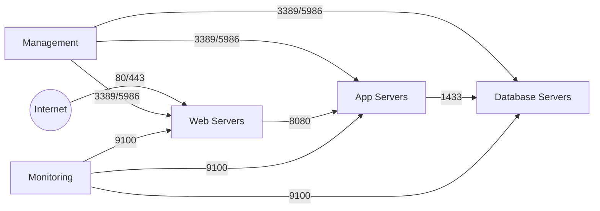

# How to Use Ansible win_firewall_rule Module

Author: [nawazdhandala](https://www.github.com/nawazdhandala)

Tags: Ansible, Windows, Firewall, Security, Automation

Description: Manage Windows Firewall rules with the Ansible win_firewall_rule module including inbound, outbound, port-based, and application rules.

---

Windows Firewall is the first line of defense on every Windows server. Manually clicking through the Windows Firewall GUI on each server does not scale, and it introduces inconsistencies that are hard to audit. The `win_firewall_rule` module lets you define firewall rules as code, deploy them consistently across your fleet, and version-control them alongside the rest of your infrastructure configuration.

## Creating a Basic Inbound Rule

The most common operation is opening a port for inbound traffic.

```yaml
# basic-firewall-rule.yml - Create inbound firewall rules
---
- name: Configure Windows Firewall rules
  hosts: windows_servers
  tasks:
    # Allow inbound HTTP traffic on port 80
    - name: Allow HTTP traffic
      community.windows.win_firewall_rule:
        name: "Allow HTTP"
        localport: 80
        action: allow
        direction: in
        protocol: tcp
        state: present
        enabled: yes

    # Allow HTTPS traffic on port 443
    - name: Allow HTTPS traffic
      community.windows.win_firewall_rule:
        name: "Allow HTTPS"
        localport: 443
        action: allow
        direction: in
        protocol: tcp
        state: present
        enabled: yes
```

Every rule needs a unique `name`. If you run the playbook again with the same name, Ansible updates the existing rule rather than creating a duplicate.

## Allowing Port Ranges

You can specify a range of ports or multiple individual ports.

```yaml
# port-ranges.yml - Allow port ranges
---
- name: Configure port range rules
  hosts: windows_servers
  tasks:
    # Allow a range of ports
    - name: Allow application port range
      community.windows.win_firewall_rule:
        name: "MyApp Port Range"
        localport: 8000-8100
        action: allow
        direction: in
        protocol: tcp
        state: present
        enabled: yes

    # Allow multiple specific ports
    - name: Allow multiple specific ports
      community.windows.win_firewall_rule:
        name: "MyApp Specific Ports"
        localport: "8080,8443,9090"
        action: allow
        direction: in
        protocol: tcp
        state: present
        enabled: yes
```

## Restricting by Source IP

Limiting access to specific source IP addresses or subnets is a critical security practice.

```yaml
# restrict-by-ip.yml - Restrict rules to specific source addresses
---
- name: Configure IP-restricted firewall rules
  hosts: windows_servers
  tasks:
    # Allow RDP only from the management network
    - name: Allow RDP from management subnet only
      community.windows.win_firewall_rule:
        name: "RDP - Management Network"
        localport: 3389
        action: allow
        direction: in
        protocol: tcp
        remoteip: 10.0.100.0/24
        state: present
        enabled: yes

    # Allow SQL Server from application servers only
    - name: Allow SQL from app servers
      community.windows.win_firewall_rule:
        name: "SQL Server - App Tier"
        localport: 1433
        action: allow
        direction: in
        protocol: tcp
        remoteip:
          - 10.0.10.10
          - 10.0.10.11
          - 10.0.10.12
        state: present
        enabled: yes

    # Allow monitoring from specific subnet
    - name: Allow SNMP from monitoring network
      community.windows.win_firewall_rule:
        name: "SNMP - Monitoring"
        localport: 161
        action: allow
        direction: in
        protocol: udp
        remoteip: 10.0.200.0/24
        state: present
        enabled: yes
```

## Creating Outbound Rules

Outbound rules control what traffic the server can send out. This is useful for restricting data exfiltration paths.

```yaml
# outbound-rules.yml - Configure outbound firewall rules
---
- name: Configure outbound rules
  hosts: windows_servers
  tasks:
    # Allow outbound DNS queries
    - name: Allow DNS outbound
      community.windows.win_firewall_rule:
        name: "Allow DNS Outbound"
        remoteport: 53
        action: allow
        direction: out
        protocol: udp
        state: present
        enabled: yes

    # Allow outbound HTTPS for package downloads
    - name: Allow HTTPS Outbound
      community.windows.win_firewall_rule:
        name: "Allow HTTPS Outbound"
        remoteport: 443
        action: allow
        direction: out
        protocol: tcp
        state: present
        enabled: yes

    # Block outbound connections to a specific range
    - name: Block outbound to untrusted network
      community.windows.win_firewall_rule:
        name: "Block Untrusted Outbound"
        remoteip: 192.168.0.0/16
        action: block
        direction: out
        protocol: any
        state: present
        enabled: yes
```

## Application-Based Rules

Instead of opening ports, you can create rules that allow traffic for a specific executable.

```yaml
# application-rules.yml - Create rules based on application path
---
- name: Configure application-based firewall rules
  hosts: windows_servers
  tasks:
    # Allow traffic for a specific application
    - name: Allow MyApp executable
      community.windows.win_firewall_rule:
        name: "MyApp Application Rule"
        program: C:\Applications\MyApp\myapp.exe
        action: allow
        direction: in
        state: present
        enabled: yes

    # Allow SQL Server executable
    - name: Allow SQL Server engine
      community.windows.win_firewall_rule:
        name: "SQL Server Engine"
        program: C:\Program Files\Microsoft SQL Server\MSSQL16.MSSQLSERVER\MSSQL\Binn\sqlservr.exe
        action: allow
        direction: in
        state: present
        enabled: yes
```

## Assigning Rules to Firewall Profiles

Windows Firewall has three profiles: Domain, Private, and Public. You can target rules to specific profiles.

```yaml
# profile-rules.yml - Create rules for specific network profiles
---
- name: Configure profile-specific rules
  hosts: windows_servers
  tasks:
    # Allow RDP only on the Domain profile
    - name: Allow RDP on domain network
      community.windows.win_firewall_rule:
        name: "RDP - Domain Only"
        localport: 3389
        action: allow
        direction: in
        protocol: tcp
        profiles:
          - domain
        state: present
        enabled: yes

    # Allow HTTP on domain and private profiles
    - name: Allow HTTP on internal networks
      community.windows.win_firewall_rule:
        name: "HTTP - Internal"
        localport: 80
        action: allow
        direction: in
        protocol: tcp
        profiles:
          - domain
          - private
        state: present
        enabled: yes
```

## Removing Firewall Rules

Cleaning up old rules is just as important as creating new ones.

```yaml
# remove-rules.yml - Remove firewall rules
---
- name: Remove obsolete firewall rules
  hosts: windows_servers
  tasks:
    # Remove a rule by name
    - name: Remove old application rule
      community.windows.win_firewall_rule:
        name: "OldApp Access Rule"
        state: absent

    # Remove multiple obsolete rules
    - name: Clean up deprecated rules
      community.windows.win_firewall_rule:
        name: "{{ item }}"
        state: absent
      loop:
        - "Legacy FTP Access"
        - "Temp Debug Port"
        - "Old Monitoring Agent"
```

## Real-World Example: Multi-Tier Application Firewall Configuration

Here is a complete playbook that configures firewall rules for a three-tier application stack.

```yaml
# app-firewall.yml - Configure firewalls for a multi-tier app
---
# Web tier: accepts HTTP/HTTPS from the internet
- name: Configure Web Tier Firewall
  hosts: web_servers
  vars:
    app_server_ips:
      - 10.0.10.10
      - 10.0.10.11
    monitoring_subnet: 10.0.200.0/24
    management_subnet: 10.0.100.0/24

  tasks:
    - name: Allow HTTP from anywhere
      community.windows.win_firewall_rule:
        name: "Web - HTTP Inbound"
        localport: 80
        action: allow
        direction: in
        protocol: tcp
        state: present
        enabled: yes

    - name: Allow HTTPS from anywhere
      community.windows.win_firewall_rule:
        name: "Web - HTTPS Inbound"
        localport: 443
        action: allow
        direction: in
        protocol: tcp
        state: present
        enabled: yes

    - name: Allow RDP from management only
      community.windows.win_firewall_rule:
        name: "RDP - Management Only"
        localport: 3389
        action: allow
        direction: in
        protocol: tcp
        remoteip: "{{ management_subnet }}"
        state: present
        enabled: yes

    - name: Allow WinRM from management only
      community.windows.win_firewall_rule:
        name: "WinRM - Management Only"
        localport: 5986
        action: allow
        direction: in
        protocol: tcp
        remoteip: "{{ management_subnet }}"
        state: present
        enabled: yes

    - name: Allow monitoring
      community.windows.win_firewall_rule:
        name: "Monitoring Agent"
        localport: 9100
        action: allow
        direction: in
        protocol: tcp
        remoteip: "{{ monitoring_subnet }}"
        state: present
        enabled: yes

# App tier: accepts traffic only from web servers
- name: Configure App Tier Firewall
  hosts: app_servers
  vars:
    web_server_ips:
      - 10.0.5.10
      - 10.0.5.11
    db_server_ip: 10.0.20.10

  tasks:
    - name: Allow app port from web servers
      community.windows.win_firewall_rule:
        name: "App - From Web Tier"
        localport: 8080
        action: allow
        direction: in
        protocol: tcp
        remoteip: "{{ web_server_ips }}"
        state: present
        enabled: yes

    - name: Allow outbound to database
      community.windows.win_firewall_rule:
        name: "App - To Database"
        remoteport: 1433
        action: allow
        direction: out
        protocol: tcp
        remoteip: "{{ db_server_ip }}"
        state: present
        enabled: yes
```

## Network Topology with Firewall Rules

Here is how the firewall rules map to the network topology.



## Auditing Firewall Rules

Periodically audit your firewall rules to find anything unexpected.

```yaml
# audit-firewall.yml - Audit firewall rules
---
- name: Audit firewall rules
  hosts: windows_servers
  tasks:
    - name: List all enabled inbound rules
      ansible.windows.win_shell: |
        Get-NetFirewallRule -Direction Inbound -Enabled True |
          Select-Object Name, DisplayName, Action,
            @{N='LocalPort';E={($_ | Get-NetFirewallPortFilter).LocalPort}},
            @{N='RemoteAddress';E={($_ | Get-NetFirewallAddressFilter).RemoteAddress}} |
          ConvertTo-Json
      register: inbound_rules

    - name: Display inbound rules
      ansible.builtin.debug:
        var: inbound_rules.stdout | from_json
```

## Summary

The `win_firewall_rule` module turns Windows Firewall management into repeatable, version-controlled code. Define your rules in playbooks, deploy them consistently across every server, and audit them with PowerShell queries. Whether you are setting up simple port-based rules or complex multi-tier application firewalls with source IP restrictions, this module gives you the control you need. Always start restrictive and add rules as needed rather than starting open and trying to close things down later.
