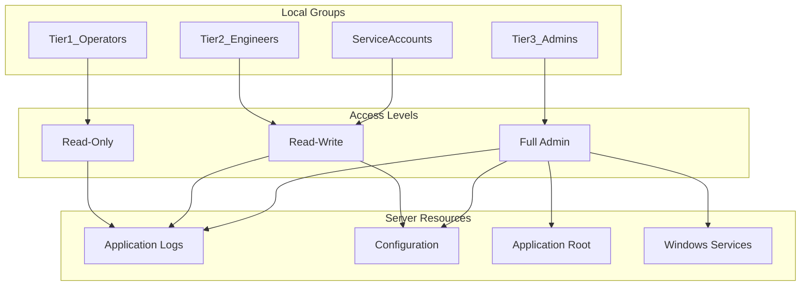

# How to Use Ansible win_group Module

Author: [nawazdhandala](https://www.github.com/nawazdhandala)

Tags: Ansible, Windows, Group Management, Security, Automation

Description: Manage local Windows groups with the Ansible win_group module for organizing users, controlling access, and enforcing security policies.

---

Local groups on Windows are the building blocks of access control. They determine who can log in remotely, who can read event logs, who has administrative privileges, and much more. The `win_group` module lets you create, modify, and remove local groups on Windows hosts, while `win_group_membership` handles adding and removing members. Together, they give you full control over group-based access on your Windows fleet.

## Creating Local Groups

Creating a local group is straightforward. You specify the group name and set the state to present.

```yaml
# create-groups.yml - Create local groups on Windows
---
- name: Create local groups
  hosts: windows_servers
  tasks:
    # Create a single group
    - name: Create application users group
      ansible.windows.win_group:
        name: AppUsers
        description: "Users with access to the application"
        state: present

    # Create multiple groups for a tiered access model
    - name: Create access tier groups
      ansible.windows.win_group:
        name: "{{ item.name }}"
        description: "{{ item.desc }}"
        state: present
      loop:
        - { name: "App_ReadOnly", desc: "Read-only access to application data" }
        - { name: "App_ReadWrite", desc: "Read-write access to application data" }
        - { name: "App_Admin", desc: "Full administrative access to application" }
        - { name: "App_Deploy", desc: "Deployment service accounts" }
```

## Managing Group Membership

The `win_group_membership` module (separate from `win_group`) handles adding and removing users from groups. This separation follows the Unix philosophy of doing one thing well.

```yaml
# group-membership.yml - Add and remove group members
---
- name: Manage group membership
  hosts: windows_servers
  tasks:
    # Add users to a group
    - name: Add service accounts to deploy group
      ansible.windows.win_group_membership:
        name: App_Deploy
        members:
          - svc_webapp
          - svc_deploy
          - DOMAIN\deploy_admin
        state: present

    # Remove users from a group
    - name: Remove old members from admin group
      ansible.windows.win_group_membership:
        name: App_Admin
        members:
          - old_admin
          - temp_contractor
        state: absent

    # Set exact membership (replaces all existing members)
    - name: Set exact membership for monitoring group
      ansible.windows.win_group_membership:
        name: App_ReadOnly
        members:
          - svc_monitoring
          - svc_healthcheck
          - DOMAIN\monitoring_team
        state: pure
```

The `state` parameter for `win_group_membership` works differently from what you might expect:
- `present`: Adds the specified members without removing existing ones
- `absent`: Removes the specified members
- `pure`: Sets the group membership to exactly the specified list, removing anyone not in the list

## Removing Groups

When a group is no longer needed, remove it cleanly.

```yaml
# remove-groups.yml - Remove local groups
---
- name: Remove obsolete groups
  hosts: windows_servers
  tasks:
    # Remove a group that is no longer needed
    - name: Remove legacy application group
      ansible.windows.win_group:
        name: OldAppUsers
        state: absent

    # Remove multiple deprecated groups
    - name: Clean up deprecated groups
      ansible.windows.win_group:
        name: "{{ item }}"
        state: absent
      loop:
        - LegacyApp_Users
        - LegacyApp_Admins
        - TempAccess_2023
```

## Real-World Example: Role-Based Access Control Setup

Here is a complete playbook that implements a role-based access control (RBAC) model on Windows servers using local groups.

```yaml
# rbac-setup.yml - Implement RBAC using local groups
---
- name: Set Up Role-Based Access Control
  hosts: windows_servers
  vars:
    rbac_groups:
      - name: Tier1_Operators
        description: "Level 1 support - read-only access"
        members:
          - DOMAIN\helpdesk_team
          - svc_monitoring
      - name: Tier2_Engineers
        description: "Level 2 support - read-write access"
        members:
          - DOMAIN\engineering_team
      - name: Tier3_Admins
        description: "Level 3 - full administrative access"
        members:
          - DOMAIN\senior_ops
          - DOMAIN\security_team
      - name: ServiceAccounts
        description: "Application service accounts"
        members:
          - svc_webapp
          - svc_backup
          - svc_deploy

    # Directories with corresponding group access
    protected_paths:
      - path: C:\Application\logs
        group: Tier1_Operators
        permission: Read
      - path: C:\Application\config
        group: Tier2_Engineers
        permission: Modify
      - path: C:\Application
        group: Tier3_Admins
        permission: FullControl

  tasks:
    # Create all RBAC groups
    - name: Create RBAC groups
      ansible.windows.win_group:
        name: "{{ item.name }}"
        description: "{{ item.description }}"
        state: present
      loop: "{{ rbac_groups }}"
      loop_control:
        label: "{{ item.name }}"

    # Set group membership
    - name: Configure group membership
      ansible.windows.win_group_membership:
        name: "{{ item.name }}"
        members: "{{ item.members }}"
        state: pure
      loop: "{{ rbac_groups }}"
      loop_control:
        label: "{{ item.name }}"

    # Create protected directories
    - name: Create protected directories
      ansible.windows.win_file:
        path: "{{ item.path }}"
        state: directory
      loop: "{{ protected_paths }}"
      loop_control:
        label: "{{ item.path }}"

    # Set NTFS permissions based on groups
    - name: Apply NTFS permissions for each group
      ansible.windows.win_acl:
        path: "{{ item.path }}"
        user: "{{ item.group }}"
        rights: "{{ item.permission }}"
        type: allow
        state: present
        inherit: ContainerInherit, ObjectInherit
      loop: "{{ protected_paths }}"
      loop_control:
        label: "{{ item.path }} -> {{ item.group }}"
```

## RBAC Model Visualization

Here is how the role-based access model maps groups to permissions.



## Auditing Group Membership

Keeping track of who belongs to which groups is critical for security. Here is an audit playbook.

```yaml
# audit-groups.yml - Audit local group membership
---
- name: Audit Local Group Membership
  hosts: windows_servers
  tasks:
    # Get membership for sensitive groups
    - name: Get Administrators group members
      ansible.windows.win_shell: |
        Get-LocalGroupMember -Group "Administrators" |
          Select-Object Name, ObjectClass, PrincipalSource |
          ConvertTo-Json
      register: admin_members

    - name: Display Administrators group members
      ansible.builtin.debug:
        msg: "{{ admin_members.stdout | from_json }}"

    # Check for unexpected members in admin group
    - name: Get all local groups and members
      ansible.windows.win_shell: |
        $report = @()
        Get-LocalGroup | ForEach-Object {
            $group = $_.Name
            $members = Get-LocalGroupMember -Group $group -ErrorAction SilentlyContinue
            $report += [PSCustomObject]@{
                Group = $group
                MemberCount = ($members | Measure-Object).Count
                Members = ($members.Name -join ", ")
            }
        }
        $report | ConvertTo-Json
      register: group_report

    - name: Save group audit report
      ansible.windows.win_copy:
        content: "{{ group_report.stdout | from_json | to_nice_json }}"
        dest: "C:\\Audit\\group_membership_{{ ansible_date_time.date }}.json"
```

## Enforcing Group Compliance

In regulated environments, you need to ensure that group memberships stay exactly as defined. The `pure` state is your enforcement tool.

```yaml
# enforce-groups.yml - Enforce strict group membership
---
- name: Enforce Group Membership Compliance
  hosts: windows_servers
  vars:
    allowed_admins:
      - DOMAIN\server_admins
      - DOMAIN\security_team
      - Administrator

  tasks:
    # Enforce exact membership of Administrators group
    - name: Enforce Administrators group membership
      ansible.windows.win_group_membership:
        name: Administrators
        members: "{{ allowed_admins }}"
        state: pure
      register: admin_enforcement

    - name: Report if changes were made
      ansible.builtin.debug:
        msg: "WARNING: Administrators group membership was corrected"
      when: admin_enforcement.changed

    # Ensure Remote Desktop Users only has approved members
    - name: Enforce Remote Desktop Users membership
      ansible.windows.win_group_membership:
        name: Remote Desktop Users
        members:
          - DOMAIN\remote_access_group
        state: pure
```

## Tips for Managing Windows Groups

Here are some practical considerations:

1. **Domain vs Local**: The `win_group` module manages local groups only. Domain groups are managed through Active Directory. You can, however, add domain users and groups as members of local groups.
2. **Built-in groups**: You cannot delete built-in Windows groups like Administrators, Users, or Remote Desktop Users. You can only manage their membership.
3. **Nested groups**: Windows supports adding groups as members of other groups. This works in `win_group_membership` by specifying the group name as a member.
4. **State: pure with caution**: Using `state: pure` will remove any members not in your list. Double-check your member list before using this in production to avoid locking yourself out.

## Summary

The `win_group` and `win_group_membership` modules together provide complete control over local group management on Windows. Use them to implement role-based access control, enforce compliance, and audit your server fleet. The combination of group creation, membership management, and NTFS permission assignment through `win_acl` gives you a solid foundation for Windows security automation.
