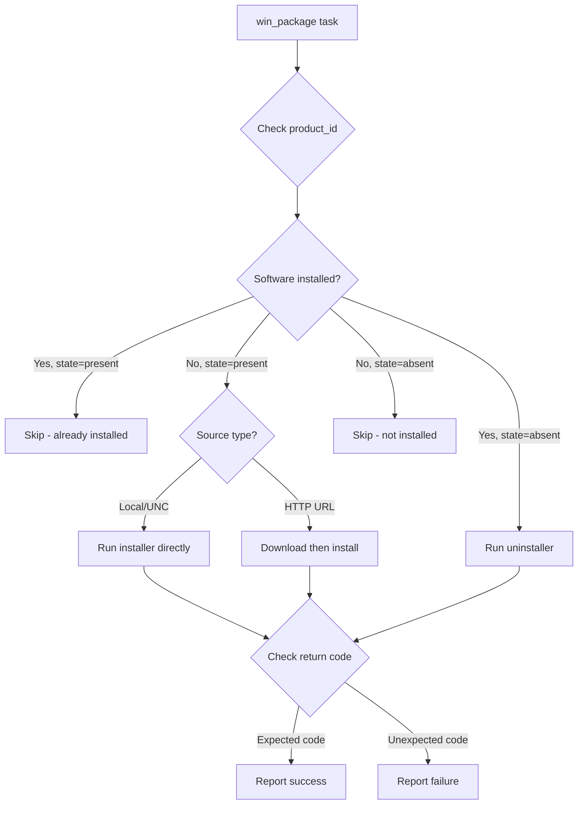

# How to Use Ansible win_package Module

Author: [nawazdhandala](https://www.github.com/nawazdhandala)

Tags: Ansible, Windows, Package Management, Automation

Description: Install, update, and remove software on Windows hosts using the Ansible win_package module with MSI, EXE, and network share examples.

---

Installing software on Windows servers at scale is one of those tasks that sounds simple but quickly becomes complicated. Different installers have different silent switches, some need reboots, others need specific prerequisites, and MSI files behave differently from EXE installers. The `win_package` module abstracts all of this, giving you a consistent interface for installing software from MSI files, EXE installers, local paths, network shares, and URLs.

## How win_package Works

The `win_package` module installs or removes software on Windows. It supports:
- MSI files (using msiexec under the hood)
- EXE installers (with custom arguments)
- MSIX packages
- Local files, UNC paths, and HTTP/HTTPS URLs

It determines whether software is already installed by checking the product ID (for MSI) or the registry.

## Installing from an MSI File

MSI installers are the most straightforward because they have a standard interface.

```yaml
# install-msi.yml - Install software from MSI packages
---
- name: Install MSI packages on Windows
  hosts: windows_servers
  tasks:
    # Install from a local MSI file
    - name: Install 7-Zip from local MSI
      ansible.windows.win_package:
        path: C:\Installers\7z2301-x64.msi
        product_id: '{23170F69-40C1-2702-2301-000001000000}'
        state: present

    # Install from a network share
    - name: Install application from network share
      ansible.windows.win_package:
        path: \\fileserver\software\myapp-3.2.1.msi
        product_id: '{XXXXXXXX-XXXX-XXXX-XXXX-XXXXXXXXXXXX}'
        state: present

    # Install from an HTTP URL
    - name: Install Notepad++ from URL
      ansible.windows.win_package:
        path: https://github.com/notepad-plus-plus/notepad-plus-plus/releases/download/v8.6.2/npp.8.6.2.Installer.x64.exe
        product_id: 'Notepad++'
        arguments: /S
        state: present
```

The `product_id` is crucial for idempotency. It tells Ansible how to check whether the software is already installed, so it does not reinstall on every run.

## Finding the Product ID

You can find the product ID for installed MSI packages using PowerShell.

```yaml
# find-product-id.yml - Discover product IDs of installed software
---
- name: Find product IDs
  hosts: windows_servers
  tasks:
    # List all installed MSI products
    - name: Get installed MSI product IDs
      ansible.windows.win_shell: |
        Get-WmiObject -Class Win32_Product |
          Select-Object Name, IdentifyingNumber, Version |
          Sort-Object Name |
          Format-Table -AutoSize
      register: products

    - name: Show installed products
      ansible.builtin.debug:
        var: products.stdout_lines

    # Alternative: check the registry for installed software
    - name: Check registry for installed software
      ansible.windows.win_shell: |
        $paths = @(
            'HKLM:\Software\Microsoft\Windows\CurrentVersion\Uninstall\*',
            'HKLM:\Software\Wow6432Node\Microsoft\Windows\CurrentVersion\Uninstall\*'
        )
        Get-ItemProperty $paths |
          Where-Object { $_.DisplayName -like '*notepad*' } |
          Select-Object DisplayName, PSChildName, UninstallString |
          Format-List
      register: registry_check

    - name: Show registry results
      ansible.builtin.debug:
        var: registry_check.stdout_lines
```

## Installing EXE Installers

EXE installers require you to specify the silent installation arguments and expected return codes.

```yaml
# install-exe.yml - Install EXE-based software
---
- name: Install EXE packages
  hosts: windows_servers
  tasks:
    # Install with silent argument
    - name: Install Visual C++ Redistributable
      ansible.windows.win_package:
        path: C:\Installers\vc_redist.x64.exe
        product_id: '{A8557D90-96A0-4A41-8B3F-1C8B2B0F0E3D}'
        arguments: /install /quiet /norestart
        state: present

    # Some installers return specific codes for "already installed"
    - name: Install Java Runtime
      ansible.windows.win_package:
        path: C:\Installers\jre-8u391-windows-x64.exe
        product_id: '{26A24AE4-039D-4CA4-87B4-2F64180391F0}'
        arguments: /s INSTALL_SILENT=1 STATIC=0
        expected_return_code:
          - 0
          - 3010
        state: present
```

The `expected_return_code` parameter is important for EXE installers. Code 3010 means "success, but reboot required" and is common for Windows installers.

## Installing with Custom MSI Arguments

You can pass additional arguments to MSI installations for customization.

```yaml
# custom-msi-args.yml - Install MSI with custom arguments
---
- name: Install MSI with custom parameters
  hosts: windows_servers
  tasks:
    # Install with custom MSI properties
    - name: Install SQL Server Management Studio
      ansible.windows.win_package:
        path: C:\Installers\SSMS-Setup-ENU.exe
        product_id: '{ABCDEFGH-1234-5678-9012-ABCDEFGHIJKL}'
        arguments: /install /quiet /norestart SSMSInstallRoot="C:\SSMS"
        state: present

    # Install MSI with logging enabled
    - name: Install application with MSI logging
      ansible.windows.win_package:
        path: C:\Installers\myapp.msi
        product_id: '{12345678-1234-1234-1234-123456789012}'
        arguments: >-
          INSTALLDIR="C:\Applications\MyApp"
          ADDLOCAL=ALL
          /l*v C:\Logs\myapp_install.log
        state: present
```

## Removing Software

Uninstalling software uses `state: absent`.

```yaml
# remove-software.yml - Uninstall software
---
- name: Remove software from Windows
  hosts: windows_servers
  tasks:
    # Remove an MSI-installed package
    - name: Remove old application version
      ansible.windows.win_package:
        product_id: '{XXXXXXXX-XXXX-XXXX-XXXX-XXXXXXXXXXXX}'
        state: absent

    # Remove an EXE-installed package with uninstall arguments
    - name: Remove application with custom uninstaller
      ansible.windows.win_package:
        product_id: 'MyApplication'
        arguments: /uninstall /quiet /norestart
        state: absent
```

## Real-World Example: Development Workstation Setup

Here is a playbook that sets up a development workstation with all the tools a developer needs.

```yaml
# dev-workstation.yml - Set up development workstation
---
- name: Provision Development Workstation
  hosts: dev_machines
  vars:
    software_packages:
      - name: "Git for Windows"
        path: https://github.com/git-for-windows/git/releases/download/v2.43.0.windows.1/Git-2.43.0-64-bit.exe
        product_id: "Git_is1"
        arguments: /VERYSILENT /NORESTART /NOCANCEL /SP- /CLOSEAPPLICATIONS
      - name: "Visual Studio Code"
        path: C:\Installers\VSCodeSetup-x64.exe
        product_id: "{EA457B21-F73E-494C-ACAB-524FDE069978}_is1"
        arguments: /VERYSILENT /NORESTART /MERGETASKS=!runcode,addcontextmenufiles,addcontextmenufolders,addtopath
      - name: "Python 3.12"
        path: C:\Installers\python-3.12.1-amd64.exe
        product_id: "{BFF94522-4E85-4D03-A3C7-ED8E5F8E7B8D}"
        arguments: /quiet InstallAllUsers=1 PrependPath=1 Include_test=0
      - name: "Node.js 20 LTS"
        path: C:\Installers\node-v20.11.0-x64.msi
        product_id: "{DDBD8ACA-1F28-4B2A-9A62-7D25A7A7F68A}"

  tasks:
    - name: Create installers directory
      ansible.windows.win_file:
        path: C:\Installers
        state: directory

    - name: Install software packages
      ansible.windows.win_package:
        path: "{{ item.path }}"
        product_id: "{{ item.product_id }}"
        arguments: "{{ item.arguments | default(omit) }}"
        expected_return_code:
          - 0
          - 3010
        state: present
      loop: "{{ software_packages }}"
      loop_control:
        label: "Installing {{ item.name }}"
      register: install_results

    - name: Check if reboot is needed
      ansible.builtin.set_fact:
        needs_reboot: "{{ install_results.results | selectattr('rc', 'defined') | selectattr('rc', 'equalto', 3010) | list | length > 0 }}"

    - name: Reboot if any installer requires it
      ansible.windows.win_reboot:
      when: needs_reboot | bool
```

## Package Installation Flow

Here is how `win_package` decides what to do.



## Tips for Working with win_package

Here are some practical tips from real-world experience:

1. **Always specify product_id**: Without it, Ansible cannot check if software is installed and will try to reinstall every time.
2. **Test silent switches first**: Run the installer manually with silent switches on a test machine before putting it in a playbook.
3. **Watch for return codes**: Different installers use different codes. Code 0 means success, 3010 means reboot needed, 1641 means reboot initiated by installer.
4. **Use network shares for large files**: WinRM has overhead for file transfers. Put large installers on a network share and reference them with UNC paths.
5. **Log everything**: Add `/l*v C:\Logs\install.log` to MSI arguments for troubleshooting.

## Summary

The `win_package` module handles the messy reality of Windows software installation. Whether you are dealing with MSI files, EXE installers, or packages downloaded from URLs, it provides a consistent interface with idempotency through product ID checks. Combine it with proper return code handling and reboot management, and you can automate the entire software lifecycle on your Windows fleet.
