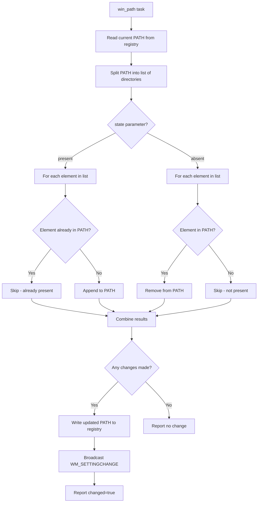

# How to Use Ansible win_path Module

Author: [nawazdhandala](https://www.github.com/nawazdhandala)

Tags: Ansible, Windows, PATH, Environment, Automation

Description: Manage the Windows system PATH environment variable with the Ansible win_path module to add and remove directory entries cleanly.

---

The PATH environment variable on Windows determines where the system looks for executables when you run a command without specifying the full path. Every time you install a tool like Python, Node.js, or a custom CLI utility, it (hopefully) adds itself to PATH. But when you are managing servers through Ansible, you need programmatic control over PATH entries. The `win_path` module handles this cleanly, letting you add and remove directories from the system or user PATH without breaking existing entries.

## How the Windows PATH Works

Windows has two PATH variables:
- **System PATH**: Applies to all users and services. Stored in the registry under `HKLM:\SYSTEM\CurrentControlSet\Control\Session Manager\Environment`.
- **User PATH**: Specific to each user. Stored under `HKCU:\Environment`.

When a process looks for an executable, Windows searches the system PATH first, then the user PATH. The `win_path` module can manage both.

## Adding a Directory to the System PATH

The most common operation is adding a new directory to the system PATH.

```yaml
# add-to-path.yml - Add directories to the system PATH
---
- name: Manage Windows PATH
  hosts: windows_servers
  tasks:
    # Add a single directory to the system PATH
    - name: Add application bin directory to PATH
      ansible.windows.win_path:
        elements:
          - C:\Applications\MyApp\bin
        scope: machine
        state: present

    # Add multiple directories at once
    - name: Add multiple directories to PATH
      ansible.windows.win_path:
        elements:
          - C:\Tools\bin
          - C:\Scripts
          - C:\Applications\MyApp\bin
        scope: machine
        state: present
```

The `scope` parameter controls which PATH to modify:
- `machine`: The system-wide PATH (requires admin rights)
- `user`: The current user's PATH

## Removing Directories from PATH

Remove directories that are no longer needed.

```yaml
# remove-from-path.yml - Remove directories from PATH
---
- name: Remove directories from PATH
  hosts: windows_servers
  tasks:
    # Remove a directory from the system PATH
    - name: Remove old application from PATH
      ansible.windows.win_path:
        elements:
          - C:\OldApp\bin
          - C:\DeprecatedTool
        scope: machine
        state: absent

    # Remove old Python version from PATH
    - name: Remove Python 2.7 from PATH
      ansible.windows.win_path:
        elements:
          - C:\Python27
          - C:\Python27\Scripts
        scope: machine
        state: absent
```

## Safe PATH Management

The `win_path` module is idempotent and safe. It only adds entries that are not already present and only removes entries that exist. It never corrupts or duplicates existing entries, which is a common problem with manual PATH editing.

```yaml
# safe-path.yml - Demonstrate idempotent PATH management
---
- name: Safe PATH operations
  hosts: windows_servers
  tasks:
    # This will only add entries not already in PATH
    - name: Ensure required directories are in PATH
      ansible.windows.win_path:
        elements:
          - C:\Windows\System32
          - C:\Applications\MyApp\bin
          - C:\Tools
        scope: machine
        state: present

    # Verify the current PATH
    - name: Show current system PATH
      ansible.windows.win_shell: |
        [Environment]::GetEnvironmentVariable('Path', 'Machine') -split ';' |
          ForEach-Object { $_.Trim() } |
          Where-Object { $_ -ne '' }
      register: current_path

    - name: Display PATH entries
      ansible.builtin.debug:
        var: current_path.stdout_lines
```

## Real-World Example: Development Tool PATH Configuration

Here is a playbook that configures PATH for a development server with multiple tools.

```yaml
# dev-path-setup.yml - Configure PATH for development tools
---
- name: Configure Development Tool PATH
  hosts: dev_servers
  vars:
    java_home: C:\Program Files\Java\jdk-17
    maven_home: C:\Tools\apache-maven-3.9.6
    node_home: C:\Program Files\nodejs
    python_home: C:\Python312
    git_home: C:\Program Files\Git

    path_entries:
      - "{{ java_home }}\\bin"
      - "{{ maven_home }}\\bin"
      - "{{ node_home }}"
      - "{{ python_home }}"
      - "{{ python_home }}\\Scripts"
      - "{{ git_home }}\\bin"
      - "{{ git_home }}\\usr\\bin"
      - C:\Tools\bin

    deprecated_entries:
      - C:\Python27
      - C:\Python27\Scripts
      - C:\Program Files\Java\jdk-11\bin

  tasks:
    # Remove old tool versions from PATH
    - name: Remove deprecated PATH entries
      ansible.windows.win_path:
        elements: "{{ deprecated_entries }}"
        scope: machine
        state: absent

    # Add current tool paths
    - name: Add development tool paths
      ansible.windows.win_path:
        elements: "{{ path_entries }}"
        scope: machine
        state: present

    # Verify tools are accessible
    - name: Verify Java is on PATH
      ansible.windows.win_command: java -version
      register: java_check
      ignore_errors: true

    - name: Verify Python is on PATH
      ansible.windows.win_command: python --version
      register: python_check
      ignore_errors: true

    - name: Verify Node.js is on PATH
      ansible.windows.win_command: node --version
      register: node_check
      ignore_errors: true

    - name: Verify Git is on PATH
      ansible.windows.win_command: git --version
      register: git_check
      ignore_errors: true

    - name: Report tool availability
      ansible.builtin.debug:
        msg: |
          Java: {{ java_check.stderr_lines[0] | default('NOT FOUND') }}
          Python: {{ python_check.stdout | default('NOT FOUND') | trim }}
          Node.js: {{ node_check.stdout | default('NOT FOUND') | trim }}
          Git: {{ git_check.stdout | default('NOT FOUND') | trim }}
```

## Application Deployment with PATH

When deploying an application that includes CLI tools, update PATH as part of the deployment.

```yaml
# deploy-with-path.yml - Deploy app and update PATH
---
- name: Deploy Application with CLI Tools
  hosts: app_servers
  vars:
    app_name: MyTool
    app_version: "2.5.0"
    install_path: "C:\\Tools\\{{ app_name }}\\{{ app_version }}"
    old_version: "2.4.0"
    old_install_path: "C:\\Tools\\{{ app_name }}\\{{ old_version }}"

  tasks:
    # Create install directory
    - name: Create installation directory
      ansible.windows.win_file:
        path: "{{ install_path }}\\bin"
        state: directory

    # Deploy application files
    - name: Copy application binaries
      ansible.windows.win_copy:
        src: "builds/{{ app_name }}-{{ app_version }}/"
        dest: "{{ install_path }}\\"

    # Remove old version from PATH
    - name: Remove old version from PATH
      ansible.windows.win_path:
        elements:
          - "{{ old_install_path }}\\bin"
        scope: machine
        state: absent

    # Add new version to PATH
    - name: Add new version to PATH
      ansible.windows.win_path:
        elements:
          - "{{ install_path }}\\bin"
        scope: machine
        state: present

    # Verify the tool works
    - name: Verify application version
      ansible.windows.win_command: mytool --version
      register: version_check

    - name: Confirm correct version
      ansible.builtin.debug:
        msg: "Deployed version: {{ version_check.stdout | trim }}"
```

## PATH Update Flow

Here is how `win_path` processes path modifications.



## Auditing PATH Entries

Here is a playbook to audit PATH entries and find potential issues.

```yaml
# audit-path.yml - Audit PATH for issues
---
- name: Audit Windows PATH
  hosts: windows_servers
  tasks:
    - name: Analyze system PATH
      ansible.windows.win_shell: |
        $path = [Environment]::GetEnvironmentVariable('Path', 'Machine')
        $entries = $path -split ';' | ForEach-Object { $_.Trim() } | Where-Object { $_ -ne '' }

        $report = @()
        foreach ($entry in $entries) {
            $exists = Test-Path $entry
            $report += [PSCustomObject]@{
                Path = $entry
                Exists = $exists
                Status = if ($exists) { "OK" } else { "MISSING" }
            }
        }

        # Check for duplicates
        $duplicates = $entries | Group-Object | Where-Object { $_.Count -gt 1 }

        Write-Output "=== PATH Entries ==="
        $report | Format-Table -AutoSize

        if ($duplicates) {
            Write-Output "`n=== Duplicate Entries ==="
            $duplicates | ForEach-Object { Write-Output "DUPLICATE: $($_.Name) (appears $($_.Count) times)" }
        }

        Write-Output "`nTotal entries: $($entries.Count)"
        Write-Output "Missing directories: $(($report | Where-Object { -not $_.Exists }).Count)"
      register: path_audit

    - name: Show PATH audit results
      ansible.builtin.debug:
        var: path_audit.stdout_lines
```

## Common Pitfalls

A few things to watch out for:

1. **PATH length limit**: Windows has a registry value size limit. If your PATH gets very long (over ~2048 characters), you may hit issues. Keep PATH clean by removing entries for uninstalled software.
2. **New process requirement**: Changes to the system PATH take effect for new processes. Existing shells and services will not see the change until they restart.
3. **Trailing backslashes**: Be consistent. `C:\Tools\bin` and `C:\Tools\bin\` are treated as different entries by some tools.
4. **Case sensitivity**: Windows paths are case-insensitive, but `win_path` does exact string matching. Use consistent casing to avoid duplicates.

## Summary

The `win_path` module provides clean, idempotent management of the Windows PATH environment variable. Whether you are setting up development tools, deploying applications with CLI utilities, or cleaning up after software removal, this module handles PATH modifications without the risk of corruption or duplication that comes with manual editing. Always pair PATH additions with verification steps to confirm that the tools are actually accessible after the change.
