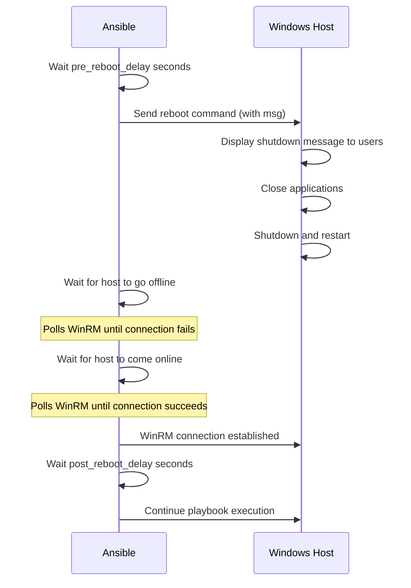

# How to Use Ansible win_reboot Module

Author: [nawazdhandala](https://www.github.com/nawazdhandala)

Tags: Ansible, Windows, Reboot, Automation, DevOps

Description: Safely reboot Windows servers with the Ansible win_reboot module including timeout control, connection testing, and post-reboot validation.

---

Rebooting a Windows server sounds trivial, but in an automated workflow it introduces a whole set of challenges. You need to initiate the reboot, wait for the machine to go down, wait for it to come back up, verify WinRM is responding again, and then continue with the rest of your playbook. The `win_reboot` module handles all of this for you, with configurable timeouts and connection testing built in.

## Basic Reboot

The simplest reboot requires no parameters at all.

```yaml
# basic-reboot.yml - Reboot a Windows server
---
- name: Reboot Windows servers
  hosts: windows_servers
  tasks:
    - name: Reboot the server
      ansible.windows.win_reboot:
```

This sends the reboot command, waits for the machine to go down, waits for it to come back up, verifies WinRM connectivity, and then lets the playbook continue. The default timeouts are usually sufficient for most servers.

## Configuring Timeouts

Different servers take different amounts of time to reboot. A bare-metal SQL server with lots of RAM might take 10 minutes; a lightweight VM might take 30 seconds. Customize the timeouts accordingly.

```yaml
# reboot-timeouts.yml - Configure reboot timing
---
- name: Reboot with custom timeouts
  hosts: windows_servers
  tasks:
    # Reboot a server that takes a while to come back
    - name: Reboot with extended timeouts
      ansible.windows.win_reboot:
        reboot_timeout: 900
        pre_reboot_delay: 15
        post_reboot_delay: 60
        connect_timeout: 10
        msg: "Ansible is rebooting this server for maintenance"
```

Here is what each timeout controls:

- `reboot_timeout`: Maximum seconds to wait for the machine to come back online (default: 600)
- `pre_reboot_delay`: Seconds to wait before sending the reboot command (default: 2)
- `post_reboot_delay`: Seconds to wait after WinRM becomes available before continuing (default: 0)
- `connect_timeout`: Seconds to wait for each WinRM connection attempt (default: 5)
- `msg`: Message displayed to logged-in users before reboot

## Conditional Reboot

You often only need to reboot after a specific change, like installing updates or a feature.

```yaml
# conditional-reboot.yml - Only reboot when needed
---
- name: Conditional reboot after changes
  hosts: windows_servers
  tasks:
    # Install a Windows feature
    - name: Install .NET Framework 4.8
      ansible.windows.win_package:
        path: C:\Installers\ndp48-x86-x64-allos-enu.exe
        product_id: '{92FB6C44-E685-45AD-9B20-CADF4CABA132}'
        arguments: /q /norestart
        state: present
      register: dotnet_install

    # Only reboot if the installation requires it
    - name: Reboot if installation requires it
      ansible.windows.win_reboot:
        msg: "Rebooting to complete .NET Framework installation"
        post_reboot_delay: 30
      when: dotnet_install.reboot_required | default(false)

    # Check for pending reboot from any source
    - name: Check if reboot is pending
      ansible.windows.win_shell: |
        $pending = $false
        # Check Component Based Servicing
        if (Test-Path "HKLM:\SOFTWARE\Microsoft\Windows\CurrentVersion\Component Based Servicing\RebootPending") {
            $pending = $true
        }
        # Check Windows Update
        if (Test-Path "HKLM:\SOFTWARE\Microsoft\Windows\CurrentVersion\WindowsUpdate\Auto Update\RebootRequired") {
            $pending = $true
        }
        # Check pending file rename operations
        $pfro = Get-ItemProperty "HKLM:\SYSTEM\CurrentControlSet\Control\Session Manager" -Name PendingFileRenameOperations -ErrorAction SilentlyContinue
        if ($pfro) {
            $pending = $true
        }
        Write-Output $pending
      register: reboot_pending

    - name: Reboot if any pending reboot detected
      ansible.windows.win_reboot:
      when: reboot_pending.stdout | trim | bool
```

## Post-Reboot Validation

After a reboot, you should verify that critical services are running and the server is healthy before continuing.

```yaml
# validated-reboot.yml - Reboot with post-reboot health check
---
- name: Reboot with validation
  hosts: windows_servers
  tasks:
    - name: Reboot the server
      ansible.windows.win_reboot:
        reboot_timeout: 600
        post_reboot_delay: 30

    # Wait for critical services to start
    - name: Wait for IIS to be running
      ansible.windows.win_service:
        name: W3SVC
        state: started
      register: iis_status
      retries: 10
      delay: 15
      until: iis_status.state == 'running'

    # Verify the application is responding
    - name: Verify web application health
      ansible.windows.win_uri:
        url: http://localhost/health
        status_code: 200
      register: health_check
      retries: 10
      delay: 10
      until: health_check.status_code == 200

    - name: Verify DNS resolution works
      ansible.windows.win_command: nslookup google.com
      register: dns_check

    - name: Report server health
      ansible.builtin.debug:
        msg: |
          Server {{ inventory_hostname }} is back online
          IIS Status: {{ iis_status.state }}
          Web App: {{ 'Healthy' if health_check.status_code == 200 else 'Unhealthy' }}
          DNS: {{ 'OK' if dns_check.rc == 0 else 'Failed' }}
```

## Rolling Reboots

When rebooting servers in a cluster, you should do it one at a time to maintain availability.

```yaml
# rolling-reboot.yml - Reboot servers one at a time
---
- name: Rolling reboot of server cluster
  hosts: web_cluster
  serial: 1
  order: sorted

  tasks:
    - name: Notify monitoring of maintenance
      ansible.builtin.debug:
        msg: "Starting maintenance reboot for {{ inventory_hostname }}"

    # Drain connections from the server
    - name: Remove from load balancer pool
      ansible.builtin.uri:
        url: "http://lb.corp.local/api/pool/{{ inventory_hostname }}/disable"
        method: POST
      delegate_to: localhost

    - name: Wait for connections to drain
      ansible.builtin.pause:
        seconds: 30

    # Reboot with generous timeout
    - name: Reboot server
      ansible.windows.win_reboot:
        reboot_timeout: 600
        post_reboot_delay: 45
        msg: "Scheduled maintenance reboot via Ansible"

    # Verify services are running
    - name: Verify all critical services
      ansible.windows.win_service:
        name: "{{ item }}"
        state: started
      loop:
        - W3SVC
        - WAS
        - MSSQLSERVER
      register: service_checks
      retries: 5
      delay: 10

    # Add back to load balancer
    - name: Add back to load balancer pool
      ansible.builtin.uri:
        url: "http://lb.corp.local/api/pool/{{ inventory_hostname }}/enable"
        method: POST
      delegate_to: localhost

    - name: Wait for health check to pass
      ansible.builtin.pause:
        seconds: 15
```

## Reboot Timeline

Here is what happens during a `win_reboot` operation.



## Handling Reboot Failures

Sometimes a reboot takes too long or the server does not come back. Handle these cases gracefully.

```yaml
# handle-reboot-failure.yml - Handle reboot failures
---
- name: Reboot with failure handling
  hosts: windows_servers
  tasks:
    - name: Attempt reboot
      ansible.windows.win_reboot:
        reboot_timeout: 300
      register: reboot_result
      ignore_errors: true

    - name: Handle reboot failure
      block:
        - name: Try to reach server via alternative method
          ansible.windows.win_ping:
          register: ping_result

        - name: Server is up but reboot may have failed
          ansible.builtin.debug:
            msg: "WARNING: Reboot may not have completed successfully for {{ inventory_hostname }}"
      rescue:
        - name: Server is unreachable
          ansible.builtin.debug:
            msg: "CRITICAL: {{ inventory_hostname }} is not responding after reboot attempt"

        - name: Send alert
          ansible.builtin.mail:
            host: smtp.corp.local
            to: ops-team@corp.local
            subject: "ALERT: {{ inventory_hostname }} failed to reboot"
            body: "Server {{ inventory_hostname }} did not come back online after reboot."
          delegate_to: localhost
      when: reboot_result is failed
```

## Best Practices

A few things I have learned from managing reboots across large Windows fleets:

1. **Always use post_reboot_delay**: Give services time to start before running tasks that depend on them. 30 to 60 seconds is usually a good starting point.
2. **Set appropriate reboot_timeout**: Physical servers with BIOS checks and large RAM can take 5 to 10 minutes. Adjust accordingly.
3. **Validate after reboot**: Never assume everything is fine just because WinRM connected. Check critical services and application health.
4. **Use serial for clusters**: Reboot one server at a time in production clusters. The few extra minutes are worth the zero-downtime guarantee.
5. **Check for pending reboots**: Before your playbook starts a long process, check if a reboot is pending from a previous change. It is better to reboot first than to discover issues midway through.

## Summary

The `win_reboot` module takes the pain out of rebooting Windows servers in an automated workflow. It handles the entire reboot lifecycle, from sending the shutdown command to verifying WinRM connectivity after the server returns. Use conditional reboots to avoid unnecessary downtime, rolling reboots to maintain cluster availability, and post-reboot validation to ensure everything is healthy before moving on.
