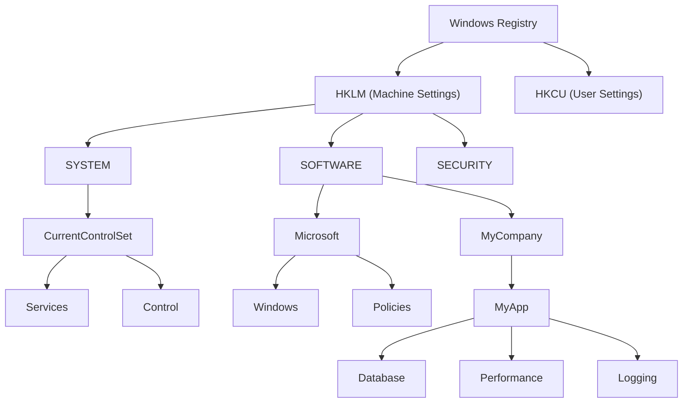

# How to Use Ansible win_registry Module

Author: [nawazdhandala](https://www.github.com/nawazdhandala)

Tags: Ansible, Windows, Registry, Configuration, Automation

Description: Read and write Windows registry keys and values using the Ansible win_regedit module for system configuration and application settings.

---

The Windows Registry is the central configuration database for the operating system and most applications. It stores everything from system boot parameters to application preferences to security policies. The `win_regedit` module lets you create, modify, and delete registry keys and values across your Windows fleet through Ansible, turning manual registry edits into repeatable, version-controlled automation.

## Understanding the Registry Structure

Before diving into examples, a quick refresher on registry terminology:
- **Hive**: The top-level container (HKLM, HKCU, etc.)
- **Key**: A folder-like container that can hold values and subkeys
- **Value**: A name-data pair stored within a key
- **Type**: The data type of a value (String, DWord, Binary, etc.)

## Creating and Setting Registry Values

The most common operation is setting a registry value.

```yaml
# set-registry.yml - Set registry values
---
- name: Configure registry settings
  hosts: windows_servers
  tasks:
    # Set a String (REG_SZ) value
    - name: Set application install path
      ansible.windows.win_regedit:
        path: HKLM:\SOFTWARE\MyCompany\MyApp
        name: InstallPath
        data: C:\Applications\MyApp
        type: string
        state: present

    # Set a DWord (REG_DWORD) value
    - name: Set application port number
      ansible.windows.win_regedit:
        path: HKLM:\SOFTWARE\MyCompany\MyApp
        name: Port
        data: 8080
        type: dword
        state: present

    # Set a Multi-String (REG_MULTI_SZ) value
    - name: Set allowed hosts list
      ansible.windows.win_regedit:
        path: HKLM:\SOFTWARE\MyCompany\MyApp
        name: AllowedHosts
        data:
          - web01.corp.local
          - web02.corp.local
          - web03.corp.local
        type: multistring
        state: present

    # Set an Expandable String (REG_EXPAND_SZ) value
    - name: Set log path with environment variable
      ansible.windows.win_regedit:
        path: HKLM:\SOFTWARE\MyCompany\MyApp
        name: LogPath
        data: '%SYSTEMDRIVE%\Logs\MyApp'
        type: expandstring
        state: present
```

## Creating Registry Keys

You can create registry keys (the folder structure) without setting any values.

```yaml
# create-keys.yml - Create registry key structure
---
- name: Create registry key structure
  hosts: windows_servers
  tasks:
    # Create a key (the full path is created recursively)
    - name: Create application registry key
      ansible.windows.win_regedit:
        path: HKLM:\SOFTWARE\MyCompany\MyApp\Settings\Advanced
        state: present

    # Create multiple keys for application structure
    - name: Create application registry structure
      ansible.windows.win_regedit:
        path: "{{ item }}"
        state: present
      loop:
        - HKLM:\SOFTWARE\MyCompany\MyApp\Settings
        - HKLM:\SOFTWARE\MyCompany\MyApp\License
        - HKLM:\SOFTWARE\MyCompany\MyApp\Connections
        - HKLM:\SOFTWARE\MyCompany\MyApp\Logging
```

## Deleting Registry Values and Keys

Remove registry entries that are no longer needed.

```yaml
# delete-registry.yml - Remove registry entries
---
- name: Clean up registry
  hosts: windows_servers
  tasks:
    # Delete a specific value
    - name: Remove deprecated setting
      ansible.windows.win_regedit:
        path: HKLM:\SOFTWARE\MyCompany\MyApp
        name: OldSetting
        state: absent

    # Delete an entire key and all its values and subkeys
    - name: Remove old application registry entries
      ansible.windows.win_regedit:
        path: HKLM:\SOFTWARE\MyCompany\OldApp
        state: absent
        delete_key: yes
```

## Security Hardening Through Registry

Many Windows security settings are controlled through registry values. Here is a hardening playbook.

```yaml
# security-hardening.yml - Harden Windows via registry settings
---
- name: Security Hardening via Registry
  hosts: windows_servers
  tasks:
    # Disable SMBv1 (protocol level)
    - name: Disable SMBv1 server
      ansible.windows.win_regedit:
        path: HKLM:\SYSTEM\CurrentControlSet\Services\LanmanServer\Parameters
        name: SMB1
        data: 0
        type: dword
        state: present

    # Disable SMBv1 client
    - name: Disable SMBv1 client driver
      ansible.windows.win_regedit:
        path: HKLM:\SYSTEM\CurrentControlSet\Services\mrxsmb10
        name: Start
        data: 4
        type: dword
        state: present

    # Enable NTLMv2 only
    - name: Enforce NTLMv2 authentication
      ansible.windows.win_regedit:
        path: HKLM:\SYSTEM\CurrentControlSet\Control\Lsa
        name: LmCompatibilityLevel
        data: 5
        type: dword
        state: present

    # Restrict anonymous access
    - name: Restrict anonymous enumeration of shares
      ansible.windows.win_regedit:
        path: HKLM:\SYSTEM\CurrentControlSet\Control\Lsa
        name: RestrictAnonymous
        data: 1
        type: dword
        state: present

    # Disable WDigest credential caching
    - name: Disable WDigest
      ansible.windows.win_regedit:
        path: HKLM:\SYSTEM\CurrentControlSet\Control\SecurityProviders\WDigest
        name: UseLogonCredential
        data: 0
        type: dword
        state: present

    # Enable Windows Firewall logging
    - name: Enable firewall logging
      ansible.windows.win_regedit:
        path: HKLM:\SOFTWARE\Policies\Microsoft\WindowsFirewall\DomainProfile\Logging
        name: LogFilePath
        data: '%systemroot%\system32\LogFiles\Firewall\pfirewall.log'
        type: string
        state: present

    - name: Set firewall log size
      ansible.windows.win_regedit:
        path: HKLM:\SOFTWARE\Policies\Microsoft\WindowsFirewall\DomainProfile\Logging
        name: LogFileSize
        data: 16384
        type: dword
        state: present
```

## Configuring RDP Settings

Remote Desktop Protocol settings are commonly managed through the registry.

```yaml
# rdp-settings.yml - Configure RDP through registry
---
- name: Configure RDP Settings
  hosts: windows_servers
  tasks:
    # Set RDP port (default is 3389)
    - name: Change RDP port
      ansible.windows.win_regedit:
        path: HKLM:\SYSTEM\CurrentControlSet\Control\Terminal Server\WinStations\RDP-Tcp
        name: PortNumber
        data: 3389
        type: dword
        state: present

    # Enable Network Level Authentication
    - name: Require NLA for RDP
      ansible.windows.win_regedit:
        path: HKLM:\SYSTEM\CurrentControlSet\Control\Terminal Server\WinStations\RDP-Tcp
        name: UserAuthentication
        data: 1
        type: dword
        state: present

    # Set idle timeout (in milliseconds, 30 minutes = 1800000)
    - name: Set RDP idle timeout
      ansible.windows.win_regedit:
        path: HKLM:\SYSTEM\CurrentControlSet\Control\Terminal Server\WinStations\RDP-Tcp
        name: MaxIdleTime
        data: 1800000
        type: dword
        state: present

    # Set disconnected session limit (2 hours = 7200000 ms)
    - name: Set disconnected session timeout
      ansible.windows.win_regedit:
        path: HKLM:\SYSTEM\CurrentControlSet\Control\Terminal Server\WinStations\RDP-Tcp
        name: MaxDisconnectionTime
        data: 7200000
        type: dword
        state: present
```

## Real-World Example: Application Configuration via Registry

Here is a playbook that configures an application entirely through registry settings.

```yaml
# app-registry-config.yml - Full application configuration via registry
---
- name: Configure Application via Registry
  hosts: app_servers
  vars:
    app_registry_base: HKLM:\SOFTWARE\MyCompany\OrderProcessor
    db_server: sql01.corp.local
    db_name: OrdersDB
    max_threads: 16
    log_level: 2
    retry_count: 3
    api_endpoints:
      - https://api1.corp.local/orders
      - https://api2.corp.local/orders

  tasks:
    # Create the base key structure
    - name: Create application registry keys
      ansible.windows.win_regedit:
        path: "{{ item }}"
        state: present
      loop:
        - "{{ app_registry_base }}"
        - "{{ app_registry_base }}\\Database"
        - "{{ app_registry_base }}\\Performance"
        - "{{ app_registry_base }}\\Logging"
        - "{{ app_registry_base }}\\API"

    # Database settings
    - name: Set database server
      ansible.windows.win_regedit:
        path: "{{ app_registry_base }}\\Database"
        name: Server
        data: "{{ db_server }}"
        type: string

    - name: Set database name
      ansible.windows.win_regedit:
        path: "{{ app_registry_base }}\\Database"
        name: DatabaseName
        data: "{{ db_name }}"
        type: string

    # Performance settings
    - name: Set max worker threads
      ansible.windows.win_regedit:
        path: "{{ app_registry_base }}\\Performance"
        name: MaxThreads
        data: "{{ max_threads }}"
        type: dword

    - name: Set retry count
      ansible.windows.win_regedit:
        path: "{{ app_registry_base }}\\Performance"
        name: RetryCount
        data: "{{ retry_count }}"
        type: dword

    # Logging settings
    - name: Set log level
      ansible.windows.win_regedit:
        path: "{{ app_registry_base }}\\Logging"
        name: Level
        data: "{{ log_level }}"
        type: dword

    - name: Set log output path
      ansible.windows.win_regedit:
        path: "{{ app_registry_base }}\\Logging"
        name: OutputPath
        data: '%PROGRAMDATA%\MyCompany\OrderProcessor\logs'
        type: expandstring

    # API endpoints
    - name: Set API endpoints
      ansible.windows.win_regedit:
        path: "{{ app_registry_base }}\\API"
        name: Endpoints
        data: "{{ api_endpoints }}"
        type: multistring
```

## Registry Hive Structure

Here is how the registry hierarchy maps to common configuration areas.



## Reading Registry Values

You can read registry values using `win_reg_stat` for auditing or conditional logic.

```yaml
# read-registry.yml - Read registry values
---
- name: Read and audit registry settings
  hosts: windows_servers
  tasks:
    - name: Read current SMBv1 setting
      ansible.windows.win_reg_stat:
        path: HKLM:\SYSTEM\CurrentControlSet\Services\LanmanServer\Parameters
        name: SMB1
      register: smb1_status

    - name: Report SMBv1 status
      ansible.builtin.debug:
        msg: "SMBv1 is {{ 'DISABLED' if smb1_status.value == 0 else 'ENABLED - REMEDIATION NEEDED' }}"
      when: smb1_status.exists
```

## Summary

The `win_regedit` module (commonly referred to as win_registry) is essential for deep Windows configuration management. From security hardening to application configuration to RDP settings, the registry touches every aspect of Windows behavior. Using Ansible to manage registry settings ensures consistency across your fleet, provides version control through your playbooks, and makes compliance auditing straightforward. Always test registry changes in a non-production environment first, as incorrect registry modifications can render a system unbootable.
