# How to Use Ansible win_scheduled_task Module

Author: [nawazdhandala](https://www.github.com/nawazdhandala)

Tags: Ansible, Windows, Scheduled Tasks, Automation

Description: Create and manage Windows scheduled tasks with the Ansible win_scheduled_task module for automated maintenance, backups, and monitoring.

---

Scheduled tasks are the Windows equivalent of cron jobs. They run scripts, executables, and maintenance routines on a schedule without human intervention. The `win_scheduled_task` module lets you define, update, and remove scheduled tasks across your Windows fleet through Ansible. No more logging into each server and clicking through the Task Scheduler GUI.

## Creating a Simple Scheduled Task

Here is a basic task that runs a PowerShell script every day at midnight.

```yaml
# simple-task.yml - Create a basic scheduled task
---
- name: Create scheduled tasks
  hosts: windows_servers
  tasks:
    - name: Create daily cleanup task
      community.windows.win_scheduled_task:
        name: DailyCleanup
        description: "Clean up temporary files daily"
        actions:
          - path: powershell.exe
            arguments: -ExecutionPolicy Bypass -File C:\Scripts\cleanup.ps1
        triggers:
          - type: daily
            start_boundary: '2024-01-01T00:00:00'
        username: SYSTEM
        state: present
        enabled: yes
```

The `start_boundary` sets when the trigger becomes active. Even for daily tasks, you need to specify a date and time.

## Multiple Actions in One Task

A scheduled task can execute multiple actions in sequence.

```yaml
# multi-action-task.yml - Create task with multiple actions
---
- name: Create multi-action scheduled task
  hosts: windows_servers
  tasks:
    - name: Create maintenance task with multiple steps
      community.windows.win_scheduled_task:
        name: NightlyMaintenance
        description: "Run nightly maintenance tasks"
        actions:
          - path: powershell.exe
            arguments: -ExecutionPolicy Bypass -File C:\Scripts\stop-services.ps1
          - path: powershell.exe
            arguments: -ExecutionPolicy Bypass -File C:\Scripts\backup-data.ps1
          - path: powershell.exe
            arguments: -ExecutionPolicy Bypass -File C:\Scripts\rotate-logs.ps1
          - path: powershell.exe
            arguments: -ExecutionPolicy Bypass -File C:\Scripts\start-services.ps1
        triggers:
          - type: daily
            start_boundary: '2024-01-01T02:00:00'
        username: SYSTEM
        state: present
        enabled: yes
```

Actions run in order, so you can use them to create multi-step workflows.

## Different Trigger Types

Windows Task Scheduler supports many trigger types. Here are the most common ones.

```yaml
# trigger-types.yml - Various trigger configurations
---
- name: Create tasks with different triggers
  hosts: windows_servers
  tasks:
    # Run every hour
    - name: Create hourly health check
      community.windows.win_scheduled_task:
        name: HourlyHealthCheck
        actions:
          - path: powershell.exe
            arguments: -File C:\Scripts\health-check.ps1
        triggers:
          - type: daily
            start_boundary: '2024-01-01T00:00:00'
            repetition:
              interval: PT1H
              duration: PT24H
        username: SYSTEM
        state: present
        enabled: yes

    # Run weekly on specific days
    - name: Create weekly report task
      community.windows.win_scheduled_task:
        name: WeeklyReport
        actions:
          - path: powershell.exe
            arguments: -File C:\Scripts\weekly-report.ps1
        triggers:
          - type: weekly
            start_boundary: '2024-01-01T06:00:00'
            days_of_week:
              - monday
              - friday
        username: SYSTEM
        state: present
        enabled: yes

    # Run at system startup
    - name: Create startup task
      community.windows.win_scheduled_task:
        name: AppStartup
        actions:
          - path: C:\Applications\MyApp\startup.bat
        triggers:
          - type: boot
            delay: PT2M
        username: SYSTEM
        state: present
        enabled: yes

    # Run when a user logs on
    - name: Create logon task
      community.windows.win_scheduled_task:
        name: UserEnvironmentSetup
        actions:
          - path: powershell.exe
            arguments: -File C:\Scripts\setup-environment.ps1
        triggers:
          - type: logon
        run_level: limited
        state: present
        enabled: yes
```

The `repetition` block uses ISO 8601 duration format: `PT1H` means 1 hour, `PT30M` means 30 minutes, `PT24H` means 24 hours.

## Running as a Specific User

You can configure which account the task runs under.

```yaml
# task-user.yml - Run tasks under different accounts
---
- name: Configure task user accounts
  hosts: windows_servers
  tasks:
    # Run as SYSTEM (highest privilege, no password needed)
    - name: Create task running as SYSTEM
      community.windows.win_scheduled_task:
        name: SystemLevelTask
        actions:
          - path: powershell.exe
            arguments: -File C:\Scripts\system-maintenance.ps1
        triggers:
          - type: daily
            start_boundary: '2024-01-01T03:00:00'
        username: SYSTEM
        state: present
        enabled: yes

    # Run as a service account with stored credentials
    - name: Create task with service account
      community.windows.win_scheduled_task:
        name: BackupTask
        actions:
          - path: powershell.exe
            arguments: -File C:\Scripts\backup.ps1
        triggers:
          - type: daily
            start_boundary: '2024-01-01T01:00:00'
        username: .\svc_backup
        password: "{{ vault_svc_backup_password }}"
        logon_type: password
        run_level: highest
        state: present
        enabled: yes

    # Run only when user is logged on
    - name: Create interactive task
      community.windows.win_scheduled_task:
        name: UserNotification
        actions:
          - path: powershell.exe
            arguments: -File C:\Scripts\notify-user.ps1
        triggers:
          - type: logon
        logon_type: interactive_token
        state: present
        enabled: yes
```

## Organizing Tasks in Folders

You can create tasks in specific Task Scheduler folders to keep things organized.

```yaml
# task-folders.yml - Organize tasks in folders
---
- name: Create organized scheduled tasks
  hosts: windows_servers
  tasks:
    # Create tasks in a custom folder path
    - name: Create backup task in custom folder
      community.windows.win_scheduled_task:
        name: DailyBackup
        path: \CompanyName\Maintenance
        description: "Daily database backup"
        actions:
          - path: powershell.exe
            arguments: -File C:\Scripts\db-backup.ps1
        triggers:
          - type: daily
            start_boundary: '2024-01-01T02:00:00'
        username: SYSTEM
        state: present
        enabled: yes

    - name: Create monitoring task in custom folder
      community.windows.win_scheduled_task:
        name: DiskSpaceCheck
        path: \CompanyName\Monitoring
        description: "Check disk space every 15 minutes"
        actions:
          - path: powershell.exe
            arguments: -File C:\Scripts\check-disk.ps1
        triggers:
          - type: daily
            start_boundary: '2024-01-01T00:00:00'
            repetition:
              interval: PT15M
              duration: PT24H
        username: SYSTEM
        state: present
        enabled: yes
```

## Removing Scheduled Tasks

Clean up tasks that are no longer needed.

```yaml
# remove-tasks.yml - Remove scheduled tasks
---
- name: Remove obsolete scheduled tasks
  hosts: windows_servers
  tasks:
    - name: Remove old maintenance task
      community.windows.win_scheduled_task:
        name: OldCleanupTask
        state: absent

    - name: Remove tasks in a specific folder
      community.windows.win_scheduled_task:
        name: "{{ item }}"
        path: \LegacyApp
        state: absent
      loop:
        - LegacyBackup
        - LegacyReporting
        - LegacyCleanup
```

## Real-World Example: Complete Server Maintenance Schedule

Here is a playbook that sets up a full maintenance schedule for production servers.

```yaml
# maintenance-schedule.yml - Set up complete maintenance schedule
---
- name: Configure Server Maintenance Schedule
  hosts: production_servers
  vars:
    scripts_path: C:\Scripts\Maintenance
    task_folder: \Ops\Maintenance

  tasks:
    - name: Create scripts directory
      ansible.windows.win_file:
        path: "{{ scripts_path }}"
        state: directory

    # Deploy maintenance scripts first
    - name: Deploy disk cleanup script
      ansible.windows.win_copy:
        content: |
          # Disk cleanup script
          $threshold = 10  # GB
          Get-WmiObject Win32_LogicalDisk -Filter "DriveType=3" | ForEach-Object {
              $freeGB = [math]::Round($_.FreeSpace / 1GB, 2)
              if ($freeGB -lt $threshold) {
                  # Clean temp files
                  Remove-Item "$env:TEMP\*" -Recurse -Force -ErrorAction SilentlyContinue
                  Remove-Item "C:\Windows\Temp\*" -Recurse -Force -ErrorAction SilentlyContinue
                  # Log the event
                  Write-EventLog -LogName Application -Source "MaintenanceScript" -EventId 1001 -Message "Disk cleanup performed on $($_.DeviceID) - Free space was $freeGB GB"
              }
          }
        dest: "{{ scripts_path }}\\disk-cleanup.ps1"

    # Disk space monitoring - every 15 minutes
    - name: Schedule disk space monitoring
      community.windows.win_scheduled_task:
        name: DiskSpaceMonitor
        path: "{{ task_folder }}"
        description: "Monitor disk space every 15 minutes"
        actions:
          - path: powershell.exe
            arguments: "-ExecutionPolicy Bypass -File {{ scripts_path }}\\disk-cleanup.ps1"
        triggers:
          - type: daily
            start_boundary: '2024-01-01T00:00:00'
            repetition:
              interval: PT15M
              duration: PT24H
        username: SYSTEM
        run_level: highest
        state: present
        enabled: yes

    # Event log archival - weekly on Sunday
    - name: Schedule weekly log archival
      community.windows.win_scheduled_task:
        name: WeeklyLogArchive
        path: "{{ task_folder }}"
        description: "Archive event logs weekly"
        actions:
          - path: powershell.exe
            arguments: "-ExecutionPolicy Bypass -File {{ scripts_path }}\\archive-logs.ps1"
        triggers:
          - type: weekly
            start_boundary: '2024-01-01T04:00:00'
            days_of_week:
              - sunday
        username: SYSTEM
        run_level: highest
        state: present
        enabled: yes

    # Certificate expiry check - daily
    - name: Schedule certificate expiry check
      community.windows.win_scheduled_task:
        name: CertExpiryCheck
        path: "{{ task_folder }}"
        description: "Check for expiring SSL certificates"
        actions:
          - path: powershell.exe
            arguments: "-ExecutionPolicy Bypass -File {{ scripts_path }}\\check-certs.ps1"
        triggers:
          - type: daily
            start_boundary: '2024-01-01T07:00:00'
        username: SYSTEM
        state: present
        enabled: yes
```

## Maintenance Schedule Overview

Here is a visual overview of the maintenance schedule.

```mermaid
gantt
    title Weekly Server Maintenance Schedule
    dateFormat HH:mm
    axisFormat %H:%M

    section Every 15min
    Disk Space Monitor  :active, 00:00, 24h

    section Daily
    Certificate Check   :07:00, 15m
    Nightly Cleanup     :02:00, 30m

    section Weekly
    Log Archival (Sun)  :04:00, 1h
    Weekly Report (Mon) :06:00, 30m
```



## Summary

The `win_scheduled_task` module brings Windows scheduled tasks under the same infrastructure-as-code umbrella as the rest of your Ansible automation. Define triggers, actions, user accounts, and folder organization all from YAML. Use it for monitoring, maintenance, backups, and any recurring task that your Windows servers need. Always deploy the scripts alongside the task definitions in the same playbook so they stay in sync.
