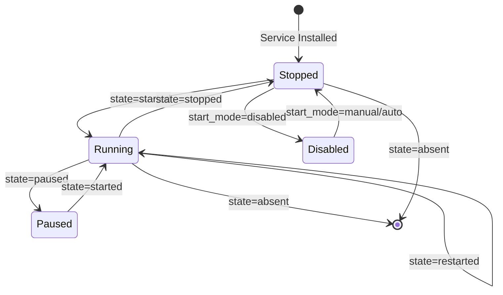

# How to Use Ansible win_service Module

Author: [nawazdhandala](https://www.github.com/nawazdhandala)

Tags: Ansible, Windows, Services, Automation, DevOps

Description: Control Windows services with the Ansible win_service module including starting, stopping, configuring startup types, and managing service accounts.

---

Windows services are the backbone of server workloads. IIS, SQL Server, monitoring agents, custom application services - they all run as Windows services. The `win_service` module gives you fine-grained control over these services through Ansible, letting you start, stop, restart, configure startup types, set service accounts, and manage dependencies across your entire Windows fleet.

## Starting and Stopping Services

The most common operations are starting and stopping services.

```yaml
# start-stop-services.yml - Basic service management
---
- name: Manage Windows services
  hosts: windows_servers
  tasks:
    # Start a service
    - name: Start the Windows Update service
      ansible.windows.win_service:
        name: wuauserv
        state: started

    # Stop a service
    - name: Stop the Print Spooler service
      ansible.windows.win_service:
        name: Spooler
        state: stopped

    # Restart a service (stops then starts)
    - name: Restart IIS
      ansible.windows.win_service:
        name: W3SVC
        state: restarted

    # Pause a service (if the service supports pausing)
    - name: Pause a service
      ansible.windows.win_service:
        name: MyCustomService
        state: paused
```

Note that not all services support the pause operation. If a service does not support pausing, the task will fail.

## Configuring Startup Types

The startup type determines whether a service starts automatically when Windows boots, starts only when triggered, or remains disabled.

```yaml
# startup-types.yml - Configure how services start
---
- name: Configure service startup types
  hosts: windows_servers
  tasks:
    # Set a service to start automatically on boot
    - name: Enable automatic startup for monitoring agent
      ansible.windows.win_service:
        name: MonitoringAgent
        start_mode: auto
        state: started

    # Set delayed auto-start (starts after other auto services)
    - name: Set delayed auto-start for non-critical service
      ansible.windows.win_service:
        name: MyBackgroundService
        start_mode: delayed

    # Disable a service completely
    - name: Disable the Remote Registry service
      ansible.windows.win_service:
        name: RemoteRegistry
        start_mode: disabled
        state: stopped

    # Set to manual start (only starts when explicitly triggered)
    - name: Set Windows Update to manual
      ansible.windows.win_service:
        name: wuauserv
        start_mode: manual
```

The available startup types are:
- `auto`: Starts automatically on boot
- `delayed`: Starts automatically but after all `auto` services
- `manual`: Only starts when explicitly started
- `disabled`: Cannot be started at all

## Configuring Service Accounts

Services run under a specific account. The default is LocalSystem, but production services often need a dedicated account.

```yaml
# service-accounts.yml - Configure service logon accounts
---
- name: Configure service accounts
  hosts: windows_servers
  tasks:
    # Run a service as a specific local user
    - name: Set service to run as local service account
      ansible.windows.win_service:
        name: MyAppService
        username: .\svc_myapp
        password: "{{ vault_svc_myapp_password }}"
        state: restarted

    # Use the built-in Network Service account
    - name: Set service to Network Service
      ansible.windows.win_service:
        name: MyWebService
        username: NT AUTHORITY\NetworkService
        password: ""

    # Use the Local Service account
    - name: Set service to Local Service
      ansible.windows.win_service:
        name: MyHelperService
        username: NT AUTHORITY\LocalService
        password: ""

    # Use a domain service account
    - name: Set service to domain account
      ansible.windows.win_service:
        name: MyEnterpriseApp
        username: DOMAIN\svc_enterprise
        password: "{{ vault_svc_enterprise_password }}"
        state: restarted
```

When you change the service account, you usually need to restart the service for the change to take effect. Also make sure the account has "Log on as a service" rights.

## Managing Service Dependencies

Some services depend on others and must start in a specific order. You can configure these dependencies.

```yaml
# service-dependencies.yml - Set up service dependencies
---
- name: Configure service dependencies
  hosts: windows_servers
  tasks:
    # Set service dependencies (this service requires these to be running)
    - name: Configure application service dependencies
      ansible.windows.win_service:
        name: MyAppService
        dependencies:
          - MSSQLSERVER
          - W3SVC

    # Add dependencies without removing existing ones
    - name: Add additional dependency
      ansible.windows.win_service:
        name: MyAppService
        dependencies:
          - MSSQLSERVER
          - W3SVC
          - MyHelperService
```

## Setting Service Description and Display Name

You can update the service metadata that appears in the Windows Services console.

```yaml
# service-metadata.yml - Update service display information
---
- name: Update service metadata
  hosts: windows_servers
  tasks:
    - name: Set service display name and description
      ansible.windows.win_service:
        name: MyAppService
        display_name: "My Application Service v3.0"
        description: "Processes incoming orders and sends notifications"
```

## Service Recovery Options

While `win_service` does not directly manage recovery options, you can use `win_shell` alongside it to configure what happens when a service crashes.

```yaml
# service-recovery.yml - Configure service recovery options
---
- name: Configure service recovery
  hosts: windows_servers
  tasks:
    - name: Ensure service exists and is configured
      ansible.windows.win_service:
        name: MyAppService
        start_mode: auto
        state: started

    # Configure recovery: restart on first, second, and subsequent failures
    - name: Set service recovery options
      ansible.windows.win_shell: |
        sc.exe failure MyAppService reset= 86400 actions= restart/5000/restart/10000/restart/30000
      register: recovery_config

    # Enable recovery for non-crash exits too
    - name: Enable recovery for non-crash stops
      ansible.windows.win_shell: |
        sc.exe failureflag MyAppService 1
```

## Real-World Example: Application Stack Management

Here is a complete playbook that manages an entire application stack's services in the correct order.

```yaml
# manage-app-stack.yml - Start/stop an application stack
---
- name: Manage Application Service Stack
  hosts: app_servers
  vars:
    stack_services:
      - name: MSSQLSERVER
        display: "SQL Server"
        start_mode: auto
      - name: RabbitMQ
        display: "RabbitMQ Message Broker"
        start_mode: auto
      - name: MyAppWorker
        display: "Background Worker"
        start_mode: auto
        username: .\svc_worker
      - name: MyAppAPI
        display: "REST API Service"
        start_mode: auto
        username: .\svc_api
      - name: W3SVC
        display: "IIS Web Server"
        start_mode: auto

  tasks:
    # Stop services in reverse order (web first, database last)
    - name: Stop services in correct order
      ansible.windows.win_service:
        name: "{{ item.name }}"
        state: stopped
      loop: "{{ stack_services | reverse | list }}"
      loop_control:
        label: "Stopping {{ item.display }}"
      ignore_errors: true

    # Perform any maintenance here
    - name: Maintenance window placeholder
      ansible.builtin.debug:
        msg: "Performing maintenance tasks..."

    # Start services in dependency order
    - name: Start services in correct order
      ansible.windows.win_service:
        name: "{{ item.name }}"
        start_mode: "{{ item.start_mode }}"
        state: started
      loop: "{{ stack_services }}"
      loop_control:
        label: "Starting {{ item.display }}"

    # Verify all services are running
    - name: Verify service status
      ansible.windows.win_service:
        name: "{{ item.name }}"
      register: service_status
      loop: "{{ stack_services }}"
      loop_control:
        label: "{{ item.display }}"

    - name: Report service states
      ansible.builtin.debug:
        msg: "{{ item.item.display }}: {{ item.state }}"
      loop: "{{ service_status.results }}"
      loop_control:
        label: "{{ item.item.display }}"
```

## Service Lifecycle Flow

Here is how `win_service` handles different state transitions.



## Querying Service Information

The `win_service` module returns useful information about the service that you can use in later tasks.

```yaml
# query-service.yml - Get service information
---
- name: Query service details
  hosts: windows_servers
  tasks:
    - name: Get IIS service info
      ansible.windows.win_service:
        name: W3SVC
      register: iis_info

    - name: Display service details
      ansible.builtin.debug:
        msg: |
          Name: {{ iis_info.name }}
          Display Name: {{ iis_info.display_name }}
          State: {{ iis_info.state }}
          Start Mode: {{ iis_info.start_mode }}
          Username: {{ iis_info.username }}
          Path: {{ iis_info.path }}
          Dependencies: {{ iis_info.dependencies }}
```

## Summary

The `win_service` module is essential for Windows server automation. It handles everything from basic start/stop operations to advanced configuration of startup types, service accounts, and dependencies. When combined with proper ordering and health checks, you can reliably manage complex application stacks across your Windows infrastructure. Always test service changes in a staging environment first, especially when modifying service accounts or dependencies, as mistakes can leave critical services unable to start.
